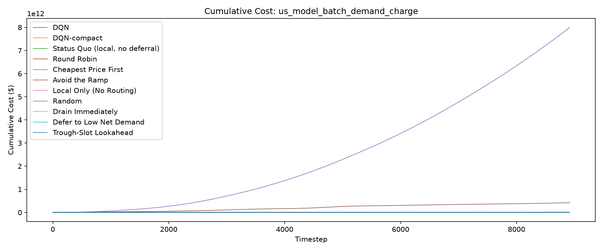
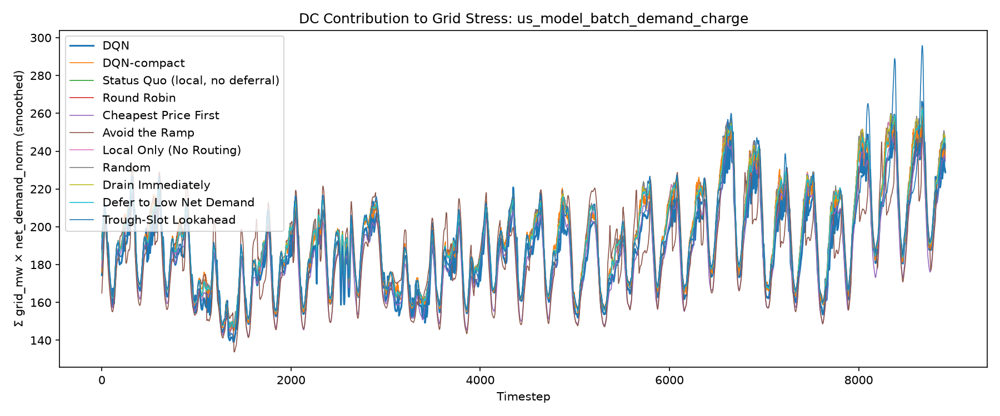
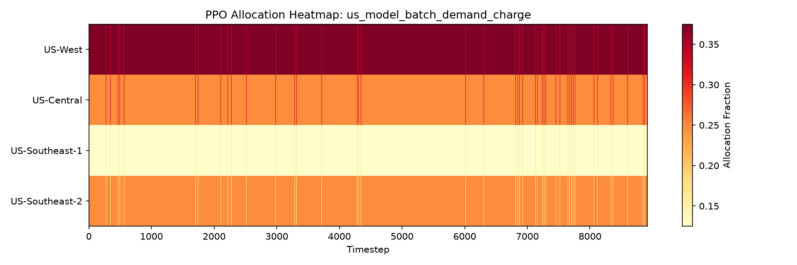
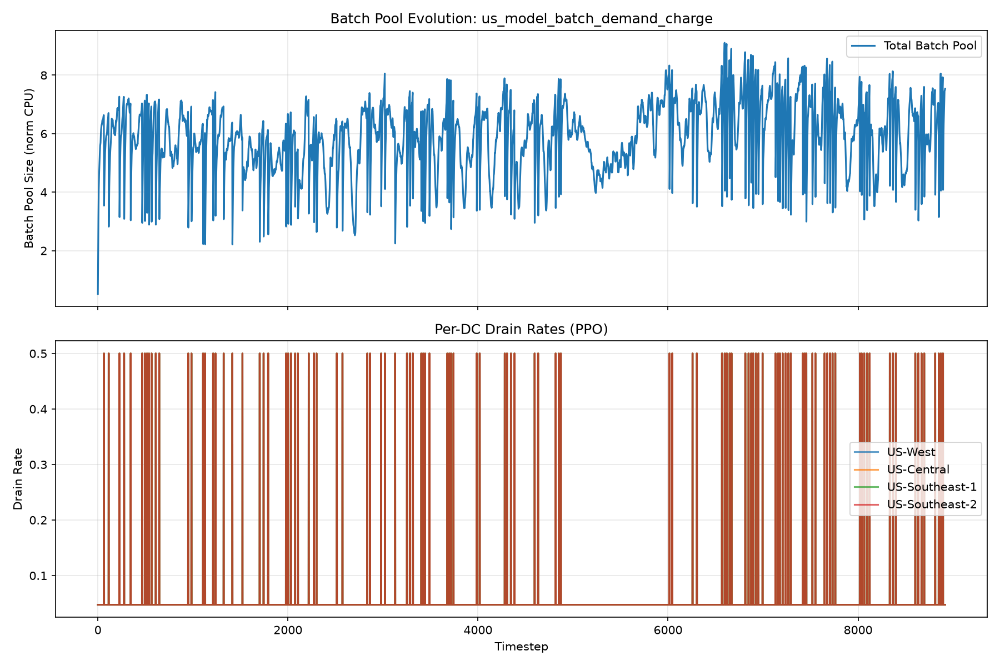
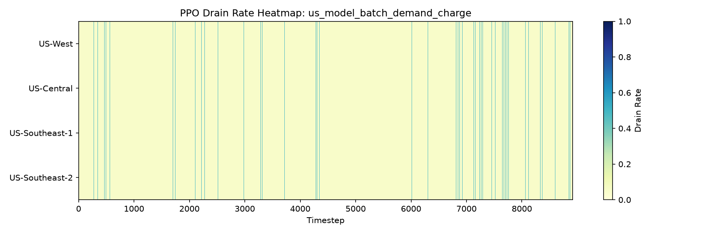

# Evaluation Report: us_model_batch_demand_charge

## Summary

Demand charge is included in total cost at $15/kW per 8917-step billing period (1 period(s)). Tariff-aware backlog/expiry floor: $898,698.99/unit; RL reward scale: 0.0001.

| Policy | Total Cost | Energy Cost | Peak Penalty | Full-Cycle Billed Peak (MW) | Demand Charge (In Reward) | ND-weighted Load | Batch Complete | Batch Expired | Unfinished Batch Cost | Avg Pool Size |
| --- | --- | --- | --- | --- | --- | --- | --- | --- | --- | --- |
| DQN | 722492270.93 | 7793835.55 | 1785407.00 | 358.50 | 5377468.78 | 1673920 | 0.7996 | 779.7537 | 707535559.60 | 5.8708 |
| DQN-compact | 18238938.44 | 7919879.47 | 1914828.68 | 358.50 | 5377468.78 | 1722516 | 0.9991 | 0.0319 | 3026761.51 | 1.5308 |
| Status Quo (local, no deferral) | 14544777.03 | 7970669.48 | 1876864.91 | 312.93 | 4694017.33 | 1727825 | 1.0000 | 0.0000 | 3225.31 | 0.0030 |
| Round Robin | 14868302.08 | 7969736.14 | 1875610.69 | 303.08 | 4546256.93 | 1727931 | 0.9999 | 0.0000 | 476698.32 | 0.4405 |
| Cheapest Price First | 7997311406516.77 | 7394238.82 | 1786313.64 | 286.81 | 4302147.86 | 1650685 | 0.9983 | 3.4954 | 6102129.76 | 2.7127 |
| Avoid the Ramp | 417772331509.26 | 7912941.38 | 1809050.20 | 358.50 | 5377468.78 | 1675949 | 0.7365 | 1025.7950 | 930276519.69 | 5.2631 |
| Local Only (No Routing) | 14714820.34 | 7970617.44 | 1876845.37 | 312.78 | 4691635.43 | 1727820 | 1.0000 | 0.0000 | 175722.09 | 0.1621 |
| Random | 92576364.32 | 7968509.76 | 1906193.91 | 358.50 | 5377468.78 | 1727847 | 0.9999 | 0.0000 | 442194.50 | 0.4831 |
| Drain Immediately | 14391316.30 | 7969870.66 | 1875657.23 | 302.84 | 4542563.10 | 1727945 | 1.0000 | 0.0000 | 3225.31 | 0.0030 |
| Defer to Low Net Demand | 83852666.19 | 7957575.06 | 1869168.08 | 302.65 | 4539706.39 | 1724958 | 0.9803 | 73.2911 | 69486216.67 | 1.7975 |
| Trough-Slot Lookahead | 7796310479.87 | 8026531.03 | 1846639.06 | 341.94 | 5129038.39 | 1708072 | 0.9996 | 0.0000 | 1588207.24 | 0.6712 |

## Per-DC Energy Cost Breakdown

| Policy | US-West | US-Central | US-Southeast-1 | US-Southeast-2 |
| --- | --- | --- | --- | --- |
| DQN | 2816460.72 | 1652912.74 | 1632321.64 | 1692140.44 |
| DQN-compact | 2526830.04 | 1745524.84 | 2165895.72 | 1481628.87 |
| Status Quo (local, no deferral) | 2563207.99 | 1661717.14 | 2031472.35 | 1714271.99 |
| Round Robin | 2545087.27 | 1667526.73 | 2028512.70 | 1728609.45 |
| Cheapest Price First | 2265075.26 | 2041237.45 | 1688622.23 | 1399303.87 |
| Avoid the Ramp | 2703167.47 | 1463781.38 | 1709987.52 | 2036005.02 |
| Local Only (No Routing) | 2563200.11 | 1661710.08 | 2031454.62 | 1714252.63 |
| Random | 2541545.94 | 1669966.15 | 2031274.65 | 1725723.02 |
| Drain Immediately | 2545115.42 | 1667550.00 | 2028557.41 | 1728647.84 |
| Defer to Low Net Demand | 2542092.20 | 1665436.11 | 2024862.33 | 1725184.43 |
| Trough-Slot Lookahead | 2619720.83 | 1565604.25 | 2014366.52 | 1826839.43 |

## Plots

