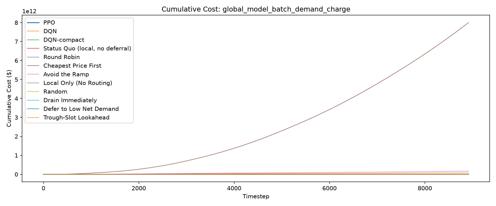
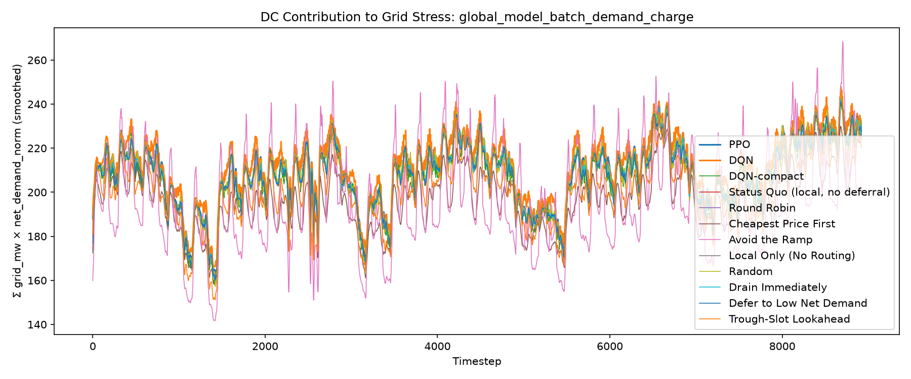
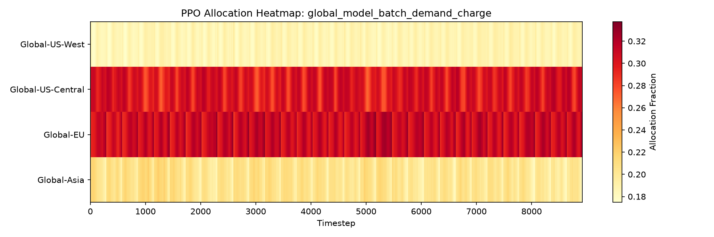
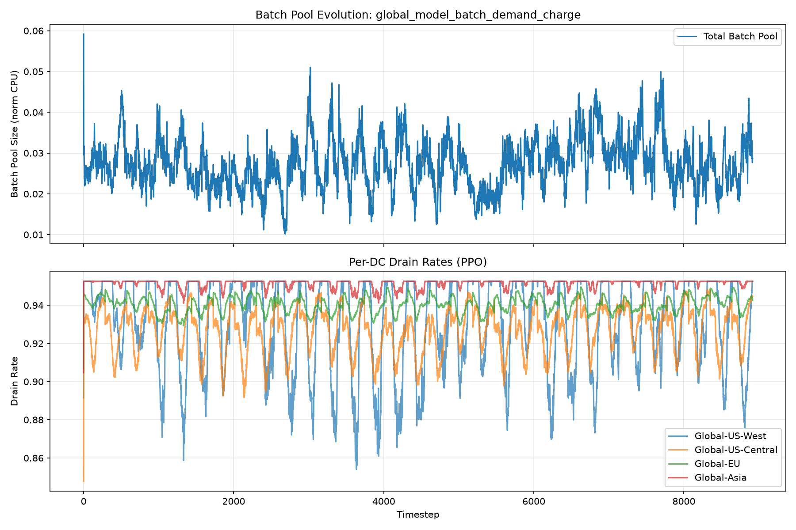
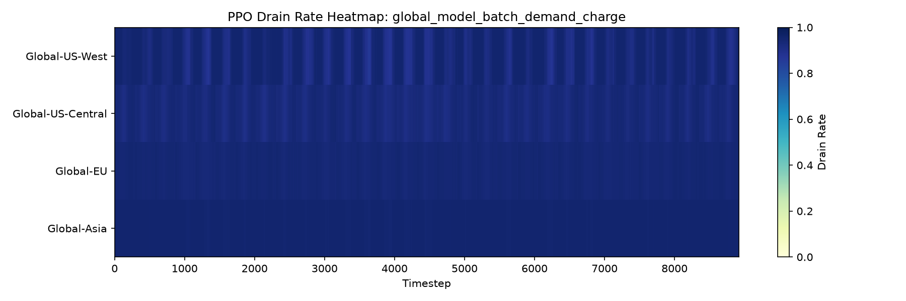

# Evaluation Report: global_model_batch_demand_charge

## Summary

Demand charge is included in total cost at $15/kW per 8917-step billing period (1 period(s)). Tariff-aware backlog/expiry floor: $899,211.96/unit; RL reward scale: 0.0001.

| Policy | Total Cost | Energy Cost | Peak Penalty | Full-Cycle Billed Peak (MW) | Demand Charge (In Reward) | ND-weighted Load | Batch Complete | Batch Expired | Unfinished Batch Cost | Avg Pool Size |
| --- | --- | --- | --- | --- | --- | --- | --- | --- | --- | --- |
| PPO | 18798334.83 | 12067380.38 | 2036396.05 | 311.25 | 4668792.41 | 1861976 | 1.0000 | 0.0000 | 25765.99 | 0.0274 |
| DQN | 72743363245.40 | 13019031.47 | 2117549.97 | 320.50 | 4807526.32 | 1889664 | 0.9998 | 0.0000 | 698963.29 | 0.6527 |
| DQN-compact | 55822410.76 | 12103941.65 | 2010021.00 | 352.05 | 5280753.12 | 1843080 | 0.9897 | 37.4694 | 36410273.50 | 2.7256 |
| Status Quo (local, no deferral) | 18758797.98 | 12056446.00 | 2005107.50 | 312.93 | 4694017.33 | 1849858 | 1.0000 | 0.0000 | 3227.15 | 0.0030 |
| Round Robin | 19117955.41 | 12088015.41 | 2006712.66 | 303.08 | 4546256.93 | 1851323 | 0.9999 | 0.0000 | 476970.41 | 0.4405 |
| Cheapest Price First | 8001877044578.01 | 10741285.52 | 1870266.44 | 287.17 | 4307479.48 | 1749403 | 0.9990 | 0.0000 | 3483914.17 | 2.9560 |
| Avoid the Ramp | 164245116942.80 | 11279016.80 | 1875009.69 | 358.50 | 5377468.78 | 1752901 | 0.7170 | 1104.6030 | 999858236.82 | 6.0389 |
| Local Only (No Routing) | 18928971.96 | 12056434.48 | 2005079.65 | 312.78 | 4691635.43 | 1849850 | 1.0000 | 0.0000 | 175822.39 | 0.1621 |
| Random | 96865181.79 | 12078819.84 | 2040564.97 | 358.50 | 5377468.78 | 1851237 | 0.9999 | 0.0000 | 442446.90 | 0.4831 |
| Drain Immediately | 18640573.56 | 12088005.84 | 2006777.47 | 302.84 | 4542563.10 | 1851345 | 1.0000 | 0.0000 | 3227.15 | 0.0030 |
| Defer to Low Net Demand | 95667078.89 | 12068384.40 | 2000336.41 | 303.41 | 4551080.48 | 1848378 | 0.9782 | 82.9764 | 77047277.60 | 2.2194 |
| Trough-Slot Lookahead | 73557015.64 | 11814965.29 | 1940546.91 | 354.47 | 5317075.91 | 1801542 | 0.9994 | 1.7424 | 2071680.62 | 0.6431 |

## Per-DC Energy Cost Breakdown

| Policy | Global-US-West | Global-US-Central | Global-EU | Global-Asia |
| --- | --- | --- | --- | --- |
| PPO | 2403938.21 | 1708206.54 | 2648558.29 | 5306677.34 |
| DQN | 2405616.67 | 1607707.72 | 2290251.68 | 6715455.41 |
| DQN-compact | 2586174.01 | 1700308.49 | 2303712.18 | 5513746.97 |
| Status Quo (local, no deferral) | 2563207.99 | 1661717.14 | 2500211.75 | 5331309.11 |
| Round Robin | 2545087.27 | 1667526.73 | 2498302.36 | 5377099.06 |
| Cheapest Price First | 2265168.86 | 2041237.45 | 2078171.12 | 4356708.09 |
| Avoid the Ramp | 2729394.76 | 1611606.84 | 2498160.61 | 4439854.59 |
| Local Only (No Routing) | 2563200.11 | 1661710.08 | 2500201.58 | 5331322.72 |
| Random | 2541545.94 | 1669966.15 | 2501726.04 | 5365581.71 |
| Drain Immediately | 2545115.42 | 1667550.00 | 2498323.92 | 5377016.51 |
| Defer to Low Net Demand | 2542005.54 | 1665429.08 | 2494048.06 | 5366901.72 |
| Trough-Slot Lookahead | 2702944.22 | 1624013.62 | 2491903.40 | 4996104.04 |

## Plots

