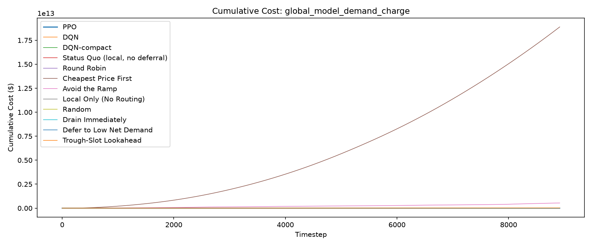
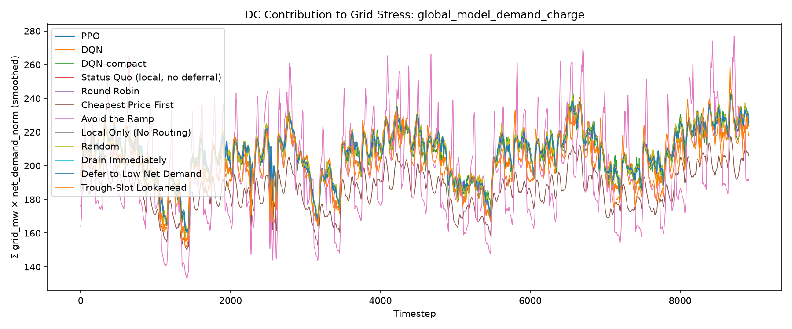
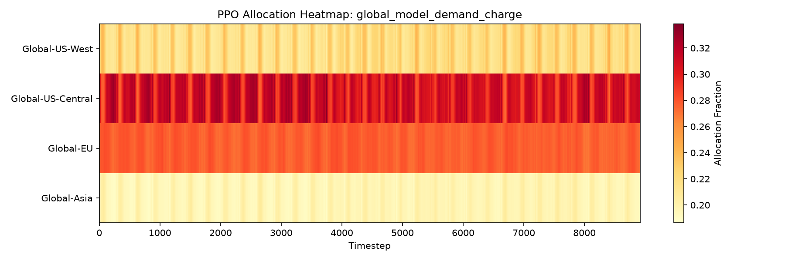

# Evaluation Report: global_model_demand_charge

## Summary

Demand charge is included in total cost at $15/kW per 8917-step billing period (1 period(s)). Tariff-aware backlog/expiry floor: $899,211.96/unit; RL reward scale: 0.0001.

| Policy | Total Cost | Energy Cost | Peak Penalty | Full-Cycle Billed Peak (MW) | Demand Charge (In Reward) | ND-weighted Load | Total Grid (MW-steps) |
| --- | --- | --- | --- | --- | --- | --- | --- |
| PPO | 18282803.99 | 11710675.54 | 2008097.54 | 304.27 | 4564030.91 | 1844775 | 2562408.35 |
| DQN | 19028297.48 | 12471238.10 | 2011044.10 | 301.59 | 4523792.54 | 1833979 | 2550846.67 |
| DQN-compact | 19081542.09 | 11710703.06 | 2020577.55 | 356.68 | 5350261.48 | 1839641 | 2555261.98 |
| Status Quo (local, no deferral) | 18755621.27 | 12056446.32 | 2005108.07 | 312.94 | 4694066.89 | 1849858 | 2570430.17 |
| Round Robin | 18637241.99 | 12088005.94 | 2006778.00 | 302.83 | 4542458.06 | 1851345 | 2572494.93 |
| Cheapest Price First | 18888048877371.23 | 9965768.05 | 1706756.33 | 261.67 | 3925077.91 | 1653357 | 2294314.85 |
| Avoid the Ramp | 540677964524.64 | 11271057.71 | 1954845.48 | 358.50 | 5377468.78 | 1773977 | 2517453.77 |
| Local Only (No Routing) | 18755621.27 | 12056446.32 | 2005108.07 | 312.94 | 4694066.89 | 1849858 | 2570430.17 |
| Random | 632320339.15 | 12093643.75 | 2053935.75 | 358.50 | 5377468.78 | 1852125 | 2572980.31 |
| Drain Immediately | 18637241.99 | 12088005.94 | 2006778.00 | 302.83 | 4542458.06 | 1851345 | 2572494.93 |
| Defer to Low Net Demand | 18637241.99 | 12088005.94 | 2006778.00 | 302.83 | 4542458.06 | 1851345 | 2572494.93 |
| Trough-Slot Lookahead | 21962145521.81 | 11783494.11 | 1930847.49 | 354.41 | 5316192.35 | 1796000 | 2550107.94 |

## Per-DC Energy Cost Breakdown

| Policy | Global-US-West | Global-US-Central | Global-EU | Global-Asia |
| --- | --- | --- | --- | --- |
| PPO | 2463614.57 | 1771875.00 | 2604226.75 | 4870959.22 |
| DQN | 2754456.75 | 1670270.43 | 1842234.41 | 6204276.52 |
| DQN-compact | 2551233.87 | 1741551.40 | 2513171.72 | 4904746.07 |
| Status Quo (local, no deferral) | 2563208.16 | 1661717.29 | 2500211.96 | 5331308.91 |
| Round Robin | 2545115.63 | 1667550.17 | 2498324.11 | 5377016.03 |
| Cheapest Price First | 2138471.12 | 2041237.45 | 1891279.70 | 3894779.78 |
| Avoid the Ramp | 2873911.53 | 1612620.74 | 2585169.15 | 4199356.29 |
| Local Only (No Routing) | 2563208.16 | 1661717.29 | 2500211.96 | 5331308.91 |
| Random | 2541334.31 | 1668298.38 | 2500231.84 | 5383779.22 |
| Drain Immediately | 2545115.63 | 1667550.17 | 2498324.11 | 5377016.03 |
| Defer to Low Net Demand | 2545115.63 | 1667550.17 | 2498324.11 | 5377016.03 |
| Trough-Slot Lookahead | 2740737.91 | 1615093.21 | 2473391.34 | 4954271.65 |

## Plots

