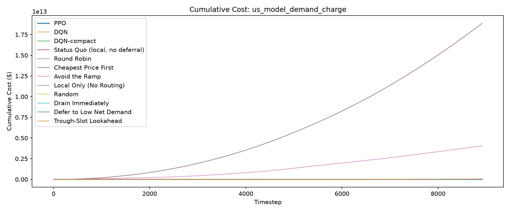
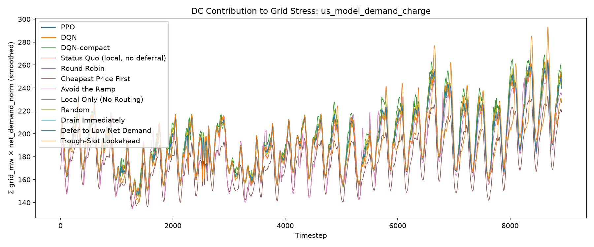
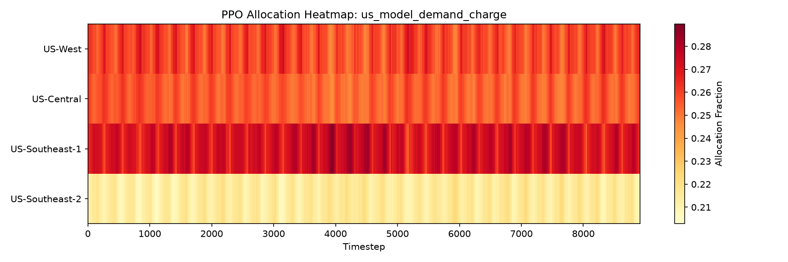

# Evaluation Report: us_model_demand_charge

## Summary

Demand charge is included in total cost at $15/kW per 8917-step billing period (1 period(s)). Tariff-aware backlog/expiry floor: $898,698.99/unit; RL reward scale: 0.0001.

| Policy | Total Cost | Energy Cost | Peak Penalty | Full-Cycle Billed Peak (MW) | Demand Charge (In Reward) | ND-weighted Load | Total Grid (MW-steps) |
| --- | --- | --- | --- | --- | --- | --- | --- |
| PPO | 14395579.70 | 7962936.13 | 1871631.93 | 304.07 | 4561011.64 | 1723792 | 2565062.55 |
| DQN | 14971838.30 | 7919772.17 | 1915488.37 | 336.67 | 5050089.04 | 1730502 | 2568927.48 |
| DQN-compact | 15356474.44 | 8014707.81 | 1976126.59 | 357.71 | 5365640.04 | 1754273 | 2596776.45 |
| Status Quo (local, no deferral) | 14541602.72 | 7970670.51 | 1876865.32 | 312.94 | 4694066.89 | 1727825 | 2570430.17 |
| Round Robin | 14387987.34 | 7969871.67 | 1875657.62 | 302.83 | 4542458.06 | 1727945 | 2572494.93 |
| Cheapest Price First | 18877270749843.15 | 6966632.68 | 1636567.28 | 261.67 | 3925077.91 | 1563117 | 2294314.85 |
| Avoid the Ramp | 4053936392975.11 | 7964406.04 | 1849241.45 | 358.50 | 5377468.78 | 1686934 | 2543909.25 |
| Local Only (No Routing) | 14541602.72 | 7970670.51 | 1876865.32 | 312.94 | 4694066.89 | 1727825 | 2570430.17 |
| Random | 627711362.94 | 7970391.86 | 1917792.80 | 358.50 | 5377468.78 | 1728325 | 2572980.31 |
| Drain Immediately | 14387987.34 | 7969871.67 | 1875657.62 | 302.83 | 4542458.06 | 1727945 | 2572494.93 |
| Defer to Low Net Demand | 14387987.34 | 7969871.67 | 1875657.62 | 302.83 | 4542458.06 | 1727945 | 2572494.93 |
| Trough-Slot Lookahead | 49752416943.39 | 8017734.53 | 1833401.35 | 335.99 | 5039857.81 | 1699810 | 2574380.82 |

## Per-DC Energy Cost Breakdown

| Policy | US-West | US-Central | US-Southeast-1 | US-Southeast-2 |
| --- | --- | --- | --- | --- |
| PPO | 2567543.69 | 1675524.25 | 2100166.44 | 1619701.77 |
| DQN | 2463891.29 | 1755400.00 | 1977450.19 | 1723030.69 |
| DQN-compact | 2347886.10 | 1662856.84 | 2370871.93 | 1633092.94 |
| Status Quo (local, no deferral) | 2563208.16 | 1661717.29 | 2031472.70 | 1714272.37 |
| Round Robin | 2545115.63 | 1667550.17 | 2028557.74 | 1728648.13 |
| Cheapest Price First | 2138471.12 | 2041237.45 | 1535700.70 | 1251223.40 |
| Avoid the Ramp | 2824132.75 | 1389235.10 | 1597252.44 | 2153785.76 |
| Local Only (No Routing) | 2563208.16 | 1661717.29 | 2031472.70 | 1714272.37 |
| Random | 2541334.31 | 1668298.38 | 2029988.08 | 1730771.09 |
| Drain Immediately | 2545115.63 | 1667550.17 | 2028557.74 | 1728648.13 |
| Defer to Low Net Demand | 2545115.63 | 1667550.17 | 2028557.74 | 1728648.13 |
| Trough-Slot Lookahead | 2675251.96 | 1551082.60 | 1991712.34 | 1799687.63 |

## Plots

