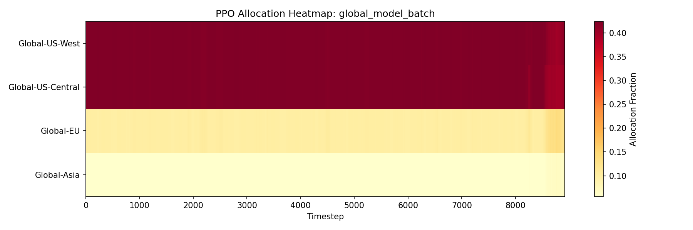
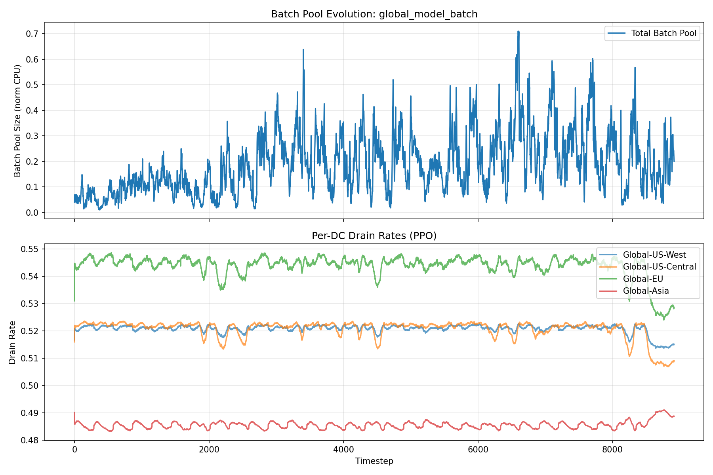
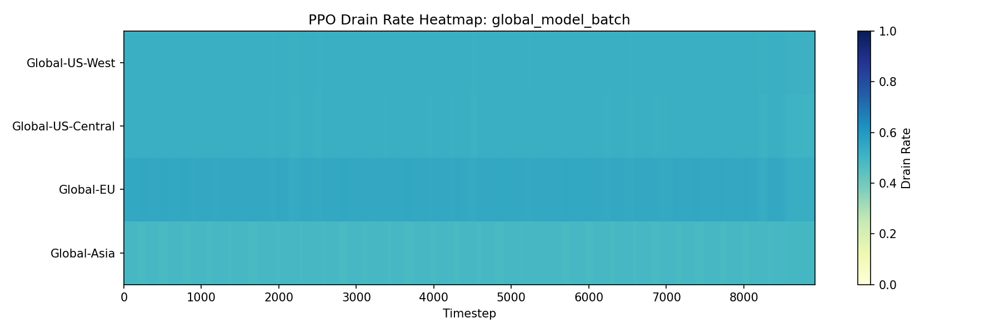

# Evaluation Report: global_model_batch

## Summary

| Policy | Total Cost | Energy Cost | Peak Penalty | ND-weighted Load | Batch Expired | Deadline Cost | Avg Pool Size |
| --- | --- | --- | --- | --- | --- | --- | --- |
| PPO | 12421133.60 | 10503809.98 | 1904732.56 | 1747307 | 0.0000 | 0.00 | 0.1892 |
| DQN | 13005570.16 | 11030611.51 | 1974958.65 | 1804910 | 0.0000 | 0.00 | 0.1403 |
| DQN-flatidx | 14094782.85 | 12088006.23 | 2006776.61 | 1851345 | 0.0000 | 0.00 | 0.0070 |
| Status Quo (local, no deferral) | 14061553.97 | 12056446.13 | 2005107.84 | 1849858 | 0.0000 | 0.00 | 0.0009 |
| Round Robin | 14094779.67 | 12088025.08 | 2006754.58 | 1851340 | 0.0000 | 0.00 | 0.1403 |
| Cheapest Price First | 38092654.22 | 10206975.10 | 1756660.22 | 1683555 | 2.3510 | 587.75 | 0.9862 |
| Avoid the Ramp | 13886069.60 | 11233174.80 | 1919421.41 | 1761723 | 538.9683 | 134742.06 | 1.6918 |
| Local Only (No Routing) | 14061535.63 | 12056438.93 | 2005096.70 | 1849856 | 0.0000 | 0.00 | 0.0516 |
| Random | 14134003.32 | 12085744.94 | 2047651.84 | 1851268 | 0.0000 | 0.00 | 0.1662 |
| Drain Immediately | 14094783.78 | 12088005.97 | 2006777.81 | 1851345 | 0.0000 | 0.00 | 0.0009 |
| Defer to Low Net Demand | 14091169.16 | 12072596.42 | 2001728.83 | 1849032 | 67.3756 | 16843.91 | 0.6858 |
| Trough-Slot Lookahead | 13755218.66 | 11804097.74 | 1936612.64 | 1799299 | 4.9169 | 1229.23 | 0.2548 |

## Per-DC Energy Cost Breakdown

| Policy | Global-US-West | Global-US-Central | Global-EU | Global-Asia |
| --- | --- | --- | --- | --- |
| PPO | 2948879.61 | 1964277.98 | 1963324.10 | 3627328.28 |
| DQN | 2765520.15 | 1667544.92 | 2827327.21 | 3770219.22 |
| DQN-flatidx | 2545115.31 | 1667549.85 | 2498322.85 | 5377018.22 |
| Status Quo (local, no deferral) | 2563208.17 | 1661717.25 | 2500211.82 | 5331308.89 |
| Round Robin | 2545110.86 | 1667544.92 | 2498302.18 | 5377067.13 |
| Cheapest Price First | 2178526.36 | 2041237.45 | 1949677.33 | 4037533.96 |
| Avoid the Ramp | 2822487.28 | 1611158.06 | 2547661.69 | 4251867.76 |
| Local Only (No Routing) | 2563209.14 | 1661715.71 | 2500204.39 | 5331309.69 |
| Random | 2542873.84 | 1668626.80 | 2498411.54 | 5375832.76 |
| Drain Immediately | 2545115.59 | 1667550.13 | 2498323.93 | 5377016.32 |
| Defer to Low Net Demand | 2542711.49 | 1665890.30 | 2494850.78 | 5369143.85 |
| Trough-Slot Lookahead | 2714830.66 | 1620596.29 | 2486794.94 | 4981875.85 |

## Plots

