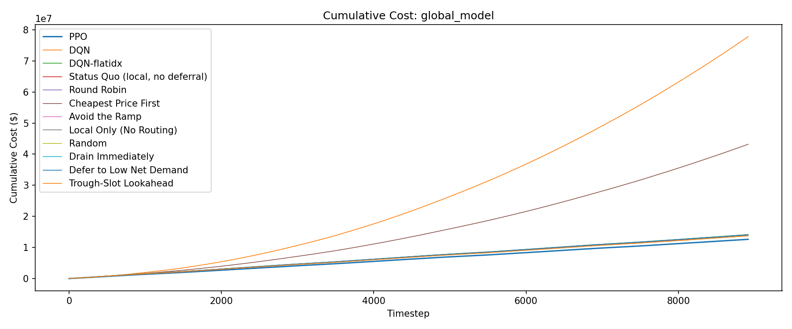
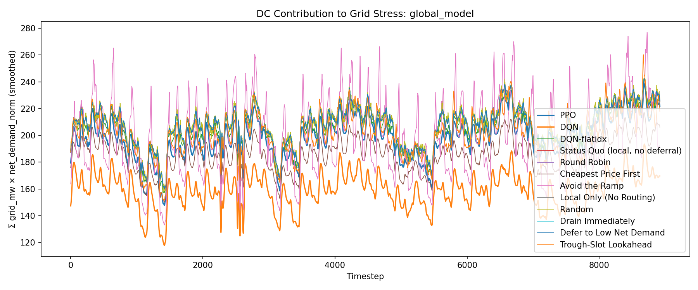
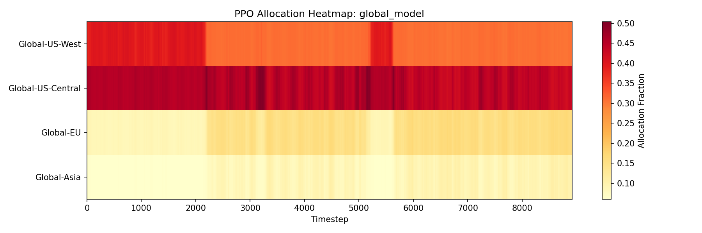

# Evaluation Report: global_model

## Summary

| Policy | Total Cost | Energy Cost | Peak Penalty | ND-weighted Load | Total Grid (MW-steps) |
| --- | --- | --- | --- | --- | --- |
| PPO | 12617024.24 | 10589720.08 | 1933784.92 | 1764935 | 2469243.70 |
| DQN | 77786603.20 | 8930275.72 | 1273289.48 | 1418108 | 2013737.74 |
| DQN-flatidx | 13759893.47 | 11768158.97 | 1991734.49 | 1821279 | 2528773.78 |
| Status Quo (local, no deferral) | 14061554.38 | 12056446.32 | 2005108.07 | 1849858 | 2570430.17 |
| Round Robin | 14094783.94 | 12088005.94 | 2006778.00 | 1851345 | 2572494.93 |
| Cheapest Price First | 43180167.94 | 9965768.05 | 1706756.33 | 1653357 | 2294314.85 |
| Avoid the Ramp | 14127791.82 | 11271057.71 | 1954845.48 | 1773977 | 2517453.77 |
| Local Only (No Routing) | 14061554.38 | 12056446.32 | 2005108.07 | 1849858 | 2570430.17 |
| Random | 14148601.72 | 12093643.75 | 2053935.75 | 1852125 | 2572980.31 |
| Drain Immediately | 14094783.94 | 12088005.94 | 2006778.00 | 1851345 | 2572494.93 |
| Defer to Low Net Demand | 14094783.94 | 12088005.94 | 2006778.00 | 1851345 | 2572494.93 |
| Trough-Slot Lookahead | 13750945.51 | 11783494.11 | 1930847.49 | 1796000 | 2550107.94 |

## Per-DC Energy Cost Breakdown

| Policy | Global-US-West | Global-US-Central | Global-EU | Global-Asia |
| --- | --- | --- | --- | --- |
| PPO | 2763833.10 | 2028281.54 | 2046196.68 | 3751408.75 |
| DQN | 2971259.43 | 1245061.52 | 1579777.67 | 3134177.10 |
| DQN-flatidx | 2545115.63 | 1939961.42 | 1906065.88 | 5377016.04 |
| Status Quo (local, no deferral) | 2563208.16 | 1661717.29 | 2500211.96 | 5331308.91 |
| Round Robin | 2545115.63 | 1667550.17 | 2498324.11 | 5377016.03 |
| Cheapest Price First | 2138471.12 | 2041237.45 | 1891279.70 | 3894779.78 |
| Avoid the Ramp | 2873911.53 | 1612620.74 | 2585169.15 | 4199356.29 |
| Local Only (No Routing) | 2563208.16 | 1661717.29 | 2500211.96 | 5331308.91 |
| Random | 2541334.31 | 1668298.38 | 2500231.84 | 5383779.22 |
| Drain Immediately | 2545115.63 | 1667550.17 | 2498324.11 | 5377016.03 |
| Defer to Low Net Demand | 2545115.63 | 1667550.17 | 2498324.11 | 5377016.03 |
| Trough-Slot Lookahead | 2740737.91 | 1615093.21 | 2473391.34 | 4954271.65 |

## Plots

