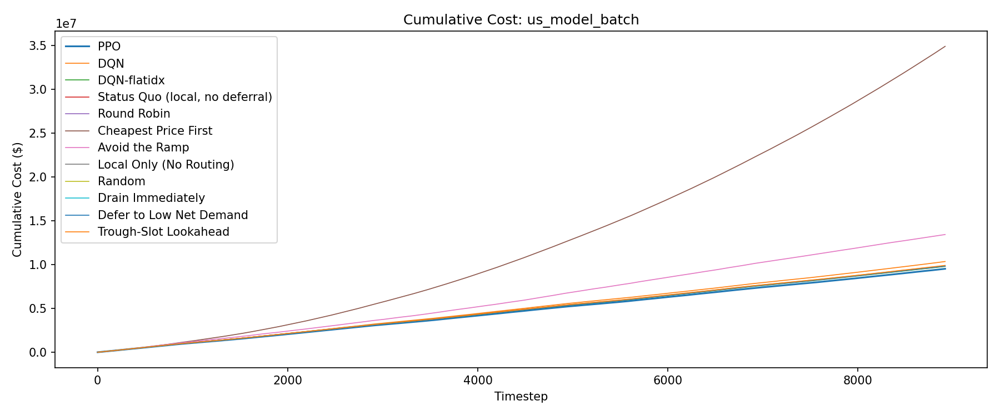
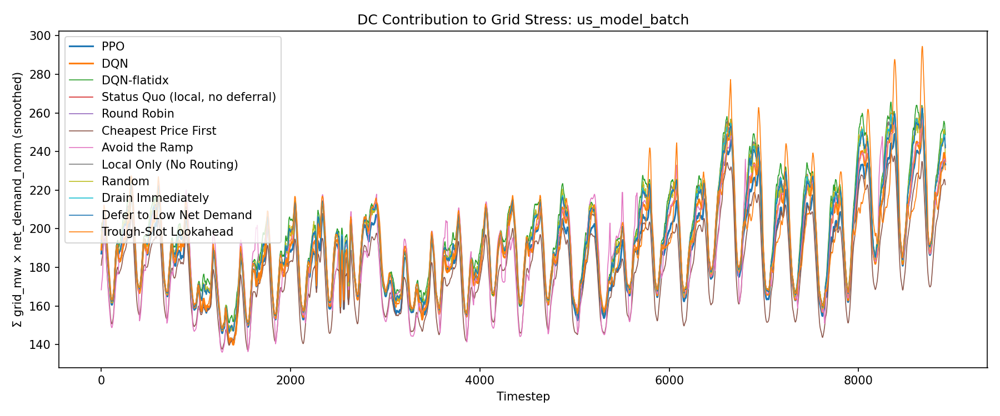
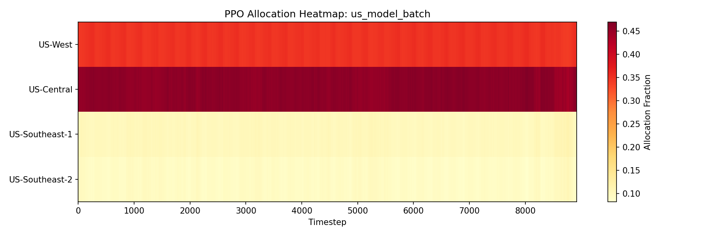
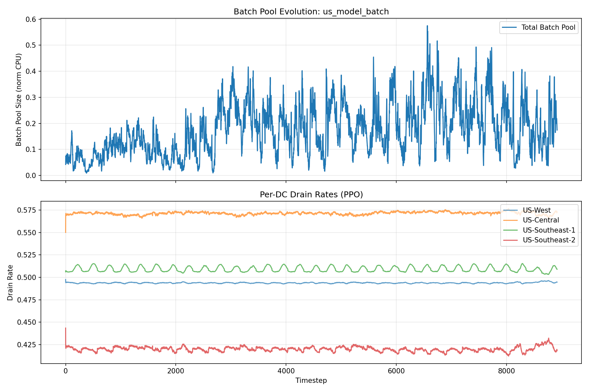
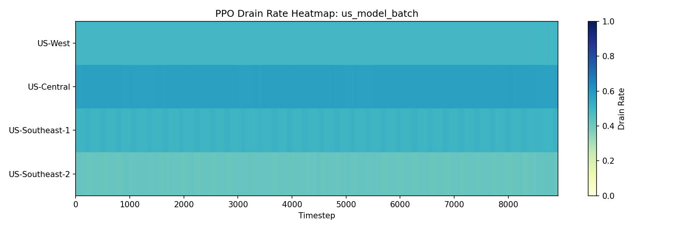

# Evaluation Report: us_model_batch

## Summary

| Policy | Total Cost | Energy Cost | Peak Penalty | ND-weighted Load | Batch Expired | Deadline Cost | Avg Pool Size |
| --- | --- | --- | --- | --- | --- | --- | --- |
| PPO | 9523696.06 | 7669066.32 | 1850918.94 | 1672921 | 0.0000 | 0.00 | 0.1753 |
| DQN | 10354413.23 | 8044242.31 | 1829427.12 | 1698829 | 0.0000 | 0.00 | 0.1184 |
| DQN-flatidx | 9798256.29 | 7845541.51 | 1952714.78 | 1747437 | 0.0000 | 0.00 | 0.0070 |
| Status Quo (local, no deferral) | 9847535.58 | 7970670.22 | 1876865.36 | 1727825 | 0.0000 | 0.00 | 0.0009 |
| Round Robin | 9845509.73 | 7969837.64 | 1875672.09 | 1727957 | 0.0000 | 0.00 | 0.1403 |
| Cheapest Price First | 34915615.33 | 7098289.68 | 1681450.10 | 1590176 | 29.7776 | 7444.40 | 0.6982 |
| Avoid the Ramp | 13435357.08 | 7976679.17 | 1855591.40 | 1692455 | 487.8571 | 121964.28 | 1.4988 |
| Local Only (No Routing) | 9847524.85 | 7970656.22 | 1876868.63 | 1727829 | 0.0000 | 0.00 | 0.0516 |
| Random | 9882203.26 | 7969112.24 | 1912484.50 | 1727770 | 0.0000 | 0.00 | 0.1662 |
| Drain Immediately | 9845529.08 | 7969871.39 | 1875657.69 | 1727945 | 0.0000 | 0.00 | 0.0009 |
| Defer to Low Net Demand | 9846741.69 | 7961162.06 | 1871118.42 | 1725867 | 57.8449 | 14461.22 | 0.5473 |
| Trough-Slot Lookahead | 9907754.50 | 8021037.90 | 1838868.63 | 1703380 | 0.1639 | 40.98 | 0.2372 |

## Per-DC Energy Cost Breakdown

| Policy | US-West | US-Central | US-Southeast-1 | US-Southeast-2 |
| --- | --- | --- | --- | --- |
| PPO | 2799893.58 | 2008815.63 | 1580561.84 | 1279795.27 |
| DQN | 2968989.56 | 1425154.47 | 1974205.95 | 1675892.31 |
| DQN-flatidx | 2148375.96 | 1939960.64 | 2028557.21 | 1728647.69 |
| Status Quo (local, no deferral) | 2563208.17 | 1661717.25 | 2031472.62 | 1714272.18 |
| Round Robin | 2545110.86 | 1667544.92 | 2028544.80 | 1728637.07 |
| Cheapest Price First | 2177407.70 | 2041237.45 | 1582872.55 | 1296771.98 |
| Avoid the Ramp | 2786386.96 | 1409855.95 | 1626970.84 | 2153465.41 |
| Local Only (No Routing) | 2563209.14 | 1661715.71 | 2031468.72 | 1714262.65 |
| Random | 2542873.84 | 1668626.80 | 2028656.12 | 1728955.47 |
| Drain Immediately | 2545115.59 | 1667550.13 | 2028557.64 | 1728648.04 |
| Defer to Low Net Demand | 2542978.07 | 1666062.90 | 2025951.90 | 1726169.20 |
| Trough-Slot Lookahead | 2650020.32 | 1557536.62 | 2002040.07 | 1811440.88 |

## Plots

