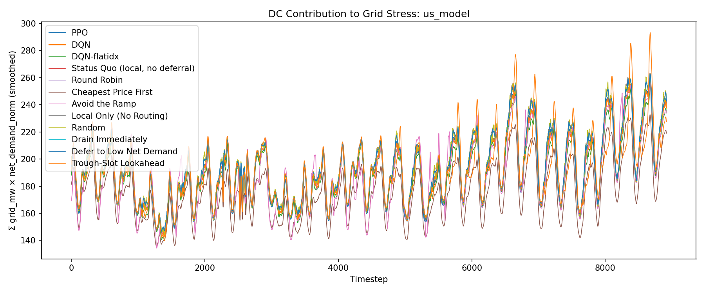
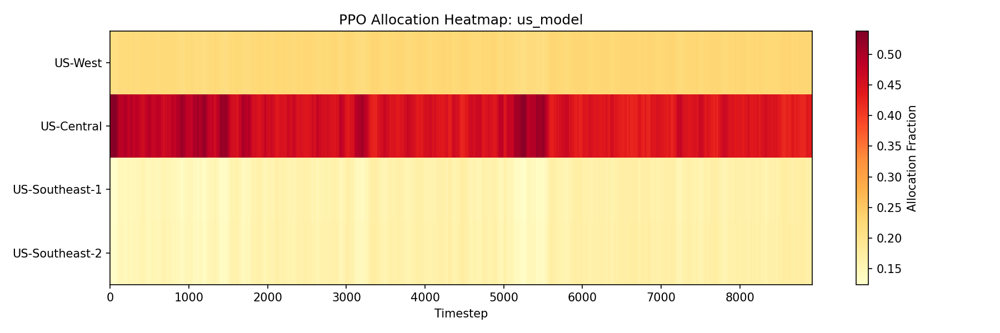

# Evaluation Report: us_model

## Summary

| Policy | Total Cost | Energy Cost | Peak Penalty | ND-weighted Load | Total Grid (MW-steps) |
| --- | --- | --- | --- | --- | --- |
| PPO | 9665559.61 | 7705782.05 | 1888720.57 | 1703894 | 2512826.62 |
| DQN | 9759381.44 | 7923142.45 | 1836238.98 | 1705245 | 2542369.65 |
| DQN-flatidx | 9786852.25 | 7896900.77 | 1828198.22 | 1684319 | 2504336.30 |
| Status Quo (local, no deferral) | 9847535.83 | 7970670.51 | 1876865.32 | 1727825 | 2570430.17 |
| Round Robin | 9845529.29 | 7969871.67 | 1875657.62 | 1727945 | 2572494.93 |
| Cheapest Price First | 40110843.52 | 6966632.68 | 1636567.28 | 1563117 | 2294314.85 |
| Avoid the Ramp | 16579964.01 | 7964406.04 | 1849241.45 | 1686934 | 2543909.25 |
| Local Only (No Routing) | 9847535.83 | 7970670.51 | 1876865.32 | 1727825 | 2570430.17 |
| Random | 9889206.89 | 7970391.86 | 1917792.80 | 1728325 | 2572980.31 |
| Drain Immediately | 9845529.29 | 7969871.67 | 1875657.62 | 1727945 | 2572494.93 |
| Defer to Low Net Demand | 9845529.29 | 7969871.67 | 1875657.62 | 1727945 | 2572494.93 |
| Trough-Slot Lookahead | 9934151.76 | 8017734.53 | 1833401.35 | 1699810 | 2574380.82 |

## Per-DC Energy Cost Breakdown

| Policy | US-West | US-Central | US-Southeast-1 | US-Southeast-2 |
| --- | --- | --- | --- | --- |
| PPO | 2481515.33 | 2041230.74 | 1734230.48 | 1448805.50 |
| DQN | 2765526.51 | 1667550.17 | 1761417.63 | 1728648.14 |
| DQN-flatidx | 2937940.51 | 1667550.17 | 2028557.74 | 1262852.35 |
| Status Quo (local, no deferral) | 2563208.16 | 1661717.29 | 2031472.70 | 1714272.37 |
| Round Robin | 2545115.63 | 1667550.17 | 2028557.74 | 1728648.13 |
| Cheapest Price First | 2138471.12 | 2041237.45 | 1535700.70 | 1251223.40 |
| Avoid the Ramp | 2824132.75 | 1389235.10 | 1597252.44 | 2153785.76 |
| Local Only (No Routing) | 2563208.16 | 1661717.29 | 2031472.70 | 1714272.37 |
| Random | 2541334.31 | 1668298.38 | 2029988.08 | 1730771.09 |
| Drain Immediately | 2545115.63 | 1667550.17 | 2028557.74 | 1728648.13 |
| Defer to Low Net Demand | 2545115.63 | 1667550.17 | 2028557.74 | 1728648.13 |
| Trough-Slot Lookahead | 2675251.96 | 1551082.60 | 1991712.34 | 1799687.63 |

## Plots

