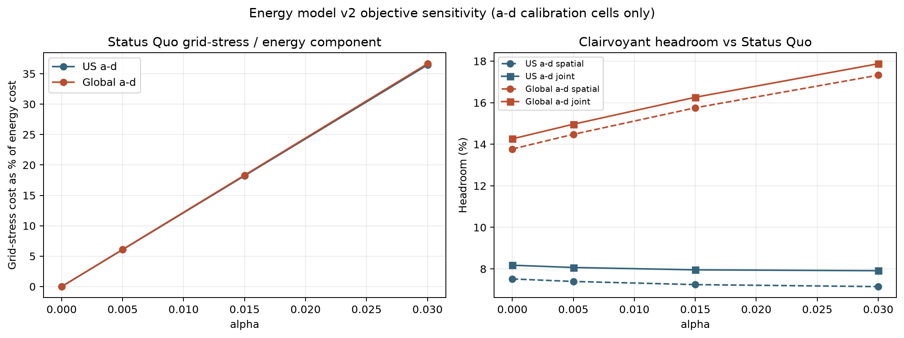

# Energy Model v2 Objective Sensitivity

> No PPO training is involved. Alpha is calibrated on a-d only; e-h remains held out.

The primary objective includes real energy cost plus the convex `alpha * grid_mw^2 * max(net_demand_signed, 0)` grid-stress term. The standardized $15/kW-cycle demand charge is excluded from the primary reward and reported as a secondary sensitivity.

| Scenario | Alpha | Stress / energy | Spatial headroom | Joint headroom | Temporal | Ref demand charge |
|---|---:|---:|---:|---:|---:|---:|
| US a-d | 0.000 | 0.0% | 7.52% | 8.18% | 0.71% | $4.694M |
| US a-d | 0.005 | 6.1% | 7.40% | 8.07% | 0.73% | $4.694M |
| US a-d | 0.015 | 18.2% | 7.24% | 7.95% | 0.77% | $4.694M |
| US a-d | 0.030 | 36.5% | 7.15% | 7.91% | 0.82% | $4.694M |
| Global a-d | 0.000 | 0.0% | 13.77% | 14.26% | 0.57% | $4.694M |
| Global a-d | 0.005 | 6.1% | 14.48% | 14.96% | 0.57% | $4.694M |
| Global a-d | 0.015 | 18.3% | 15.75% | 16.26% | 0.60% | $4.694M |
| Global a-d | 0.030 | 36.6% | 17.32% | 17.87% | 0.67% | $4.694M |

