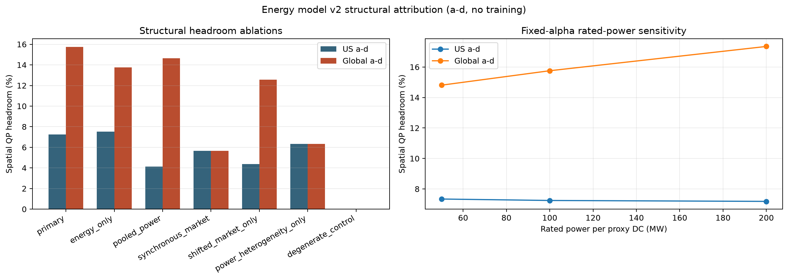
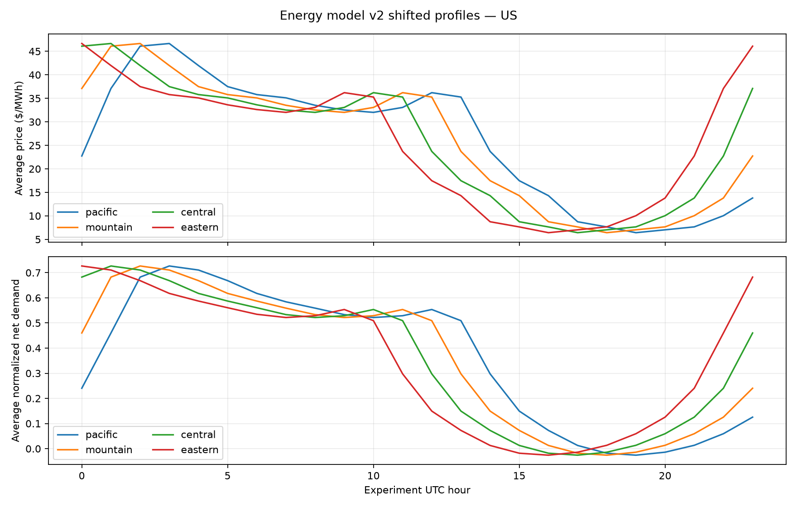
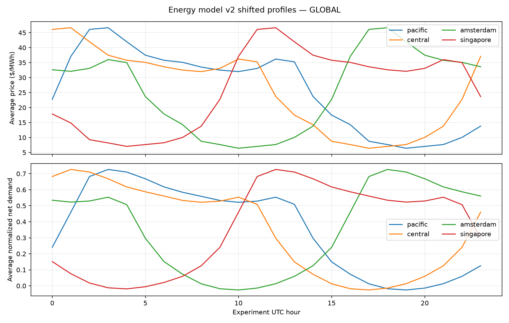

# Energy Model v2 Review Gate — May 2025

> **No PPO retraining has been launched.** This report validates the energy system and theoretical headroom first.

## Experimental energy model

The primary model is one co-timestamped, real CAISO archetype:

- CAISO Today's Outlook native five-minute net demand;
- CAISO OASIS NP15 hourly day-ahead total LMP, expanded stepwise;
- negative prices preserved;
- one Pacific civil-time calendar with IANA/DST conversion;
- price and net demand shifted together across market slots;
- no regional price re-averaging.
- net demand scaled by the maximum absolute Pacific May value, preserving its sign in [-1, 1];
- every site is an equal 100 MW proxy with normalized capacity 1.0;
- current measured batch arrival is observable before the action that may release it.

US slots: Pacific, Mountain, Central, Eastern. Global slots: Pacific, Central, Amsterdam, Singapore.

Google's May-2019 workload shapes are anchored to the May-2025 energy calendar as an explicit cross-year counterfactual.

## Finite-window boundary handling

The time-zone transformation is continuous rather than circular. Every slot still contains exactly 8,928 five-minute intervals (744 hours), but shifted slots can use adjacent real CAISO hours at the month boundary instead of wrapping May 31 back to May 1. Singapore is 15 hours ahead of Pacific time, so its reference window replaces CAISO's first 15 hours of May (mean $21.54/MWh) with the first 15 hours of June (mean $29.16/MWh). Its monthly mean is therefore $26.09/MWh instead of Pacific's $25.93/MWh: a $0.154/MWh (0.59%) boundary effect, not extra simulated time or a Singapore price premium.

The continuous shift is retained because a circular within-May shift would create an artificial May 31-to-May 1 discontinuity. Baselines, QP, and future learned policies are compared on the same slot data within each scenario; regional monthly means are not forced to match.

## Reference diagnostics

| Slot | Mean price | Price std | Price/net-demand r | Price peak UTC | Net peak UTC |
|---|---:|---:|---:|---:|---:|
| us_pacific | $25.93/MWh | $16.48/MWh | 0.895 | 03:00 | 03:00 |
| us_mountain | $25.93/MWh | $16.48/MWh | 0.895 | 02:00 | 02:00 |
| us_central | $25.94/MWh | $16.48/MWh | 0.895 | 01:00 | 01:00 |
| us_eastern | $25.94/MWh | $16.48/MWh | 0.895 | 00:00 | 00:00 |
| global_pacific | $25.93/MWh | $16.48/MWh | 0.895 | 03:00 | 03:00 |
| global_central | $25.94/MWh | $16.48/MWh | 0.895 | 01:00 | 01:00 |
| global_amsterdam | $25.94/MWh | $16.47/MWh | 0.894 | 18:00 | 18:00 |
| global_singapore | $26.09/MWh | $16.39/MWh | 0.892 | 12:00 | 12:00 |

Reference CAISO facts:

- mean DAM price: about $25.93/MWh;
- negative-price intervals are retained;
- average local price and net-demand trough: ~12:00 PDT;
- average local price and net-demand peak: ~20:00 PDT;
- price/net-demand correlation: ~0.895.
- negative-net-demand intervals average about $2.86/MWh versus $29.88/MWh otherwise; the deepest 5% average about $0.11/MWh.

## QP headroom gate — unrestricted-routing upper bound

| Scenario | Status quo | Spatial QP | Joint QP | Spatial headroom | Joint headroom | Incremental temporal |
|---|---:|---:|---:|---:|---:|---:|
| US a-d | $6.568M | $6.092M | $6.045M | 7.24% | 7.95% | 0.77% |
| US e-h | $6.219M | $5.768M | $5.637M | 7.26% | 9.36% | 2.27% |
| Global a-d | $6.598M | $5.559M | $5.525M | 15.75% | 16.26% | 0.60% |
| Global e-h | $6.276M | $5.246M | $5.185M | 16.42% | 17.38% | 1.16% |

## Objective coefficient and demand-charge treatment

The frozen primary objective keeps `alpha=0.015`. On a-d calibration cells, the Status Quo grid-stress component is 18.2% of energy cost in US and 18.3% in Global: material but not dominant. The alpha sweep is generated from a-d only so held-out e-h does not select the coefficient.

The standardized demand charge is excluded from the primary reward. At $15/kW-cycle it is about $4.694M for Status Quo and would dominate the controlled objective; it is also not a real Dutch or Singapore tariff. It remains a secondary reported sensitivity and optional later extension.

## Experimental deadline sensitivity

ClusterData 2019 does not publish deadlines. The primary `flexibility_factor=1` sets `H=2x` fitted mean duration. QP robustness uses factor 0 (`H=1x`) and factor 2 (`H=3x`).

- factor 0 incremental temporal headroom: 0.3–1.2%;
- factor 1 incremental temporal headroom: 0.6–2.3%;
- factor 2 incremental temporal headroom: 0.8–3.2%.

Full table: [flexibility_sweep.md](flexibility_sweep.md).

## Structural attribution and rated-power sensitivity

V2 uses one price level shifted in time, so the v1 unequal-mean synthetic-price criticism no longer applies. The following a-d-only QP ablations diagnose—not additively decompose—the sources of spatial headroom:

| Condition | US headroom | Global headroom |
|---|---:|---:|
| primary | 7.24% | 15.75% |
| energy_only | 7.52% | 13.77% |
| pooled_power | 4.14% | 14.64% |
| synchronous_market | 5.67% | 5.67% |
| shifted_market_only | 4.36% | 12.58% |
| power_heterogeneity_only | 6.33% | 6.33% |
| degenerate_control | 0.05% | 0.05% |

Per-cell power heterogeneity makes routing non-degenerate but is not a novel RL mechanism. Shifted market phase is the dominant Global lever; both mechanisms interact. The fully equal, energy-only control leaves about 0.05% headroom.

With fixed alpha, R sensitivity is modest in US (7.18–7.34%) and larger in Global (14.81–17.35%) over R=50–200 MW.

Full table: [structure_ablation.md](structure_ablation.md).

## Ramp-rate treatment

Ramp rate is evaluated, not optimized. The primary reward contains no net-demand derivative. Price correlates about 0.206 with the one-hour CAISO ramp and 0.429 with the three-hour ramp, so it is only a partial ramp proxy.

Evaluation reports per-region maximum and p95 upward ramps for one hour and three hours, comparing raw net demand with net demand plus DC load. As an instrumentation check, Status Quo changes the maximum one-hour ramp by -0.4 to 1.7 MW against a 11,465 MW base ramp. A ramp penalty is future work only if trained v2 policies worsen these physical KPIs.

## Figures

## Review interpretation

The aligned real energy model creates meaningful but optimistic unrestricted-routing optimization headroom (8.0–17.4% depending on scenario). Spatial diversity remains the dominant lever. Incremental temporal headroom is positive but modest (0.6–2.3%), so a defensible thesis should not promise a large temporal gain.

## Explicit limitations / future work

- The primary experiment is a controlled CAISO archetype, not a real multi-market replay.
- Regional price levels are intentionally not re-averaged.
- Time-zone shifts use adjacent real boundary hours rather than a circular within-May wrap, so shifted monthly means can differ slightly.
- Five-minute RTM price is future robustness work.
- Historical 2019/2024 duck-curve comparison and extrapolation are future work, not additional training scenarios.
- Workload shapes are from May 2019 while the energy calendar is May 2025; this is an explicit counterfactual.
- The controlled study reuses the same May-2025 CAISO calendar across OOF workload folds; other months/years are future work.
- Service and batch routing are unrestricted across all four slots; latency, residency, and movement constraints are future work.
- The primary deadline uses fitted mean duration with flexibility factor 1.0; factors 0 and 2 are planned robustness cases.
- A causal MPC comparator is future work; the QP remains a clairvoyant diagnostic only.
- The primary reward penalizes high net-demand exposure, not ramp rate. Evaluation reports per-region 1h/3h maximum and p95 upward ramps; a ramp penalty is future work only if those KPIs worsen.

## Downstream frozen campaign

**The energy gate was consumed by the completed 80-model frozen OOF campaign. The joint-shaping headline criterion failed; only Global spatial PPO produced positive held-out optimizer CIs in both folds.**

See [the canonical OOF results](../../oof_v2_2025/results_report.md).
