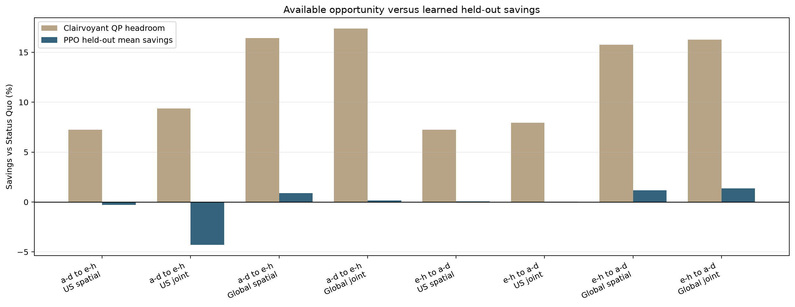

# Frozen Energy-Model v2 OOF Results

> 80 PPO models; two symmetric held-out workload folds; 10 optimizer seeds per configuration; no validation selection or post-hoc tuning.

## Frozen verdict

**Joint-shaping headline supported: FALSE.**

Only Global spatial PPO satisfies the frozen positive-CI and feasibility criteria in both folds. The joint-shaping headline criterion fails.

## Held-out results

| Fold | Config | Status quo | PPO mean +/- sd | Savings (95% optimizer CI) | Positive seeds | Feasible seeds | QP headroom | PPO gap to QP |
|---|---|---:|---:|---:|---:|---:|---:|---:|
| a-d to e-h | US spatial | $6.219M | $6.237M +/- $0.047M | -0.29% [-0.76, 0.15] | 4/10 | 10/10 | 7.26% | 8.13% |
| a-d to e-h | US joint | $6.219M | $6.486M +/- $0.779M | -4.30% [-12.45, 0.20] | 4/10 | 3/10 | 9.36% | 15.07% |
| a-d to e-h | Global spatial | $6.276M | $6.220M +/- $0.058M | 0.90% [0.34, 1.42] | 8/10 | 10/10 | 16.42% | 18.57% |
| a-d to e-h | Global joint | $6.276M | $6.265M +/- $0.119M | 0.17% [-1.00, 1.19] | 6/10 | 2/10 | 17.38% | 20.84% |
| e-h to a-d | US spatial | $6.568M | $6.563M +/- $0.039M | 0.07% [-0.27, 0.42] | 5/10 | 10/10 | 7.24% | 7.74% |
| e-h to a-d | US joint | $6.568M | $6.565M +/- $0.073M | 0.04% [-0.59, 0.71] | 4/10 | 2/10 | 7.95% | 8.60% |
| e-h to a-d | Global spatial | $6.598M | $6.520M +/- $0.044M | 1.19% [0.81, 1.58] | 10/10 | 10/10 | 15.75% | 17.29% |
| e-h to a-d | Global joint | $6.598M | $6.508M +/- $0.059M | 1.38% [0.82, 1.87] | 9/10 | 2/10 | 16.26% | 17.77% |

## Interpretation

- **Global spatial is the only robust success:** 0.90% and 1.19% held-out mean savings, with positive optimizer CIs and complete service in both folds.
- **US spatial does not establish savings:** a-d to e-h is consistent with a small loss (-0.29%, CI [-0.76, +0.15]) and its PPO mean also loses to Round Robin; e-h to a-d is indistinguishable from zero (+0.07%, CI [-0.27, +0.42]).
- **Joint batch control is not established:** US is unstable and Global is fold-dependent; only 9/40 batch seeds (2 configs x 2 folds x 10 seeds) meet the frozen 99.99% completion floor, and no batch configuration reaches 4/10 feasible seeds in a fold.
- **The learned policies capture little clairvoyant opportunity:** Global spatial captures 5.47% and 7.55% of QP savings; other configurations capture less or are negative.
- **Joint batch control does not reliably improve over separately trained spatial PPO:** it is worse in both US folds and in Global a-d to e-h; it improves Global e-h to a-d by only 0.19%. Completion failures in 31/40 batch seeds confound any claim about pure temporal value.

The frozen success rule uses a 20,000-resample percentile bootstrap over 10 optimizer seeds. As a wider small-sample sensitivity, the two Global spatial t-intervals are [0.24, 1.55]% and [0.71, 1.66]%; both remain positive, so the conclusion is unchanged.

## Secondary effects

| Fold | Config | Demand-charge change | Fleet-peak change | 1h max-ramp change vs SQ | 3h max-ramp change vs SQ |
|---|---|---:|---:|---:|---:|
| a-d to e-h | US spatial | -2.71% | +0.42 MW | -0.57 MW | -3.49 MW |
| a-d to e-h | US joint | +8.05% | +2.57 MW | +1.12 MW | +2.81 MW |
| a-d to e-h | Global spatial | -1.43% | +0.95 MW | +1.55 MW | -0.97 MW |
| a-d to e-h | Global joint | +7.01% | +1.63 MW | +3.52 MW | +3.05 MW |
| e-h to a-d | US spatial | -3.05% | -0.54 MW | +0.31 MW | -0.15 MW |
| e-h to a-d | US joint | +5.33% | +2.28 MW | +0.92 MW | +2.26 MW |
| e-h to a-d | Global spatial | -1.48% | -1.34 MW | -1.92 MW | -0.89 MW |
| e-h to a-d | Global joint | +7.55% | +2.61 MW | -0.49 MW | +1.09 MW |

Spatial PPO generally lowers the secondary demand-charge reference (about 1.4-3.0%), while batch PPO raises it (about 5.3-8.1%). Batch PPO also worsens the rare maximum three-hour ramp across all sites in every fold, even though typical p95 three-hour ramps improve. Ramp rate was not in the training reward.

## Completion audit

All 80 policies complete 100% of service. Across 40 batch policies, 9 meet the frozen 99.99% batch-completion floor. Global joint e-h to a-d seed 103 expires 0.889 normalized units. US joint a-d to e-h seed 101 has the largest terminal pool (7.690 units) and accumulates $2.289M of transient service-backlog cost despite clearing it by episode end.

## Figures

