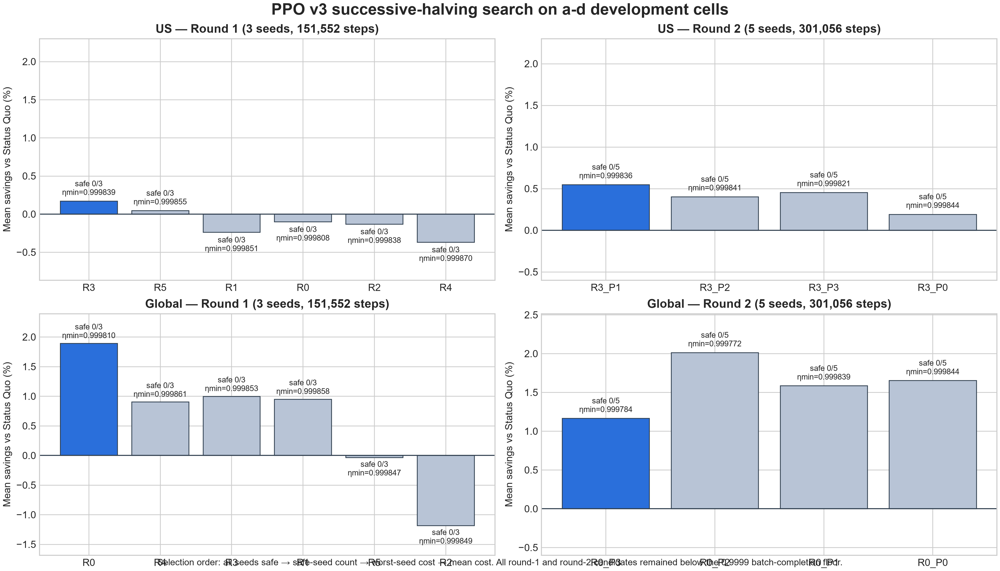
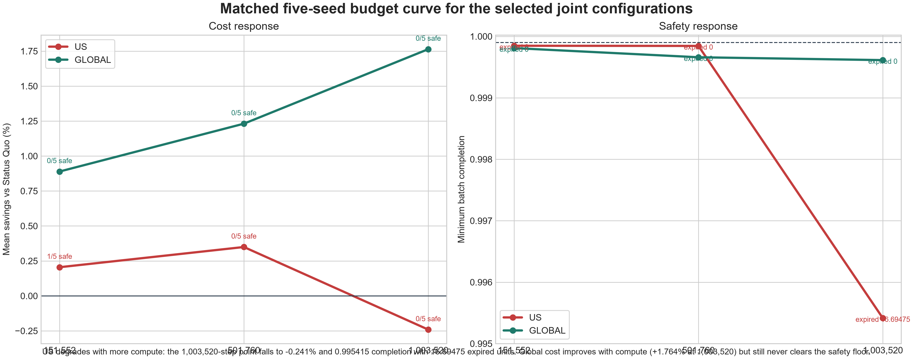
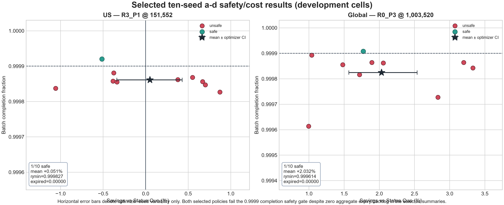
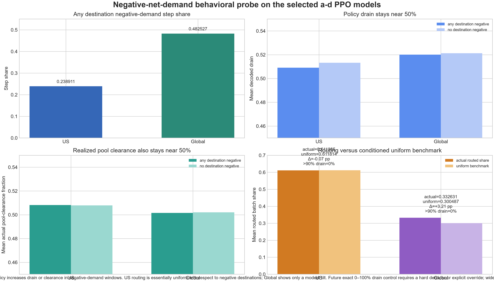
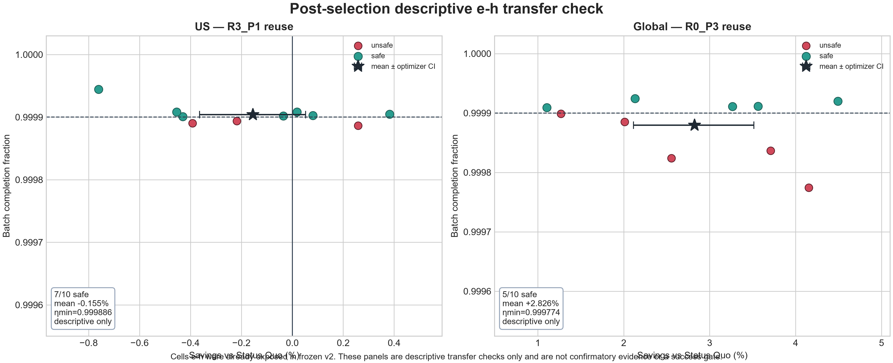

# PPO v3 canonical analysis package

> 126 frozen PPO model artifacts; joint temporal+spatial PPO only; no new spatial-only, temporal-only, or MPC runs.

All intervals below describe optimizer-seed variability only. The a-d results are development-set diagnostics, and the e-h results are descriptive transfer checks only.

## Frozen design

- Primary comparator: deterministic **Status Quo**. **Round Robin** and **Drain Immediately** remain diagnostics only.
- Full-dollar evaluation stayed fixed at service/batch weights **1000 / 1000** even when training reward weights changed.
- Successive-halving budgets: **36 models at 151,552**, **40 models at 301,056**, **20 ten-seed full models at 501,760**, plus matched budget reuses/separate replicas for the selected configurations.
- Selected configurations: **US R3_P1 @ 151,552** and **Global R0_P3 @ 1,003,520**.
- No fresh confirmatory data exist in this protocol: a-d drove selection, and e-h was already exposed in frozen v2.

## Frozen verdict

**Both selected policies fail the frozen safety gate on a-d.** The protocol's required outcome therefore remains: report the joint PPO recovery as unsuccessful and do not activate a spatial-only, temporal-only, or MPC controller under this protocol.

- **US:** 1/10 safe, mean savings +0.051%, optimizer CI $-22,194 to +$28,227, minimum completion 0.999827, zero aggregate expiry/backlog.
- **Global:** 1/10 safe, mean savings +2.032%, optimizer CI +$103,384 to +$167,439, minimum completion 0.999614, zero aggregate expiry/backlog.

## Successive-halving search

| Region | Round | Combo | Mean savings | Worst savings | Safe seeds | Min completion | Selected |
|---|---|---|---:|---:|---:|---:|---|
| US | 151,552 | R3 | +0.171% | -0.072% | 0/3 | 0.999839 | yes |
| US | 151,552 | R5 | +0.047% | -0.638% | 0/3 | 0.999855 |  |
| US | 151,552 | R1 | -0.239% | -0.770% | 0/3 | 0.999851 |  |
| US | 151,552 | R0 | -0.101% | -0.787% | 0/3 | 0.999808 |  |
| US | 151,552 | R2 | -0.131% | -0.889% | 0/3 | 0.999838 |  |
| US | 151,552 | R4 | -0.367% | -1.697% | 0/3 | 0.999870 |  |
| GLOBAL | 151,552 | R0 | +1.893% | +0.755% | 0/3 | 0.999810 | yes |
| GLOBAL | 151,552 | R4 | +0.903% | +0.537% | 0/3 | 0.999861 |  |
| GLOBAL | 151,552 | R3 | +0.998% | +0.322% | 0/3 | 0.999853 |  |
| GLOBAL | 151,552 | R1 | +0.950% | -0.130% | 0/3 | 0.999858 |  |
| GLOBAL | 151,552 | R5 | -0.035% | -0.599% | 0/3 | 0.999847 |  |
| GLOBAL | 151,552 | R2 | -1.185% | -2.869% | 0/3 | 0.999849 |  |
| US | 301,056 | R3_P1 | +0.547% | +0.303% | 0/5 | 0.999836 | yes |
| US | 301,056 | R3_P2 | +0.401% | -0.473% | 0/5 | 0.999841 |  |
| US | 301,056 | R3_P3 | +0.452% | -0.614% | 0/5 | 0.999821 |  |
| US | 301,056 | R3_P0 | +0.191% | -1.952% | 0/5 | 0.999844 |  |
| GLOBAL | 301,056 | R0_P3 | +1.167% | +0.306% | 0/5 | 0.999784 | yes |
| GLOBAL | 301,056 | R0_P2 | +2.014% | +0.182% | 0/5 | 0.999772 |  |
| GLOBAL | 301,056 | R0_P1 | +1.586% | -0.525% | 0/5 | 0.999839 |  |
| GLOBAL | 301,056 | R0_P0 | +1.654% | -1.070% | 0/5 | 0.999844 |  |

Round 1 promoted **R3** for US and **R0** for Global. Round 2 then selected **R3_P1** and **R0_P3**. No round-1 or round-2 candidate achieved all-seeds-safe status.

## Matched budget curve

| Region | Steps | Mean savings | Safe seeds | Min completion | Total expired |
|---|---:|---:|---:|---:|---:|
| US | 151,552 | +0.205% | 1/5 | 0.999847 | 0.00000 |
| US | 501,760 | +0.350% | 0/5 | 0.999845 | 0.00000 |
| US | 1,003,520 | -0.241% | 0/5 | 0.995415 | 16.69475 |
| GLOBAL | 151,552 | +0.889% | 0/5 | 0.999809 | 0.00000 |
| GLOBAL | 501,760 | +1.231% | 0/5 | 0.999660 | 0.00000 |
| GLOBAL | 1,003,520 | +1.764% | 0/5 | 0.999614 | 0.00000 |

- **US worsens with more compute:** the matched five-seed 1,003,520-step point falls to **-0.241%**, minimum completion **0.995415**, and **16.69475** expired units.
- **Global cost improves with more compute:** the matched five-seed 1,003,520-step point reaches **+1.764%**, but still fails the safety floor in **5/5** seeds.
- The separate 501,760-step ten-seed replication also remains unsafe: US **0/10** safe, Global **1/10** safe.

## Final selected a-d results

| Region | Selected config | Mean cost | Mean savings | Optimizer CI (USD) | Safe seeds | Min completion | Max terminal pool | Passed |
|---|---|---:|---:|---:|---:|---:|---:|---|
| US | R3_P1 @ 151,552 | $6.564M | +0.051% | $-22,194 to +$28,227 | 1/10 | 0.999827 | 0.682218 | no |
| GLOBAL | R0_P3 @ 1,003,520 | $6.464M | +2.032% | +$103,384 to +$167,439 | 1/10 | 0.999614 | 1.520689 | no |

## Negative-net-demand behavioral probe

This deterministic diagnostic reconstructs the a-d evaluation environment and reruns all ten selected models per region with domain randomization disabled. It is descriptive only and supports no causal or confirmatory claim.

| Region | Negative-step share | Mean drain if any destination negative | Mean drain otherwise | Mean actual clearance if any destination negative | Mean actual clearance otherwise | Actual routed batch share to negative destinations | Conditioned uniform benchmark | Actual - benchmark | Negative steps with mean drain >90% |
|---|---:|---:|---:|---:|---:|---:|---:|---:|---:|
| US | 0.238911 | 0.509108 | 0.513233 | 0.508187 | 0.507867 | 0.611085 | 0.611814 | -0.07 pp | 0.000000 |
| GLOBAL | 0.482527 | 0.520032 | 0.521231 | 0.501521 | 0.502063 | 0.332631 | 0.300487 | +3.21 pp | 0.000000 |

Neither policy increases drain or realized pool-clearance in negative-demand windows. On conditioned any-negative steps, US actual routing to negative-demand destinations (**0.611085**) is essentially uniform relative to the negative-destination benchmark (**0.611814**, -0.07 percentage points). Global shows only a modest positive spatial tilt (**0.332631** versus **0.300487**, +3.21 percentage points). In both regions, **no** negative-demand step has mean drain above **90%**.

Actual pool-clearance fraction here means `total batch drained / pre-drain batch pool`, with `pre-drain batch pool = post-step batch_pool_size + batch_drained`.

## Descriptive e-h transfer check

**Do not treat this section as confirmatory.** Cells e-h were already exposed in frozen v2, so these results are descriptive transfer only.

| Region | Reused config | Mean savings | Optimizer CI (USD) | Safe seeds | Min completion |
|---|---|---:|---:|---:|---:|
| US | R3_P1 | -0.155% | $-22,658 to +$3,243 | 7/10 | 0.999886 |
| GLOBAL | R0_P3 | +2.826% | +$132,709 to +$220,656 | 5/10 | 0.999774 |

The exact descriptive transfer means are **-0.155% for US** and **+2.826% for Global**; these numbers are reported honestly but are not a gate or headline.

## Context versus frozen v2

- Frozen v2 headline support: **FALSE**. Only Global spatial PPO satisfies the frozen positive-CI and feasibility criteria in both folds. The joint-shaping headline criterion fails.
- The v2 joint result was conditional on a state representation that omitted episode position whenever demand charge was off. V3 adds episode progress and deadline buckets, but the deadline-boundary audit below shows that this repair is incomplete. This does **not** prove causality.
- Frozen v2 spatial-vs-joint comparisons were also affected by a reward-scale confound, so v3 does not use any new spatial-only-versus-joint comparison as evidence.
- Equal 100 MW / unit-capacity proxy sites remove real fleet-size heterogeneity and may reduce US opportunity.

## Remaining deadline-boundary observability limitation

The pre-action observation at step t can include pool entries with deadline_step <= t even though the current transition expires those entries before service. That due-now mass is therefore observable but not actionable.

| Region | Selected training seeds with expiry | Training expiry across all episodes | a-d eval seeds with expiry | e-h eval seeds with expiry |
|---|---:|---:|---:|---:|
| US | 0/10 | 0.000000 | 0/10 | 0/10 |
| GLOBAL | 9/10 | 127.597075 | 0/10 | 0/10 |

This does not change the recorded full-dollar evaluation totals. No selected a-d or descriptive e-h evaluation seed expired work, so the stale due-now bucket was absent from those selected trajectories. However, selected Global policies were trained through randomized episodes containing expiry, so the v3 state repair is incomplete and the exploratory learning result remains conditional on this boundary semantics.

**Next-protocol fix:** Preserve the current deadline and expiry timing, but compute actionable pool size, urgency, and deadline buckets from entries with deadline_step > t. Keep due-now unavoidable mass out of those actionable features; optionally expose it separately as an audit/value feature. This avoids an extra service step and makes every advertised actionable pool unit serviceable. The fix requires a new protocol and retraining; frozen v3 source/results must not be silently rewritten.

## Diagnostic notes

- Existing exact demand-charge and batch-accounting telescope tests had already passed before this frozen reward-sweep analysis.
- Action cap diagnostic: max single-step learned drain = 95.257% (sigmoid(+3)); four repeated steps still permit 99.9995% theoretical clearance, and selected mean saturation remained zero.
- If future work needs exact 0–100% drain behavior, it requires a hard decoder or explicit override; widening a sigmoid is not exact.

## Provenance

- Protocol hash: `afcdacc992bdf9ba219fab251a2576812e0180aa189da49994056d935b549dda`
- Model manifest hash: `7f1fe995e53334a406f5ccfa7d89c90565032ee5b6d439cb80fe014d2f69b425`
- Model count: **126**
- Completion-record count: **126**
- Stage counts: `{"budget_1003520": 15, "budget_151552": 15, "full": 20, "round1": 36, "round2": 40}`
- Exact manifest entries, stage-group hashes, and selected model completion-record hashes are preserved in `canonical_results.json`.

## Figures

