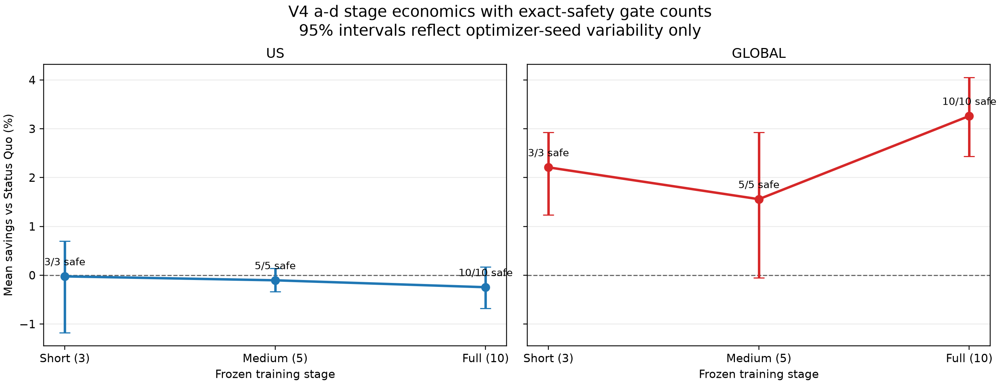
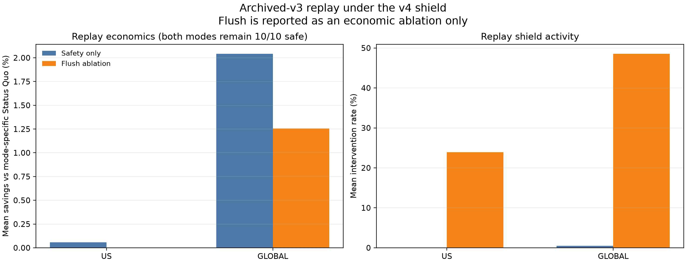
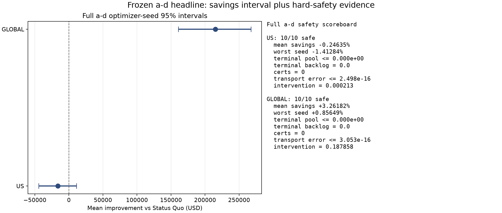
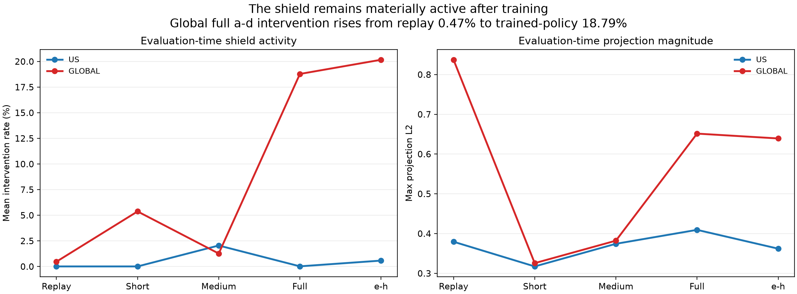
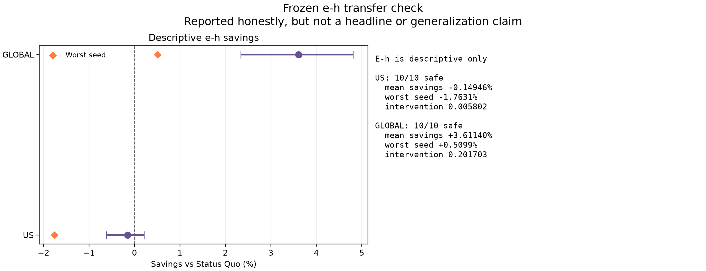

# PPO v4 hard-safety canonical analysis package

> Frozen v4 safety-only package built deterministically from archived protocol/results/manifests/training diagnostics only.

All intervals below reflect optimizer-seed variability only. No new untouched month/cells were added; a-d remains development-only and e-h remains descriptive only.

## Frozen scope

- **36 new v4 models:** short **6** (3/region), medium **10**, full **20**.
- **Replay:** **20** archived v3 selected models evaluated in **two** modes (`safety_only`, `safety_plus_negative_demand_flush`).
- **Hard mechanism:** actionable state keeps only `deadline_step > t`; frozen envelopes are **2.25** service, **1.0** new batch, **4.0** future fleet with **0.75** guaranteed carried reserve; cumulative exact EDF; clean-state service guarantee; exact flow and exact drain endpoints; fail-closed certificates; minimal Euclidean projection telemetry; negative-demand flush optional; grid/ramp caps implemented but disabled in the primary protocol.

## Replay of archived v3 models under the v4 shield

| Region | Mode | Safe seeds | Mean cost | Mean savings | Optimizer CI (USD) | Intervention | Note |
|---|---|---:|---:|---:|---:|---:|---|
| US | safety_only | 10/10 | $6,563,934.425 | +0.05746% | $-21,772 to $28,698 | 0.000112 | archived v3 replay |
| US | flush ablation | 10/10 | $6,551,770.791 | +0.0021% | $-25,141 to $25,022 | 23.90% | economic ablation only |
| GLOBAL | safety_only | 10/10 | $6,463,819.890 | +2.04079% | $103,993 to $167,977 | 0.004727 | archived v3 replay |
| GLOBAL | flush ablation | 10/10 | $6,302,024.796 | +1.2567% | $50,314 to $111,333 | 48.52% | economic ablation only |

Replay `safety_only` is 10/10 safe in both regions. US mean cost is $6,563,934.425 (+0.05746%) with intervention 0.000112; Global mean cost is $6,463,819.890 (+2.04079%) with intervention 0.004727. The flush variant lowers absolute cost, but the correct comparison is versus the flush-enabled Status Quo; treat it as an economic ablation only.

## A-d stage progression

| Stage | Region | Safe seeds | Mean savings | Optimizer CI (USD) | All-seed positive? | Diagnostic CI vs replayed v3 (USD) |
|---|---|---:|---:|---:|---|---:|
| Short | US | 3/3 | -0.0243% | $-77,608 to $45,937 | false | $-76,781 to $52,737 |
| Short | GLOBAL | 3/3 | +2.2095% | $81,395 to $193,223 | true | $-54,076 to $68,239 |
| Medium | US | 5/5 | -0.1045% | $-22,064 to $9,184 | false | $-39,756 to $19,571 |
| Medium | GLOBAL | 5/5 | +1.5572% | $-3,567 to $192,943 | false | $-141,315 to $61,669 |
| Full | US | 10/10 | -0.24635% | $-44,445 to $11,041 | false | $-57,319 to $17,574 |
| Full | GLOBAL | 10/10 | +3.26182% | $160,775 to $267,541 | true | $18,047 to $142,269 |

- **Short gate:** 6/6 safe. US mean is -0.0243% and its CI crosses zero; Global is +2.2095% with a positive optimizer-seed CI.
- **Medium gate:** 10/10 safe. US is -0.1045%; Global is +1.5572%, but its CI still crosses zero.

## Full a-d headline

- **20/20 full a-d evaluations are safe** under the frozen gate: exact completion within protocol tolerance, zero expiry, zero certificates, zero terminal backlog, terminal pool numerically at zero (<=1.1e-9), and transport conservation around 3e-16.
- **US:** mean savings -0.24635%, optimizer CI $-44,445 to $11,041, intervention 0.000213. Economic improvement is **not established** under this frozen protocol.
- **Global:** mean savings +3.26182%, worst seed +0.85649%, optimizer CI $160,775 to $267,541, diagnostic CI vs archived v3 replay $18,047 to $142,269, intervention 0.187858. All ten Global full seeds are positive.
- The projector changes **18.8%** of Global full a-d steps even though Global replay `safety_only` intervention was only **0.47%**. It is therefore materially co-producing feasible behavior, not merely certifying a nearly-feasible archived policy.

## E-h descriptive transfer only

- **US:** 10/10 safe, mean savings -0.14946%, worst seed -1.763%, intervention 0.005802.
- **Global:** 10/10 safe, mean savings +3.61140%, worst seed +0.5099%, intervention 0.201703.
- These e-h numbers are descriptive only. They must not be promoted to a headline or generalized beyond the frozen protocol.

## Comparison with archived v3 selected policies

- Archived v3 selected a-d safety: US 1/10, Global 1/10.
- V4 full a-d hard safety: US 10/10, Global 10/10.
- This is a protocol comparison only; it does not establish a causal proof beyond the frozen design.

## Training telemetry from frozen training.json diagnostics

| Group | Mean intervention | Mean projection L2 | Mandatory-step rate | Min slack | Exact full drains (mean) | Exact zero drains (mean) | Certificates |
|---|---:|---:|---:|---:|---:|---:|---:|
| short:us | 0.469903 | 0.109801 | 0.000211 | -0.000000 | 64.0 | 0.0 | 0 |
| short:global | 0.477022 | 0.112703 | 0.000213 | 0.000000 | 64.3 | 0.0 | 0 |
| medium:us | 0.476022 | 0.112313 | 0.000221 | -0.000000 | 131.6 | 0.0 | 0 |
| medium:global | 0.463607 | 0.107547 | 0.000228 | -0.000000 | 132.2 | 0.0 | 0 |
| full:us | 0.466707 | 0.108416 | 0.000213 | -0.000000 | 63.7 | 0.0 | 0 |
| full:global | 0.455416 | 0.104464 | 0.000249 | -0.000000 | 449.8 | 0.0 | 0 |

All 36 training diagnostics were hash-verified against their completion records. Negative flush activations are zero in every training run because the primary protocol keeps flush disabled.

## Ten-item implementation matrix

| # | Mechanism | Code/tests evidence | Runtime evidence |
|---:|---|---|---|
| 1 | Actionable state excludes any batch with deadline_step <= t; due-now mass is audit-only and expires before service. | env/protocols/v4_safety.yaml:19-24 env/safe_multi_dc_env.py:46-49,200-212 env/safety_layer.py:286-294 scripts/smoke_test_safety_v4.py:84-90 | Full a-d gate is 20/20 safe with total expiry 0 in both regions. |
| 2 | Cumulative exact EDF uses frozen causal envelopes to force enough work now that every known deadline and episode end remain schedulable. | env/protocols/v4_safety.yaml:26-47 env/safety_layer.py:18-36,409-431,461-472 env/safety_layer.py:276-339,607-618 scripts/smoke_test_safety_v4.py:93-151,276-332,385-408 | Preflight observed maxima service 2.130388 and batch 0.831723 below envelopes 2.25/1.0; training records mandatory EDF steps and full a-d/e-h expiry remains zero. |
| 3 | Service guarantee is clean-state only: any preexisting local service backlog fails closed instead of being silently pooled. | env/safe_multi_dc_env.py:170-185,311-312 scripts/smoke_test_safety_v4.py:200-212 | Full a-d maximum terminal service backlog is exactly 0.0 in both regions. |
| 4 | Origin-destination batch flow is exact and conservation is checked at step level and episode summary level. | env/safety_layer.py:235-273,571-575 env/safe_multi_dc_env.py:357-380,452-469 scripts/smoke_test_safety_v4.py:67-82,385-408 | Full a-d max transport conservation error is 2.498e-16 (US) and 3.053e-16 (Global). |
| 5 | Exact drain endpoints are preserved: the projector can realize true 0% and 100% drains when required. | env/safety_layer.py:640-642 scripts/smoke_test_safety_v4.py:93-151 | Adversarial tests exercise both exact endpoints; every stage-region training group records nonzero exact-full-drain counts. The measured traces did not require exact-zero overrides. |
| 6 | Hard infeasibility certificates fail closed on envelope overruns, missed deadlines, and mandatory-capacity deficits. | env/safety_layer.py:409-442,485-495,525-534 env/safe_multi_dc_env.py:204-212 scripts/smoke_test_safety_v4.py:154-197 | Replay, short, medium, full, and e-h all report zero safety infeasibility certificates; all 36 training.json files also report zero. |
| 7 | The shield applies a minimal Euclidean projection and records intervention/projection telemetry rather than replacing the policy with a rule-based controller. | env/safety_layer.py:134-232,595-605,634-635 env/safe_multi_dc_env.py:418-481 scripts/smoke_test_safety_v4.py:67-82,276-332 | Global replay intervention is +0.473%, while the trained full a-d policy is still changed on +18.786% of steps. |
| 8 | PPO is trained with the projector active and every intervention, projection distance, binding horizon, deadline slack, exact endpoint, flush, certificate, and conservation metric is persisted. | train_v4.py:31-132,159-315 env/safe_multi_dc_env.py:418-481 evaluate.py:368-462 scripts/smoke_test_safety_v4.py:385-408 | All 36 hash-verified training diagnostics contain projector telemetry and zero infeasibility certificates. |
| 9 | Negative-demand flush exists as an optional ablation, not the primary protocol. | env/protocols/v4_safety.yaml:43-44 env/safety_layer.py:497-564 scripts/smoke_test_safety_v4.py:241-273 | Replay flush ablation remains 10/10 safe in both regions but raises mean intervention to 23.90% (US) and 48.52% (Global); it is reported as economic ablation only. |
| 10 | Grid and ramp caps are implemented in the shield, but the primary frozen protocol leaves both disabled. | env/safety_layer.py:23-27,62-79 env/safe_multi_dc_env.py:67-95,122-160,275-310 scripts/smoke_test_safety_v4.py:335-382 | All 36 completion records show primary max_grid_mw=null and max_upward_ramp_mw=null, matching the protocol snapshot. |

## Provenance

- Protocol hash: `42a39388adf3a1ed7597c255fa5352f690783b9e10cd49de60eae72e576ded6b`
- Manifest hash: `de2059c0357b95fe7fce4bf1be08b80f6448b7d81d5a27a35cbce1dd65972283`
- Verified model hashes: **36**
- Verified diagnostics hashes: **36**
- Verified completion hashes: **36**
- Stage counts: `{"full": 20, "medium": 10, "short": 6}`
- Frozen input hashes are preserved in `canonical_results.json` under `provenance.input_hashes`.

## Figures

