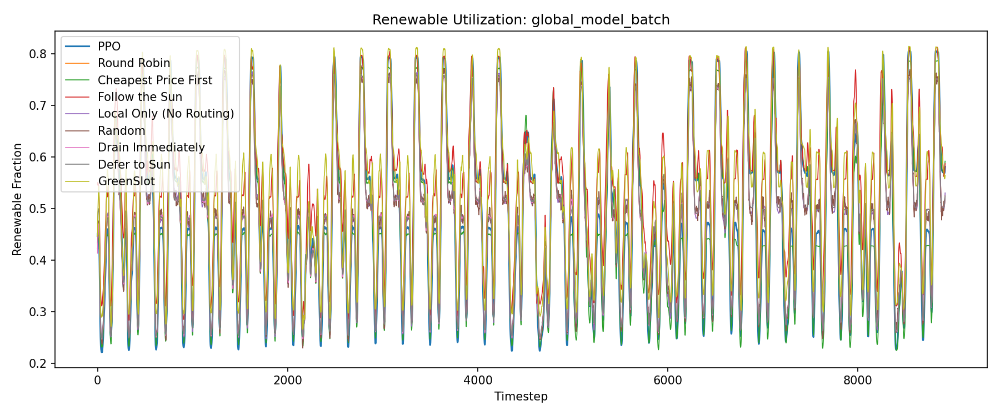

# Evaluation Report: global_model_batch

## Summary

| Policy | Total Cost | Avg Renewable % | Batch Expired | Deadline Cost | Avg Pool Size |
| --- | --- | --- | --- | --- | --- |
| PPO | 4571688.36 | 47.7% | 1645.8418 | 3291.68 | 0.6525 |
| Round Robin | 5070615.68 | 47.1% | 36.7074 | 73.41 | 0.4666 |
| Cheapest Price First | 16573718.52 | 47.0% | 2316.8850 | 4633.77 | 0.7046 |
| Follow the Sun | 4723237.37 | 53.3% | 1177.5289 | 2355.06 | 0.9383 |
| Local Only (No Routing) | 5067391.58 | 47.0% | 72.2401 | 144.48 | 0.1782 |
| Random | 5045514.72 | 47.1% | 420.1795 | 840.36 | 0.5088 |
| Drain Immediately | 5065579.79 | 47.1% | 123.9446 | 247.89 | 0.0170 |
| Defer to Sun | 5066315.78 | 47.2% | 101.4973 | 202.99 | 5.0459 |
| GreenSlot | 4728697.08 | 52.1% | 468.6643 | 937.33 | 1.5599 |

## Per-DC Energy Cost Breakdown

| Policy | Global-US-West | Global-US-Central | Global-EU | Global-Asia |
| --- | --- | --- | --- | --- |
| PPO | 905445.62 | 978580.36 | 851339.37 | 1833027.15 |
| Round Robin | 976832.88 | 821967.89 | 927640.65 | 2344100.85 |
| Cheapest Price First | 773574.63 | 1018235.79 | 729970.40 | 1891962.86 |
| Follow the Sun | 887633.89 | 683323.70 | 771559.66 | 2134975.26 |
| Local Only (No Routing) | 991751.39 | 817028.06 | 930904.41 | 2327563.24 |
| Random | 978467.74 | 806096.28 | 932013.07 | 2328007.69 |
| Drain Immediately | 976832.97 | 816316.65 | 927877.66 | 2344304.62 |
| Defer to Sun | 976528.59 | 816002.09 | 928376.15 | 2345205.95 |
| GreenSlot | 894780.69 | 760429.97 | 950499.17 | 2121659.60 |

## Plots

