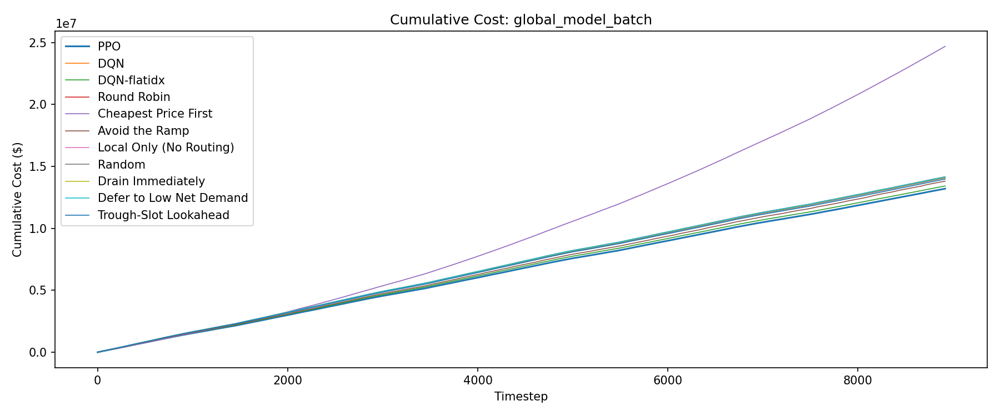
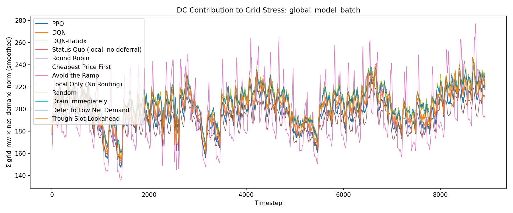
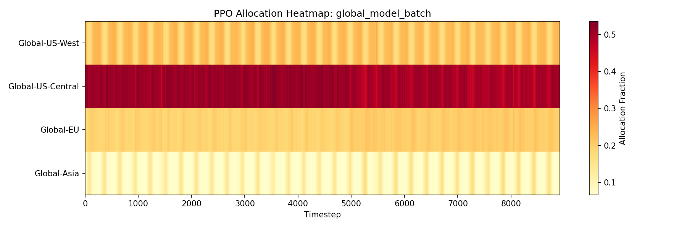
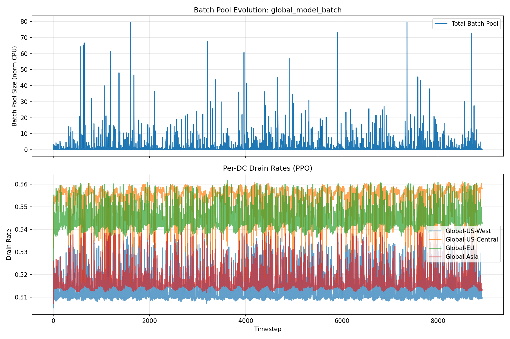
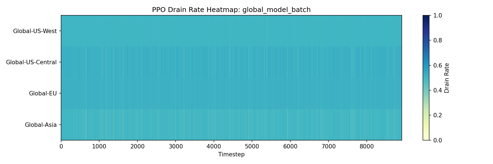

# Evaluation Report: global_model_batch

## Summary

| Policy | Total Cost | Energy Cost | Peak Penalty | ND-weighted Load | Batch Expired | Deadline Cost | Avg Pool Size |
| --- | --- | --- | --- | --- | --- | --- | --- |
| PPO | 13200684.28 | 11233517.71 | 1964650.79 | 1809538 | 1257.8927 | 2515.79 | 0.7287 |
| DQN | 14077804.73 | 12017983.19 | 2059273.55 | 1855238 | 273.9920 | 547.98 | 0.4932 |
| DQN-flatidx | 13418703.31 | 11428230.23 | 1989004.65 | 1825247 | 734.2128 | 1468.43 | 0.5448 |
| Round Robin | 14157556.08 | 12138313.16 | 2019169.51 | 1850517 | 36.7074 | 73.41 | 0.4666 |
| Cheapest Price First | 24689885.81 | 10711673.29 | 1818237.68 | 1721228 | 2316.8850 | 4633.77 | 0.7046 |
| Avoid the Ramp | 13807453.72 | 11623269.38 | 1921059.34 | 1775187 | 1071.0715 | 2142.14 | 2.3813 |
| Local Only (No Routing) | 14137838.86 | 12120996.20 | 2016698.18 | 1849378 | 72.2401 | 144.48 | 0.1782 |
| Random | 14088937.65 | 12071455.29 | 2016552.42 | 1837997 | 420.1795 | 840.36 | 0.5088 |
| Drain Immediately | 14142015.65 | 12128766.17 | 2013001.59 | 1847711 | 123.9446 | 247.89 | 0.0170 |
| Defer to Low Net Demand | 14157371.82 | 12137028.99 | 2020323.70 | 1851042 | 9.5694 | 19.14 | 2.2622 |
| Trough-Slot Lookahead | 13974911.49 | 12009138.37 | 1965431.15 | 1815191 | 114.0874 | 228.17 | 0.4900 |

## Per-DC Energy Cost Breakdown

| Policy | Global-US-West | Global-US-Central | Global-EU | Global-Asia |
| --- | --- | --- | --- | --- |
| PPO | 2359959.76 | 1944206.53 | 2398138.19 | 4531213.22 |
| DQN | 1973364.70 | 1848067.62 | 2628920.25 | 5567630.63 |
| DQN-flatidx | 2427003.21 | 1909809.60 | 2410080.81 | 4681336.62 |
| Round Robin | 2427003.20 | 1733598.54 | 2410080.80 | 5567630.61 |
| Cheapest Price First | 2008537.17 | 2037622.46 | 2006330.55 | 4659183.11 |
| Avoid the Ramp | 2766335.86 | 1612883.77 | 2424419.54 | 4819630.21 |
| Local Only (No Routing) | 2445971.66 | 1723930.90 | 2411460.30 | 5539633.35 |
| Random | 2421747.55 | 1704509.78 | 2409168.00 | 5536029.96 |
| Drain Immediately | 2427006.34 | 1723966.95 | 2410085.34 | 5567707.54 |
| Defer to Low Net Demand | 2426931.58 | 1736154.62 | 2409584.07 | 5564358.72 |
| Trough-Slot Lookahead | 2630296.34 | 1678230.82 | 2393424.72 | 5307186.48 |

## Plots

