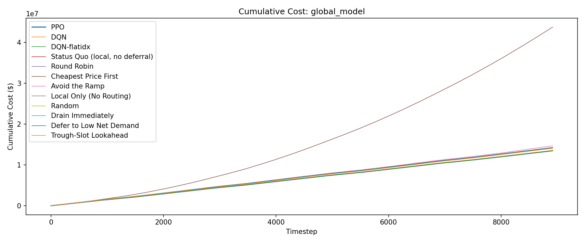
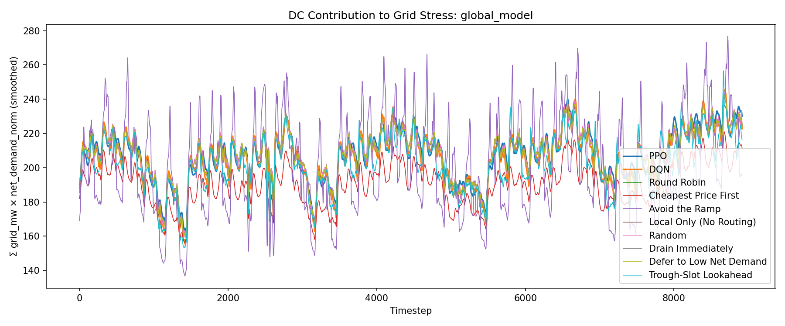
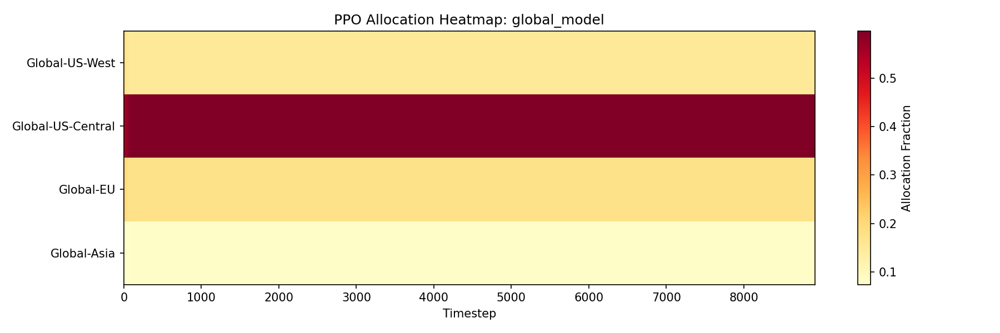

# Evaluation Report: global_model

## Summary

| Policy | Total Cost | Energy Cost | Peak Penalty | ND-weighted Load | Total Grid (MW-steps) |
| --- | --- | --- | --- | --- | --- |
| PPO | 13479999.16 | 11331243.72 | 2063018.14 | 1848298 | 2570058.82 |
| DQN | 13567887.52 | 11565256.27 | 2002631.14 | 1833835 | 2570402.73 |
| DQN-flatidx | 13473988.34 | 11438041.94 | 2035946.39 | 1845916 | 2570402.73 |
| Status Quo (local, no deferral) | 14226821.30 | 12224387.91 | 2002433.38 | 1849641 | 2570402.73 |
| Round Robin | 14242627.80 | 12241614.48 | 2001013.32 | 1849584 | 2570402.73 |
| Cheapest Price First | 43772225.56 | 10485812.49 | 1778769.52 | 1699588 | 2350716.82 |
| Avoid the Ramp | 14671016.69 | 11763190.19 | 2005937.87 | 1805966 | 2563848.20 |
| Local Only (No Routing) | 14226821.30 | 12224387.91 | 2002433.38 | 1849641 | 2570402.73 |
| Random | 14288837.50 | 12244431.56 | 2043383.72 | 1850001 | 2570402.73 |
| Drain Immediately | 14242627.80 | 12241614.48 | 2001013.32 | 1849584 | 2570402.73 |
| Defer to Low Net Demand | 14242627.80 | 12241614.48 | 2001013.32 | 1849584 | 2570402.73 |
| Trough-Slot Lookahead | 14073495.74 | 12085211.20 | 1951680.63 | 1808770 | 2569904.77 |

## Per-DC Energy Cost Breakdown

| Policy | Global-US-West | Global-US-Central | Global-EU | Global-Asia |
| --- | --- | --- | --- | --- |
| PPO | 2496515.58 | 2037593.84 | 2388943.17 | 4408191.14 |
| DQN | 2964880.29 | 1644977.65 | 2555097.77 | 4400300.56 |
| DQN-flatidx | 2572203.65 | 1917995.58 | 2479339.42 | 4468503.29 |
| Status Quo (local, no deferral) | 2595841.19 | 1589334.66 | 2480933.21 | 5558278.85 |
| Round Robin | 2572203.65 | 1596224.44 | 2479339.42 | 5593846.98 |
| Cheapest Price First | 2040930.38 | 2037622.46 | 1966851.43 | 4440408.23 |
| Avoid the Ramp | 3001769.20 | 1531342.00 | 2552657.03 | 4677421.96 |
| Local Only (No Routing) | 2595841.19 | 1589334.66 | 2480933.21 | 5558278.85 |
| Random | 2567263.42 | 1597108.23 | 2480949.99 | 5599109.92 |
| Drain Immediately | 2572203.65 | 1596224.44 | 2479339.42 | 5593846.98 |
| Defer to Low Net Demand | 2572203.65 | 1596224.44 | 2479339.42 | 5593846.98 |
| Trough-Slot Lookahead | 2827780.41 | 1534262.47 | 2458290.31 | 5264877.99 |

## Plots

