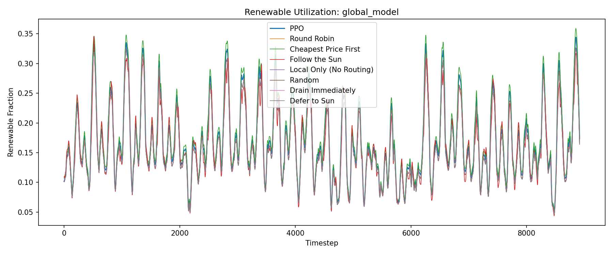

# Evaluation Report: global_model

## Summary

| Policy | Total Cost | Avg Renewable % | Total Grid (MW-steps) |
| --- | --- | --- | --- |
| PPO | 25479224.79 | 16.7% | 2040713.79 |
| Round Robin | 10140503.69 | 15.9% | 2160993.93 |
| Cheapest Price First | 39892345.25 | 17.4% | 1941308.01 |
| Follow the Sun | 11101741.71 | 16.0% | 2159326.99 |
| Local Only (No Routing) | 10123277.12 | 15.9% | 2160993.93 |
| Random | 10144342.99 | 15.9% | 2160993.93 |
| Drain Immediately | 10140503.69 | 15.9% | 2160993.93 |
| Defer to Sun | 10140503.69 | 15.9% | 2160993.93 |

## Per-DC Energy Cost Breakdown

| Policy | Global-US-West | Global-US-Central | Global-EU | Global-Asia |
| --- | --- | --- | --- | --- |
| PPO | 1740071.84 | 1782993.15 | 1815950.34 | 3371402.21 |
| Round Robin | 2084185.94 | 1341595.14 | 2072836.50 | 4641886.11 |
| Cheapest Price First | 1552912.67 | 1782993.15 | 1560348.50 | 3488447.36 |
| Follow the Sun | 2104886.27 | 1231076.06 | 2138433.83 | 4940914.03 |
| Local Only (No Routing) | 2107823.49 | 1334705.36 | 2074430.29 | 4606317.98 |
| Random | 2079245.72 | 1342478.92 | 2074447.07 | 4647149.05 |
| Drain Immediately | 2084185.94 | 1341595.14 | 2072836.50 | 4641886.11 |
| Defer to Sun | 2084185.94 | 1341595.14 | 2072836.50 | 4641886.11 |

## Plots

