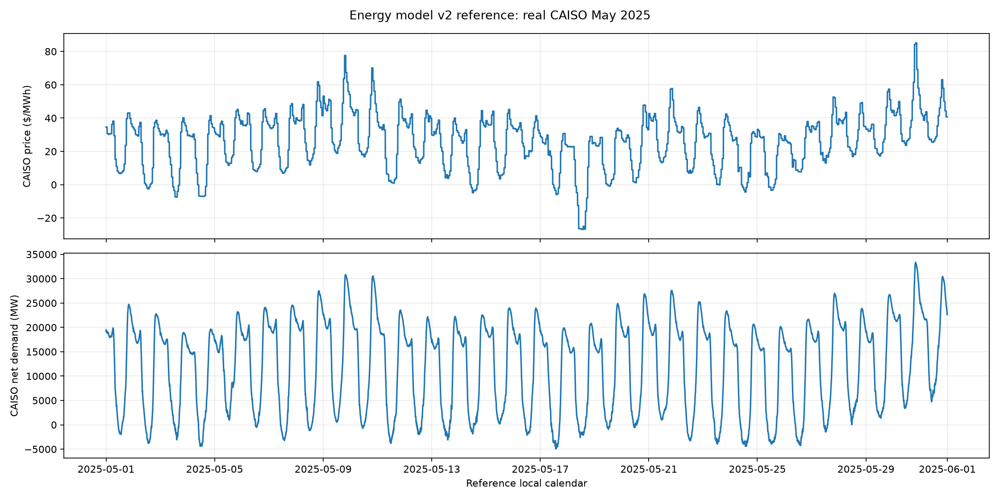
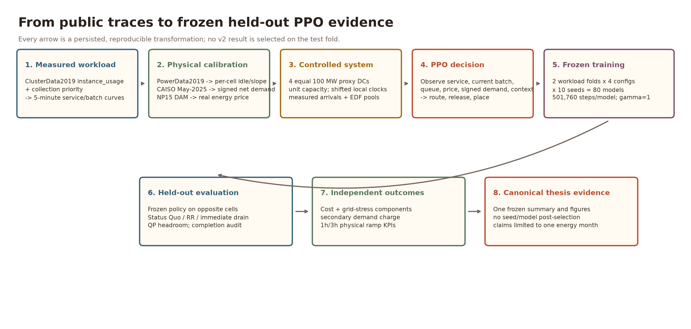
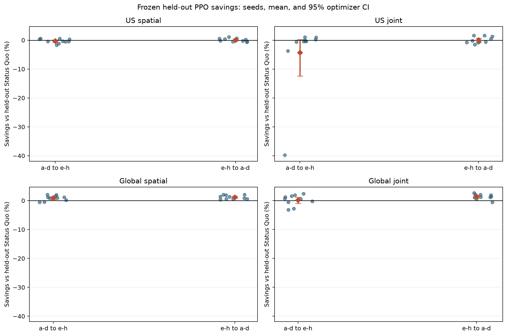
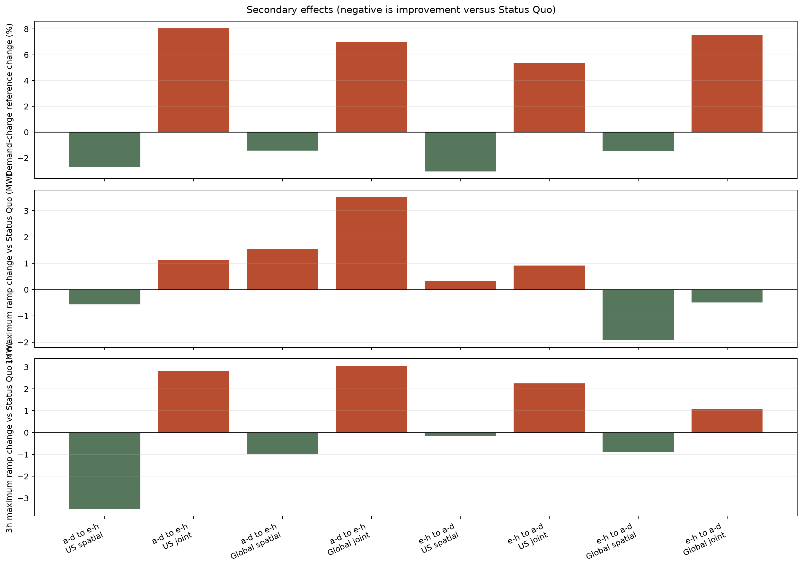

# Multi-Datacenter Energy Optimization via Reinforcement Learning

## Thesis Overview & Technical Reference

> **Current evidence state (August 2026).** The frozen energy-model v2 campaign
> is complete: 80 PPO models, two symmetric held-out workload folds, and ten
> optimizer seeds/configuration. The broad joint-shaping headline **failed**.
> Global spatial PPO is the only robust learned success (~0.9–1.2% held-out
> savings); US spatial is not established and joint batch control is unstable.
> Energy-model v1 remains historical evidence only.

---

## 1. Problem Statement

Modern hyperscale cloud providers operate geographically distributed data centers that collectively consume tens of gigawatts of power, drawn from grids whose **net demand** (total load minus renewable generation) swings dramatically over each day. In solar-heavy regions, net demand exhibits the **duck curve**: midday solar pushes residual demand low, but the evening ramp — when solar drops off and residential load rises — produces a steep peak that strains the grid and spikes wholesale prices. Hyperscale DCs, with steady-state loads of 50–100 MW per site, are non-trivial contributors to this peak.

> **Can a reinforcement learning agent learn to route workloads across data centers — both spatially (which DC) and temporally (when to execute deferrable work) — to minimize grid energy cost while reducing the DCs' contribution to grid net-demand peaks?**

By shifting deferrable batch workloads away from high-net-demand periods, and routing latency-insensitive work to regions where the grid is currently under less stress, the agent can lower modeled operator cost (via day-ahead wholesale price signals) and reduce its load's contribution to the duck-curve neck.

### 1.1 Scope

We optimize a **joint objective** across a fleet of 4 data centers:

1. **Grid energy cost**: $/kWh × grid MW consumed.
2. **Peak-contribution penalty**: a load-squared term weighted by current grid net demand, penalizing DC consumption concentrated during periods of grid stress.

The action space has two dimensions:

1. **Spatial routing**: distributing incoming service demand across DCs to exploit regional differences in net demand and price.
2. **Temporal scheduling** (batch mode): deciding when to execute deferrable batch jobs, deferring work away from peak net-demand periods.

We explicitly **do not** model:
- On-site solar generation or PPAs (DCs are pure grid-connected loads — solar enters only as a forecast feature for upcoming net-demand peaks)
- Carbon emissions (excluded to maintain a focused optimization target; net demand is a correlated proxy)
- Battery storage
- Cooling energy (excluded per advisor guidance; the cooling-optimization dimension — cooling-aware scheduling and RL cooling control — is covered by surveys such as *"A survey on data center cooling systems"* and *"Towards Joint Optimization Over ICT and Cooling Systems in Data Centre: A Survey"*, and is out of scope here)
- Inter-site latency, data residency, or movement cost in the primary controlled
  experiment. Service and batch are assumed freely routable across all four
  slots, including intercontinental Global routing. This is an explicit,
  optimistic assumption—not an operational deployment claim.

### 1.2 Modeling Granularity & Positioning

**We model workload as divisible aggregate flow, not discrete jobs.** Each cell's demand is a single continuous CPU-utilization curve; the agent routes *fractions* of it spatially and releases a deferrable *pool* temporally. There is no per-job placement, no bin-packing, and no VM migration anywhere in the environment — individual jobs enter only *upstream*, as samples that shape the batch-demand curve (§2.2, §3.8). This is a deliberate abstraction, and it places the work in a specific lineage.

**The sustainable-scheduling literature splits by granularity.** One camp schedules discrete units onto machines: **Grange et al. (2018), *"Green IT scheduling for data center powered with renewable energy"*** places individual *tasks*; **Xu et al. (2020), *"A Self-Adaptive Approach for Managing…"*** creates/migrates *VMs* via OpenStack; **Haghshenas et al. (2022), *"Infrastructure-Aware…"*** schedules *jobs* on heterogeneous machines; **CFWS (Zhao et al. 2025)** migrates *VMs* across physical machines. The other camp shapes *aggregate* cluster load with no per-job placement — most authoritatively **Radovanovic et al. (2023), *"Carbon-Aware Computing for Datacenters"*** (Google's production Carbon-Intelligent Compute Management System, CICS, operating on the same Google-cluster workload). Our environment sits squarely in the aggregate camp.

**Partial alignment with Google's production system (CICS).** CICS is the production precedent for aggregate temporal shaping; geographic routing comes from the separate load-balancing lineage:

| Our environment | CICS (Radovanovic et al. 2023) |
|---|---|
| Aggregate cell CPU curve; no job placement | Cluster-level "Virtual Capacity Curves" shape hourly resource/power usage |
| Deferrable vs must-serve split by **priority tier** (free+beb vs production) | *"temporally **inflexible** (higher tiers)"* vs *"**flexible** (lower-tier batch jobs that tolerate delays)"* |
| Per-cell power model on aggregate CPU | *"power models trained separately for each cluster"* on *"aggregate… resource demand"* |
| Spatial routing **+** temporal deferral | CICS implements temporal VCC limits; Qureshi/Rao/Liu-Wierman motivate the spatial routing head |
| Peak-contribution penalty | *"reduces daily peak CPU and, consequently, power consumption"* |
| CPU as demand proxy | *"in aggregate, resource consumption is highly correlated to CPU consumption"* |

CICS explicitly runs independently from real-time job-level scheduling and uses aggregate cluster-specific demand forecasts rather than a stylized job-level workload model. We therefore use it as a production precedent for aggregate load shaping, not as evidence that job-level deadline optimization has been universally superseded.

**What we reuse vs. what we benchmark.** The primary workload is the measured
aggregate service/batch split from `instance_usage`; it is not generated.
Single-DC predecessors such as GreenSlot, Grange, Xu, and Haghshenas motivate
deadline-constrained deferral and time-varying energy objectives, but we do not
reproduce their per-job placement mechanisms. The retained Grange/Da Costa
generator is optional sensitivity tooling only (§3.8).

**Honest limitations of the abstraction.** Divisible aggregate flow cannot capture per-VM/per-job SLA enforcement, VM-migration overhead, bin-packing and resource fragmentation on real machines, or the indivisibility of a single job. These belong to the intra-DC placement problem (CFWS's territory) and are out of scope. The aggregate view is appropriate for the inter-DC, grid-facing question this thesis asks — *how much load runs where, and when* — which does not require machine-level detail.

---

## 2. Data Sources

### 2.1 Workload Traces — Google ClusterData 2019

Workload demand traces are derived from the **Google ClusterData 2019** trace, the second-generation Borg trace published by Google in 2019/2020 and documented by **Tirmazi et al. (2020), "Borg: the next generation"** (EuroSys '20) [§8.1]. The trace covers eight Borg clusters (cells **a–h**) for the entire month of May 2019, comprising ~96.4k machines across the eight cells with an average of ~12k machines per cell. We use cells a, b, c, d — one per DC in our 4-DC scenarios.

A **cell** in Borg is "a single management unit" — a logical cluster of machines managed by one scheduler master (Tirmazi §2). Treating each cell as one DC's natural workload is consistent with how the trace publishers themselves describe cells as first-class deployment units; the trace publication explicitly notes "considerable inter-cell workload variation" (Tirmazi §3), which is precisely the heterogeneity our multi-DC routing exploits.

We extract per-cell aggregate CPU demand timeseries at 5-minute resolution:
- **Source table**: `google.com:google-cluster-data.clusterdata_2019_a` (and b, c, d variants), accessed via BigQuery
- **Metric**: Normalized CPU demand (`cpu_demand_norm`) — aggregate CPU usage per 5-minute interval, expressed in **Normalized Compute Units (NCUs)** scaled to [0, 1]. NCUs abstract over machine heterogeneity by rescaling Google Compute Units (GCUs) against the maximum machine size in the trace (Tirmazi §3).
- **Sampling interval**: 5 minutes, matching the trace's native sampling period (Tirmazi notes that the 2019 trace adds a 21-element CPU-utilization histogram per 5-minute period)
- **Extracted duration**: 31 days → 8,929 ordinal workload rows per cell; the
  active v2 loader uses the first 8,928 rows to match the complete energy calendar
- **Files**: `data/cells/cell_a.csv` through `cell_d.csv`

This per-cell aggregate extraction is the standard way of summarizing the 2019 trace — Tirmazi's own analyses (Figures 2–3 of that paper) present cell-level CPU and memory usage as "fraction of cell capacity" timeseries across the trace duration, which is structurally the same view our environment operates on. Each cell thus represents one DC's natural workload pattern with real diurnal and weekly variation preserved.

**Modeling assumption — cells as proxy DCs.** Tirmazi documents the 2019 trace as eight Borg cells but does *not* claim those cells are in geographically distinct locations. Our framing treats four cells as if they were four geographically distributed hyperscale DCs — i.e., what 4 hyperscale-DC workloads with similar diurnal patterns but realistic cell-level heterogeneity would look like. This is a defensible **modeling exercise** rather than a dataset-grounded claim: it relies on (a) Tirmazi's documented inter-cell workload variation as a proxy for inter-DC workload variation, and (b) the absence of any contradicting metadata in the trace. The cell's actual physical scale is also significantly smaller than a hyperscale DC; the magnitude scaling that bridges this gap is treated separately in §3.2 (`rated_power_mw`). Together with §3.2, this is the cell-as-proxy-DC modeling exercise that the rest of the thesis builds on — not what the dataset publishers had in mind, but consistent with the patterns the dataset preserves.

### 2.2 Batch Job Distributions — Google ClusterData 2019

The 2019 trace exposes job priority as a sparse value in [0, 450] and groups priorities into named **tiers**. We classify a job as deferrable **batch** iff it belongs to one of the two **SLO-free tiers**: the **free tier** (`priority ≤ 99`) or the **best-effort batch (beb) tier** (`priority ∈ [100, 115]`) — i.e., simply **`priority ≤ 115`**. Tier bounds follow the normative trace documentation (**Wilkes, *"Google cluster-usage traces v3"*, 2020-08 revision**); Tirmazi et al. (2020) describe beb as 110–115 in their exposition. Both no-SLO tiers are the genuinely delay-tolerant work. Every SLO-bearing tier is non-deferrable **service**: the mid-tier (116–119, weak SLOs) and especially the **production tier** (120–359), which requires high availability and can evict lower tiers. Monitoring (≥ 360) is likewise service. Classification is by **priority**, not `scheduling_class`: the latter encodes latency sensitivity and is orthogonal to tier.

All numbers below are the **corrected `≤ 115` (free + beb) extraction** — the re-extraction the earlier erratum banner anticipated is done, and the deferrable shares duly rose (the 100–109 band the inherited 110–115 filter had dropped was the bulk of best-effort batch). Exact per-cell fit parameters live in `data/jobs/batch_distributions_{a..d}.json`.

We fit statistical distributions to each cell's deferrable jobs (Cell A shown; illustrative — full params in the JSON):

| Property | Cell A distribution | Key parameters |
|---|---|---|
| **Inter-arrival time** (sec) | Weibull (min) | shape=0.54, scale=33.0, mean=29.4s, KS D=0.11 |
| **Duration** (sec) | Log-normal | σ=1.74, scale=129, mean=1430s, median=105s, KS D=0.13 |
| **CPU request** (normalized) | Log-normal | σ=0.81, mean=0.0090, KS D=0.07 |
| **Memory request** (normalized) | Log-normal | σ=0.95, mean=0.0061, KS D=0.08 |
| **Tasks per job** | Negative binomial | mean=52.5, median=1, KS D=0.20 |

**Fitting methodology.** Candidate continuous distributions (exponential, log-normal, gamma, Weibull) are fit by MLE and the best selected by **minimum KS *D* statistic** — *not* the KS *p*-value, which underflows to 0 at n~10⁵ regardless of fit quality and is invalid for parameters estimated from the same sample (the Lilliefors situation). Tasks-per-job is count data, so it uses a **discrete** fit (Poisson / geometric / negative-binomial). Inter-arrivals and resource requests are taken over all deferrable jobs; durations only over jobs that reached FINISH. The heavy-tailed winners — log-normal durations/requests, negative-binomial task counts with mean 52 ≫ median 1 — reproduce the extreme variability Tirmazi documents: "the top 1% of jobs consume over 99% of resources," squared coefficient of variation > 23,000 (Tirmazi §7).

**Batch fraction.** The environment splits the CPU-*usage* curve, so the operative `batch_fraction` is the no-SLO tiers' share of **measured usage** — extracted ground-truth from `instance_usage` split by priority tier ([extract_tier_curves.ipynb](extract_tier_curves.ipynb)):

| | Cell A | Cell B | Cell C | Cell D |
|---|---|---|---|---|
| **measured usage share (used by the env)** | **16.6%** | **15.7%** | **22.3%** | **26.4%** |
| by CPU request | 63% | 85% | 81% | 79% |
| by CPU-time proxy (request × duration) | 60% | 82% | 77% | 75% |
| by job count | 2.4% | 49.8% | 9.1% | 14.3% |

**The request-based proxies overestimate the deferrable *usage* share by ~3–5×.** This is exactly the over-allocation Tirmazi documents: the best-effort tiers request far more than Borg actually runs them at — *"cell c has allocated ~140% of the cell's memory capacity just to the best-effort batch tier"* (§5 of that paper) while tier *usage* is a smaller fraction of that. Requests measure intent; usage measures the schedulable reality. The corrected measured deferrable share — **16–26% of load** — sits right at the **~20%-of-capacity best-effort average** Tirmazi reports for the trace, an independent consistency check. `batch_fraction` remains a natural **sensitivity-sweep parameter** (the synthetic generator, §3.8, can instantiate counterfactually batch-heavier mixes). (All figures supersede earlier `scheduling_class ≤ 1 AND priority < 200` numbers, which conflated production with batch, and the inherited 110–115 band, which dropped most of beb.)

### 2.3 Energy Model v2 Review Gate — May 2025

> **No PPO retraining has been launched.** This section validates the energy
> system and theoretical headroom first.

#### Experimental energy model

The primary model is one co-timestamped, real CAISO archetype:

- CAISO Today's Outlook native five-minute net demand;
- CAISO OASIS NP15 hourly day-ahead total LMP, expanded stepwise;
- negative prices preserved;
- one Pacific civil-time calendar with IANA/DST conversion;
- price and net demand shifted together across market slots; and
- no regional price re-averaging.
- every site is an equal 100 MW proxy with normalized capacity 1.0; and
- current measured batch arrival is observable before the action that may
  release it.

US slots: Pacific, Mountain, Central, Eastern. Global slots: Pacific, Central,
Amsterdam, Singapore.

Google's May-2019 workload shapes are anchored to the May-2025 energy calendar
as an explicit cross-year counterfactual.

#### Finite-window boundary handling

The time-zone transformation is continuous rather than circular. Every slot
still contains exactly **8,928 five-minute intervals (744 hours)**, but shifted
slots can use adjacent real CAISO hours at the month boundary instead of
wrapping May 31 back to May 1. Singapore is 15 hours ahead of Pacific time, so
its reference window replaces CAISO's first 15 hours of May (mean
**$21.54/MWh**) with the first 15 hours of June (mean **$29.16/MWh**). Its
monthly mean is therefore **$26.09/MWh** instead of Pacific's **$25.93/MWh**:
a **$0.154/MWh (0.59%)** boundary effect, not extra simulated time or a
Singapore price premium.

The continuous shift is retained because a circular within-May shift would
create an artificial May 31-to-May 1 discontinuity. Baselines, QP, and future
learned policies are compared on the same slot data within each scenario;
regional monthly means are not forced to match.

#### Reference diagnostics

| Slot | Mean price | Price std | Price/net-demand r | Price peak UTC | Net peak UTC |
|---|---:|---:|---:|---:|---:|
| us_pacific | $25.93/MWh | $16.48/MWh | 0.895 | 03:00 | 03:00 |
| us_mountain | $25.93/MWh | $16.48/MWh | 0.895 | 02:00 | 02:00 |
| us_central | $25.94/MWh | $16.48/MWh | 0.895 | 01:00 | 01:00 |
| us_eastern | $25.94/MWh | $16.48/MWh | 0.895 | 00:00 | 00:00 |
| global_pacific | $25.93/MWh | $16.48/MWh | 0.895 | 03:00 | 03:00 |
| global_central | $25.94/MWh | $16.48/MWh | 0.895 | 01:00 | 01:00 |
| global_amsterdam | $25.94/MWh | $16.47/MWh | 0.894 | 18:00 | 18:00 |
| global_singapore | $26.09/MWh | $16.39/MWh | 0.892 | 12:00 | 12:00 |

Reference CAISO facts:

- mean DAM price: about $25.93/MWh;
- negative-price intervals are retained;
- average local price and net-demand trough: ~12:00 PDT;
- average local price and net-demand peak: ~20:00 PDT; and
- price/net-demand correlation: ~0.895.

The signed signal agrees with the real economic incentive. Across the Pacific
reference month, negative-net-demand intervals average **$2.86/MWh** versus
**$29.88/MWh** otherwise. The deepest 5% of net-demand intervals average
**$0.11/MWh**, and 56% of them have negative prices. Thus energy cost already
strongly favors executing flexible work in the duck-curve belly; signed net
demand supplies explicit physical context without requiring a non-convex
quadratic reward credit.

#### QP headroom gate — unrestricted-routing upper bound

| Scenario | Status quo | Spatial QP | Joint QP | Spatial headroom | Joint headroom | Incremental temporal |
|---|---:|---:|---:|---:|---:|---:|
| US a-d | $6.568M | $6.092M | $6.045M | 7.24% | 7.95% | 0.77% |
| US e-h | $6.219M | $5.768M | $5.637M | 7.26% | 9.36% | 2.27% |
| Global a-d | $6.598M | $5.559M | $5.525M | 15.75% | 16.26% | 0.60% |
| Global e-h | $6.276M | $5.246M | $5.185M | 16.42% | 17.38% | 1.16% |

#### Figures




#### Review interpretation

The corrected signed-demand/equal-capacity model creates **8.0–17.4%**
optimistic unrestricted-routing joint headroom depending on scenario. Spatial
routing remains dominant. Incremental temporal headroom is positive but modest
(**0.6–2.3%**).

#### Objective coefficient and demand-charge treatment

The frozen primary objective is:

```text
real energy cost
+ α × grid_mw² × max(net_demand_signed, 0)
+ service/completion safeguards
```

with **`α=0.015`**. The coefficient sweep uses only a–d calibration cells:

- `α=0.005` makes grid stress ~6.1% of Status Quo energy cost;
- `α=0.015` makes it ~18.2–18.3%; and
- `α=0.030` makes it ~36.5–36.6%.

Headroom conclusions remain stable across the sweep. `α=0.015` is material but
not dominant and is therefore the frozen value.

The standardized **$15/kW-cycle demand charge is secondary**, not part of the
primary reward. It is about **$4.694M** for Status Quo—large enough to dominate
the controlled objective—and is not a real Dutch or Singapore tariff. Every
policy will still report it as a common sensitivity; demand-aware training is a
separate future extension.


#### Structural attribution and rated-power sensitivity

The v1 criticism about materially different regional mean prices no longer
applies: v2 uses one CAISO price level, shifted only in local time. A–d-only
no-training QP ablations isolate the remaining structure without claiming an
additive causal decomposition:

| Condition | US spatial headroom | Global spatial headroom |
|---|---:|---:|
| Primary | 7.24% | 15.75% |
| Energy only (`α=0`) | 7.52% | 13.77% |
| Pooled power model | 4.14% | 14.64% |
| Synchronous market clocks | 5.67% | 5.67% |
| Shifted market only (`α=0`, pooled power) | 4.36% | 12.58% |
| Power heterogeneity only (`α=0`, synchronous) | 6.33% | 6.33% |
| Fully equal energy-only control | 0.05% | 0.05% |

The correct interpretation is:

- shifted price/net-demand phase is the dominant Global lever;
- calibrated per-cell power heterogeneity materially increases US headroom;
- the mechanisms interact, so differences are not additive; and
- “slope arbitrage” is a direct consequence of heterogeneous linear power
  models with sunk idle power—not a novel RL discovery.

With fixed `α=0.015`, headroom over `R∈{50,100,200}` stays
**7.18–7.34% in US** and **14.81–17.35% in Global**. The 100 MW primary result
is therefore not a single-scale artifact, although Global sensitivity is
visible and must remain in the limitations.


Full values: [structure ablation](energy_model_v2/2025/structure_ablation.md).

#### Experimental deadline sensitivity

The primary `flexibility_factor=1` means `H=2×` fitted mean duration. QP
robustness shows incremental temporal headroom of:

- **0.3–1.2%** for tight `φ=0` (`H=1×μ`);
- **0.6–2.3%** for primary `φ=1` (`H=2×μ`); and
- **0.8–3.2%** for loose `φ=2` (`H=3×μ`).

The temporal conclusion remains secondary across the sweep. Full values are in
[the flexibility report](energy_model_v2/2025/flexibility_sweep.md).

#### Explicit limitations / future work

- The primary experiment is a controlled CAISO archetype, not a real
  multi-market replay.
- Regional price levels are intentionally not re-averaged.
- Time-zone shifts use adjacent real boundary hours rather than a circular
  within-May wrap, so shifted monthly means can differ slightly.
- Five-minute RTM price is future robustness work.
- Historical 2019/2024 duck-curve comparison and extrapolation are future work,
  not additional training scenarios.
- Workload shapes are from May 2019 while the energy calendar is May 2025; this
  is an explicit counterfactual.
- Net demand is scaled by the maximum absolute Pacific May value and retains its
  sign in `[-1,1]`. The quadratic grid-stress term uses only the positive
  portion to remain convex; low/negative real prices provide the economic
  trough incentive.
- OOF holds out workload cells but reuses the same deterministic May-2025 CAISO
  calendar; other months and years are future work.
- Routing is unrestricted across all four slots; latency, residency, and
  movement costs are future work.
- The primary experimental deadline uses `flexibility_factor = 1`; factors 0
  and 2 are robustness cases.
- Causal MPC is future work; the QP is a clairvoyant diagnostic, not a causal
  competitor.

#### Gate status

**The objective and demand-charge scope are frozen. Before training, freeze the
remaining PPO budget and campaign hashes in the v2 OOF protocol.**

---

## 3. Environment Design

### 3.1 Simulation Architecture

The environment (`env/multi_dc_env.py`) is a **Gymnasium** environment implementing a multi-datacenter workload routing simulator. Each active v2 episode runs for exactly 8,928 five-minute intervals (744 hours = 31 days).

```
Timestep interval: 5 minutes (300 seconds)
Steps per day: 288
Episode length: 8,928 steps (744 hours; exactly 31 days)
Number of DCs: 4
```

#### 3.1.1 Equal-capacity 100 MW proxy contract

Every workload curve is already expressed as utilization of its **own source
cell**:

```text
cpu_demand_norm = measured CPU usage / source cell CPU capacity
```

The thesis then maps each real utilization *shape* onto an equal-sized
**100 MW proxy data center**. Therefore every destination has normalized
compute capacity `κᵢ = 1.0`: a workload value of `0.70` means 70% utilization of
that proxy DC and is compared with capacity 1.0.

Raw machine totals are retained as provenance metadata and support the per-cell
power calibration, but they do not rescale destination capacity. Dividing those
totals by the largest cell would mix common-fleet units with own-cell
utilization units and double-normalize the model. The proxy contract separates:

- **shape:** measured cell utilization and tier curves;
- **power response:** measured per-cell idle/slope coefficients; and
- **magnitude:** `rated_power_mw = 100` for every modeled DC.

### 3.2 Power Model

The power model converts CPU utilization to electrical power consumption using a **linear model** calibrated against real Google power measurements from the **`powerdata_2019`** BigQuery dataset — the companion power-measurement trace published alongside ClusterData 2019 and documented in **Sakalkar et al. (2020), "Data Center Power Oversubscription with a Medium Voltage Power Plane and Priority-Aware Capping" (ASPLOS '20)** [§8]. `powerdata_2019` exposes per-PDU measured power utilization at the cell level; we join it with aggregate cell-level CPU utilization at hourly resolution and fit a linear model on the resulting (cpu_util, power_util) pairs. The linear `idle + slope·util` server-power form is the standard model catalogued by **Dayarathna, Wen & Fan (2016), "Data Center Energy Consumption Modeling: A Survey" (IEEE Communications Surveys & Tutorials 18(1))**.

**Calibration** (see [preprocess/power_calibrator.py](preprocess/power_calibrator.py)):

- **Source**: `powerdata_2019.cell*.measured_power_util` joined with aggregate CPU computed from `instance_usage.average_usage.cpus / cell_cpu_capacity`, both per (cell, hour).
- **Cells**: a, b, c, d (matching the four cells used as DCs in our scenarios).
- **Samples**: 2,981 (cpu_util, power_util) pairs across the four cells.
- **Fit**: `P(u) = idle_power + slope × u`, least squares.

| Parameter | Value | Description |
|---|---|---|
| `idle_power` | 0.4788 | Power draw at zero CPU load (normalized, fraction of rated) |
| `slope` | 0.4438 | Additional power per unit CPU utilization |
| `peak_power` | 0.9227 | Power at 100% CPU (idle + slope) |
| `R²` | 0.4328 | CPU alone explains ~43% of measured power variance |

**Why this is credible without leaning on R².** The justification for the power model is its agreement with the established `idle + slope·u` literature form (Dayarathna; DeepEE; Fan et al.) and direct calibration on the companion PowerData2019 trace. Our fitted idle fractions are **0.40–0.61 of theoretical peak**, consistent with the substantial idle draw reported in server-power measurements and surveys. **R² is a diagnostic, not the justification**: every policy is scored by the same power model, so the relative comparison is more defensible than a claim of absolute point accuracy. The pooled R² ≈ 0.43 is low partly because it blends distinct per-cell lines.

**Where the missing variance actually lives — per-cell heterogeneity.** Extended diagnostics (per-cell fits, CPU+memory regression, binned means; all stored in `power_model_params.json`) decompose the low pooled R²:

| Model | R² | Note |
|---|---|---|
| Pooled CPU-only (above) | 0.433 | fleet-wide reference / fallback |
| Pooled CPU + memory | 0.460 | memory adds little (coef 0.08) |
| Binned means (20 CPU bins) | 0.950 | the mean CPU→power relationship is cleanly linear |
| **Per-cell CPU-only (used by the env)** | **0.75–0.80** | a: idle 0.53/slope 0.34 · b: 0.55/0.38 · c: 0.44/0.53 · d: 0.38/0.57 |

Most of the pooled residual is **between-cell heterogeneity**, not noise: each cell's machine mix has its own idle/slope (cell d is markedly more energy-proportional than cell a), and pooling four different lines into one scatters the fit. Memory as a second regressor is *not* the fix (+0.03). **The environment therefore uses the per-cell models** (`per_cell_power: true` in the scenario YAMLs; each site matched to its cell's calibration) — which both lifts the fit to R² 0.75–0.80 and makes the §1.2 CICS alignment literal: *"power models trained separately for each cluster"* (Radovanović et al. 2023). Per-DC power heterogeneity is also a real routing signal: the agent can prefer the more energy-proportional fleet (cell d) at high load.

**Magnitude scaling (the `rated_power_mw` assumption)**. The model output `P(u)` is dimensionless [0, 1]. To get MW:

```
power_MW = P(cpu_util) × rated_power_mw
```

With `rated_power_mw = 100`, this yields ~47.9 MW idle and ~92.3 MW peak per DC. **This 100 MW figure is an explicit assumption, not derived from cell size.** A Borg cell of ~12k machines (Tirmazi Table 1) drawing ~300 W per server is physically about 3–5 MW — roughly 20× smaller than the 100 MW we use. The decision to scale up reflects the thesis's research question: at 3–5 MW a single cell is invisible to the regional grid (CAISO peak ~26 GW), and the duck-curve / peak-penalty optimization signal would be near-zero. At 100 MW per DC × 4 DCs = 400 MW aggregate, the simulated fleet is the size of a real hyperscale operator's regional footprint (e.g., Google's Council Bluffs IA campus, Microsoft's Quincy WA), which is the scale where grid-stress considerations actually drive operator decisions.

The defensible framing is: **the cell's own-capacity-normalized utilization
curve provides the workload *shape*; unit capacity maps that shape onto an
equal proxy DC; the per-cell idle/slope preserves measured power-response
heterogeneity; and `rated_power_mw = 100` sets the hyperscale *magnitude*.**
Sensitivity to the magnitude assumption could be tested by sweeping
`rated_power_mw` ∈ {10, 50, 100, 200}.

### 3.3 Energy Cost & Peak-Contribution Penalty

DCs are pure grid-connected loads. For each DC at each timestep:
```python
grid_mw      = power_mw                                                    # full draw from grid
energy_cost  = price[t] × grid_mw × 1000 × (5/60)                          # $ for this interval
grid_penalty = α × grid_mw² × max(net_demand_signed[t], 0)                # convex stress term
```

The `× 1000` converts MW to kW (matching $/kWh prices), and `× (5/60)` converts the 5-minute interval to hours.

This load-squared, positive-net-demand-weighted term operationalizes **demand
response / peak shaving** while preserving convexity. Signed net demand remains
in the observation. At negative net demand the custom stress term is zero, but
real LMP is usually very low and often negative, so the energy term directly
rewards execution in the duck-curve belly.

The term is **quadratic in load** (so concentrating draw is penalized more than
spreading it out) and **scaled by positive current net demand**. The v2
a–d-only component sweep supports **`α=0.015`**: grid stress is 18.2–18.3% of
real energy cost, material but not dominant, and the spatial/temporal conclusion
remains stable across the candidate range.

All slots use the same CAISO archetype and the same signed MW denominator, so
their `d` values are comparable **by construction inside this controlled
experiment**. This does not claim that actual CAISO, Amsterdam, and Singapore
systems have comparable physical scarcity.

**Φ is a shadow price, not a tariff.** This distinction matters and was previously blurred (the paper's lineage paragraph called Φ a "demand-charge-style peak term"; it is now stated correctly). Φ differs from a commercial demand charge in all three respects that matter:

| | Φ = α·g²·max(d,0) (in the reward) | demand charge (real tariff) |
|---|---|---|
| aggregation | **summed** over every 5-min step | **max** over the billing period |
| shape in load | quadratic | linear in kW |
| grid coupling | weighted by positive signed net demand | indifferent to grid state |
| calibration | α selected by a documented v2 sensitivity | published $/kW-period rate |

Φ is thesis-original (no reference has a quadratic per-interval grid cost;
Radovanović et al. is linear on daily peak). It represents constructed
**high-net-demand exposure**, not independently validated physical grid cost.
The operator's tariff cost is separate (§3.3.2).

### 3.3.1 Ramp Rate Is Evaluated, Not Optimized

The duck curve has two related problems:

1. a deep midday trough with renewable oversupply; and
2. a steep upward ramp as solar disappears.

The primary reward addresses the first and the **net-demand level** around the
second, but contains no derivative such as
`net_demand[t] − net_demand[t−H]`. Φ therefore does **not** directly penalize
ramp rate. Energy price is only a partial proxy: its correlation with the raw
CAISO ramp is about **0.206 at one hour** and **0.429 at three hours**, versus
**0.895 with net-demand level**. Only 12.6% of top-5% one-hour ramp intervals
overlap top-5% net-demand intervals.

This is deliberate for the first v2 campaign. Concentrating work during
negative-net-demand/very-low-price intervals is acceptable and desirable
within proxy capacity; Φ is zero there. Adding a ramp penalty now would
introduce another constructed coefficient before observing whether the simpler
real-price + high-demand objective already improves physical ramps.

Every evaluation instead reports independent **physical MW KPIs** at one-hour
(primary) and three-hour (sensitivity) horizons, per regional site:

```text
base_up_ramp(t,H) = max(0, N[t] − N[t−H])
with_dc_up_ramp(t,H) = max(0, (N[t]+g[t]) − (N[t−H]+g[t−H]))
```

Reports include the maximum and 95th-percentile upward ramp before and after DC
load. Regions are evaluated separately; they are not summed into a fictitious
global grid. A ramp-aware reward is future work and will be considered only if
the first v2 policies worsen these KPIs.

The metric is wired and sanity-checked: Status Quo changes the maximum one-hour
regional ramp by roughly **−0.4 to +1.7 MW** across the four scenarios, compared
with a **11,465 MW** raw CAISO maximum. Trained-policy ramp effects remain
unknown until v2 evaluation.

### 3.3.2 Demand Charge (the operator's tariff term)

Commercial and industrial customers can also be billed on their **highest demand interval** of each billing period, at a $/kW-period rate. The bill share is tariff- and customer-specific, so this thesis does not assume a universal percentage. Billing is per meter, making the billed quantity the **sum of per-site maxima**, not the fleet coincident peak:

```
Ψ = c × Σᵢ maxₜ gᵢ,ₜ × 1000        c in $/kW per billing period
```

A max over the period is not a per-step cost, so it is charged in **telescoping form**, where `Dᵢ,ₜ = maxₜ′≤ₜ gᵢ,ₜ′` is the running billed peak:

```python
ψ[i,t] = c_period × max(0, grid_mw[i,t] − D[i,t-1]) × 1000
# Σₜ ψ[i,t] == c_period × maxₜ grid_mw[i,t]   (exact with γ = 1)
```

Each step pays exactly the amount by which it *raises* the running maximum. Properties:

- **One explicit billing cycle.** By default the complete 8,928-step v2 episode is one billing period, matching the post-hoc metric and Eq. Ψ. A shorter configured period is a different tariff with its own rate, and `max_steps` must contain an integer number of complete periods; partial trailing periods are rejected.
- **Exact under the training objective.** The incremental sum equals the billed maximum only in an undiscounted return. `train.py` therefore selects `γ = 1.0` whenever the charge or completion guard is enabled and rejects `γ < 1`; unguarded historical runs used `γ = 0.99`.
- **Fully observable period state.** Enabling the term adds one running-peak feature per DC plus global billing-period progress and active-rate-fraction features. A new period is opened before its first observation, so the policy never acts on a stale peak from the previous period.
- **Auditable reporting.** Every evaluation summary records the configured rate, unit, period length, and period count. Markdown reports show the full-cycle billed peak and either the in-reward charge or the disabled-term reference charge.

**Primary/secondary decision.** The v2 protocol freezes
`primary_demand_charge_rate = 0.0`: the tariff is not in the primary reward.
Every policy still reports the standardized `c = $15/kW-cycle` reference via
`billed_peak_sum_mw` / `demand_charge_ref`. Demand-aware training is reserved
for a separate extension because the reference charge is large enough to
dominate and is not a real tariff for every Global slot.

**Tariff scope.** `$15/kW-cycle` is a mid-range **US C&I reference sensitivity** (see the NREL U.S. demand-charge survey, NREL/TP-6A20-64980), not a bill-grade tariff model. Applying it to Global is explicitly a US-reference comparison, not a Dutch or Singapore bill reconstruction. The model uses five-minute samples rather than common 15/30-minute integrated demand windows and omits site-specific TOU tiers, ratchets, contract demand, and power-factor clauses.

### 3.4 Observation Space

**Spatial-only mode**: base `6N + 2 = 26` dimensions

Per DC (×4):
| Dim | Feature | Range |
|---|---|---|
| 0 | Local CPU demand | [0, 1] |
| 1 | Backlog (accumulated unserved work) | [0, ∞) |
| 2 | Electricity price ($/kWh) | varies |
| 3 | Grid net demand (signed, documented scale) | [-1, 1] |
| 4 | Solar fraction (ramp-forecast feature) | [0, 1] |
| 5 | Current CPU load | [0, 1] |

Global (×2):
| Dim | Feature |
|---|---|
| 24 | Total demand (sum across DCs) |
| 25 | Hour of day (normalized to [0, 1]) |

**Spatial+temporal mode**: base `9N + 3 = 39` dimensions

Per DC (×4):
| Dim | Feature | Range |
|---|---|---|
| 0 | Service demand (non-deferrable) | [0, 1] |
| 1 | **Current measured batch arrival** (eligible this step) | [0, 1] |
| 2 | Batch pool size carried from prior steps | [0, ∞) |
| 3 | Urgency (fraction due within horizon) | [0, 1] |
| 4 | Service backlog | [0, ∞) |
| 5 | Electricity price | varies |
| 6 | Grid net demand (signed, documented scale) | [-1, 1] |
| 7 | Solar fraction (ramp-forecast feature) | [0, 1] |
| 8 | Current CPU load | [0, 1] |

Global (×3):
| Dim | Feature |
|---|---|
| 36 | Total service demand |
| 37 | Total batch pool size |
| 38 | Hour of day |

**Optional augmentations** (used by the burst-aware experiments in §7.6):

| Flag | Adds per DC | Adds globally | Total batch-mode obs dim |
|---|---|---|---|
| `memory_enabled=True` | `current_memory_load`, `memory_backlog` (+2) | — | 47 |
| `burst_aware=True` | `burst_severity = current_batch_arrival / rolling_24h_mean` (+1) | — | 43 (or 51 with memory) |
| both | (+3) | — | **51** |
| `site_context=True` (default) | `idle_power`, `slope`, `capacity`, `batch_fraction` (+4) | — | **55** |
| demand charge enabled | `running_billed_peak / rated_power` (+1) | period progress, active-rate fraction (+2) | **61** with default site context |

Burst severity is clipped to [0, 10] for numerical stability; 1.0 indicates "this arrival is average," 2+ indicates an active burst. Memory is enabled but does not bind in our env (verified — total cost unchanged vs disabled).

### 3.5 Action Space

**Spatial-only mode**: `N = 4` continuous actions ∈ [-3, 3]

Converted to allocation fractions via **softmax**:
```python
exp_a = exp(action - max(action))   # numerically stable
fractions = exp_a / sum(exp_a)       # fractions sum to 1
```

**Spatial+temporal mode** (default independent batch placement): `3N = 12` continuous actions ∈ [-3, 3]

- First N: service-routing logits (→ softmax → allocation fractions)
- Middle N: temporal drain logits (→ sigmoid → drain rates per DC)
- Last N: batch-routing logits (→ softmax → placement fractions)

With batch spatial routing disabled, the final head is omitted and the action
space is `2N = 8`.

```python
drain_rates = sigmoid(drain_logits)  # ∈ (0, 1)
```

A drain rate of 0.5 means drain 50% of the batch pool this timestep. The sigmoid mapping gives the agent smooth control from "hold everything" (logit → -∞) to "drain everything" (logit → +∞).

### 3.6 Reward Function

```python
reward = -total_cost
```

Where:
```python
total_cost = Σᵢ (energy_cost[i] + peak_penalty[i] + demand_charge[i]
                 + backlog_weight × backlog[i])
```

In batch mode, an additional deadline violation penalty:
```python
total_cost += Σᵢ (deadline_penalty_weight × expired_demand[i])
```

| Weight | Default | Purpose |
|---|---|---|
| `backlog_weight` (λ_b) | 25 (calibrated; §7.14) | Penalize unserved service demand |
| `capacity_penalty_weight` | 5.0 | Defensive diagnostic only: serving is capped before cost, so this term is zero in valid transitions and is not part of the formal objective |
| `peak_penalty_weight` (α) | 0.015 (frozen) | Weight on `grid_mw² × max(net_demand_signed,0)` grid-stress shadow-price term (§3.3) |
| `demand_charge_rate` (c) | **0.0 = disabled** | Operator tariff in $/kW per configured billing period on the per-site billed peak (§3.3.2). Evaluation also reports a $15/kW full-cycle reference |
| `demand_charge_period_steps` | **`None` = full 8,928-step v2 episode** | Explicit complete billing period; must divide `max_steps`. Shorter periods require their own period-specific tariff rate |
| RL discount `gamma` | 0.99 if charge disabled; **1.0 if enabled** | Demand-charge training rejects `gamma < 1`, preserving equivalence between incremental reward and the final billed maximum |
| `deadline_penalty_weight` (λ_x) | 250 (calibrated; §7.8) | Penalty per unit of batch work that expires past deadline |
| demand-charge economic guard | enabled with `c > 0` | Raises backlog/expiry weights above the maximum modeled one-step saving from dropping a normalized CPU unit; prevents tariff gaming |
| `reward_scale` | 1.0 normally; `1e-4` with charge | Scales the RL signal only; reports and objective accounting remain raw dollars |

The `renewable_bonus` term from the prior on-site-solar formulation has been removed — with grid-only DCs, there is no "renewable fraction" to reward. Demand smoothing is now expressed directly through `peak_penalty`, which carries the same intent but targets the actual quantity (grid stress) rather than a proxy (local solar self-consumption).

### 3.6.1 Formal Problem Statement — what we optimize

The reward above is the per-step signal; stated as an optimization, the agent solves a **constrained cost-minimization over the full episode**. Indices **i** and **j** distinguish batch **origin** from execution **destination**; **t** and **τ** index time. Per-step controls are **f**ₜ (service-routing fractions), **δ**ₜ (origin drain rates), and **h**ₜ (batch-placement fractions).

Queue timing is phase-explicit. `Q⁻ᵢ,ₜ` is origin `i`'s batch pool carried into step `t` before the current arrival and deadline boundary; `Q⁺ᵢ,ₜ` is eligible work after adding `aᵢ,ₜ` and removing expiry `Xᵢ,ₜ`. `rᵢ,ₜ` is requested release, `qᵢ,ₜ` is origin work actually completed anywhere, `σⱼ,ₜ` is service executed at destination `j`, and `yⱼ,ₜ` is batch executed there:

```
minimize   J = Σₜ [ Eₜ + Φₜ + Σᵢ(ψᵢ,ₜ + λ_b·Bᵢ,ₜ) + χₜ ]              (P)
 f, δ, h

subject to, for all origins i, destinations j, and steps t:
  Q⁺ᵢ,ₜ = Q⁻ᵢ,ₜ + aᵢ,ₜ − Xᵢ,ₜ                         arrival / expiry boundary
  rᵢ,ₜ = δᵢ,ₜ·Q⁺ᵢ,ₜ                                   requested origin release
  σⱼ,ₜ = min(fⱼ,ₜ·Dₜ + Bⱼ,ₜ₋₁, κⱼ)                    service served first
  yⱼ,ₜ = min(hⱼ,ₜ·Σᵢrᵢ,ₜ, κⱼ − σⱼ,ₜ)                  batch executed at j
  ρₜ = Σⱼyⱼ,ₜ / Σᵢrᵢ,ₜ ;  qᵢ,ₜ = ρₜ·rᵢ,ₜ             origin completion
  Q⁻ᵢ,ₜ₊₁ = Q⁺ᵢ,ₜ − qᵢ,ₜ                              next carried pool
  uⱼ,ₜ = σⱼ,ₜ + yⱼ,ₜ ≤ κⱼ                              utilization / capacity
  Bⱼ,ₜ = Bⱼ,ₜ₋₁ + fⱼ,ₜ·Dₜ − σⱼ,ₜ                      service conservation
  Σⱼfⱼ,ₜ = Σⱼhⱼ,ₜ = 1; f,h ≥ 0; δ ∈ [0,1]           valid allocations
```

`ρₜ=0` when no batch is requested. It allocates any destination-capacity shortfall proportionally across origin releases, so `Σᵢqᵢ,ₜ=Σⱼyⱼ,ₜ`; each origin then removes completed work earliest-deadline-first. This distinction matters: an earlier draft incorrectly used one symbol `Sᵢ,ₜ` both for work removed from origin `i` and work executed at destination `i`.

This also resolves the screenshot's `aᵢ,ₜ` versus `aᵢ,ₜ₊₁` question. With `Q⁻` defined **before** the current arrival, Eq. `Q⁺ᵢ,ₜ=Q⁻ᵢ,ₜ+aᵢ,ₜ−Xᵢ,ₜ` correctly uses `aᵢ,ₜ`. If `Q` were instead defined as the post-arrival pool available to drain, its one-line next-state recurrence would use `aᵢ,ₜ₊₁`. The previous document mixed those two conventions; the phase-explicit form above matches the code.

Here `Eₜ=Σᵢπᵢ,ₜgᵢ,ₜ1000Δh`, `Φₜ=αΣᵢgᵢ,ₜ²max(dᵢ,ₜ,0)`, and `ψᵢ,ₜ` is the incremental tariff. Default-off `χₜ=λ_xΣᵢXᵢ,ₜ`. Demand-enabled runs use `χₜ=λ_xΣᵢ(aᵢ,ₜ−qᵢ,ₜ)`; with `γ=1`, its episode sum is exactly `λ_x(expired + terminal pool)`, but completion receives immediate credit. Capacity is hard-capped; `capacity_cost` is a zero-valued diagnostic. Deadlines remain soft, and completion/expiry/carryover are reported separately.

**How we solve it.** Problem (P) is an *offline, full-information* evaluation objective; the deployed controller is causal. PPO maximizes `E[Σₜγᵗrₜ]`. When `γ<1`, that training objective is not identical to undiscounted `J`; older default-off results use `γ=0.99` and are evaluated on `J`. Demand-charge-enabled runs require `γ=1`, aligning training and evaluation. The clairvoyant QP now includes the same backlog, soft-expiry, and optional demand-charge terms, while relaxing causality and action parameterization; its optimum therefore lower-bounds evaluated `J`.

**Worked three-step example.** Consider one destination slice with `κ=1`, `R=100 MW`, `P(u)=0.50+0.40u`, `α=0.015`, and `c=$15/kW-cycle`, with no service backlog or expiry. A multi-site step performs the same arithmetic after `f` and `h` divide work across destinations.

| Quantity | `t=0` | `t=1` | `t=2` |
|---|---:|---:|---:|
| `D; Q⁻; a` | `0.50; 0.10; 0.20` | `0.40; 0.15; 0.10` | `0.70; 0.15; 0` |
| `δ; Q⁺; q=y` | `0.50; 0.30; 0.15` | `0.40; 0.25; 0.10` | `1.00; 0.15; 0.15` |
| `u=σ+y` | `0.65` | `0.50` | `0.85` |
| `g=(0.50+0.40u)100` | `76 MW` | `70 MW` | `84 MW` |
| `π; d` | `$0.06; 0.80` | `$0.04; 0.50` | `$0.08; 0.90` |
| Energy `E` | `$380.00` | `$233.33` | `$560.00` |
| Grid penalty `Φ` | `$69.31` | `$36.75` | `$95.26` |
| Demand increment `ψ` | `$1.140M` | `$0` | `$0.120M` |
| Next `Q⁻` | `0.15` | `0.15` | `0` |

At `t=2`, for example, `Q⁻₃=0.15+0−0−0.15=0`. Grid draw rises from the prior record of 76 MW to 84 MW, so `ψ=15×(84−76)×1000=$120,000`. Energy and `Φ` accrue every step; the demand tariff fires only when the period maximum increases.

**Lineage of the formulation (what to cite).** Problem (P) follows the **aggregate flexible/inflexible load-shaping problem of Google's CICS** (Radovanović et al. 2023) — retargeted from carbon to grid net-demand smoothing + electricity cost — with the **cost-minimization-over-distributed-DCs** structure of geographic load balancing (Qureshi 2009; Rao 2010; Liu-Wierman 2011), a **linear idle+slope power model** (Fan 2007; Dayarathna 2016), and aggregate batch-with-deadline dynamics. `Φ` is a constructed high-net-demand exposure term, not a tariff or direct ramp model; tariff and ramp KPIs are treated separately (§3.3.1–§3.3.2).

### 3.7 Batch Scheduling Mechanism

The deferrable-batch-with-deadlines pattern follows a well-established lineage in renewable-aware datacenter scheduling — most directly **Grange et al. (2018)** (§8.3), whose central abstraction is "batch jobs with due-date constraints, which takes into account the availability of the renewable energy," and **GreenSlot (Goiri et al. 2011)** (§8.5), which "delays jobs to execute them when the cost is the lowest." We extend the single-DC pool-with-deadline pattern from that lineage to the multi-DC setting, where the agent must simultaneously decide *where* to route service work and *when* to drain each DC's batch pool.

When spatial+temporal mode is enabled, each timestep follows this pipeline:

1. **Observe and decide**: The policy observes `Q⁻ₜ`, current measured batch
   arrival `aₜ`, service demand, urgency, prices, net demand, context, and
   optional billing state, then outputs service routing `f`, drain intent `δ`,
   and batch placement `h`.

2. **Inject**: Current measured batch demand `aₜ` enters its origin pool with a deadline:
   ```python
   deadline = t + ceil(mean_duration × (1 + flexibility_factor) / interval_seconds)
   ```
   With `flexibility_factor = 1.0`, the deadline horizon is 2× fitted mean
   duration. Injection occurs inside `step`, but `aₜ` is now included in the
   pre-action observation because the same action can release it immediately.

   These are **experimental control deadlines**, not deadlines published in
   ClusterData 2019. The trace supplies measured batch volume and fitted mean
   duration; `flexibility_factor` supplies counterfactual scheduling slack. The
   primary experiment freezes `φ=1` (`H=2μ`). Robustness cases use `φ=0`
   (`H=μ`, tight) and `φ=2` (`H=3μ`, loose) to test whether the spatial/temporal
   conclusion depends on assumed flexibility.

3. **Expire at the boundary**: Entries with `deadline_step ≤ t` are removed before service and charged via `deadline_penalty_weight`. Thus an arrival at `τ` with horizon `H` can run during `τ,…,τ+H−1`; any remainder becomes `X` at the start of `τ+H`.

4. **Request release and place it**: Each origin requests `rᵢ,ₜ=δᵢ,ₜQ⁺ᵢ,ₜ`; the placement head assigns the fleet-wide request to destination sites. This does **not** remove work from origin queues yet.
   ```python
   drain_request[i] = drain_rate[i] * ready_pool[i]
   batch_assigned[j] = batch_fraction[j] * sum(drain_request)
   ```

5. **Serve**: Service is routed and served first; assigned batch uses remaining capacity. Destination completion `y` can be lower than requested placement when capacity binds.

6. **Commit completion to origins**: The global completion ratio `ρ=Σy/Σr` maps destination execution back to each origin as `qᵢ=ρrᵢ`. Only then does each origin call `BatchPool.drain`, removing `qᵢ` earliest-deadline-first. Unserved requested work remains queued with its original deadline.

The `BatchPool` data structure maintains a deque of `(cpu_demand, deadline_step)` entries. Committed completion preferentially removes nearest-deadline entries first (EDF).

### 3.8 Batch Demand Input — Real Per-Tier Curves (primary) + Synthetic Generator (sensitivity)

#### 3.8.1 Extraction: measured usage becomes two controller inputs

For each cell `a`–`h`, [extract_tier_curves.ipynb](extract_tier_curves.ipynb):

1. computes cell CPU capacity from `machine_events`;
2. obtains collection priority from `collection_events`;
3. joins priority to `instance_usage`;
4. keeps top-level instances and usage records spanning at least five minutes;
5. groups `average_usage.cpus` into 300-second buckets; and
6. normalizes by cell CPU capacity.

The no-SLO tiers (`priority ≤ 115`) form `batch_demand_norm`. The remainder
forms `service_demand_norm`; `cpu_demand_norm` is their sum. This is a measured
usage split—not a reconstruction from requests, job counts, or sampled
distributions.

| Cell | Measured batch share | Cell | Measured batch share |
|---|---:|---|---:|
| a | 16.6% | e | 23.5% |
| b | 15.7% | f | 8.4% |
| c | 22.3% | g | 37.7% |
| d | 26.4% | h | 29.1% |

All eight tier files contain 8,929 rows, and
`service_demand_norm + batch_demand_norm = cpu_demand_norm` with maximum
observed numerical error `2.22×10⁻¹⁶`.

#### 3.8.2 Alignment and loading

The workload rows have ordinal timesteps because the original absolute
timestamp was discarded during extraction. The experiment therefore anchors
workload timestep zero to **2025-05-01 00:00 PDT** as an explicit cross-year
counterfactual. Energy model v2 contains 8,928 five-minute intervals; the loader
truncates the one extra workload boundary row so every loaded site runs exactly
744 hours.

Because each curve is already divided by its source cell's capacity, the loader
sets every v2 proxy destination to `capacity: 1.0`. This preserves the meaning
of the curve after scaling every modeled DC to 100 MW. Machine counts are not
used to shrink the destination a second time.

When `tier_curves` is present in the scenario:

- `service_curve[t]` and `batch_curve[t]` are loaded directly;
- their full-month ratio sets `batch_fraction` only as a static context feature;
- the time-varying curves, not that ratio, supply actual demand; and
- the `BatchArrivalGenerator` is not constructed, even when
  `dynamic_arrivals=True`.

The `batch_distributions` JSON is still read for fitted mean duration, which
sets the modeled deadline, and for memory ratio when memory modeling is enabled.
Reading that metadata does **not** generate arrivals.

#### 3.8.3 Runtime handling

At each spatial+temporal step:

1. the observation exposes current measured service, current measured batch
   arrival, carried pool state, energy signals, and site context;
2. pooled measured service demand is routed and treated as must-serve;
3. the observed current batch value enters its origin EDF queue;
4. the policy requests a release fraction from each origin queue;
5. a separate placement head assigns requested batch to destination sites;
6. service consumes capacity first, then batch uses the remainder; and
7. only completed batch is removed from origin queues, while blocked work keeps
   its original deadline.

Evaluation reports service demand/served, batch arrivals/completions, completion
fraction, expiry, and terminal backlog/pool. The completion guard makes it
economically irrational to appear cheaper by dropping or parking work.

#### 3.8.4 Training and rating

> **Executed frozen protocol.** All 80 models and eight held-out evaluations
> completed without validation/test-fold selection.

The measured month is deterministic. PPO training therefore replays complete
episodes; training-only domain randomization may permute compute bundles and
interpolate measured power parameters using only the training fold.

The frozen v2 protocol is symmetric:

- Fold A trains on cells `a`–`d` and evaluates frozen policies on `e`–`h`.
- Fold B trains on `e`–`h` and evaluates frozen policies on `a`–`d`.
- Each fold/configuration uses ten seeds.
- Evaluation actions are deterministic and use the same v2 energy slots.
- Comparisons are Status Quo, Round Robin, Drain Immediately, and the
  clairvoyant QP diagnostic.

This validates transfer to unseen **workload cells**, not unseen energy
conditions: both folds reuse the one available controlled May-2025 CAISO
calendar. Other months/years and Google workload seasons are future work. The
synthetic generator validates nothing in the primary experiment.

#### 3.8.5 Remaining role of the synthetic generator

The Grange/Da Costa-derived `BatchArrivalGenerator` is retained only for
explicit counterfactual sensitivity studies—for example, batch-heavier mixes or
different arrival-shape assumptions. Such runs must be labeled synthetic and
cannot replace the measured-curve headline experiment.

---

## 4. RL Agents

Reinforcement learning is an established lens for data-center energy optimization. **Kahil, Sharma, Välisuo & Elmusrati, "Reinforcement learning for data center energy efficiency optimization: A systematic literature review and research roadmap" (Applied Energy)** survey the area and find model-free RL increasingly applied to scheduling and resource control, and **Ran, Hu, Zhou & Wen, "DeepEE: Joint Optimization of Job Scheduling and Cooling Control for Data Center Energy Efficiency Using Deep Reinforcement Learning" (IEEE INFOCOM 2019)** is a representative DRL scheduler. We use one active learned controller: continuous-action PPO for spatial routing, temporal release, and batch placement.

### 4.1 PPO (Proximal Policy Optimization)

Our primary RL agent uses **PPO** from Stable-Baselines3, operating in the continuous action space.

| Hyperparameter | Value |
|---|---|
| Algorithm | PPO (clip objective) |
| Policy | MlpPolicy |
| Network architecture | [128, 128] (two hidden layers) |
| Learning rate | 3 × 10⁻⁴ |
| Rollout steps (n_steps) | 2,048 |
| Minibatch size | 64 |
| Training timesteps | **501,760/model** |
| Seeds | **10 per fold/configuration** |

PPO was chosen for its:
- **Continuous action space** support — natural for the softmax routing formulation
- **Stability** — clipped objective prevents catastrophic policy updates
- **Sample efficiency** — on-policy but with multiple epochs per rollout

PPO was evaluated across US/Global × spatial-only/spatial+temporal under the
symmetric a–d↔e–h held-out protocol. All 80 model hashes and completion records
are in `models/oof_v2_2025/manifest.json`.

### 4.2 Archived DQN/CFWS sensitivity

The former routing-grid DQN and CFWS-inspired compact encoding are preserved
under `archive/dqn_cfws_20260805/`. They belong to energy-model v1 and are not
part of the v2 method, baseline set, or retraining plan.

---

## 5. Active Baseline Policies

The v2 comparison set is deliberately small:

### 5.1 Round Robin
Equal allocation to all DCs. Drain rate: 50% (sigmoid(0)). The simplest possible policy.

### 5.2 Status Quo
Serve each cell's measured service and batch locally and immediately. This is
the primary no-optimization counterfactual. Its spatial and batch modes are
required to reproduce the same demand and cost to numerical precision.

### 5.3 Drain Immediately
Use equal spatial placement and release all queued batch immediately. This is a
simple no-deferral reference; the spatial-vs-joint QP gap remains the cleaner
upper-bound measure of incremental temporal value.

All other historical heuristics remain in `baselines.py` only for archived v1
reproduction. A causal MPC baseline is explicitly deferred to future work; the
clairvoyant QP is retained only to measure optimistic headroom.

---

## 6. End-to-End v2 Workflow: From Public Traces to Held-Out Evidence



This section is the operational guide to the complete thesis experiment. Each
arrow above corresponds to a persisted source file, transformation, scenario,
model, or frozen result artifact.

### 6.1 Measure the workload rather than generate it

ClusterData2019 `instance_usage` records are joined to collection priority and
aggregated into five-minute cell curves. Priority `≤115` becomes measured
no-SLO batch demand; the remainder becomes measured service. For every cell and
timestep:

```text
service_demand_norm + batch_demand_norm = cpu_demand_norm
```

The synthetic generator is bypassed whenever these tier curves are present.
Fitted job duration remains only as metadata for the experimental deadline.

### 6.2 Convert normalized cell shapes into equal proxy data centers

Each source curve is already divided by its own cell capacity. We map that
utilization shape onto an equal **100 MW, capacity-1.0 proxy DC**. Raw machine
totals remain provenance/calibration metadata and do not shrink capacity again.
PowerData2019 provides a separate idle/slope power model for each cell.

### 6.3 Build one real controlled energy system

CAISO May-2025 native five-minute net demand/solar and NP15 hourly DAM price are
co-timestamped. Net demand retains a signed `[-1,1]` scale; negative prices are
preserved. The pair is shifted together by IANA local wall time across:

- US: Pacific, Mountain, Central, Eastern;
- Global: Pacific, Central, Amsterdam, Singapore.

All slots use the same CAISO price level. This is a controlled time-zone
experiment, not a real multi-market replay.

### 6.4 Materialize the Gymnasium state and action

At each step the PPO observation contains measured service, the current
measured batch arrival, carried EDF pool/urgency, backlog, real price, signed net
demand, solar context, current load, and static power/capacity context. PPO emits:

1. service-routing fractions;
2. per-origin batch release rates; and
3. batch-placement fractions.

Service consumes destination capacity first. Only completed batch leaves its
origin queue; blocked work retains its original deadline. The experiment
assumes unrestricted routing and is therefore an optimistic upper bound.

### 6.5 Optimize the frozen primary objective

The primary cost is:

```text
real energy cost
+ 0.015 × grid_mw² × max(net_demand_signed, 0)
+ service backlog and batch completion safeguards
```

The standardized `$15/kW-cycle` demand charge is reported only as a secondary
sensitivity. Ramp rate is also an independent physical KPI, not a reward term.

### 6.6 Train without selecting on the test fold

The frozen protocol is:

| Element | Frozen value |
|---|---|
| Algorithm | PPO, MLP `[128,128]`, learning rate `3e-4` |
| Rollout/minibatch | `2,048` / `64` |
| Budget | `501,760` steps = 245 complete rollouts/model |
| Discount | `γ=1` |
| Seeds | `101–110` |
| Fold A | train a–d; evaluate frozen models on e–h |
| Fold B | train e–h; evaluate frozen models on a–d |
| Configurations | US/Global × spatial-only/joint batch |
| Total | 2 folds × 4 configs × 10 seeds = **80 models** |
| Selection | none; no validation checkpoint or test-fold tuning |

The runner hashes source, data, packages, and each model; writes models
atomically; and requires all completion records before evaluation.

### 6.7 Score held-out policies against fixed references

Every frozen policy runs one complete held-out month with deterministic actions.
It is compared with Status Quo, Round Robin, Drain Immediately (joint mode), and
the clairvoyant QP diagnostic. Reports include objective components, service and
batch completion, secondary demand charge, load factor, billed peaks, and
per-region one-hour/three-hour physical ramp KPIs.

Canonical artifacts:

- [protocol](oof_v2_2025/protocol.json)
- [canonical results](oof_v2_2025/canonical_results.json)
- [full results report](oof_v2_2025/results_report.md)
- `models/oof_v2_2025/manifest.json` (80 model hashes and completion records)

---

## 7. Frozen Energy-Model v2 Held-Out Results

> **Frozen verdict: the joint-shaping headline criterion failed.** Only Global
> spatial PPO satisfies the positive-CI and feasibility criteria in both folds.

### 7.1 Held-out results

| Fold | Config | Status Quo | PPO mean ± sd | Savings (95% optimizer-bootstrap CI) | Positive seeds | Feasible seeds | QP headroom | PPO gap |
|---|---|---:|---:|---:|---:|---:|---:|---:|
| a–d→e–h | US spatial | $6.219M | $6.237M ± $0.047M | −0.29% [−0.76, +0.15] | 4/10 | 10/10 | 7.26% | 8.13% |
| a–d→e–h | US joint | $6.219M | $6.486M ± $0.779M | −4.30% [−12.45, +0.20] | 4/10 | 3/10 | 9.36% | 15.07% |
| a–d→e–h | Global spatial | $6.276M | $6.220M ± $0.058M | **+0.90% [+0.34, +1.42]** | 8/10 | 10/10 | 16.42% | 18.57% |
| a–d→e–h | Global joint | $6.276M | $6.265M ± $0.119M | +0.17% [−1.00, +1.19] | 6/10 | 2/10 | 17.38% | 20.84% |
| e–h→a–d | US spatial | $6.568M | $6.563M ± $0.039M | +0.07% [−0.27, +0.42] | 5/10 | 10/10 | 7.24% | 7.74% |
| e–h→a–d | US joint | $6.568M | $6.565M ± $0.073M | +0.04% [−0.59, +0.71] | 4/10 | 2/10 | 7.95% | 8.60% |
| e–h→a–d | Global spatial | $6.598M | $6.520M ± $0.044M | **+1.19% [+0.81, +1.58]** | 10/10 | 10/10 | 15.75% | 17.29% |
| e–h→a–d | Global joint | $6.598M | $6.508M ± $0.059M | +1.38% [+0.82, +1.87] | 9/10 | 2/10 | 16.26% | 17.77% |

The frozen CI is a percentile bootstrap over 10 optimizer seeds with 20,000
resamples. A wider Student-*t* sensitivity leaves both Global-spatial intervals
positive: `[+0.24,+1.55]%` and `[+0.71,+1.66]%`.



### 7.2 What succeeded

**Global spatial routing is the only robust learned result.** It saves 0.90% and
1.19% over held-out Status Quo with complete service in both folds. It reduces
both real energy cost and the constructed positive-grid-stress component, but
captures only **5.47% and 7.55%** of available clairvoyant-QP savings.

US spatial does not establish savings. The a–d→e–h fold is consistent with a
small loss and its PPO mean also loses to Round Robin; the reverse fold is
indistinguishable from zero.

### 7.3 What failed

**Joint batch control does not reliably improve over separately trained
spatial-only PPO.** It is worse in both US folds and in Global a–d→e–h; it
improves Global e–h→a–d by only 0.19%. This is not a clean estimate of pure
temporal value because batch feasibility fails in **31 of 40 seeds**.

Only **9/40 batch seeds** (2 joint configs × 2 folds × 10 seeds) meet the frozen
99.99% completion floor; no joint configuration reaches 4/10 feasible seeds in
a fold. All 80 policies complete 100% of service, but:

- Global joint e–h→a–d seed 103 expires 0.889 normalized units;
- US joint a–d→e–h seed 101 leaves the largest terminal pool (7.690 units);
- that same US seed incurs $2.289M of transient service-backlog cost and drives
  the −39.77% seed outlier.

The QP proves temporal opportunity exists, but PPO did not learn to capture it
reliably under the frozen budget and parameterization.


### 7.4 Independent physical and billing outcomes

Spatial PPO lowers the secondary demand-charge reference by **1.4–3.0%** across
folds. Joint PPO raises it by **5.3–8.1%**, showing that the primary
energy/grid-stress objective can worsen the operator peak tariff when temporal
control is unstable.

Ramp rate was not optimized. Joint PPO worsens the rare maximum three-hour ramp
across all sites in every fold by **+1.09 to +3.05 MW** versus Status Quo,
although its typical p95 three-hour ramp improves. Spatial ramp effects are
small and mixed. This supports reporting ramp as an independent KPI rather than
claiming direct ramp reduction.



### 7.5 Thesis conclusion from the frozen campaign

The defensible empirical conclusion is narrower than the original thesis
hypothesis:

1. A real, aligned CAISO archetype provides substantial clairvoyant spatial
   opportunity, especially under optimistic Global routing.
2. PPO captures a small but reproducible portion only for Global spatial
   routing.
3. US spatial savings are not established.
4. Learned joint batch control is unstable and fails the frozen completion
   criterion; no reliable incremental temporal benefit is demonstrated.
5. Unrestricted routing, one energy month, one workload month, optimizer-seed
   uncertainty, and the constructed Φ metric bound all physical claims.

This is a negative result for the broad joint-optimization headline, not a
failure of the data/system contribution. It identifies batch-safe constrained
control and stronger spatial policy optimization as the next algorithmic work.

---

## Appendix A — Archived Energy-Model v1 Scenarios

> The scenarios in this section use the retired mixed/synthetic energy model and
> are retained for auditability. The active v2 slots and provenance are defined
> in §2.3.

### 6.1 US Model (Data Sovereignty)

4 DCs within the continental United States, testing optimization under constrained timezone diversity (~3 hours).

| DC | Location | Net Demand Source | Solar Forecast | Price Source | Cell |
|---|---|---|---|---|---|
| US-West | The Dalles, OR | CAISO OASIS | NREL NSRDB | CAISO | cell_a |
| US-Central | Council Bluffs, IA | MISO | NREL NSRDB | MISO | cell_b |
| US-Southeast-1 | Douglas County, GA | EIA-930 | NREL NSRDB | Southern Co | cell_c |
| US-Southeast-2 | Berkeley County, SC | EIA-930 | NREL NSRDB | Duke Carolinas | cell_d |

All DCs: `rated_power_mw = 100`. No on-site solar.

### 6.2 Global Model (Maximum Diversity)

4 DCs across 3 continents, testing unconstrained routing with maximum solar/timezone diversity (~16-hour spread).

| DC | Location | Net Demand Source | Solar Forecast | Price Source | Cell |
|---|---|---|---|---|---|
| Global-US-West | The Dalles, OR | CAISO OASIS | NREL NSRDB | CAISO | cell_a |
| Global-US-Central | Council Bluffs, IA | MISO | NREL NSRDB | MISO | cell_b |
| Global-EU | Eemshaven, NL | ENTSO-E | NREL NSRDB | ENTSO-E NL | cell_c |
| Global-Asia | Singapore | EMA | NREL NSRDB | EMA Singapore | cell_d |

---

## Appendix B — Archived Energy-Model v1 Results

> These learned-policy results are historical v1 evidence. They are not current
> v2 headline results; the current frozen evidence is in §7 above.

All numbers below come from the default-off demand-smoothing formulation: grid-only DCs, reward = −(energy cost + α × grid_mw² × net demand + service backlog [+ batch expiry]), with α = 0.015. Demand charges are reported post hoc but are not in these policies' training reward. Each policy is run for one full 8,917-step episode (~31 days) under the same seed.

### 7.1 Multi-Seed Campaign — Canonical Results

The archived headline numbers came from the **v1 multi-seed review campaign**
([archived runner](../archive/dqn_cfws_20260805/scripts/run_review_campaign.py)):
5 training seeds × 3 algorithms × 4 configurations = 60 models. They are
retained only as historical evidence and are not comparable to v2 costs.

| Config | Status Quo | Trough-Slot | Best DQN | **PPO (mean ± sd)** | **Δ vs SQ** | QP optimum | PPO gap | PPO vs DQN | PPO wins |
|---|---|---|---|---|---|---|---|---|---|
| US spatial-only | 9.848 | 11.235 | 9.809 | **9.570 ± 0.034** | **+2.82%** | 9.462 | 1.61% | +2.50% | 5/5 |
| US batch | 9.848 | 10.090 | 9.893 | **9.586 ± 0.080** | **+2.66%** | 9.444 | 1.30% | +3.20% | 5/5 |
| Global spatial-only | 14.062 | 14.324 | 13.348 | **12.621 ± 0.249** | **+10.25%** | 11.947 | 5.70% | +5.77% | 4/5 |
| Global batch | 14.062 | 13.757 | 13.457 | **12.246 ± 0.139** | **+12.91%** | 11.885 | 3.08% | +9.88% | 5/5 |

**Headline.** PPO is the best policy — learned or heuristic — in **all four configurations**: **+2.7–12.9%** vs the grid-unaware status quo, **+5.0–14.8%** vs the foresighted Trough-Slot heuristic, **+2.5–9.9%** vs the best DQN variant. It beats the best DQN in **19 of 20 seed-paired comparisons** (sign/Wilcoxon p = 0.031 in three configs; Global spatial-only is the exception at 4/5, p = 0.19). It sits **1.3–5.7% from the corrected clairvoyant QP lower bound** (§7.11), serves **100% of service demand with zero deadline violations** (§7.14), and holds the flattest, lowest fleet draw.

**Historical v1 mechanism interpretation.** Per-cell power calibration made
low-slope destinations cheaper at the margin, but v1 did not isolate this from
its unequal synthetic regional prices. The old “no price diversity” and causal
“worth +2.8%” claims are withdrawn. V2 uses equal price levels and reports
pooled-power/synchronous-market/α ablations before attributing headroom.

**The foresighted heuristic loses everywhere.** Trough-Slot Lookahead has privileged 3-hour net-demand foresight yet loses every config by 5.0–14.8%, and in the US is the single most expensive policy (worse than doing nothing): its slack-grid routing *concentrates* load, raising the fleet peak the quadratic penalty punishes (load factor ≈ 0.86 vs PPO's ≈ 0.96), and it is blind to per-cell power. Foresight does not compensate for optimizing the wrong surface.

**The temporal lever, honestly sized.** At the measured 16–26% deferrable fractions (§2.2), batch deferral adds **+2.7 points** over spatial-only in the Global scenario (+10.3% → +12.9%) but is essentially neutral in the US (+2.8% → +2.7%), which has little price/timezone diversity to shift into. Spatial routing is the primary lever; deferral is a real but secondary, scenario-dependent one. (Earlier drafts' inflated +6% estimates were artifacts L1–L3, §7.8–§7.10.)

**DQN stability is the discrete-encoding story.** With 5 seeds, DQN's weakness is variance, not a single bad run: DQN std reaches ±$0.6M and flat-idx ±$0.9M, versus PPO's ≤ ±$0.25M. Neither discrete encoding dominates the other across configs, and the one PPO near-miss (Global spatial-only, 4/5) is where a flat-idx seed got close. PPO trained reliably in all four with one hyperparameter set. (This concerns our cell-aggregate formulation, not CFWS's per-VM setting where the encoding is reported effective — §8.7.)

> **Note on the single-seed tables.** Earlier drafts of §7.1–§7.4 carried full 11-policy baseline tables from a single pre-context model per config. Those are superseded by the campaign above; the archived per-policy fields are under `archive/energy_model_v1_mixed_20260805/output/review_campaign_ctx/`.

### 7.5 Per-DC Energy Cost Breakdown

**US Batch Mode** (per-DC energy cost):

| Policy | US-West (a) | US-Central (b) | US-Southeast-1 (c) | US-Southeast-2 (d) |
|---|---|---|---|---|
| PPO | $2,799,894 | $2,008,816 | $1,580,562 | $1,279,795 |
| Status Quo | $2,563,208 | $1,661,717 | $2,031,473 | $1,714,272 |
| Round Robin | $2,545,111 | $1,667,545 | $2,028,545 | $1,728,637 |

PPO **inverts** the historical v1 load distribution toward low-slope cells, as
the linear model predicts when idle power is sunk. This is evidence that the
policy used calibrated heterogeneity, not that RL discovered a novel mechanism;
v1 did not isolate its causal contribution from synthetic price differences.

**Global Batch Mode** (per-DC energy cost):

| Policy | Global-US-West | Global-US-Central | Global-EU | Global-Asia |
|---|---|---|---|---|
| PPO | $2,948,880 | $1,964,278 | $1,963,324 | $3,627,328 |
| Trough-Slot | $2,714,831 | $1,620,596 | $2,486,795 | $4,981,876 |
| Status Quo | $2,563,208 | $1,661,717 | $2,500,212 | $5,331,309 |

Global-Asia (Singapore, high EMA prices) dominates fleet cost, and PPO attacks exactly that: **−32% Singapore energy** and **−21% EU** vs the Status Quo, paid for with more (cheap, low-slope) US-West/Central consumption. Price arbitrage and slope arbitrage compound — this is where the 11.7% total saving over the status quo (§7.7) comes from.

### 7.6 Burst-Awareness Revisited (superseded experiment)

> This subsection documents an experiment whose **premise was dissolved by the environment corrections** of §7.8–§7.10. It is retained because the dissolution is itself a finding, and because the original experiment is part of the artifact narrative (§12).

**The original premise and experiments.** Tirmazi et al. (2020) document an extreme per-job heavy tail ("the top 1% of jobs consume over 99% of all resources," squared coefficient of variation > 23,000). The hypothesis: this tail manifests as *bursty aggregate batch arrivals*, making burst handling a high-leverage optimization axis. Two experiments tested it on the pre-correction environment: (1) a decomposition showing the RL agents' advantage over Round Robin was up to **2.1× larger in burst windows** (top-5% arrival timesteps); (2) an explicit `burst_severity` observation feature, which improved PPO by +0.7–1.2% (via tighter spatial routing, not differentiated drain timing) and *hurt* DQN-flatidx by 5.4%.

**Why the corrected environment dissolved the premise.** Each correction removed a leg:

1. **The burstiness was manufactured.** The synthetic generator injected each job's full demand at its arrival timestep, producing batch curves with peak/mean ≈ 195 vs ≈ 1.24 in the measured trace (§7.10). The "burst windows" the agents exploited were two orders of magnitude more extreme than reality — the 2.1× concentration finding was a property of the bug, not the workload.
2. **The measured deferrable slice is bounded.** At the ground-truth 16–26% batch fractions (§2.2), and with the aggregate batch curve being smooth (peak/mean ≈ 1.24), bursty *arrivals* barely perturb total fleet demand.
3. **The damage channel is closed.** With deadline-preserving queueing (§7.9), arrival spikes no longer cause expiry — violations are ≈ 0 for every reasonable policy — so there is nothing for burst-awareness to protect against.
4. **The real curves are deterministic.** The generator re-sampled arrivals per seed, making bursts stochastic events worth detecting; the measured tier curves are a fixed 31-day series whose "bursts" sit at known calendar positions an agent can learn implicitly. An explicit burst feature is a derived column of fixed data.

**What replaced it — where does the advantage actually live in time?** A historical no-retrain diagnostic ([archived script](../archive/energy_model_v1_mixed_20260805/scripts/analyze_peak_windows.py)) decomposes v1 PPO's per-timestep advantage over the Status Quo by fleet-mean net-demand quartile:

| Net-demand quartile | US batch: share of savings | Global batch: share of savings |
|---|---|---|
| Q1 (slack grid) | 23.3% | 21.1% |
| Q2 | 23.5% | 26.7% |
| Q3 | 24.1% | 26.4% |
| Q4 (duck-curve neck) | **29.1%** | 25.8% |

PPO's savings are **nearly uniform in time** — a mild tilt toward high-net-demand windows in the US (Q4 earns 1.25× the per-step savings of Q1, driven by the peak penalty), and effectively flat in Global. This is the honest final picture: the slope- and price-arbitrage that drive the savings (§7.5) operate *continuously*, not in rare crisis windows. The old "advantage concentrates in bursts" result inverted into "the advantage is steady" once the bursts stopped being synthetic.

**What survives of the heavy-tail story.** The tail is real at the job level, but **it does not survive aggregation**: thousands of concurrent jobs smooth the cell-level curve to peak/mean ≈ 1.24 (§7.10). For cell-aggregate scheduling, Tirmazi's heavy tail matters through the *distribution fits* used in sensitivity experiments (§3.8), not as an operational burst phenomenon. The burst-aware models and sweep scripts are retained in the repository as the historical record of the superseded experiment.

### 7.7 Comparison to the no-optimization status quo

The tables above rank policies against each other. This section adds the external reference point: **how much grid-aware optimization saves over running the workload as-is** — the closest in-framework analogue to "Google's actual operation."

**The Status Quo baseline.** `StatusQuoPolicy` ([baselines.py](baselines.py)) serves each cell's own demand **locally and immediately** — no cross-DC routing, no temporal deferral. It is Borg's raw aggregate run grid-unaware: a CICS-style load-shaper switched *off* (§1.2, §8.6). Since the 2019 trace has no grid prices, no net demand, and no inter-cell routing, this is the correct counterfactual — *not* "Google's scheduler," which never solved the multi-DC grid-aware problem.

**Why the comparison remains useful despite imperfect power fits.** All policies use the same per-cell models (R² 0.75–0.80), giving a controlled comparison. Residual error does **not** strictly cancel—especially slope error, because policies route differently—so held-out-cell and domain-randomization results are the relevant robustness evidence.

**Normalized power metric — load factor.** Beyond cost, every policy reports `load_factor = mean / peak` aggregate grid draw (emitted by `compute_summary`). Higher = flatter.

Multi-seed PPO means vs the status quo:

| Config | PPO mean cost | Status Quo cost | **Δ vs Status Quo** |
|---|---|---|---|
| US spatial-only | $9.570M | $9.848M | **+2.82%** |
| US batch | $9.586M | $9.848M | **+2.66%** |
| Global spatial-only | $12.621M | $14.062M | **+10.25%** |
| Global batch | $12.246M | $14.062M | **+12.91%** |

**PPO saves 2.7–12.9% over the grid-unaware status quo in every archived v1 configuration**, with zero deadline violations, while *also* shaving the fleet peak ~10–14 MW (≈303 → ≈289). The historical visual and generating script are retained under `archive/energy_model_v1_mixed_20260805/`.

### 7.8 Calibrating the deadline penalty — a sensitivity lesson

A non-obvious lesson surfaced when the corrected free+beb batch fraction (27–61%; §2.2) replaced the old tiny one. The deadline-violation penalty `deadline_penalty_weight × expired_demand` had been set to **2.0**, calibrated when batch was a negligible slice of load. At the realistic volume that value is **~100× too weak**: expiring a unit of deferred work costs \$2, while *serving* it costs ~\$150 of energy — so the cost-minimal strategy becomes to **dump batch and pay the trivial penalty**. Under that miscalibration, aggressive-expiry policies (Avoid-the-Ramp, Cheapest-First, even immediate-drain Status Quo) *beat* PPO, which conservatively served its committed work — an artifact, not a real ranking.

Because the penalty is linear in expired demand, the cost of any rollout at any weight is recoverable without re-evaluating: `cost(λ_x) = (cost − 2·expired) + λ_x·expired`. Sweeping `λ_x` over the US-batch rollouts inverts the ranking around **λ_x ≈ 183** (where low-expiry policies overtake high-expiry ones):

| Policy (US batch) | expired | cost @ λ_x=2 | cost @ λ_x=250 |
|---|---|---|---|
| **PPO** | 3,127 | $9.21M (10th) | **$9.99M (1st)** |
| Avoid-the-Ramp | 6,434 | $8.64M (1st) | $10.23M (last) |
| Status Quo | 5,059 | $8.87M | $10.13M |

**The calibration.** A principled value is the **energy cost of serving one unit** of deferred CPU — `slope · rated_power · 1000 · Δt · price ≈ $150` at a typical wholesale price — so that dropping committed work is never cheaper than doing it. We set **`deadline_penalty_weight = 250`** (≈ that energy cost at a moderately high price, comfortably above the empirical $183 crossover). At this value the optimization rewards *completing* deferred work, and PPO's spatial batch routing — which lowers forced expiry by balancing load across DCs (3,127 vs Status Quo's 5,059) — becomes a legitimate advantage rather than a liability.

**The general lesson:** in a deferral-with-deadlines reward, the deadline penalty must **scale with the value of the deferred work** (≈ its energy cost), not be a fixed small constant — otherwise the agent learns to discard work whenever the deferrable fraction is non-trivial. All batch-mode results in this thesis use the recalibrated **`λ_x = 250`** (the `deadline_penalty_weight` config key).

*Postscript: the expiry counts in this subsection are from the interim (request-based) batch fractions under which the lesson was learned. In the final environment — measured 16–26% fractions (§2.2) plus deadline-preserving queueing (§7.9) — deadline violations essentially vanish for all reasonable policies (§7.1, §7.14), and the calibrated penalty matters mainly for counterfactual batch-heavy sensitivity sweeps.*

### 7.9 Queue, don't dump — preserving deadlines under capacity pressure

A second batch-model artifact surfaced from a simple sanity check: **why does Status Quo expire ~5,000 units?** A policy that drains everything *immediately* should never discard work. The cause was in the step loop — drained batch that didn't fit under capacity was re-queued with a **1-step deadline (`t+1`)**, so any capacity-blocked work expired the very next step instead of waiting for a later trough. With the interim request-based free+beb fraction (27–61%; later measured at 16–26% of usage, §2.2), bursty arrivals routinely exceeded capacity, so this manufactured a large, *policy-independent* expiry floor — ~5,059 in **both** US and Global batch (identical, because the cells/capacity/arrivals are the same and only the grid differs: the tell that it was an artifact, not a result).

**This is the opposite of how Borg behaves.** The best-effort batch tier is *queued* — beb jobs wait for capacity, managed by the batch scheduler; they are not discarded because they could not run this instant. The "deadline" itself is a *synthetic* construct (Grange/Da Costa's `flexibility_factor`; §2.2 / §8.2), not a property of the trace. So the `t+1` re-queue contradicted both Borg's documented behavior and the deferral semantics we meant to model.

**The fix** ([multi_dc_env.py](env/multi_dc_env.py), Phases 3/7): the drain decision is now an *intended release*, and **only the batch actually served is removed from the pool**; everything unserved stays with its **original deadline** and is retried at a later trough, expiring only when genuinely overdue. Effect, on fixed-behavior baselines:

| US batch | expired (before) | expired (after) |
|---|---|---|
| Status Quo | 5,059 | **738** |
| Drain Immediately | 5,050 | **738** |
| Round Robin | 2,891 | **777** |
| Avoid the Ramp | 6,434 | 3,617 |

Status Quo's expiry collapses by **~85%** to a small genuine residual (bursts that exceed capacity even across the full deadline window). Avoid-the-Ramp stays high — but *legitimately*, because routing everything to one DC really does overload it. With the artifact removed, the batch comparison measures **scheduling skill** (placing deferrable work in the troughs) rather than who least-suffers from a modeling fuse. The §7.2–7.5 batch tables reflect this fix (and the calibrated `λ_x = 250`).

**The general lesson:** in a deferral-with-deadlines simulator, work that is merely capacity-blocked must **retain its deadline and queue**, not be discarded — otherwise saturation manufactures artificial deadline violations that swamp the real optimization signal.

### 7.10 Real per-tier curves replace synthetic arrival pulses — the burstiness lesson

The third (and final) batch-model artifact was found by comparing the synthetic batch curve against the trace it was supposed to mimic:

| Curve | peak / mean | max (fraction of capacity) |
|---|---|---|
| **Real cell-a aggregate** (includes all batch, post-Borg) | **1.24** | 0.69 |
| Synthetic batch curve (`BatchArrivalGenerator`) | **195** | **29.7** (≈30× one DC's capacity in a single 5-min bucket) |

The generator sampled each job's `cpu × tasks` and injected **all of it into the single arrival timestep** — the sampled *duration* was used only for deadlines, never for the curve shape. In reality (and in the Grange/Da Costa model it descends from), a job occupies capacity *at its rate over its runtime*; thousands of concurrent long jobs overlap, and the aggregate is smooth — which is precisely why the measured cell curves have peak/mean ≈ 1.2 despite Tirmazi's extreme per-job heavy tail. The single-step pulses explain the earlier anomaly that spatial+temporal mode was *peakier* than spatial-only (load factor 0.796 vs 0.954) and every policy saturated at the same 357.5 MW: a modeling artifact, not a property of the workload.

**The fix — adopt CICS's data organization.** Rather than repairing the generator, we switched the batch-demand input to **real per-tier demand curves**, exactly the organization of Radovanović et al. (2023), *"Carbon-Aware Computing for Datacenters"* (real aggregate flexible vs inflexible demand per cluster, no synthetic generation in the loop):

- `data/cells/cell_{x}_tiers.csv`: per-timestep `service_demand_norm` (SLO tiers) and `batch_demand_norm` (no-SLO tiers), with **`service + batch = measured aggregate`** at every timestep (verified to machine precision, and the aggregate matches `cell_X.csv` exactly).
- **Ground truth** ([extract_tier_curves.ipynb](extract_tier_curves.ipynb)): `instance_usage` split by priority tier in BigQuery — measured usage, no reconstruction. The committed curves' aggregate batch usage shares are **a=16.6%, b=15.7%, c=22.3%, d=26.4%** (§2.2), and service + batch equals measured aggregate at every step.
- An interim local approximation reconstructed the split from job *request* windows and **overestimated the deferrable share ~3–5×** (request-weighted ≈ 60–85% vs measured usage 16–26%). It remains a diagnostic, not the primary input.

**Validation:** with the real curves (and the §7.9 queueing fix), a serve-everything-now policy in spatial+temporal mode reproduces spatial-only demand exactly — Status Quo: load factor 0.952, peak 302.8 MW, **zero** expiry, and total cost equal **to the dollar** ($9,847,536 in both modes; the invariant also holds under the per-cell power models and in the final §7.2 results). The temporal machinery is demand-neutral by construction; any cost difference between policies is *scheduling*, not artifacts.

**Two general lessons:** (i) a synthetic workload generator must conserve not just total volume but the **demand-presentation process** — jobs present their rate *over their duration*; validating the generated curve's shape statistics against the source trace (peak/mean here) is a one-line check that would have caught this immediately. (ii) **Resource *requests* are not resource *usage*** — any quantity weighted by requests (batch fractions, tier shares) can be off by an order of magnitude in an over-allocated system; only measured usage settles it. The generator is retained for controlled load-intensity sensitivity experiments (its original purpose in Grange et al.), no longer as the primary input.

---

### 7.11 Optimality gap — a clairvoyant QP lower bound

Reviewers rightly note that "beats the best heuristic we wrote" is weaker than "near-optimal." The environment is convex in fluid serving decisions, so a clairvoyant planner with full-episode foresight solves a **QP lower bound**. The corrected QP matches service backlog, soft expiry, terminal carryover, and the optional demand-charge epigraph. Its sparse Clarabel assembly matches a CVXPY reference below `10⁻⁸` relative.

| Config | QP optimum | PPO mean | **PPO gap** | Share of clairvoyant savings captured |
|---|---|---|---|---|
| US spatial-only | $9.462M | $9.570M | **1.61%** | 61% |
| US batch | $9.444M | $9.586M | **1.30%** | 70% |
| Global spatial-only | $11.947M | $12.621M | **5.70%** | 68% |
| Global batch | $11.885M | $12.246M | **3.08%** | 83% |

PPO captures **61–83% of the clairvoyant savings over status quo** and is **1.3–5.7% from the bound**. The default-off QP may rationally buy soft expiry when λ_x=250 is below a rare interval's marginal cost (2.3 units US batch; 1,577 units Global batch), whereas evaluated PPO expires zero; this makes the bound intentionally generous and must be disclosed. Spatial-only vs batch QP optima differ by **0.19% (US)** and **0.52% (Global)**, so temporal value remains small under the default-off objective.

### 7.12 Generalization — transfer tracks observability

A model evaluated on the same 31-day episode it trained on could be memorizing the calendar. The archived v1 campaign tested frozen policies on two distribution shifts using [the historical generalization script](../archive/energy_model_v1_mixed_20260805/scripts/eval_generalization.py).

**Stage 1 — unobserved shift (held-out cells e–h).** Swap cells a–d for the four cells the agent never trained on (new workloads, tier mixes, per-cell power), via `extract_cells_eh.ipynb` → `*_eh.yaml`. The context-aware policies **fail where their edge is purely spatial** (US spatial-only −19.0%, Global spatial-only −27.5% vs the held-out status quo): the policy had learned per-site routing keyed to static parameters that — although now *in* the observation (§3.4) — never *varied* across the fixed-a–d training episodes, so the network received them as a constant bias with no gradient signal to depend on them. Adding the observation feature is **necessary but not sufficient**.

**Stage 2 — the fix (domain randomization).** Train with the env's `domain_randomization` flag ([env/multi_dc_env.py](env/multi_dc_env.py) `reset`): each episode permutes the compute bundles (workload/tiers/capacity/power/deadlines) across the market slots — destroying slot identity so the policy *must* read the context — and resamples power parameters within the measured 8-cell range (idle 0.35–0.60, slope 0.30–0.65) so held-out cells lie inside the training support. This **restores positive transfer in 3 of 4 configs** (US spatial +4.7%, US batch +4.0%, Global batch +5.2%). Global spatial-only stays brittle (−19.8%): its aggressive price-concentration strategy has no deferral pool to absorb mistakes on unseen capacity, and the (correctly expensive) backlog penalty amplifies the overload — while its **batch** counterpart, which *does* have the pool, transfers at +5.2% with the tightest variance of all. **Deferral capacity buys distribution-shift robustness** — a finding that did not exist before this experiment.

**Stage 3 — observed net-demand-year shift (M2b).** Keep cells a–d but swap US regions to real EIA-930 May-2024 and NL/Singapore to matching-year documented approximations; prices remain fixed. The same frozen policies transfer near-perfectly (US +3.4%/+3.1%, Global +10.7%/+13.2%).

**The unified statement:** generalization **succeeds along the axes the policy observes** (net demand, prices) and **fails along the one it cannot** (static site parameters) — until domain randomization makes the static axis learnable. This answers the memorization concern for the demand signal and prescribes the fix.

### 7.13 Robustness to inter-site movement cost

The archived v1 spatial analysis assumed free, instant fungibility. Its [historical movement-cost script](../archive/energy_model_v1_mixed_20260805/scripts/movement_cost_sensitivity.py) charged only service movement post hoc; it omitted batch movement and is not sufficient for v2.

The old break-even values are not promoted: omitting batch movement understates
total movement cost and makes the result optimistic. It is neither a
conservative lower bound nor evidence that unrestricted routing is operationally
feasible. V2 instead states unrestricted routing as an optimistic upper-bound
assumption; latency, residency, capacity, and movement constraints are future
work.

### 7.14 Deadline & backlog audit; environment calibration

**Backlog audit.** Across the ten historical default-off PPO batch seeds, service served / demand = 1.0000, terminal service backlog = 0, zero batch expires, and terminal batch pool ≤0.95 units (≤0.025% of ~3,929 batch units). Default-off evaluation retains that finite-horizon convention for model compatibility and reports the tail explicitly. Demand-enabled runs observe full-episode progress and charge terminal pool at the same one-time weight as expiry, closing the economically material tariff loophole. The historical default-off tail is <$238 at λ_x=250 (<0.003% of cost), so rankings do not change, but “all batch completed” was too strong.

**Two reward-calibration changes underpin that** (both following the §7.8 "scale the penalty to the value of the work" logic):
- **Service-backlog weight λ_b: 1.5 → 25.** At 1.5, parking a unit of SLO service for 3 hours cost ~$54 against ~$180 of price arbitrage — an exploitable loophole (delay interactive work when it's expensive). At 25 a 3-hour hold costs ~$900 ≫ $180, closing it; the audit above confirms it is closed.
- **Continuous action bound: ±1 → ±3** ([env/multi_dc_env.py](env/multi_dc_env.py) `ACTION_LOGIT_BOUND`). SB3 clips actions to the action box *before* the softmax/sigmoid decode, so the default ±1 structurally capped routing shares to [4.3%, 71%] and drain rates to [27%, 73%] — full concentration and multi-hour holding were impossible by construction, while the discrete wrappers (logits ±2/±3) were not so limited. ±3 restores expressiveness parity (shares to ~98.5%, drain 4.7–95.3%). Baselines and DQN bypass the box and are unaffected.

### 7.15 The demand charge — a real cost the objective does not see

The archived v1 demand-charge analysis and its generating script are retained under `archive/energy_model_v1_mixed_20260805/`. The charge below was computed at `c = $15/kW` for the v1 8,917-step billing cycle; it is not a v2 result.

**The charge is the single largest cost the objective omits.** Global spatial+temporal, status quo: **$4.69M per study billing cycle**, equal to **39% of that scenario's $12.06M energy charge**, **28% of the combined energy-plus-demand bill**, and **2.3× the Φ term** already in the reward. It is a rate-and-scale sensitivity result, not a reconstruction of the four sites' utility bills.

**Global spatial+temporal, default-off models** (`served` = completed service+batch / total arrivals; below 1.0 means the low peak is partly bought with unfinished work):

| Policy | Billed peak | Charge @ $15/kW-cycle | vs SQ | Energy | Served |
|---|---|---|---|---|---|
| Cheapest Price First | 287.2 MW | $4.307M | −8.2% | $10.741M | **0.8889** ⚠ |
| **PPO** | **288.0 MW** | **$4.319M** | **−8.0%** | $10.221M | 0.9999 |
| Drain Immediately | 302.8 MW | $4.543M | −3.2% | $12.088M | 1.0000 |
| Round Robin | 303.1 MW | $4.546M | −3.1% | $12.088M | 1.0000 |
| Local Only | 312.8 MW | $4.692M | −0.1% | $12.056M | 1.0000 |
| Status Quo | 312.9 MW | $4.694M | 0.0% | $12.056M | 1.0000 |
| Trough-Slot Lookahead | 354.5 MW | $5.317M | +13.3% | $11.815M | 0.9999 |
| Avoid the Ramp | 358.5 MW | $5.377M | +14.6% | $11.279M | **0.9409** ⚠ |
| Random | 358.5 MW | $5.377M | +14.6% | $12.079M | 1.0000 |

PPO reduces the charge **8.0%** (Global batch) and **7.3%** (US batch) purely as a side effect of routing for energy price.

**But the headroom is small, because most of the charge is not shapeable.** Sites never power off, so `Σᵢ Pᵢⁱᵈˡᵉ·R = 189.8 MW = $2.85M` is irreducible — **66% of the best charge any policy could achieve**. The clairvoyant floor collapses to a greedy lowest-`sᵢ·R` fill (the objective depends only on the peak vector, and only the busiest step binds):

| Floor on billed peak | MW | Charge | vs SQ |
|---|---|---|---|
| spatial reoptimization only | 289.4 | $4.341M | −7.5% |
| **+ defer batch out of the worst step** | **267.1** | **$4.007M** | **−14.6%** |
| + perfect flatten to monthly mean | 272.8 | $4.091M | −12.8% |
| irreducible idle floor | 189.8 | $2.847M | −39.4% |

So the entire prize is **$0.687M**, of which **PPO already captures ~55% incidentally**. The remaining ~$0.31M is **2.5% of J** — inside the seed-to-seed spread (§7.14 notes seed 103's backlog alone is $337k). It would not survive as a headline result.

**And it would penalize part of PPO's current strategy.** Concentrating load on the cheap, efficient sites raises *their* site peaks even as the others fall (Global batch, PPO vs SQ): US-West 76.3 → 83.3 MW (**+9%**), US-Central 80.0 → 92.2 MW (**+15%**), EU 80.7 → 67.4 MW (−16%), Asia 75.8 → 45.1 MW (−41%). A retrained policy would trade energy saving for peak relief rather than adding to it.

**The real argument for adding it: it is the cost term most likely to increase temporal value.** Energy arbitrage must pay repeatedly; clipping a demand charge can pay at the binding interval. At the busiest step, **17% of load is deferrable batch** (0.424 of 2.496 units). Under the default-off objective, the corrected QP values batch flexibility at only 0.19% (US) to 0.52% (Global). With a guarded $15/kW US-reference tariff, the demand-aware QP's spatial-to-batch improvement rises to about **1.0–1.1%**, with near-zero expiry and billed-peak reductions of roughly 9.6 MW per scenario.

**Demand-aware training (seed 42, 500k steps).** The corrected environment uses a full-episode billing cycle, `γ=1`, observed billing progress, tariff-aware backlog/expiry floors, reward scaling, and exact dense arrival-minus-completion shaping. All 12 models (PPO, DQN-routing-grid, DQN-compact × four configurations) were retrained locally.

| Config | Demand QP | Status quo | Best feasible evaluated | PPO | PPO billed peak |
|---|---:|---:|---:|---:|---:|
| US spatial-only | $13.820M | $14.542M | Round Robin $14.388M | $14.396M | 304.1 MW |
| US spatial+temporal | $13.676M | $14.545M | Drain Immediately $14.391M | $14.561M | 312.1 MW |
| Global spatial-only | $16.290M | $18.756M | **PPO $18.283M** | **$18.283M** | 304.3 MW |
| Global spatial+temporal | $16.139M | $18.759M | Drain Immediately $18.641M | $18.798M | 311.3 MW |

This is a **negative but useful extension result**, separate from the five-seed default-off headline. PPO improves on status quo in both spatial-only scenarios (1.0% US, 2.5% Global), but Round Robin narrowly wins US. In spatial+temporal mode, simple immediate drain wins both scenarios; PPO is 0.1–0.2% above status quo and 6.5–16.5% above the QP. DQN is less reliable, with unfinished-work penalties dominating several batch runs. The tariff and QP expose temporal headroom, but this 500k-step single-seed campaign does not demonstrate that PPO or DQN learns to capture it.

## 8. Comparison with Related Work

The current thesis combines four established ideas rather than claiming a new
scheduling paradigm: measured aggregate workload shaping, geographic load
balancing, deadline-constrained deferral, and model-free control. This section
keeps only the lineage that remains active in energy-model v2.

### 8.1 Measured aggregate workload shaping

**Tirmazi et al. (2020), “Borg: the next generation,”** is the primary source
for ClusterData 2019 semantics: a cell is one management unit, resource usage is
reported at five-minute resolution in normalized units, cells are heterogeneous,
and the free/best-effort tiers have no SLO. The normative trace documentation
sets best-effort batch to priority 100–115, so the measured no-SLO class is
`priority ≤ 115`.

We use those measured cell aggregates directly. `instance_usage` is split by
priority into service and batch, preserving
`service + batch = aggregate demand` at every interval. The companion
PowerData2019 trace (Sakalkar et al. 2020) supplies per-cell power calibration.

**Radovanović et al. (2023), “Carbon-Aware Computing for Datacenters,”**
describes Google’s CICS and is the production precedent for this aggregate
granularity. CICS shapes flexible and inflexible cluster demand independently
of real-time job scheduling and uses cluster-specific forecasts and power
models. We adopt that aggregate control abstraction, retargeted from carbon to
electricity cost and grid net demand. CICS is not reproduced and does not
provide the spatial-routing mechanism.

The retained Da Costa/Grange generator is not part of this primary lineage
because it does not supply the active workload. It is an optional counterfactual
sensitivity tool; the primary input and validation both come from measured tier
curves.

### 8.2 Geographic load balancing

Qureshi et al. (2009) quantify electricity-price savings from routing internet
load geographically. Rao et al. (2010) formalize multi-data-center electricity
cost minimization, and Liu, Lin, Wierman, Low, and Andrew (2011) analyze
geographical load balancing with renewable supply. These papers supply the
spatial lineage. Our differences are explicit: the routed object is measured
aggregate tier demand, and the controlled experiment uses one CAISO
price/net-demand archetype shifted by local time rather than replaying multiple
real electricity markets.

### 8.3 Deadline-constrained temporal deferral

GreenSlot (Goiri et al. 2011) establishes the basic idea of delaying flexible
work toward predicted cheap or renewable-rich slots. Grange et al. (2018) add
due-date constraints; Xu, Toosi, and Buyya distinguish interactive from
deferrable workloads; Haghshenas et al. combine heterogeneous work with
time-varying rates; and Liu et al. use a forecast-then-plan structure.

We borrow the **pool-and-deadline abstraction**, not their job-level placement
mechanisms. In this thesis, measured no-SLO aggregate demand enters an
earliest-deadline-first pool, and the controller chooses its release rate and
execution site. The active baseline scope is Status Quo, Round Robin, and Drain
Immediately; no v1 lookahead or DQN comparison is a v2 headline claim.

### 8.4 Reinforcement learning and open environments

Model-free RL is established for data-center control (Kahil et al.; DeepEE).
We use PPO because the active decision is continuous: service-routing fractions,
batch-release rates, and batch-placement fractions. The paper does **not** claim
a new RL algorithm; its contribution is the measured workload/energy
formulation and controlled evaluation.

SustainDC addresses multi-agent control within a data center. SustainCluster is
geo-distributed but dispatches individual Alibaba GPU tasks with carbon, cost,
SLA, and transmission objectives. These are complementary environments rather
than drop-in baselines: our controller operates on divisible Google-cell
aggregate demand and explicitly targets CAISO net-demand shape.

### 8.5 Current positioning

The active contribution is:

1. a cell-as-proxy-DC modeling exercise using measured service and batch usage;
2. per-cell power models calibrated from PowerData2019;
3. one real May-2025 CAISO net-demand/price archetype shifted across four US and four Global local-time slots;
4. continuous joint spatial routing and temporal release control; and
5. a clairvoyant QP gate that sizes opportunity before training; and
6. a frozen 80-model held-out campaign that finds a small robust Global spatial
   effect but rejects reliable joint batch control.

This is **not** a real multi-market replay, a CICS reproduction, a VM/job
scheduler, or a benchmark against archived DQN/CFWS code. No v1 learned-policy
result is promoted as v2 evidence. The current defensible claim is narrower:
the real controlled energy model has meaningful total headroom, Global spatial
PPO captures a small reproducible fraction, US savings are not established,
and joint batch control fails the frozen completion/headline criteria.

---

## 9. Technical Architecture Summary

```
┌─────────────────────────────────────────────────┐
│                  Scenario YAML                    │
│  (v2 slots, workload, power, energy paths, batch) │
└──────────────────────┬──────────────────────────┘
                       │
              ┌────────▼────────┐
              │   data_loader   │  Loads shifted CAISO slots, tier curves,
              │                 │  and per-cell power
              └────────┬────────┘
                       │
              ┌────────▼────────┐
              │  MultiDCEnv     │  Gymnasium environment
              │  ┌────────────┐ │
              │  │ DC Sites   │ │  4× DataCenterSite with:
              │  │  workload  │ │  - CPU demand timeseries
              │  │  net_dem.  │ │  - Shifted CAISO net demand
              │  │  solar     │ │  - Shifted CAISO solar
              │  │  price     │ │  - Shifted NP15 DAM LMP
              │  │  BatchPool │ │  - Deferrable work queue
              │  └────────────┘ │
              │  ┌────────────┐ │
              │  │ PowerModel │ │  P = idleᵢ + slopeᵢ × u
              │  └────────────┘ │
              └────────┬────────┘
                       │
           ┌───────────┼────────────┐
           │           │            │
    ┌──────▼──────┐ ┌──▼────────┐ ┌─▼────────────┐
    │    PPO      │ │ Baselines │ │ Clairvoyant  │
    │ continuous  │ │ SQ/RR/DI  │ │ QP diagnostic│
    │ 2N / 3N     │ │           │ │              │
    └──────┬──────┘ └──┬────────┘ └─┬────────────┘
           │            │             │
           └────────────┼─────────────┘
                       │
              ┌────────▼────────┐
              │   evaluate.py   │  Runs all policies, generates
              │                 │  reports, plots, comparisons
              └─────────────────┘
```

### 9.1 File-by-file reference (what every file does)

The authoritative map of the repository — grouped by role. Paths are clickable.

**Environment (the simulator the agent acts against)**
- [env/multi_dc_env.py](env/multi_dc_env.py) — the Gymnasium `MultiDCEnv`. Observation/action spaces, the `_step_spatial` (spatial-only) and `_step_batch` (spatial+temporal) loops, reward (§3.6), `_compute_dc_cost` (per-cell power → energy + peak + demand charge + backlog + capacity components), the deadline/queue dynamics (§7.9), the **site-context observation** and **domain-randomization** in `reset` (§7.12), and the `ACTION_LOGIT_BOUND = 3` action box (§7.14). The heart of the project.
- [env/dc_site.py](env/dc_site.py) — `DataCenterSite`: per-DC demand/price/net-demand accessors, the real per-tier `service_curve`/`batch_curve`, the per-cell `power_model`, the `BatchPool` deferrable queue, and `batch_fraction` (Tirmazi-cited).
- [env/power_model.py](env/power_model.py) — linear idle+slope `PowerModel`; `per_cell_from_json` builds the four per-cell models (§3.2).
- [env/data_loader.py](env/data_loader.py) — `load_scenario`: reads scenario CSVs, applies explicit unit proxy capacity, and wires measured tier curves, fleet metadata, and per-cell power onto each site.
- [env/protocol.py](env/protocol.py) + [env/protocols/v2_2025.yaml](env/protocols/v2_2025.yaml) — frozen source of truth for proxy capacity, signed-demand semantics, objective coefficients, deadline sensitivity, routing assumptions, baselines, seeds, and claim scope.
- `archive/dqn_cfws_20260805/env/` — retired DQN wrappers, preserved with the v1 lineage.
- [env/scenarios/](env/scenarios/) — active `us_model_v2_2025.yaml`, `us_model_eh_v2_2025.yaml`, `global_model_v2_2025.yaml`, and `global_model_eh_v2_2025.yaml`; unsuffixed scenarios are v1 inputs.

**Agents, baselines, training, evaluation**
- [train.py](train.py) — low-level PPO trainer used by the completed frozen runner.
- [baselines.py](baselines.py) — active comparison scope: Status Quo, Round Robin, and Drain Immediately.
- [evaluate.py](evaluate.py) — PPO-only learned-policy evaluation plus active baselines, component/backlog accounting, and per-region one-hour/three-hour physical ramp KPIs.
- `archive/dqn_cfws_20260805/` — retired DQN/CFWS trainers, models, logs, and orchestration.

**Active v2 energy and review scripts**
- [scripts/build_energy_model_v2.py](scripts/build_energy_model_v2.py) — downloads and cache-validates CAISO sources, builds eight shifted slots and four scenarios, and writes the manifest and figures.
- [scripts/review_energy_model_v2.py](scripts/review_energy_model_v2.py) — runs Status Quo and clairvoyant-QP diagnostics without training and writes the complete §2.3 review gate.
- [scripts/review_objective_v2.py](scripts/review_objective_v2.py) — a–d-only α/component and standardized demand-charge sensitivity.
- [scripts/review_flexibility_v2.py](scripts/review_flexibility_v2.py) — φ∈{0,1,2} QP deadline sensitivity.
- [scripts/preflight_energy_model_v2.py](scripts/preflight_energy_model_v2.py) — failing-closed source/hash/unit-capacity/tier/observation/Status-Quo invariant gate.
- [scripts/run_oof_campaign_v2.py](scripts/run_oof_campaign_v2.py) — frozen 80-model PPO campaign with clean-tree enforcement, source/data/package hashes, atomic publication, completion records, held-out evaluation, and canonical summary generation.
- [scripts/build_oof_v2_results.py](scripts/build_oof_v2_results.py) — derives the compact canonical result, statistical disclosures, publication figures, and end-to-end pipeline from the immutable OOF summary.
- [scripts/compute_qp_optimum.py](scripts/compute_qp_optimum.py) — clairvoyant lower-bound implementation used by the v2 gate.
- Historical review-response scripts and outputs are preserved under `archive/energy_model_v1_mixed_20260805/`.

**Data pipeline (extraction & fitting)**
- [extract_clusterdata2019_full.ipynb](extract_clusterdata2019_full.ipynb) — the original Colab notebook: per-cell aggregate demand, machine fleets, **per-cell power calibration** (Dataset 2), and job metadata with the ≤115 tier classification (Dataset 4).
- [extract_tier_curves.ipynb](extract_tier_curves.ipynb) — standalone Colab: ground-truth per-tier (service/batch) usage curves, `priority ≤ 115` (§7.10).
- [extract_cells_eh.ipynb](extract_cells_eh.ipynb) — standalone Colab: held-out cells e–h (curves, machines, power, durations) for the generalization test (§7.12).
- [scripts/refit_freebeb_local.py](scripts/refit_freebeb_local.py) — refits batch distributions from `jobs_*.csv` under free+beb (§2.2).
- [archive/energy_model_v1_mixed_20260805/scripts/derive_tier_curves.py](../archive/energy_model_v1_mixed_20260805/scripts/derive_tier_curves.py) — superseded request-window approximation, archived.
- [scripts/grange_generator.py](scripts/grange_generator.py) — verbatim Grange Listing 1 reproduction (§8.2).
- [scripts/build_energy_model_v2.py](scripts/build_energy_model_v2.py) — active CAISO Today's Outlook and OASIS ingestion path.
- `archive/energy_model_v1_mixed_20260805/preprocess/` — retired v1 synthetic/mixed energy pipeline.

**Figures & paper**
- `archive/energy_model_v1_mixed_20260805/scripts/build_paper_figures.py` — archived v1 figure generator.
- [scripts/build_thesis_paper.py](scripts/build_thesis_paper.py) — assembles `thesis_paper.docx` (two-column, Google-Docs-importable).
- `archive/energy_model_v1_mixed_20260805/analysis/` — archived v1 plotting utilities.

**Key data & outputs**
- `data/cells/cell_{a..h}.csv` + `cell_*_tiers.csv` — aggregate and per-tier workload demand; `data/power_model_params.json` — per-cell power.
- `data/energy_model_v2/2025/` — raw CAISO inputs, processed shifted slots, hashes, and canonical manifest.
- `output/energy_model_v2/2025/` — review report, three figures, gate summary, and QP headroom.
- `archive/energy_model_v1_mixed_20260805/` — exact retired inputs, campaigns, outputs, and manuscript snapshot.

---

## 10. Reproduction

### Data Pipeline

```bash
# Build/cache-validate the real May-2025 CAISO archetype, shifted slots,
# scenarios, manifest, and figures.
python scripts/build_energy_model_v2.py --year 2025

# Verify hashes, 8,928-step alignment, measured-tier conservation,
# generator bypass, and Status Quo spatial/batch neutrality.
python scripts/preflight_energy_model_v2.py

# Recompute the no-training Status Quo/QP gate only after preflight passes.
python scripts/review_energy_model_v2.py --year 2025
```

### Training

The completed runner is `scripts/run_oof_campaign_v2.py`. The frozen budget was
**501,760 steps (245 complete 2,048-step PPO rollouts)** per model.

```bash
# Reproduce only from the frozen committed source and matching package set.
python scripts/run_oof_campaign_v2.py --phase preflight

# Train 2 folds × 4 configs × 10 seeds = 80 models.
python scripts/run_oof_campaign_v2.py --phase train --workers 16

# Evaluate only after every model has a validated completion record.
python scripts/run_oof_campaign_v2.py --phase evaluate
```

The runner hashed source/data/package versions, rejected tracked changes after
freeze, wrote each model atomically, and validated all 80 completion records
before evaluation. The current outputs already contain the completed campaign.

All v1 training/evaluation commands, scenarios, models, and outputs are retained
under `archive/energy_model_v1_mixed_20260805/` and
`archive/dqn_cfws_20260805/`; they are not active reproduction paths.

---

## 11. Key Takeaways for Thesis Writing

### Current energy-model v2

1. **The thesis now starts with a real energy model.** May-2025 CAISO native five-minute net demand/solar and NP15 DAM LMP are co-timestamped and shifted together across the US and Global slots.
2. **The QP opportunity is 8.0–17.4% joint, dominated by spatial routing.** Incremental temporal headroom is only 0.6–2.3% at the primary deadline and remains secondary across the φ sweep.
3. **Every slot has equal duration, not necessarily an identical finite-window mean.** Each has 8,928 intervals/744 hours. Singapore's 0.59% higher mean is caused by substituting 15 real June boundary hours for 15 May hours.
4. **Continuous boundary handling is deliberate.** Circularizing May would create an artificial May 31-to-May 1 discontinuity.
5. **The primary objective recommendation is real energy + α=0.015 positive-grid stress.** Signed demand is observable; real low/negative prices drive trough execution. The standardized demand charge is secondary.
6. **Ramp reduction is a reported physical KPI, not a reward term.** One-hour and three-hour regional upward ramps are measured before/after DC load; a ramp penalty is added only if v2 policies worsen them.
7. **Global spatial PPO is the only robust learned success.** It saves 0.90% and 1.19% on the two held-out folds; wider t-interval sensitivity remains positive.
8. **US spatial savings are not established.** One fold is consistent with a small loss and the other is indistinguishable from zero.
9. **The joint-shaping headline failed.** Only 9/40 batch seeds meet the frozen completion floor; joint PPO does not reliably improve over spatial PPO.
10. **Secondary effects matter.** Spatial PPO lowers the reference demand charge, while joint PPO raises it and worsens rare maximum three-hour ramps.

### Archived energy-model v1 takeaways

*(All numbers are the 5-seed multi-seed campaign, §7.1.)*

1. **PPO wins all four configurations — against every heuristic, both DQN variants, and the status quo — with zero deadline violations, across five seeds.** Margins: **+2.7–12.9%** over the grid-unaware Status Quo, **+5.0–14.8%** over the foresighted Trough-Slot heuristic, **+2.5–9.9%** over the best DQN (winning **19 of 20** seed-paired comparisons), while shaving the fleet peak ~303 → ~289 MW. This headline only became trustworthy after the modeling artifacts were fixed (takeaway 5), the per-cell power calibration exposed the routing surface (takeaway 3), and the multi-seed campaign confirmed the margins are not seed noise.

2. **PPO is near the clairvoyant relaxation, not just the best heuristic written here.** It lands **1.3–5.7% from the corrected QP lower bound** (§7.11), capturing 61–83% of its savings. The default-off QP values temporal flexibility at 0.19–0.52%; the guarded demand tariff raises that to about 1.0–1.1%.

3. **Per-cell power calibration makes routing non-degenerate.** Lower fitted
slopes make marginal work cheaper when idle power is sunk. This is a direct
model consequence, not a novel RL discovery; v1 did not isolate it from
synthetic price differences.

4. **Spatial routing is the primary lever; temporal deferral is secondary and scenario-dependent.** Global spatial-only already saves +10.3% over the status quo (price + timezone + slope arbitrage). At the measured 16–26% deferrable fractions, batch deferral adds **+2.7 points in Global** but is **~neutral in the US** — and the QP confirms the small intrinsic temporal value.

5. **Generalization scope (§7.12).** The symmetric a–d/e–h campaign tests cross-cell transfer over the complete available trace month. ClusterData2019 publishes only May 2019, so it cannot establish workload generalization across months or seasons; that limitation is explicit rather than inferred from synthetic extensions.

6. **The v1 movement sweep is not valid robustness evidence (§7.13).** It priced
service movement post hoc but omitted batch movement, making the result
optimistic. V2 instead treats unrestricted routing as an explicit upper bound.

7. **The foresighted heuristic loses to learning on every config (+5.0–14.8%).** Trough-Slot has perfect 3-hour foresight but optimizes the wrong surface: its slack-grid concentration raises the peak (load factor 0.86 vs PPO's 0.96) and it is blind to per-cell power. In the US it is the single most expensive policy. Foresight does not compensate for a mis-specified objective.

8. **DQN's story is training variance, not encoding.** With 5 seeds, DQN std reaches ±$0.6M and flat-idx ±$0.9M vs PPO's ≤±$0.25M; neither discrete encoding dominates. PPO trained reliably everywhere with one hyperparameter set. The continuous/discrete choice matters for both expressiveness (slope arbitrage needs fractional control) and stability.

9. **Reward/observation calibration must match economic value (§7.8, §7.14).** Default-off λ_x=250 and λ_b=25 close the original discard/parking exploits; demand-charge runs automatically raise both above the maximum modeled one-step avoided cost and scale the RL reward. Capacity-blocked work retains deadlines, terminal carryover is charged, and ±3 action bounds preserve control range.

10. **Three modeling lessons as transferable methodological contributions (§7.8–§7.10):** the deadline penalty must scale with deferred-work energy value; capacity-blocked work must queue, not dump; and synthetic generation must conserve the demand-presentation process — with **requests ≠ usage** (request-weighted tier shares overestimated the deferrable fraction 3–5×). Each artifact, while present, inverted the ranking; the corrected results exist because each was found and fixed.

11. **The v1 provenance failure triggered the v2 redesign (§2.3).** V1 mixed EIA/non-US approximations with synthetic prices. V2 replaces that load-bearing assumption with one real, paired CAISO archetype and preserves v1 only for auditability.

## 12. Change Log — How the Final Results Were Reached

The results in §7 were not produced by a single clean run; they are the product of an iterative validation process in which **five substantive modeling corrections** were found, fixed, retrained, and documented. This log records the journey honestly — both because several corrections inverted the experimental rankings (making the lineage essential context for anyone comparing against earlier drafts), and because the corrections themselves are among the thesis's contributions.

| # | Change | Trigger | Effect on results |
|---|---|---|---|
| 1 | **Distribution-fitting fixes**: select by KS *D* statistic (the p-value underflows to 0 at n≈10⁵ and silently defaulted every fit to the first candidate); discrete (negative-binomial) fit for task counts; FINISH-only durations; last-terminal (not first-eviction) end times | "Isn't it suspicious we're getting KS=0 for every result?" | Fits became meaningful: log-normal durations, Weibull/log-normal inter-arrivals, nbinom task counts — instead of "exponential everywhere" |
| 2 | **Batch definition corrected twice**: `scheduling_class ≤ 1 AND priority < 200` → strict beb tier (110–115) → **no-SLO tiers (free ≤ 99 ∪ beb 110–115)** per Tirmazi §2 | Validation showed the old extraction was 94% *production* (priority-200) jobs; strict beb alone was ~0% of CPU | The deferrable class became defensible and citable; all batch data regenerated |
| 3 | **Batch spatial routing added** (action 2N → 3N): drained batch is pooled and routed by a second softmax head | Deferrable work has no latency SLO — pinning it to its home DC while routing latency-sensitive service inverted physical reality | Deferred work combines the GLB spatial lever with CICS-style temporal shaping; all batch models retrained |
| 4 | **Status Quo baseline + load-factor metric**: serve-locally-immediately reference; `load_factor = mean/peak` | "Can I tell how much my run is better than Google's actual data?" | The externally-facing result (§7.7) — savings vs the grid-unaware status quo — became measurable |
| 5 | **Deadline penalty calibrated 2.0 → 250** (§7.8) | At realistic batch volumes, expiring a unit cost \$2 vs ~\$150 to serve it — dumping won; ranking inverted at w≈183 | Aggressive-expiry "winners" sank; completing work became rational |
| 6 | **Queue-don't-dump** (§7.9): capacity-blocked batch keeps its original deadline instead of a 1-step fuse | "Does the status quo dump any? In theory it shouldn't, right?" — it expired 5,059 units, identically in both scenarios (the tell) | The policy-independent expiry floor vanished (5,059 → ~0); the "concentrators win by dumping" anomaly disappeared |
| 7 | **Real per-tier demand curves replace the synthetic generator** (§7.10): first a local request-window approximation, then ground truth from `instance_usage` split by tier | Generated batch curves had peak/mean ≈ 195 vs ≈ 1.24 in the trace — the generator injected whole jobs as single-step pulses | Batch demand became measured reality; the demand-neutrality invariant (Status Quo spatial+temporal ≡ spatial-only to the dollar) holds by construction |
| 8 | **Requests ≠ usage**: ground-truth tier split showed the deferrable share is **2–10%** of usage, not the 27–61% suggested by request-based proxies (Borg over-allocates best-effort tiers ~5–13×) | Comparing the local approximation against the BigQuery ground truth | Honest sizing of the temporal lever (+1.5–1.6%); batch-heavy mixes moved to sensitivity territory |
| 9 | **Per-cell power calibration** (§3.2): R² 0.43 (pooled) → 0.75–0.80 (per cell); env consumes per-cell models | Extended power diagnostics showed the pooled residual was *between-cell heterogeneity*, not noise | **US flipped from "PPO loses" to "PPO wins"** — per-DC slope heterogeneity is a real routing signal (slope arbitrage, §7.5); full 12-model retrain |
| 10 | **Burst study superseded** (§7.6): premise dissolved by #7; replaced with a net-demand-window diagnostic | The burstiness the burst study analyzed was the #7 artifact | "Advantage concentrates in bursts (2.1×)" inverted to "advantage is nearly uniform in time (~1.25×)" |
| 11 | **beb tier band aligned to normative trace documentation: 100–115** (`deferrable = priority ≤ 115`); Tirmazi et al. describe 110–115 in their exposition | Peer review flagged the paper-vs-trace-docs discrepancy; the unassigned 100–109 band held substantial requested CPU | Re-extracted deferrable shares rose to **16–26%**; requests-overestimate is now 3–5× |

**Peer-review response (M1–M9) — second campaign.** A reviewer pass prompted a settled-environment rebuild and a multi-seed campaign; these moved the headline from single-seed to statistically-backed.

| # | Change | Trigger | Effect on results |
|---|---|---|---|
| 12 | **Action bound ±1 → ±3** (M5) + **service-backlog λ_b 1.5 → 25** (M4) | SB3 clips actions before decode, capping PPO's reachable concentration/drain; λ_b=1.5 made parking SLO traffic profitable | Expressiveness restored; audit confirms 100% service completion and separately reports the small finite-horizon batch tail (§7.14) |
| 13 | **Multi-seed campaign** (M1): 5 seeds × 3 algos × 4 configs = 60 models + seed-level stats | Single seed can't support "wins every config" | **PPO wins 19/20 seed comparisons** (p=0.031); DQN reframed as high-variance, not single-divergence (§7.1) |
| 14 | **Clairvoyant QP optimum** (M3), later corrected for soft expiry, terminal carryover, and optional demand-charge epigraph; Clarabel assembly CVXPY-validated below 10⁻⁸ | "Beats best heuristic" is weaker than a relaxation gap | PPO **1.3–5.7% from the corrected default-off bound**; demand-aware QP quantifies added temporal value (§7.11) |
| 15 | **Site-context observation + domain randomization** (M2): static per-DC params observed, then randomized in training | Held-out cells e–h exposed slot-memorization (frozen policies −19 to −27%) | DR restores transfer (+4–5%, 3/4); **generalization tracks observability** (§7.12) |
| 16 | **2019→2024 net-demand-year shift** (US EIA-930; non-US approximations) + movement-cost sweep | Test observed-signal transfer and free-fungibility | Observed-axis transfer +3–13%; Global savings survive to 0.35–0.53× unit energy (§7.13) |
| 17 | **Prices found synthetic, not real LMP** (M7); non-US net-demand series are also documented approximations | Fetch-path audit exposed provenance gaps | Provenance corrected (§2.4): US net demand uses EIA-930, non-US net demand is approximated, prices are synthetic; validated market data is top future work |
| 18 | **Related work + novelty softened** (M8): Qureshi/Rao/Liu-Wierman geographic-load-balancing lineage; SustainDC/SustainCluster differentiated | Reviewer noted missing lineages and too-strong novelty claim | Novelty narrowed to measured per-tier demand + per-cell power + grid-net-demand objective (§8.7–§8.9) |
| 19 | **Demand charge separated from Φ and corrected** (§3.3.2, §7.15): full-cycle billing, `γ=1`, observed/reset tariff state, economic penalty guard, dense unfinished-work shaping, QP epigraph, and complete reporting | The first tariff implementation mixed month definitions, exposed stale/hidden state, discounted record timing, and made dropping work cheaper than the tariff | Historical default-off results remain separate. A complete single-seed 12-model demand campaign is reported as a negative extension: spatial PPO helps, but immediate drain beats learned temporal policies |
| 20 | **Energy model v2 replaces the mixed/synthetic market model** (§2.3): real May-2025 CAISO net demand/solar + NP15 DAM price shifted together across IANA slots, with explicit continuous boundary handling | Market audit found synthetic prices, misaligned price/net-demand peaks, mixed provenance, and incomplete timestamp synchronization | V1 campaigns archived; CAISO source model validated; corrected unit-capacity QP gate regenerated |
| 21 | **Status Quo locality corrected and unit-capacity proxy contract frozen** | The batch baseline moved held-out load and exposed a unit mismatch between own-cell utilization and largest-fleet-relative capacity | All sites now use equal 100 MW/unit capacity; all four spatial/batch Status Quo costs agree within $0.001 and complete all work |
| 22 | **Signed net demand, current batch arrival, and one protocol source added** | Negative troughs were clipped, same-step arrivals were hidden, and objective constants lived in separate scripts | Signed `[-1,1]` demand is observable, current arrivals are in state, convex stress uses `max(d,0)`, and `env/protocols/v2_2025.yaml` centralizes assumptions |
| 23 | **Ramp rate separated from high-demand exposure** (§3.3.1) | Peer review correctly noted that `Φ` penalizes level, not `Δ` net demand | Primary reward remains simple; evaluation now reports per-region 1h/3h maximum and p95 raw-grid versus grid-plus-DC upward ramps |
| 24 | **Frozen v2 OOF campaign completed** (§6–§7): 80 PPO models, two symmetric held-out folds, 10 seeds/config | Pretraining review demanded one immutable protocol and no test-fold selection | Global spatial shows a small robust effect; US spatial is not established; joint batch control fails the frozen completion/headline criteria |

## Verification Summary

**52 pretraining high-impact factual claims were checked:** 32 confirmed, 20
corrected, and 0 left unverifiable. The frozen campaign then completed 80/80
models and all eight held-out evaluations; its canonical result was separately
audited against raw seed records and protocol hashes.

Corrections made during verification:

- Replaced synthetic/mixed market provenance with the real May-2025 CAISO
  source contract and continuous IANA wall-time transformation.
- Corrected active episode length from 8,917 to 8,928 intervals and documented
  the 8,929-to-8,928 workload boundary alignment.
- Rewrote the workload path around measured `instance_usage` service/batch
  curves; the generator is now explicitly sensitivity-only.
- Corrected Status Quo service/batch placement. a–d spatial and batch costs now
  agree within $0.001 with complete work.
- Withdrew the former v2 QP percentages after the corrected baseline exposed
  held-out-cell capacity-unit inconsistency, froze unit proxy capacity, and
  regenerated the gate.
- Added a failing-closed v2 preflight and moved invalid gate JSON to a
  do-not-cite archive.
- Updated standalone QP defaults to all active v2 scenarios and removed stale
  v1 PPO-stat coupling.
- Moved v1 scenarios, mixed/synthetic data, fetchers, analyses, plots, and
  reproduction paths out of the active tree.
- Simplified related work to the four active lineages and removed archived v1
  experimental/results sections from the generated DOCX.
- Verified all 80 v2 model hashes/completion records and all frozen result
  calculations. Added a wider Student-*t* CI sensitivity; it does not change the
  positive Global-spatial conclusion.
- Narrowed “temporal value” language to joint batch control because 31/40 batch
  seeds fail completion and confound a pure timing interpretation.

Validated source limitations remain explicit: the active energy model is a
controlled CAISO archetype rather than a real multi-market replay; DAM prices
are hourly and held stepwise; May-2019 workload is paired counterfactually with
May-2025 energy; and the held-out-cell split does not hold out the energy
calendar.

**Current evidence boundary:** the CAISO source model, workload conservation,
unit-capacity mapping, signed-demand observation, Status Quo invariant, QP gate,
deadline sensitivity, 80-model campaign, and canonical held-out results are
verified. The evidence supports only the narrow Global-spatial learned result;
the broad joint headline fails.

**Reproducibility of the lineage:** the current measured tier curves are regenerable via `extract_tier_curves.ipynb`, and per-cell power via the enhanced Dataset 2 extraction in `extract_clusterdata2019_full.ipynb`. Superseded local approximations are preserved in the v1 archive.
