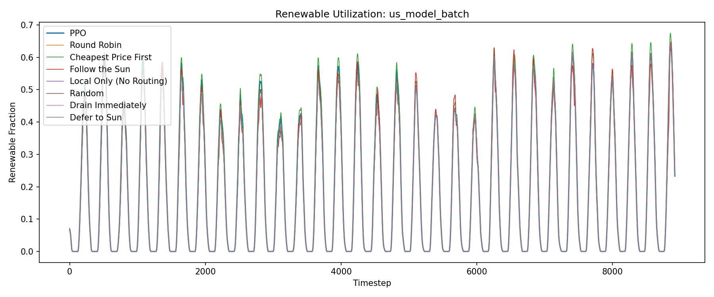

# Evaluation Report: us_model_batch

## Summary

| Policy | Total Cost | Avg Renewable % | Batch Expired | Deadline Cost | Avg Pool Size |
| --- | --- | --- | --- | --- | --- |
| PPO | 5967929.70 | 18.5% | 2217.1405 | 4434.28 | 0.6519 |
| Round Robin | 6403825.00 | 17.9% | 36.7074 | 73.41 | 0.4666 |
| Cheapest Price First | 17828909.51 | 19.3% | 2316.8850 | 4633.77 | 0.5452 |
| Follow the Sun | 6827824.68 | 17.9% | 821.9289 | 1643.86 | 0.8637 |
| Local Only (No Routing) | 6406426.72 | 17.9% | 72.2401 | 144.48 | 0.1782 |
| Random | 6358780.39 | 18.0% | 420.1795 | 840.36 | 0.5088 |
| Drain Immediately | 6394399.48 | 17.9% | 123.9446 | 247.89 | 0.0170 |
| Defer to Sun | 6398368.87 | 17.9% | 101.4938 | 202.99 | 4.9956 |

## Per-DC Energy Cost Breakdown

| Policy | US-West | US-Central | US-Southeast-1 | US-Southeast-2 |
| --- | --- | --- | --- | --- |
| PPO | 1518730.98 | 1774055.05 | 1328228.02 | 1323889.70 |
| Round Robin | 1938985.50 | 1478969.24 | 1548528.04 | 1437268.81 |
| Cheapest Price First | 1520509.45 | 1782993.15 | 1220797.87 | 1144634.20 |
| Follow the Sun | 2400714.09 | 1274413.15 | 1368432.36 | 1413632.33 |
| Local Only (No Routing) | 1957953.95 | 1469301.60 | 1550564.38 | 1428462.32 |
| Random | 1933729.84 | 1449880.48 | 1547810.01 | 1426430.13 |
| Drain Immediately | 1938988.64 | 1469337.65 | 1548528.15 | 1437297.15 |
| Defer to Sun | 1939175.22 | 1472193.26 | 1549007.92 | 1437789.49 |

## Plots

