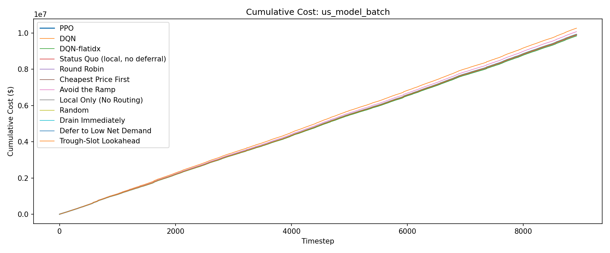
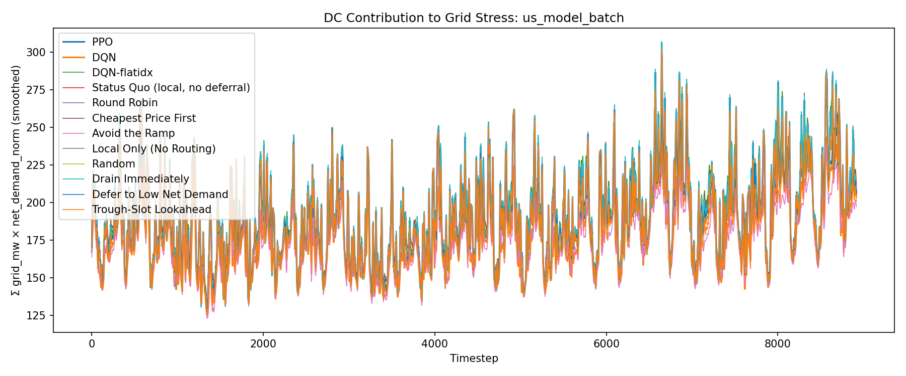
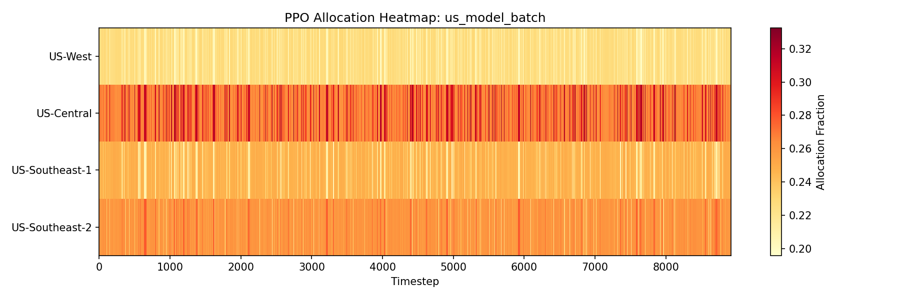
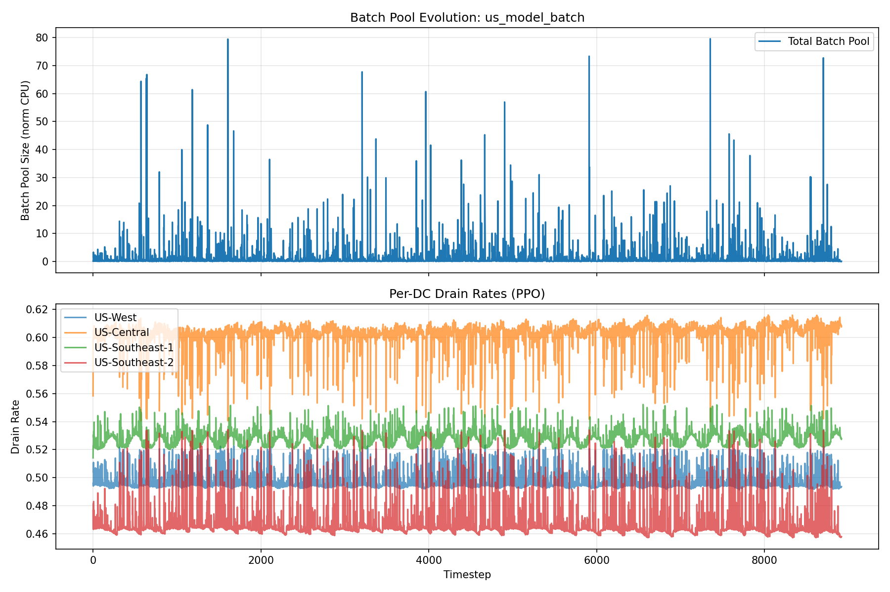
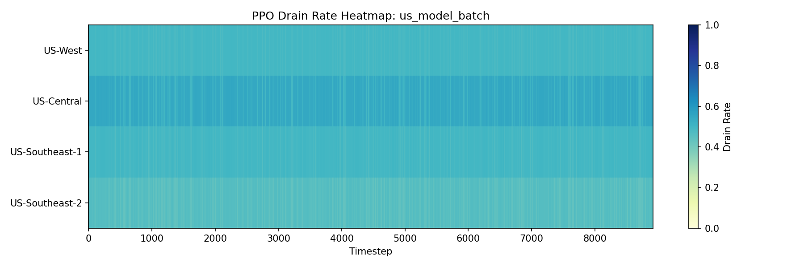

# Evaluation Report: us_model_batch

## Summary

| Policy | Total Cost | Energy Cost | Peak Penalty | ND-weighted Load | Batch Expired | Deadline Cost | Avg Pool Size |
| --- | --- | --- | --- | --- | --- | --- | --- |
| PPO | 9890203.50 | 7843587.88 | 1854130.78 | 1699588 | 769.9393 | 192484.84 | 3.9644 |
| DQN | 10262662.98 | 7390430.43 | 1575328.35 | 1562268 | 5187.6168 | 1296904.20 | 9.9112 |
| DQN-flatidx | 9828805.07 | 7762495.21 | 1866047.34 | 1699042 | 801.0501 | 200262.53 | 4.0639 |
| Status Quo (local, no deferral) | 9921934.51 | 7870362.49 | 1867074.36 | 1700417 | 737.9906 | 184497.65 | 3.5225 |
| Round Robin | 9908276.03 | 7862399.33 | 1851651.03 | 1698436 | 776.9027 | 194225.67 | 3.9419 |
| Cheapest Price First | 9877962.69 | 7616932.75 | 1898125.75 | 1697316 | 1451.6168 | 362904.19 | 5.3961 |
| Avoid the Ramp | 10072639.59 | 7548630.00 | 1615069.11 | 1573258 | 3617.0085 | 904252.12 | 7.7833 |
| Local Only (No Routing) | 9918070.13 | 7869909.73 | 1861299.13 | 1700094 | 747.4451 | 186861.27 | 3.6601 |
| Random | 9920764.16 | 7855107.89 | 1858709.67 | 1696809 | 827.7863 | 206946.58 | 4.1171 |
| Drain Immediately | 9916678.66 | 7866624.54 | 1865565.89 | 1699792 | 737.9530 | 184488.24 | 3.5204 |
| Defer to Low Net Demand | 9932662.17 | 7741367.34 | 1780434.31 | 1669749 | 1643.4421 | 410860.52 | 5.2868 |
| Trough-Slot Lookahead | 9907153.71 | 7883840.08 | 1810695.03 | 1674793 | 850.4744 | 212618.59 | 4.1839 |

## Per-DC Energy Cost Breakdown

| Policy | US-West | US-Central | US-Southeast-1 | US-Southeast-2 |
| --- | --- | --- | --- | --- |
| PPO | 2463332.90 | 1600952.81 | 2007061.08 | 1772241.09 |
| DQN | 2552710.28 | 1240909.60 | 2199528.57 | 1397281.99 |
| DQN-flatidx | 2201905.80 | 1598574.58 | 2017345.51 | 1944669.31 |
| Status Quo (local, no deferral) | 2533529.24 | 1586976.21 | 2008206.52 | 1741650.52 |
| Round Robin | 2524489.92 | 1585539.45 | 2000781.57 | 1751588.39 |
| Cheapest Price First | 2251773.98 | 2024493.91 | 1773681.21 | 1566983.65 |
| Avoid the Ramp | 2638207.50 | 1354459.65 | 1733345.42 | 1822617.43 |
| Local Only (No Routing) | 2535860.62 | 1584939.36 | 2005910.57 | 1743199.18 |
| Random | 2521399.84 | 1584727.25 | 1998310.76 | 1750670.04 |
| Drain Immediately | 2522557.89 | 1590113.81 | 2006933.12 | 1747019.71 |
| Defer to Low Net Demand | 2488816.82 | 1556880.82 | 1964558.56 | 1731111.14 |
| Trough-Slot Lookahead | 2599194.11 | 1501728.44 | 1990057.41 | 1792860.12 |

## Plots

