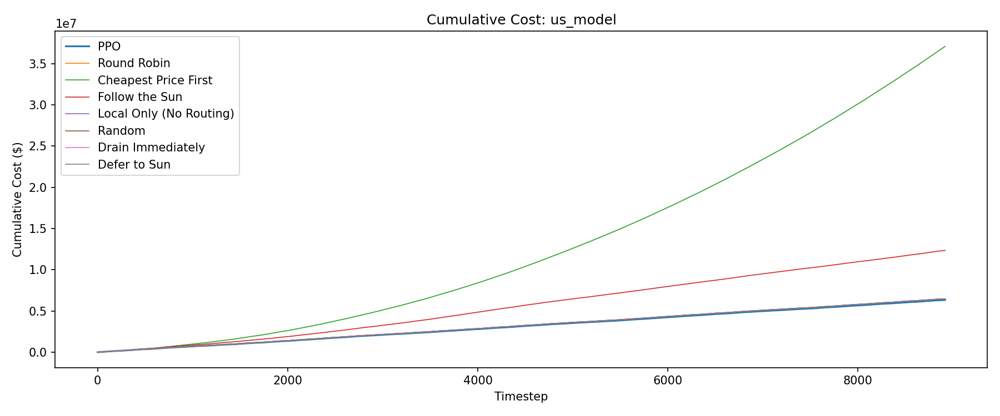
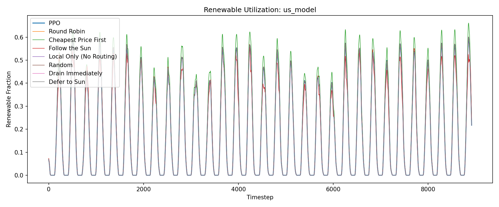
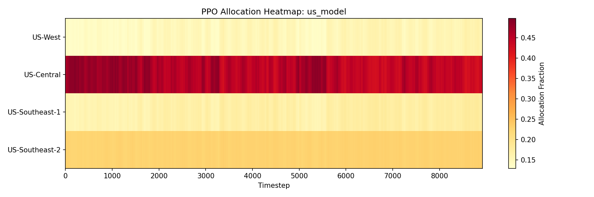

# Evaluation Report: us_model

## Summary

| Policy | Total Cost | Avg Renewable % | Total Grid (MW-steps) |
| --- | --- | --- | --- |
| PPO | 6338378.62 | 17.8% | 2111661.37 |
| Round Robin | 6477228.53 | 17.8% | 2111895.95 |
| Cheapest Price First | 37107389.94 | 19.5% | 1892210.03 |
| Follow the Sun | 12358547.57 | 17.1% | 2088048.76 |
| Local Only (No Routing) | 6485250.35 | 17.8% | 2111895.95 |
| Random | 6477053.89 | 17.8% | 2111895.95 |
| Drain Immediately | 6477228.53 | 17.8% | 2111895.95 |
| Defer to Sun | 6477228.53 | 17.8% | 2111895.95 |

## Per-DC Energy Cost Breakdown

| Policy | US-West | US-Central | US-Southeast-1 | US-Southeast-2 |
| --- | --- | --- | --- | --- |
| PPO | 1737504.56 | 1777379.01 | 1384126.97 | 1394918.17 |
| Round Robin | 2084185.94 | 1341595.14 | 1604941.26 | 1446506.19 |
| Cheapest Price First | 1552912.67 | 1782993.15 | 1188854.22 | 1074986.34 |
| Follow the Sun | 2639703.49 | 1104410.03 | 1391127.12 | 1469291.11 |
| Local Only (No Routing) | 2107823.49 | 1334705.36 | 1607402.17 | 1435319.33 |
| Random | 2079245.72 | 1342478.92 | 1606148.81 | 1448158.22 |
| Drain Immediately | 2084185.94 | 1341595.14 | 1604941.26 | 1446506.19 |
| Defer to Sun | 2084185.94 | 1341595.14 | 1604941.26 | 1446506.19 |

## Plots

