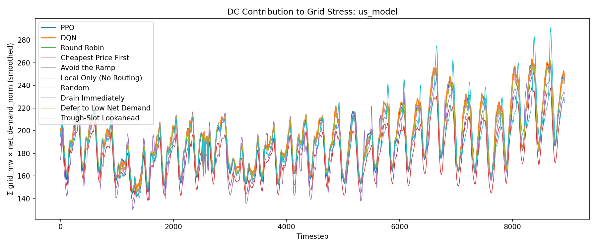

# Evaluation Report: us_model

## Summary

| Policy | Total Cost | Energy Cost | Peak Penalty | ND-weighted Load | Total Grid (MW-steps) |
| --- | --- | --- | --- | --- | --- |
| PPO | 10097586.60 | 7844162.39 | 1885276.54 | 1721236 | 2567935.27 |
| DQN | 9842805.73 | 7909957.04 | 1931809.00 | 1733322 | 2570402.73 |
| Round Robin | 9842773.42 | 7979247.21 | 1863526.21 | 1723187 | 2570402.73 |
| Cheapest Price First | 40302131.66 | 7101765.07 | 1692723.04 | 1599584 | 2350716.82 |
| Avoid the Ramp | 16580284.33 | 7981741.43 | 1832226.38 | 1672948 | 2530799.09 |
| Local Only (No Routing) | 9854608.70 | 7987269.03 | 1867339.67 | 1724368 | 2570402.73 |
| Random | 9881611.55 | 7978050.35 | 1902538.98 | 1723286 | 2570402.73 |
| Drain Immediately | 9842773.42 | 7979247.21 | 1863526.21 | 1723187 | 2570402.73 |
| Defer to Low Net Demand | 9842773.42 | 7979247.21 | 1863526.21 | 1723187 | 2570402.73 |
| Trough-Slot Lookahead | 9939815.04 | 8035871.76 | 1820927.40 | 1691662 | 2569062.08 |

## Per-DC Energy Cost Breakdown

| Policy | US-West | US-Central | US-Southeast-1 | US-Southeast-2 |
| --- | --- | --- | --- | --- |
| PPO | 2175361.23 | 1595039.99 | 1944155.29 | 2129605.88 |
| DQN | 2201966.02 | 1672836.63 | 2496402.77 | 1538751.62 |
| Round Robin | 2572203.65 | 1596224.44 | 2013160.01 | 1797659.11 |
| Cheapest Price First | 2040930.38 | 2037622.46 | 1597072.97 | 1426139.26 |
| Avoid the Ramp | 2936734.17 | 1267479.72 | 1649037.08 | 2128490.45 |
| Local Only (No Routing) | 2595841.19 | 1589334.66 | 2015620.92 | 1786472.25 |
| Random | 2567263.42 | 1597108.23 | 2014367.56 | 1799311.14 |
| Drain Immediately | 2572203.65 | 1596224.44 | 2013160.01 | 1797659.11 |
| Defer to Low Net Demand | 2572203.65 | 1596224.44 | 2013160.01 | 1797659.11 |
| Trough-Slot Lookahead | 2742224.27 | 1458653.39 | 1982053.85 | 1852940.25 |

## Plots

