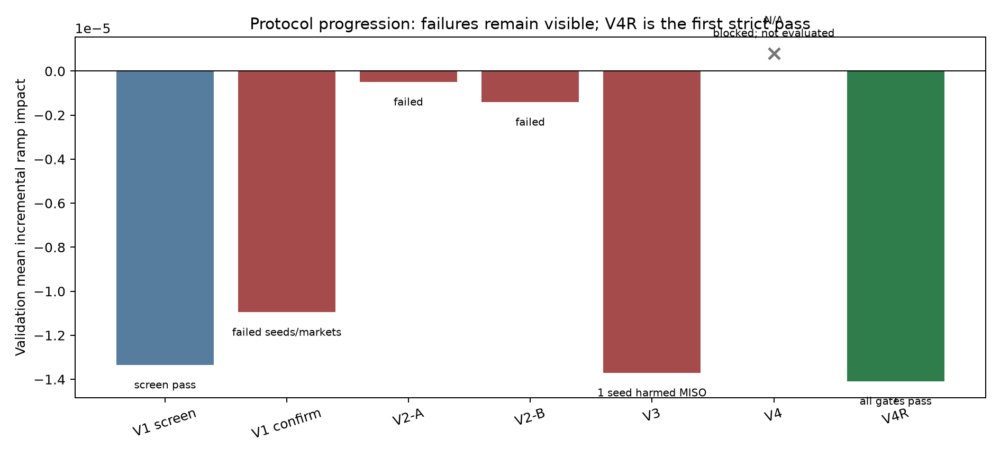
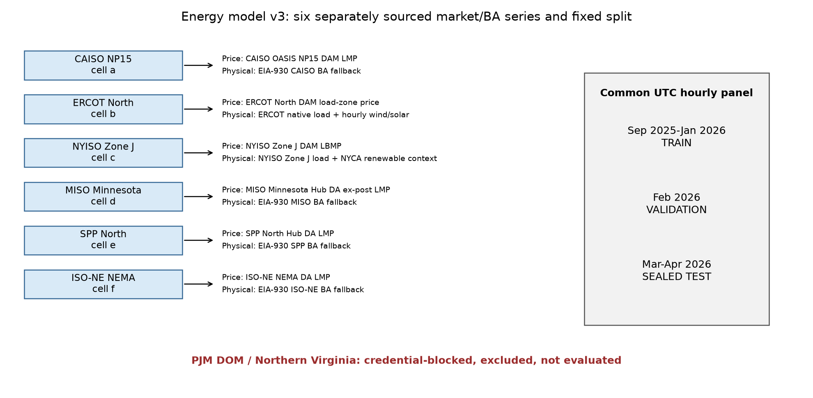
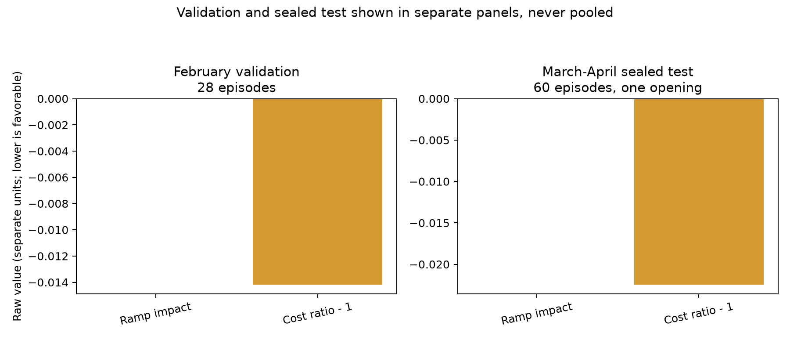
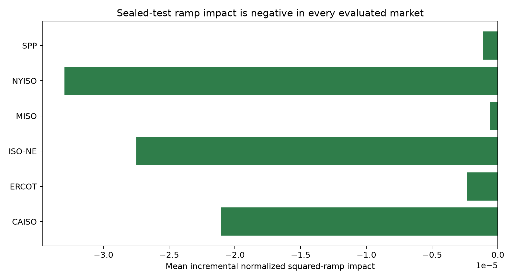
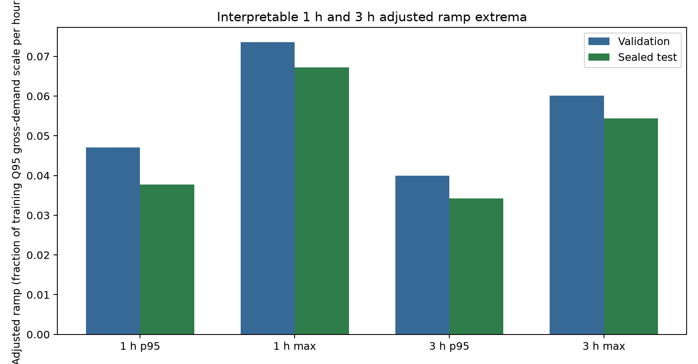
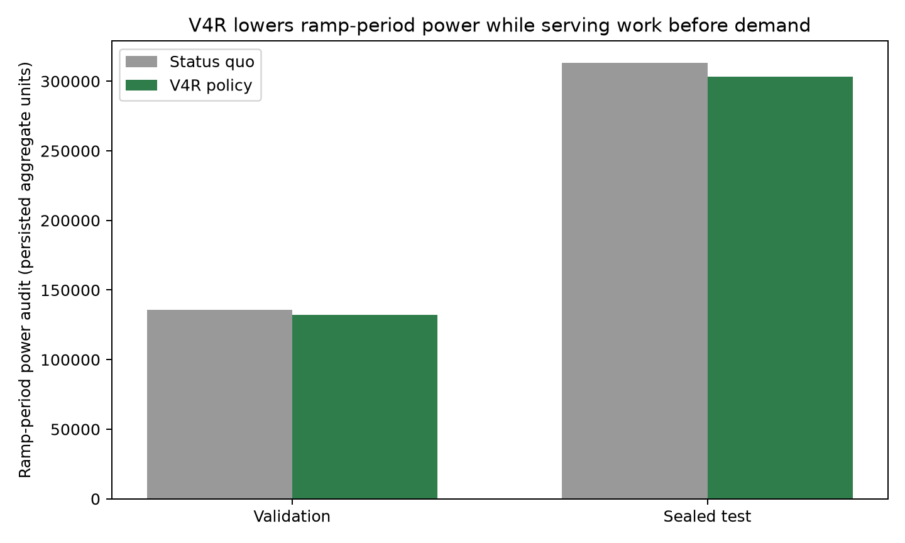
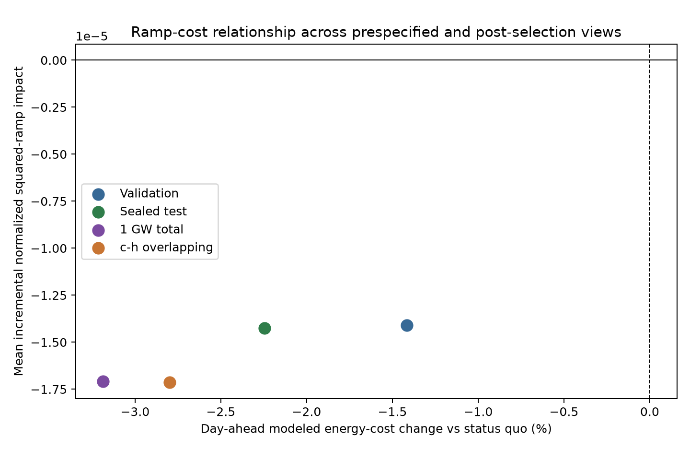
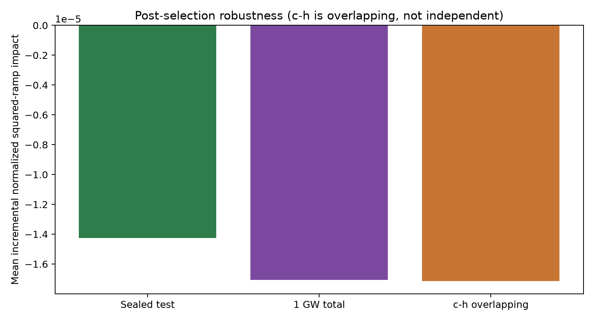

> **FINAL EVIDENCE-BOUND THESIS.** Result text inside the generated contract is
> materialized only from the canonical V4R evidence whose SHA-256 is frozen below.
> Validation and test remain separate. The March-April 2026 sealed test was
> opened exactly once after validation freeze and was never used for selection,
> tuning, tolerance changes, or retraining.

# Abstract

Geo-distributed computing can alter grid-facing demand by routing work among
electricity markets and scheduling deferrable work before forecast ramps. This
thesis asks whether a controller whose learned preferences originate entirely
in reward-only reinforcement learning can reduce a fleet's incremental
contribution to physical 1 h and 3 h net-load ramps while preserving exact
workload service and a day-ahead energy-cost constraint. The study uses a common
hourly UTC panel from September 2025 through April 2026 for six separately
sourced market/balancing-authority series: CAISO NP15, ERCOT North, NYISO Zone J,
MISO Minnesota Hub, SPP North Hub, and ISO New England NEMA. These are fixed
market cases, not statistically independent samples or facility-level grids;
hub/zonal price and physical-stress geographies can differ. September-January is training,
February is validation, and March-April is sealed test. PJM DOM / Northern
Virginia was not evaluated because the required credential was unavailable.

The final controller is a deterministic equal-action ensemble of five PPO
members. Each member originated as an independently random-initialized,
reward-only V3 policy. An operational loss of the original model containers
blocked the first V4 ensemble before evaluation. V4R is therefore a new binary
identity: recovered containers reproduce the exact V3 policy weights, critic
weights, normalization state, and training provenance, but they do not reuse or
impersonate the lost V3 containers or the blocked V4 identity. There was no new
V4R training. At each decision all five deterministic member actions are
invoked once and averaged with fixed weights of 0.2 in environment action
space. There is no member selection, learned weighting, trainable combiner,
teacher, behavior cloning, analytic policy, model-predictive controller, or
optimizer action.

V4R passed every strict February validation gate over 28 episodes, with mean
incremental normalized squared-ramp impact -1.4086907198e-05 and modeled
day-ahead cost ratio 0.9858280673. After source, recovery, and validation
freeze, its single sealed-test opening produced 60 episodes with impact
-1.4258710514e-05 and cost ratio 0.9775584402. Every evaluated market had
negative incremental impact. Service and batch completion were exact, there
were zero expiry, terminal work, certificate violations, emergency feasibility
events, and leakage detections, and ramp-period power fell from 313,167.23 to
303,077.90 persisted audit units. Post-selection 1 GW-total and c-h
overlapping/non-independent analyses also passed all gates. These are fixed
period, price-taking simulation results, not universal grid-reliability or
retail-bill claims.

# 1. Introduction and Research Question

## 1.1 From electricity-cost scheduling to physical ramp response

Prior geo-distributed scheduling work often minimizes electricity price,
emissions, or renewable mismatch by moving workload to favorable places and
times. Those objectives are useful, but an immediate price signal does not
directly identify whether controllable demand anticipates a future physical
ramp. A scheduler may save money while amplifying a balancing-area net-load
change, or it may attenuate ramp magnitude without lowering a wholesale settlement proxy.
This thesis therefore separates a physical ramp estimand from a wholesale
day-ahead LMP cost constraint.

The data-center contribution is evaluated against the native market trajectory,
not against zero load. For market \(m\), time \(t\), and horizon \(h\), the
question is whether adding modeled data-center power makes the squared,
market-normalized net-load change larger or smaller than it would have been
under native demand. Negative incremental impact means the modeled data-center
load reduced squared normalized ramp magnitude; it does not by itself prove
opposite-direction action or delivery of a balancing service. Positive impact
means amplification.

## 1.2 Why pure-RL attribution matters

The repository's V5 result was safe and economically favorable, but its
attribution was supervised-imitation dominated. Behavior cloning alone averaged
6.288964% US and 14.017276% Global objective savings, while post-RL TD3+BC
averaged 6.290226% and 14.000051%. The paired post-RL increment was only
+0.001262 percentage points in US and -0.017224 points in Global. Actor and
critic hashes changed and every seed completed reward updates, yet the absolute
performance primarily belonged to a demonstration teacher plus deterministic
feasibility. Frequent normal decoder adjustment further showed that the
executed controller was a co-product of learned preferences and exact
constraints.

That result is retained rather than relabeled. V6 removes supervision so that
the origin of the learned preferences is identifiable. Constraint-only
decoding remains because workload conservation, capacity, and deadlines are
hard requirements; it does not contain price, ramp, forecast, or policy
optimization logic.

## 1.3 Research question and contribution

The central question is:

> Can reward-only PPO preferences, acting through a constraint-only semantic
> decoder, anticipate and reduce a geo-distributed fleet's incremental
> contribution to future 1 h and 3 h market-scale net-load ramps across six
> evaluated US markets, without violating service, deadline, leakage, emergency,
> or modeled day-ahead cost gates?

The contributions are:

1. six separately sourced market/BA series with explicit price-versus-physical
   geography, licensing, missing-data, and causal-forecast contracts;
2. an incremental squared-ramp objective with interpretable 1 h/3 h p95 and
   maximum adjusted-ramp reporting;
3. a pure-RL attribution boundary that excludes demonstrations, imitation,
   analytic policy actions, MPC, optimizer actions, and test-driven iteration;
4. a transparent sequence of failed V1-V3 protocols, the operationally blocked
   original V4, and the recovered-container V4R success;
5. a single-open sealed-test protocol with hash-bound recovery provenance and
   fail-closed publication tooling; and
6. post-selection scale and workload-map analyses that remain explicitly
   separate from the primary sealed result.

# 2. Prior Evidence and Diagnostic Lineage

## 2.1 Frozen V1-V5 lineage

Repository versions are design history, not a sequence of rewritten final
claims. V1-V4 built the workload, energy, action, and safety machinery. V5
combined a supervised demonstration teacher, TD3+BC, and a deterministic
feasibility decoder in a four-site CAISO-derived archetype. Its exact safety and
absolute savings remain valid within that scope. Its incremental RL effect was
approximately zero, so it cannot support a pure-RL headline.

Deterministic audits and ablations motivated the ramp reformulation. Exact
KKT/water-filling allocation was stronger than a softmax teacher
approximation. Spatial price response had substantial immediate headroom, while
incremental temporal headroom under the modeled deadlines was small. Random-init
PPO and SAC could learn simpler immediate spatial tasks, indicating that the
training stack worked, but the earlier joint objective mixed delayed credit,
constrained geometry, and weak temporal signal.

## 2.2 V6 protocol learning

V6 preserved every failure as evidence:

| Protocol | Frozen outcome | Scientific interpretation |
|---|---|---|
| V1 100k screen | aggregate validation screen passed | promotion signal only |
| V1 500k confirmation | failed strict per-seed/per-market/behavior rules | no selection; test stayed closed |
| V2-A | all three fresh seeds failed at least one strict gate | shaped retry rejected |
| V2-B | reporting mean remained weak and strict gates failed | retry rejected |
| V3 | four of five seeds passed; seed 2805 harmed MISO slightly | conjunctive validation failure; test stayed closed |
| Original V4 | N/A: lost binaries prevented trustworthy evaluation | blocked and explicitly not evaluated |
| V4R | recovered-policy equal-action ensemble passed validation | new recovered-container identity authorized one test opening |



V1 confirmation averaged -1.09572077294e-05 at cost ratio 0.9783949019, but
three seeds violated strict market or behavior gates. V2-A averaged
-4.98371781802e-07 at cost ratio 1.0091997163 and stopped after three failed
seeds. V3 reproduced the stronger original PPO recipe on fresh seeds 2801-2805:
the reporting-only mean was -1.37109198609e-05 at cost ratio 0.9863649332, but
seed 2805's MISO impact was +1.29400801418e-07. The all-five decision was
therefore false. No aggregate override or tolerance was introduced.

# 3. Data, Geography, and Causal Information

## 3.1 Six evaluated markets

The energy-model V3 panel contains six separate price and physical-market
observations on one exact hourly UTC index:

| Site proxy | Day-ahead price | Physical stress geography | Workload cell |
|---|---|---|---|
| Northern California | CAISO NP15 | CAISO BA gross demand and renewables via EIA-930 fallback | a |
| North Texas | ERCOT LZ North | ERCOT native load plus hourly wind/solar | b |
| New York City | NYISO Zone J | Zone J load with NYCA renewable context | c |
| Minnesota | MISO Minnesota Hub | MISO BA gross demand and renewables via EIA-930 fallback | d |
| SPP North | SPP North Hub | SPP BA gross demand and renewables via EIA-930 fallback | e |
| Boston/NEMA | ISO-NE location 4008 | ISO-NE BA gross demand and renewables via EIA-930 fallback | f |



These are separately sourced market/BA series, not wall-time shifts of one CAISO
trace. They are fixed cases rather than statistically independent or iid draws
from all US grids. Their wholesale price products are hub/zonal series, while
physical stress can be balancing-authority or system scale; neither represents a
facility feeder, utility territory, or local reliability zone. PJM DOM /
Northern Virginia was not evaluated and has no result in any aggregate.

## 3.2 Source and licensing boundaries

Day-ahead price comes from operator products at the stated hub or zone.
Physical demand and renewable components use operator products where complete
and defensible. ERCOT and NYISO use the selected operator physical products;
CAISO, MISO, SPP, and ISO-NE use a documented same-balancing-authority EIA bulk fallback
because complete, timestamp-defensible operator history was unavailable. In
particular, CAISO Today's Outlook lacked an authoritative UTC field and SPP
GenMix365 had 67 incomplete five-minute hours, which could not be interpolated.
Each source
descriptor records product, geography, cadence, units, timezone, revision
status, authentication, retrieval query/time, raw hash, quality flags, and
redistribution policy. Restricted raw/native/panel files remain local and
ignored where licensing prohibits redistribution; permissible manifests,
hashes, and derived evidence are committed.

No market series is interpolated, forward-filled, shortened, silently replaced,
or dropped to make the common calendar pass. Negative renewable adjustments in
the EIA bulk product are explicitly clipped to zero before net-load derivation,
with affected-hour diagnostics retained. This is disclosed normalization, not
missing-data interpolation.

## 3.3 Calendar, split, and forecasts

The exact panel runs from 2025-09-01T00:00:00Z through
2026-05-01T00:00:00Z exclusive:

| Period | Use |
|---|---|
| September 2025-January 2026 | training, scales, thresholds, normalization, forecast fitting |
| February 2026 | validation-only selection and freeze |
| March-April 2026 | sealed test, opened once |

Forecast features are reconstructed causal forecasts, not hindsight values and
not claims about archived operator forecast products. Training uses
expanding-window vintages whose observations strictly precede issue time. The
model fitted at the February boundary is frozen for validation and test.
Validation/test data cannot influence scales, thresholds, normalization,
forecast fitting, reward calibration, member weights, or selection.

## 3.4 Workload and scale

Measured Google ClusterData 2019 cell a-f profiles are converted through
committed per-cell power models and tiled over the later energy calendar.
Synthetic EDF deadlines are experimental constraints, not production Borg
SLOs. The primary fleet is six 100 MW proxy sites, 600 MW total. The 1 GW-total
case assigns 166.6667 MW per site and is a post-selection scale sensitivity.
The c-h mapping reuses part of the primary workload population; it is
c-h overlapping/non-independent robustness, not an independent workload
holdout. A 6 GW stress exists outside the primary price-taking claim.

# 4. Ramp-Aware Control Problem

## 4.1 State, action, and exact feasibility

The causal state includes current service and batch arrivals, EDF queue/deadline
structure, current market levels, prior modeled market power, training-only
scales and thresholds, reconstructed forecast values with issue/vintage
metadata, site capacities, and episode position. Future realized net load,
renewables, price, and workload do not enter the observation.

For six sites, the semantic action has \(2N+1=13\) preferences: six service
allocation preferences, one total batch-drain preference, and six batch
destination preferences. A deterministic capped-simplex allocation conserves
service within capacity. Global EDF enforces cumulative deadline prefixes.
Residual capacity places drained batch work, and exact transport matches origin
drains to destination execution. The decoder contains no economic or ramp
objective. Safety is therefore attributed to constraint-only execution; ramp
preference is attributed to the learned policy ensemble.

## 4.2 Incremental squared-ramp objective

For market \(m\), hour \(t\), horizon \(h \in \{1,3\}\), native net load
\(N\), modeled data-center power \(P\), and the training-only Q95 gross-demand
scale \(S_m\):

```text
b[m,t,h] = (N[m,t] - N[m,t-h]) / (S[m] * h)
a[m,t,h] = ((N[m,t] + P[m,t]) - (N[m,t-h] + P[m,t-h])) / (S[m] * h)
I[m,t,h] = a[m,t,h]^2 - b[m,t,h]^2
```

The primary incremental objective is \(0.40 I_{1h} + 0.60 I_{3h}\).
Negative \(I\) means the fleet reduces the native squared ramp; positive \(I\)
means amplification. Squaring treats upward and downward ramps symmetrically.
Power is aggregated once within each market before scoring.

The objective's units are squared fractions of training Q95 gross-demand scale
per hour squared. It is dimensionless after normalization and is not MW, MWh,
USD, reserve need, or reliability probability. To retain physical
interpretability, the evaluator also persists adjusted absolute 1 h and 3 h
ramp p95/max as fractions of \(S_m\) per hour. For example, a value 0.067 means
an adjusted ramp equal to 6.7% of that market's training Q95 gross-demand scale
per hour. Because the aggregate evidence pools market-normalized windows, it
does not invent a single cross-market MW conversion.

## 4.3 Cost and anti-gaming rules

Modeled hourly cost is day-ahead LMP times modeled MWh. The primary gate requires
policy cost no more than 2% above status quo. It is reported separately from
physical ramp impact. This wholesale day-ahead LMP proxy excludes delivery,
capacity, demand charges, hedges, PPAs, taxes, ancillary-service revenue, and
endogenous market clearing. It is not a retail electricity bill or business
case.

Every episode starts with three real warm-history hours so the first scored
3 h window has authentic antecedents. Three no-arrival tail hours remain after
the final active decision. Tail power, cost, ramp windows, safety, and queue
state are scored. Circular wrap is forbidden, and all work must be complete at
the actual terminal.

# 5. Pure-RL and Recovery Attribution

## 5.1 Reward-only origin

The five V3 members used distinct seeds 2801-2805, independent random actor and
critic initialization, 110,592 training interactions, and 540 PPO updates.
Their training used environment reward only. Manifests prohibit and audit:

- demonstrations and behavior cloning;
- expert replay or warm-start checkpoints;
- analytic economic base actions;
- MPC or optimizer actions;
- oracle reward shaping and future-realized features; and
- learned or evaluation-tuned feasibility logic.

## 5.2 Original V4 block and V4R recovery

Original V4 proposed a deterministic equal-action ensemble of the V3 members,
but its required model binaries were lost before a trustworthy evaluation.
That protocol stayed blocked and unevaluated. The error is an operational
recovery failure, not a negative performance result, and it is not hidden.

V4R was frozen as a new binary identity. Each recovered container has a new
container hash while reproducing the exact internal policy and critic tensors,
byte-equivalent normalization state, training-manifest provenance, and
deterministic action behavior of its V3 source member. The recovery binding
permits only the enumerated outer-container divergences. It asserts no
performance claim and records that original V3 artifacts were not reused.

At inference, all five deterministic environment-space actions are averaged
with weights \([0.2,0.2,0.2,0.2,0.2]\). There is no member exclusion,
selection, performance weighting, trainable combiner, teacher, BC, MPC, or
optimizer. This distinction is essential: the policies have pure-RL origin,
while there was no new V4R training.

# 6. Frozen Protocol and Results

## 6.1 Evidence identities

<!-- data-result-contract-begin -->

**Protocol:** `v6-ramp-pure-rl-recovered-equal-action-ensemble-v4r`

**Protocol SHA-256:** `57310edca9e7b1e917be2901010352ad928d124beeaa5a10d21ae5fddd4f78dd`

**Frozen V4R source commit:** `46329fe765f596f84eeac71f061dcbd191a90583`

**Provenance hash contract:** `dc-energy-provenance-sha256-v2`

**Canonical JSON representation:** `canonical-json-utf8-sort-compact-v1`

**Canonical evidence SHA-256 under that representation:** `f642bd5868abdd9f7cda2a6fffb228250f3570fd0c6d440085da68c976892d9b`

**Generated claim-ledger SHA-256:** `1344baf957612527171274af84591c7271644407bcceee38036d66503c5f94e1`

## 6.2 Validation and sealed test

| Split | Episodes | Mean incremental ramp impact | DA cost ratio | Cost change | Every market negative | Strict gates |
|---|---:|---:|---:|---:|---|---|
| February validation | 28 | -1.40869071979e-05 | 0.985828067278 | -1.417% | true | true |
| March-April sealed test | 60 | -1.42587105143e-05 | 0.977558440249 | -2.244% | true | true |

Validation uncertainty: 95% day-block interval [-1.4993411575e-05, -1.3151365992e-05] from 500 draws.

Test uncertainty: 95% day-block interval [-1.4922706381e-05, -1.3524515743e-05] from 500 draws and
95% month-block interval [-1.5155776266e-05, -1.3299778159e-05] from 500 draws.

**Final verdict code:** `sealed_test_success`



## 6.3 Per-market effects

| Evaluated market | Validation impact | Sealed-test impact | Test interpretation |
|---|---:|---:|---|
| CAISO NP15 | -1.8414305411e-05 | -2.1065969624e-05 | reduced modeled data-center contribution to squared normalized grid ramps |
| ERCOT North | -3.2585091348e-06 | -2.3454355897e-06 | reduced modeled data-center contribution to squared normalized grid ramps |
| ISO-NE NEMA | -2.1716239336e-05 | -2.7491577052e-05 | reduced modeled data-center contribution to squared normalized grid ramps |
| MISO Minnesota Hub | -2.9472402337e-07 | -5.652448501e-07 | reduced modeled data-center contribution to squared normalized grid ramps |
| NYISO Zone J | -3.7629896454e-05 | -3.2978547293e-05 | reduced modeled data-center contribution to squared normalized grid ramps |
| SPP North Hub | -3.2077688281e-06 | -1.1054886764e-06 | reduced modeled data-center contribution to squared normalized grid ramps |



## 6.4 Adjusted 1 h and 3 h ramp extrema

Values are fractions of the corresponding market's training Q95 gross-demand
scale per hour. They are physical adjusted-ramp magnitudes, not the squared
incremental objective:

| Split | 1 h p95 | 1 h max | 3 h p95 | 3 h max |
|---|---:|---:|---:|---:|
| Validation | 0.047103282 | 0.073581497 | 0.039959652 | 0.060072093 |
| Sealed test | 0.03768697 | 0.067176956 | 0.034203045 | 0.054374107 |



## 6.5 Behavior and safety

| Split | Deferrable pre-service | Status-quo ramp power | Policy ramp power | Reduction |
|---|---:|---:|---:|---:|
| Validation | 322.27994 | 135587.9364 | 132335.4306 | 2.399% |
| Sealed test | 692.585819 | 313167.2267 | 303077.9036 | 3.222% |



Both splits had exact service and batch completion, zero expiry, zero terminal
work, zero infeasibility certificates, zero emergency feasibility use, zero
future-feature leakage, and deterministic repeated-action equality. All five
members were invoked once per decision.

## 6.6 Post-selection robustness

| Post-selection analysis | Scope | Ramp impact | DA cost ratio | Every market negative | Strict gates |
|---|---|---:|---:|---|---|
| `one_gw_total` | 1 GW fleet-total scale sensitivity | -1.70752652166e-05 | 0.96812698489 | true | true |
| `c_h_overlapping` | c-h overlapping/non-independent robustness | -1.71355782433e-05 | 0.972019808923 | true | true |





<!-- data-result-contract-end -->

# 7. Statistical Interpretation

The 28 validation episodes are February daily windows. The 60 test episodes are
March-April daily windows. Day-block bootstrap intervals use 500 draws. A
validation month interval cannot identify multi-month generalization because
February supplies one month. The two-month test month-block interval describes
variation within those two fixed months, not future-year uncertainty.

The six markets are reported individually and as a macro mean. They are not
treated as iid samples from a superpopulation of US markets. Market-specific
success is a conjunctive gate. The ensemble result also does not estimate
training variability of a newly trained ensemble: V4R has one frozen recovered
ensemble composed from the five already trained V3 origins.

Validation selected the frozen identity and authorized one sealed opening.
Test results were not used to alter policy membership, member weights, source
code, forecasts, thresholds, normalization, decoder, cost limit, or success
criteria. The 1 GW-total and c-h analyses occurred post-selection and cannot
strengthen the primary test's nominal independence.

# 8. Limitations and Threats to Validity

## 8.1 Geography and market structure

Hub and zonal prices may differ from a facility settlement node. Balancing-area
load and renewable context differ from utility, feeder, and transmission
constraints. The result is market-level ramp accounting, not a local
reliability claim. PJM and Northern Virginia remain absent.

The controller is price-taking: data-center action does not change LMP, unit
commitment, reserves, or network constraints. This is most plausible for the
600 MW primary case. The 1 GW-total case is a price-taking scale sensitivity, not evidence that price
or network response would remain exogenous at that penetration; larger
penetration overrides are stress tests.

## 8.2 Data and forecast horizon

The panel covers eight months, not prior years. It does not establish
robustness to future weather, fuel, transmission, policy, generation buildout,
or data-center growth. Operator and EIA products differ in revision status,
cadence, location, and licensing. Reconstructed forecasts omit many variables
available to production grid and workload forecasters.

The requested prior-year and future-year extension cannot be claimed from the
present evidence. It would require complete all-six licensed source coverage,
new train/validation/test boundaries, newly frozen forecast vintages, and a
fresh protocol. Reusing the present sealed months for development would violate
the study.

## 8.3 Workload and infrastructure

Google 2019 workload is tiled over a later energy calendar. Proxy sites omit
latency, data residency, bandwidth, migration energy, cooling, PUE variation,
batteries, generators, reliability domains, and application affinity.
Unrestricted routing is optimistic. Exact safety is exact within the simulator,
not a deployment certificate.

## 8.4 Attribution and optimality

The deterministic decoder, not PPO, guarantees feasibility. The correct
attribution is reward-only PPO preferences plus constraint-only execution and
fixed equal-action aggregation. Recovery equivalence establishes internal
identity and provenance; it does not establish that the recovered ensemble is
globally optimal. A different valid formulation or seed population may produce
different results.

# 9. Reproduction and Audit

## 9.1 Committed and local evidence

The final publication path is
`output/ramp_rl_v6/recovered_v4r_resealed_v2/canonical_evidence.json`. Its
hash contract is `dc-energy-provenance-sha256-v2`. JSON evidence identities use
`canonical-json-utf8-sort-compact-v1`; tracked non-JSON source text uses
Git-blob bytes at an explicit commit and path, never platform-dependent
working-tree bytes. Binary and model-container identities use raw bytes.
Recovery binding, source freeze, validation/test chains, single-open records,
and post-selection robustness chains reside beside it. The generated claim
ledger and CSV tables are under
`output/ramp_rl_v6/recovered_v4r_resealed_v2/thesis/`.

The reseal has `provenance-hash-chain-only` supersession scope. It supersedes
only platform-dependent checkout hashes in the original evidence chain; the
protocol, chronology, controller, trained models, data, forecasts, numerical
metrics, strict decisions, and sealed-test opening are unchanged. The original
evidence remains append-only historical provenance rather than the publication
hash authority.

Recovered model binaries may be intentionally local or unavailable in a fresh
clone because of size or licensing constraints. Their required SHA-256 values,
V3 training-manifest hashes, policy/critic tensor hashes, normalizer hashes,
and recovery equivalence are committed in the binding and canonical evidence.
The publication build validates those recorded identities; it does not retrain,
retune, substitute, or download models.

## 9.2 Exact build commands

Run from the repository root in this worktree:

```powershell
python scripts\build_ramp_rl_thesis_results.py --v4r `
  output\ramp_rl_v6\recovered_v4r_resealed_v2\canonical_evidence.json `
  --output output\ramp_rl_v6\recovered_v4r_resealed_v2\thesis

python scripts\build_ramp_thesis_figures.py

python scripts\materialize_ramp_thesis.py `
  --results output\ramp_rl_v6\recovered_v4r_resealed_v2\canonical_evidence.json `
  --output thesis_paper.md

python scripts\validate_ramp_thesis.py `
  --source thesis_paper.md `
  --results output\ramp_rl_v6\recovered_v4r_resealed_v2\canonical_evidence.json

python scripts\build_final_thesis.py `
  --source thesis_paper.md `
  --output thesis_paper.docx
```

The builder rejects wrong canonical, protocol, source, recovery, model, and
sidecar hashes; a missing market or member seed; unresolved placeholders;
more than one test opening; test-driven selection/tuning; missing recovery
equivalence; failed strict gates; and unsupported scope claims. The DOCX build
normalizes package IDs, core timestamps, relationship IDs, and ZIP timestamps
before schema/package validation and SHA-256 reporting.

## 9.3 Preserved earlier reproduction

Legacy V2-V5 commands, data, models, and evidence remain in their original
paths. The V4R publication tooling is additive. It does not rewrite frozen
energy-model V2 artifacts, V5 canonical evidence, V6 V1-V3 decisions, or the
blocked original V4 record.

# 10. Conclusion

The thesis began with a negative attribution result: the earlier V5 controller
was safe and effective within its controlled archetype, but supervised
imitation explained almost all absolute performance. V6 therefore replaced the
headline objective and removed the teacher. Its protocol history was not
linear success. V1 confirmation, V2 retries, and V3 all failed strict
validation; original V4 could not be evaluated after an operational model-loss
error.

V4R resolves only the recovery problem, not by hiding it. Five independently
random-init, reward-only V3 PPO policies were repackaged into new containers
with exact internal weight, normalizer, and provenance equivalence, then
combined by a fixed deterministic equal-action mean. This recovered ensemble
passed all February gates and, after a single authorized opening, all
March-April sealed-test gates. It reduced normalized incremental squared-ramp
impact in every evaluated market, lowered modeled wholesale cost, preserved
exact simulated service and deadlines, and required no emergency action.

The result supports a narrow conclusion: under the frozen six-market,
price-taking simulator and fixed 2025-2026 panel, pure-RL-origin preferences
with constraint-only decoding reduced the modeled data-center contribution to
squared normalized grid ramps. It does not establish opposite-direction action,
balancing-service delivery, feeder relief, endogenous market effects, retail
savings, universal US-grid generalization, or future-year performance.

# References

[1] A. Verma et al., "Large-scale cluster management at Google with Borg,"
*EuroSys*, 2015. DOI: 10.1145/2741948.2741964.

[2] A. Tirmazi et al., "Borg: the Next Generation," *EuroSys*, 2020.
DOI: 10.1145/3342195.3387517.

[3] X. Fan, W.-D. Weber, and L. Barroso, "Power Provisioning for a
Warehouse-sized Computer," *ISCA*, 2007. DOI: 10.1145/1250662.1250665.

[4] A. Qureshi et al., "Cutting the Electric Bill for Internet-Scale Systems,"
*SIGCOMM*, 2009. DOI: 10.1145/1592568.1592584.

[5] L. Rao et al., "Minimizing Electricity Cost: Optimization of Distributed
Internet Data Centers in a Multi-Electricity-Market Environment," *INFOCOM*,
2010. DOI: 10.1109/INFCOM.2010.5461933.

[6] Z. Liu et al., "Greening Geographical Load Balancing," *SIGMETRICS*, 2011.
DOI: 10.1145/1993744.1993767.

[7] I. Goiri et al., "GreenSlot: Scheduling Energy Consumption in Green
Datacenters," 2011. DOI: 10.1145/2063384.2063411.

[8] J. Schulman et al., "Proximal Policy Optimization Algorithms,"
arXiv:1707.06347, 2017.

[9] A. Raffin et al., "Stable-Baselines3: Reliable Reinforcement Learning
Implementations," *JMLR*, 22(268), 2021.
