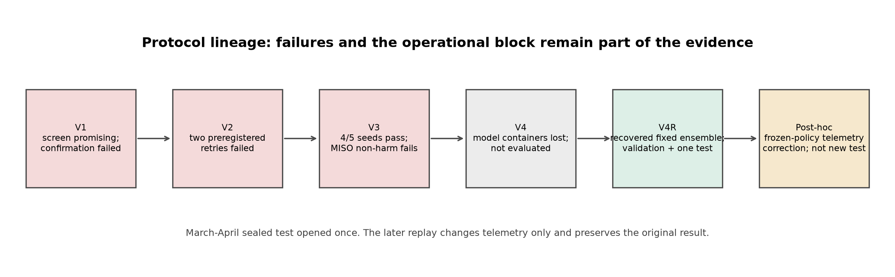
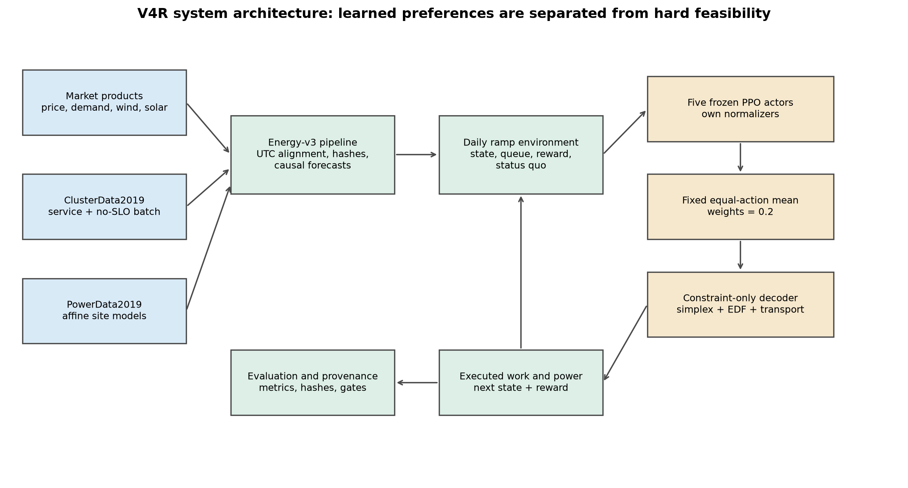
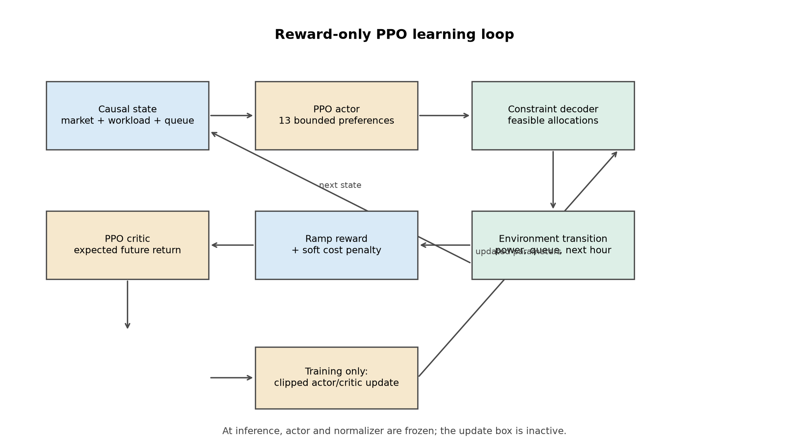
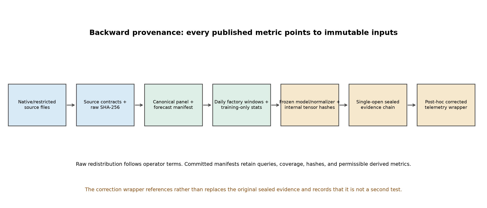
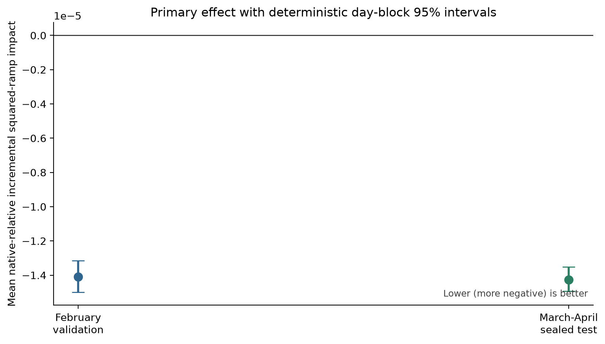
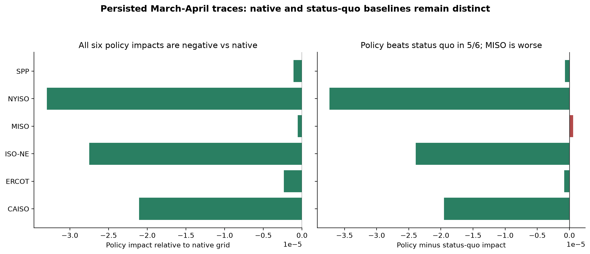
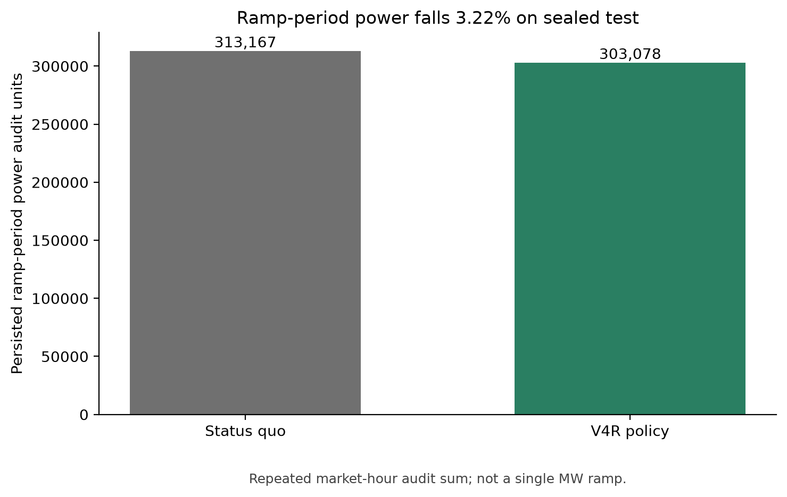
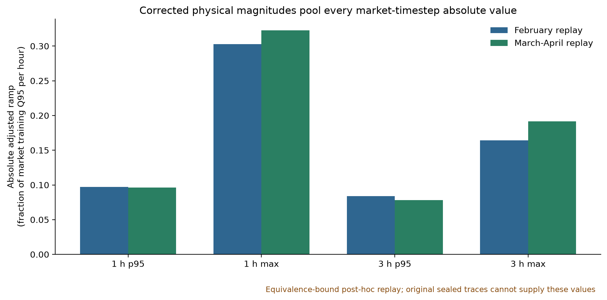
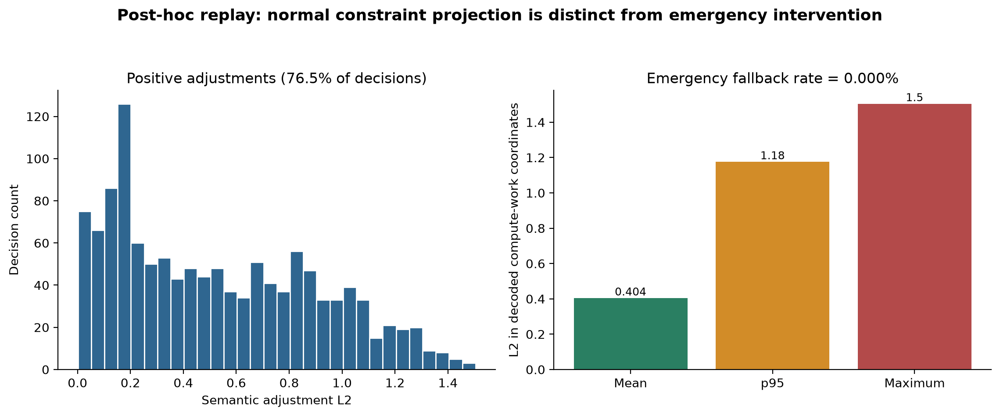
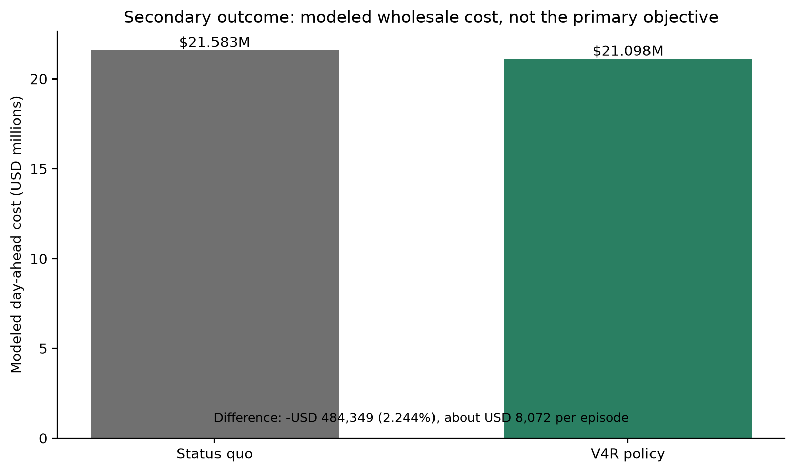

# Abstract

> **Evidence and correction notice.** The March-April 2026 policy result below
> remains the original single-open sealed evaluation. A later deterministic
> replay of the frozen policy corrects physical-ramp aggregation, status-quo
> labeling, and decoder telemetry only. It is explicitly post-hoc, occurred
> after unblinding, and is not a second sealed generalization test. It changed
> no policy, member, weight, model selection, data split, forecast, reward,
> constraint, or primary objective.

Large data centers can change when and where they consume electricity. A
geographically distributed operator can route immediate service work among
sites and can execute some deferrable work before its deadline. This thesis
asks whether those two forms of flexibility can reduce a modeled fleet's
incremental contribution to rapid electricity-system net-load changes. The
primary target is physical grid-ramp smoothing over one-hour and three-hour
windows. Modeled wholesale cost is a guardrail and secondary byproduct, not the
headline objective. Demand charges, retail tariffs, and facility bill savings
are explicitly out of scope.

The experiment combines six price locations and six physical grid contexts:
CAISO NP15, ERCOT North, NYISO Zone J, MISO Minnesota Hub, SPP North Hub, and
ISO New England NEMA. All series share an exact hourly UTC index from September
2025 through April 2026. September 2025 through January 2026 is training,
February 2026 is validation, and March-April 2026 is the sealed test. The
energy pipeline retains source product, geography, interval convention,
timezone, raw hash, retrieval, revision, quality, and redistribution metadata.
Where a complete operator physical history was unavailable, the study uses a
documented same-balancing-authority EIA bulk fallback. No market series is
interpolated or silently substituted. PJM DOM / Northern Virginia was not
evaluated because its required API credential was unavailable.

The workload is not a 2011 trace. It is Google ClusterData2019: eight Borg
cells measured during May 2019, with cells a-f mapped to the primary sites.
Five-minute CPU use is classified into no-SLO batch work and immediate
service/residual work using collection priority metadata, aggregated to hourly
means, converted to proxy power through per-cell PowerData2019 affine models,
and tiled over the later energy calendar. The original trace does not supply
the experiment's deadlines, so deadlines are synthetic and disclosed. The
cross-year alignment is a counterfactual modeling convention, not a
contemporaneous operational replay.

The final controller is a fixed equal-action ensemble of five independently
initialized PPO members whose learned preferences came only from environment
reward. A deterministic decoder enforces service conservation, capacity,
earliest-deadline-first batch execution, destination capacity, and exact
origin-destination transport. The ensemble invokes every member once per
decision and averages the 13 environment-space actions with weights of 0.2.
There is no teacher, behavior cloning, demonstration replay, model-predictive
controller, optimizer action, member selection, learned weighting, or
trainable combiner. The defensible attribution is therefore reward-only PPO
member preferences plus fixed equal-action aggregation plus constraint-only
execution.

The immutable sealed evaluation contains 60 daily episodes. Its primary mean
incremental normalized squared-ramp impact is -1.4258710514e-05, with a
day-block bootstrap interval of approximately [-1.492e-05, -1.352e-05].
All six policy impacts are negative relative to their native grid ramps. A
separate operational comparison shows that policy outperforms status quo in
five of six markets; MISO is the exception. The overall macro difference
strongly favors policy. Ramp-period power falls from about 313,167 to 303,078
persisted audit units, a 3.22% reduction. Secondary modeled day-ahead cost
falls from USD 21,582,662 to USD 21,098,314, about USD 484,349 or 2.244%, even though
the prespecified gate allowed cost to rise by as much as 2%. All five training
cost multipliers remained zero.

The result supports a narrow claim: in this simulator, fixed calendar, and
price-taking scope, the frozen reward-only PPO ensemble reduced the modeled
fleet's incremental squared-ramp contribution while satisfying modeled work
constraints. It does not prove that reinforcement learning was necessary.
There is no untrained/random PPO comparator, simple causal ramp heuristic,
forecast-masked ablation, or equally resourced non-RL controller in the final
protocol. It also does not establish feeder relief, reserve delivery,
endogenous market response, retail savings, demand-charge savings, or
future-year generalization.

# 1. Introduction

## 1.1 The operational problem

Electricity supply and demand must remain balanced continuously. Variable
renewable generation can make net load - demand after selected renewable
generation - change quickly even when gross demand is smooth. The familiar
California "duck curve" illustrates a steep evening increase as solar output
falls. Operators manage ramps with generation, storage, interchange, reserves,
and flexible demand. A data-center fleet is potentially flexible demand
because computational work can be routed among regions and some work can be
shifted in time.

That potential should not be confused with a demonstrated grid service. A
market-level simulation does not observe a feeder, transmission contingency,
unit-commitment action, or reserve activation. The defensible question is
smaller: conditional on fixed native grid trajectories, does modeled
data-center power make one-hour and three-hour net-load changes larger or
smaller?

Spatial and temporal control answer different parts of that question. Spatial
control chooses which site serves immediate work or executes batch work.
Temporal control chooses how much queued batch work to execute now, subject to
deadlines. Spatial control can move power between markets within an hour.
Temporal control can move power between hours. Joint control can therefore
shape both the market distribution and time profile of fleet power.

## 1.2 Research question

The central research question is:

> Can reward-only PPO preferences, combined by a fixed equal-action ensemble
> and executed through a constraint-only decoder, reduce a geo-distributed
> fleet's incremental contribution to one-hour and three-hour market-scale
> net-load ramps while preserving exact modeled workload service and a
> day-ahead energy-cost guardrail?

The phrase *incremental contribution* is important. The controller is not
credited for a native grid ramp that would have occurred without the modeled
fleet. It is scored on the difference between the squared adjusted ramp and
the squared native ramp. Negative impact means adding the modeled fleet made
the squared ramp smaller; positive impact means it made the squared ramp
larger.

## 1.3 Scope and non-claims

The primary scope is spatial plus temporal workload control for grid-ramp
smoothing. The study does not optimize demand charges. It does not model
15-minute billing peaks, ratchets, coincident peaks, customer-specific tariffs,
capacity charges, transmission charges, taxes, power-purchase agreements,
hedges, or ancillary-service revenue. The modeled cost is wholesale day-ahead
LMP multiplied by modeled power and one hour. It is not a retail electricity
bill.

The market cases are fixed observations, not iid samples of all US power
systems. Physical context is generally balancing-authority or system scale;
price is a hub or zone. Those geographies are not always identical. The model
is price-taking: fleet action does not change price, generation dispatch,
commitment, transmission flows, or reserve procurement. The primary 600 MW
fleet is therefore an accounting experiment, not a claim that a deployed
fleet could move the same amount without market feedback.

## 1.4 Contributions

This thesis makes seven concrete contributions:

1. It documents a six-market hourly energy pipeline with product-level source,
   timestamp, quality, licensing, retrieval, and hash provenance.
2. It documents a measured ClusterData2019 workload transformation from
   five-minute CPU usage and collection priorities to hourly service and
   deferrable arrivals, including synthetic deadline semantics.
3. It implements an N-site ramp-aware Gymnasium environment with causal
   observations, exact warm history, an explicitly scored terminal tail, and a
   constraint-only semantic action decoder.
4. It trains genuine reward-only PPO members and records actor, critic,
   normalizer, interaction, update, and data-provenance identities.
5. It preserves failed V1-V3 protocols and the blocked original V4 rather than
   rewriting them after the final result.
6. It separates the preregistered native-grid-relative gate from a new,
   first-class policy-versus-status-quo diagnostic.
7. It corrects physical-ramp and decoder telemetry in a post-hoc frozen-policy
   replay without altering the original sealed evidence or claiming a second
   test.

# 2. Relationship to the Earlier V5 Study

## 2.1 What V5 established

The repository's V5 study combined behavior cloning, a short TD3+BC reward
phase, and a deterministic safety decoder. It produced exact modeled workload
completion and favorable objective values in a four-site CAISO-derived
archetype. Those results remain part of the repository history.

The important limitation was attribution. Behavior cloning alone produced
almost all of the reported performance. Post-RL changes were approximately
zero relative to the cloned policy. The V5 result was therefore best described
as teacher imitation preserved by reward training, not performance caused
primarily by reinforcement learning. That conclusion is not a defect to hide;
it motivated a new study.

## 2.2 How V4R supersedes V5 scientifically

V4R does not erase V5 or reuse its final controller. It changes the scientific
question and experimental boundary:

| Dimension | V5 | V4R |
|---|---|---|
| Main objective | mixed energy/grid-stress objective | incremental squared 1 h/3 h ramp impact |
| Learned origin | behavior cloning plus TD3+BC | random initialization plus PPO reward only |
| Geography | CAISO-derived slot archetypes | six separately sourced market/BA cases |
| Data cadence | five minutes | one hour |
| Final aggregation | individual trained networks | fixed equal-action mean of five members |
| Cost role | central objective component | separate 2% guardrail and secondary outcome |
| Demand charges | secondary sensitivity existed | explicitly out of scope |
| Test discipline | frozen confirmation and transfer scopes | validation freeze then one sealed opening |

The continuity is the deterministic feasibility principle. Both studies refuse
to let a neural policy violate conservation, capacity, or deadlines. The
change is that V4R removes the demonstration teacher and makes ramp impact the
primary estimand.

## 2.3 What V4R still does not prove

Removing behavior cloning establishes a reward-only origin for the learned
preferences. It does not establish the necessity of RL. The fixed decoder may
make simple heuristics effective, and the forecasts may provide enough
structure for a causal hand-designed policy. A convincing RL-necessity claim
would require at least:

- an untrained or random-network PPO action comparator;
- a simple forecast-aware ramp heuristic with the same decoder;
- a no-forecast or forecast-masked PPO ablation;
- an equally resourced optimization or model-predictive benchmark; and
- repeated end-to-end ensemble training to estimate training variability.

Those experiments are absent. The thesis reports that gap rather than
inferring necessity from the success of one trained controller.

# 3. Related Work

## 3.1 Electricity-aware geographical load balancing

Qureshi et al. quantified electricity-price variation across geographically
distributed Internet systems and showed that routing can exploit it [4]. Rao
et al. formalized distributed data-center scheduling in multiple electricity
markets under service constraints [5]. Liu et al. extended geographical load
balancing to energy and environmental objectives [6]. These papers establish
that location is a control variable, but their primary targets are not the
incremental physical ramp measure used here.

This thesis retains their central systems idea - computational demand can move
among sites - while separating market price from physical grid context.
Hub/zonal LMP supplies an economic guardrail. Balancing-area or system net load
supplies the physical ramp objective. The separation matters because low price
does not necessarily imply low or falling physical net load.

## 3.2 Temporal workload shifting

GreenSlot scheduled batch work to align with renewable availability [7].
Related green data-center systems use forecasts, batteries, or deferrable jobs
to shift power through time. V4R adopts the broad temporal-flexibility concept
but uses global earliest-deadline-first accounting and a one-hour control
interval. It does not claim to reproduce Borg's production scheduler or
application-level SLOs.

## 3.3 Data-center demand response and grid interaction

Demand response treats controllable load as a balancing resource. Flexible
data centers are attractive because software can alter work placement faster
than many physical industrial processes. Nevertheless, a simulated reduction
in market-scale ramp magnitude is not equivalent to qualification for a
wholesale demand-response product. FERC Order 745 provides regulatory context
for compensating demand response at LMP [10], but this study models neither
market participation nor settlement.

The closest defensible interpretation is grid-interactive scheduling:
forecasts inform when flexible compute is executed, and resulting power is
audited against native net-load changes. Reliability, telemetry, baselines,
dispatch instructions, and performance penalties would be required for a
real product.

Production and research systems provide evidence that temporal shifting is
technically plausible even though they optimize different signals.
Radovanovic et al. describe Google's carbon-aware compute management, which
uses day-ahead capacity curves to defer flexible workloads while preserving
daily capacity [26]. Wiesner et al. analyze intra-region temporal workload
shifting under changing grid carbon intensity [27]. These studies support the
availability of temporal flexibility; neither validates V4R's specific ramp
metric or its six-market result.

## 3.4 Ramp flexibility

CAISO's duck-curve materials explain why increasing solar can create a steep
late-day net-load ramp [11]. The engineering issue is not renewable generation
itself; it is the need for sufficient flexibility as net load changes. V4R
uses one-hour and three-hour windows because they are long enough to interact
with hourly workload scheduling and short enough to represent operationally
meaningful change. It does not claim that those windows are the only relevant
ones or that its metric is a reliability standard.

Haider et al. formulate coordinated distributed flexible loads, batteries, and
solar as a duck-curve ramp-support problem and report reduced bulk-system
ramping in an IEEE-34-node case study [28]. That work supplies a power-systems
control precedent for using flexible demand to reduce ramp burden. V4R differs
by treating computation as the controllable load and by evaluating historical
market-scale trajectories rather than a distribution-network optimal power
flow.

## 3.5 Reinforcement learning and constrained control

PPO alternates environment interaction with multiple minibatch updates to a
clipped policy-gradient objective [8]. The actor produces an action
distribution; the critic estimates expected return and reduces gradient
variance. Stable-Baselines3 supplies the tested implementation used here [9].

Constrained Markov decision processes formalize reward optimization subject to
expected costs [12]. Constrained Policy Optimization is one safe-RL approach
[13]. V4R takes a structurally different route. Hard workload constraints are
not learned and are not enforced only in expectation. A deterministic decoder
maps preferences to feasible allocations on every step. A scalar Lagrangian
term exists for the soft day-ahead cost guardrail, but all five frozen training
runs kept the multiplier at exactly zero because the measured training cost
never required a positive penalty.

## 3.6 Ensembles

Deep ensembles commonly average independently initialized networks [14]. V4R
uses equal action averaging for a narrower purpose: to combine five frozen PPO
members without learning or selecting weights. It does not use the ensemble as
a calibrated uncertainty estimate. All members are invoked, no member is
dropped, and the weights remain [0.2, 0.2, 0.2, 0.2, 0.2].

## 3.7 Workload traces

Borg is Google's large-scale cluster manager [1,2]. Google ClusterData2019
contains eight Borg-cell traces from May 2019 and adds five-minute CPU
histograms, allocation sets, and other structure not present in the older
2011 trace [15]. PowerData2019 provides related power-domain observations
[16]. Both are distributed under CC-BY 4.0 according to their repository
documentation.

Earlier project descriptions can conflate this workload with Google's 2011
trace. That would be inaccurate for this study. ClusterData2011 is a different
single-cell, 29-day trace [17]. The implemented workload uses ClusterData2019
cells a-f for the primary study. This distinction matters because trace
generation, schema, cell count, and priority semantics differ.

# 4. Protocol Lineage and Experimental Governance

## 4.1 Why protocol history matters

The final result followed several failures. Reporting only V4R would conceal
the amount of iteration and invite hindsight bias. The repository therefore
keeps frozen protocol documents, source hashes, validation decisions, and
failure reports for each stage.



## 4.2 V1

V1 used the original pure-RL ramp formulation. A 100k screen looked promising,
but the longer confirmation did not satisfy every per-seed, per-market, and
behavior gate. The result was published as a failure. The sealed test stayed
closed.

## 4.3 V2

V2 introduced predeclared learning-rate, epoch, KL, and reward-shaping changes.
Both candidates failed validation gates. No tolerance was added after seeing
the failures, no aggregate mean overrode a failed conjunctive gate, and the
test remained closed.

## 4.4 V3

V3 returned to the stronger original PPO recipe using fresh seeds 2801-2805.
Four members passed all strict checks. Seed 2805 produced a small positive MISO
native-relative impact, so the all-five validation decision was false. The
V3 test remained closed.

## 4.5 Original V4

Original V4 proposed a deterministic equal-action ensemble of the five V3
members. The required model containers were lost before trustworthy
evaluation. The correct record is "blocked and not evaluated," not a score of
zero and not a failed performance result.

## 4.6 V4R recovery

V4R is a new binary identity for recovered containers that reproduce the exact
V3 policy tensors, critic tensors, normalizer state, and training provenance.
The outer Stable-Baselines3 ZIP containers differ because runtime and ZIP
metadata are not content-addressed policy identities. Recovery evidence binds
both the new container hashes and the exact internal policy/critic hashes.

There was no new V4R training. Validation evaluated the fixed ensemble over 28
February episodes. Passing validation authorized one March-April opening. The
sealed test then ran once over 60 daily episodes. Test data did not change
membership, weights, source, forecast, decoder, cost budget, or gates.
This is the March-April 2026 sealed test referenced throughout the thesis.

## 4.7 Post-hoc metric correction

The original environment correctly computed per-market signed adjusted ramps
and the primary squared incremental objective. The telemetry bug occurred
after those calculations: it exposed a signed cross-market mean, and the
evaluator took p95 and maximum without absolute values. Opposite market signs
could therefore cancel before the physical summary. In addition, the
`semantic_adjustment_l2` field was a literal zero, and the historical gate name
could be misread as a status-quo comparison.

The original sealed physical p95/max values are therefore withdrawn. Correct
absolute per-market horizon extrema are unavailable from the original sealed
traces because those traces retain only signed cross-market means. The original
literal-zero decoder field is also withdrawn: it is unmeasured placeholder
telemetry, not evidence that the requested and projected allocations were
identical.

In short, valid absolute physical extrema are unavailable from the original
sealed traces.

The correction replays the frozen policy with unchanged dynamics and action
execution. It pools absolute adjusted ramp magnitudes at the
market-timestep level, computes decoder adjustment in comparable decoded work
coordinates, and adds explicit status-quo deltas. It reproduces decision-
relevant objective, cost, safety, behavior, and action-chain identities. It is
post-hoc descriptive evidence, not a fresh test.

The exact ignored V4R containers were no longer available in this clean
worktree. Before replay, an isolated deterministic checkpoint reconstruction
therefore re-executed the already frozen V3 recipe. This did execute training
code after unblinding and is disclosed in the wrapper; it cannot create fresh
test evidence. The reconstructed outer ZIP hashes differ, but every policy
tensor hash, critic tensor hash, normalizer hash, and ensemble action chain
matches the frozen identities. No tuning, selection, weighting, or policy
change occurred. The metric replay itself performed no training.

# 5. Energy Data

## 5.1 Calendar and common index

The locked calendar contains 5,808 hourly UTC rows from
2025-09-01T00:00:00Z through 2026-05-01T00:00:00Z exclusive:

| Split | Months | Purpose |
|---|---|---|
| Train | 2025-09 through 2026-01 | policy learning, normalizers, scales, thresholds, forecast fitting |
| Validation | 2026-02 | fixed model/protocol selection and test-opening decision |
| Sealed test | 2026-03 and 2026-04 | one authorized generalization evaluation |

Each market must cover the exact common index. Duplicate timestamps, missing
hours, mixed interval conventions, or an incomplete source product fail
closed. The builder does not shorten the period or drop a market to make the
intersection pass.

## 5.2 Source matrix

| Market case | Day-ahead price | Physical demand/renewables | Important geography or terms caveat |
|---|---|---|---|
| CAISO NP15 | OASIS PRC_LMP v12, TH_NP15_GEN-APND | EIA CAISO balancing-authority demand/wind/solar fallback | price hub differs from BA physical context; CAISO attribution/OASIS terms |
| ERCOT North | MIS report 13060, LZ_NORTH | native-load archives plus report 13052 WGR/PVGR reconstruction | load-zone price versus ERCOT-system physical tuple; public reuse with notices |
| NYISO Zone J | damlbmp monthly archive, PTID 61761 | Zone J PAL load plus NYCA renewable context | renewable geography is systemwide; archive correction hashes retained |
| MISO Minnesota Hub | daily DA ex-post LMP, MINN.HUB | EIA MISO balancing-authority fallback | restrictive MISO redistribution; derived metrics only |
| SPP North Hub | DA-LMP by settlement location, SPPNORTH_HUB | EIA SPP balancing-authority fallback | no clear bulk redistribution license; derived metrics only |
| ISO-NE NEMA | WW_DALMP_ISO daily final report, location 4008 | EIA ISO-NE balancing-authority fallback | ISO-NE data-use terms; metadata/hashes/derived metrics only |

CAISO OASIS, ERCOT MIS, NYISO archives, MISO market reports, SPP Marketplace
Public Data, and ISO-NE reports are cited in [18-23]. EIA Form 930 / Hourly
Electric Grid Monitor and the EBA.zip archive are cited in [24].

## 5.3 Download and raw-field contracts

The source descriptors in
`data/energy_model_v3/provenance/source_contract.json` record authentication,
query parameters, feed version, location, native cadence, interval beginning
or ending, timezone, DST rule, units, revision policy, retrieval status,
licensing, redistribution, and quality flags.

The locked product selectors are:

- CAISO price: OASIS `PRC_LMP` version 12 with
  `market_run_id=DAM`, `lmp_type=LMP`, and
  `node=TH_NP15_GEN-APND`;
- ERCOT price: MIS report 13060 at `LZ_NORTH`; native physical load from
  `Native_Load_2025.zip` and `Native_Load_2026.zip`; renewable reconstruction
  from report 13052 fields including SCED timestamp, repeated-hour flag,
  resource name/type, and telemetered net output;
- NYISO price: monthly `damlbmp` archives at Zone J PTID 61761; physical load
  from `pal`, with NYCA fuel-mix wind and behind-the-meter solar retained as
  broader renewable context;
- MISO price: `YYYYMMDD_da_expost_lmp.csv`, row
  `MINN.HUB / Hub / LMP`;
- SPP price: hourly
  `/YYYY/MM/By_Day/DA-LMP-SL-YYYYMMDDHH00.csv` rows at
  `SPPNORTH_HUB`;
- ISO-NE price: final daily `WW_DALMP_ISO_YYYYMMDD.csv` at location
  4008 (`.Z.NEMASSBOST`); and
- EIA physical fallback: hourly balancing-authority series of the form
  `EBA.<BA>-ALL.D.H`, `EBA.<BA>-ALL.NG.WND.H`, and
  `EBA.<BA>-ALL.NG.SUN.H` for demand, wind, and solar.

Examples illustrate why that detail matters:

- CAISO price uses `INTERVALSTARTTIME_GMT`; the GMT field is authoritative.
- ERCOT local delivery date, hour, interval, and `DSTFlag` must be parsed
  together.
- MISO reports fixed EST hour ending; civil-time inference is prohibited.
- NYISO archives are corrected over time, so each archive hash is retained.
- SPP physical files have rolling retention; collection time is part of
  reproducibility.
- ISO-NE repeated hour-ending values are resolved using report order.

Raw restricted files are not committed when terms prohibit redistribution.
Instead, permissible manifests retain file size, SHA-256, query, and derived
coverage evidence. The canonical results are therefore auditable without
publishing raw data that the repository is not authorized to redistribute.

## 5.4 Cleaning and alignment

Native records are normalized to UTC interval start. Subhourly physical
products require every contributing interval before hourly aggregation. A
five-minute or fifteen-minute hour with a missing interval is rejected rather
than forward-filled. Price remains hourly. Physical demand, wind, solar, and
price remain separate columns until the canonical join.

Net load is either a defensible source field or is derived exactly once:

```text
net_load_mw = gross_demand_mw - wind_mw - solar_mw
```

CAISO published net demand and NYISO PAL are not double-subtracted. EIA bulk
occasionally contains negative renewable adjustments; those values are
explicitly clipped to zero before derivation, and affected-hour counts and raw
minima remain in the acquisition manifest. This is a disclosed non-negativity
normalization, not interpolation.

The builder validates:

- one row per market-hour;
- a common ordered market set;
- finite demand, renewable, price, and forecast values;
- positive market scales;
- causal forecast issue time;
- consistent source and revision identity;
- no missing active hour, three-hour warm history, or three-hour terminal
  tail; and
- exact declared file hashes.

## 5.5 Normalization

For each market, the training-only Q95 gross demand is the physical scale
`S_m`. Training-only means and standard deviations normalize gross and net
levels in the observation. Training-only Q90 native absolute ramp thresholds
support the smaller residual-tail reward term. February, March, and April do
not influence these quantities.

Normalization makes market cases comparable without pretending they have the
same MW scale. A normalized ramp value of 0.05 means a change equal to five
percent of that market's training Q95 gross demand per hour. It is not a
cross-market MW total.

## 5.6 Forecast construction and leakage control

The policy does not receive realized future load, renewable generation, or
real-time price. It receives reconstructed causal gross and net forecasts for
one, two, and three hours ahead. The model is an expanding-window ridge
regression using only observations whose target time strictly precedes the
vintage. Features include observed lags, trailing means, target hour, and day
of week.

Daily expanding vintages are fit during training. At the February boundary,
the first-five-month model is frozen for validation and test. Every forecast
row records target, value, issue time, vintage, horizon, model identifier, and
quality. The environment rejects any issue time after the controller
timestamp.

These are reconstructed research forecasts, not archived operator forecast
products. Their errors are reported by split, but no test error is used to
change the policy or model.
In short, they are reconstructed causal forecasts with explicit issue and
vintage identities.

## 5.7 Data hashes and manifests

The principal data identities are retained in:

| Artifact | Role |
|---|---|
| `data/energy_model_v3/manifest.json` | inventory of native, panel, diagnostic, and protocol artifacts |
| `data/energy_model_v3/provenance/source_contract.json` | product/geography/timezone/licensing contract |
| `data/energy_model_v3/provenance/live-acquisition-manifest.json` | actual acquisition, raw hashes, cleaning diagnostics |
| `data/energy_model_v3/provenance/workload-power-manifest.json` | cell mapping and power-fit hashes |
| `data/energy_model_v3/forecasts/manifest.json` | forecast vintages, coefficients, errors, and hashes |
| `output/energy_model_v3/ramp_v6/factory_manifest.json` | per-window panel/fixture hashes consumed by RL |

The factory manifest binds every daily window to its `canonical_panel.csv`,
`fixture.json`, forecast vintage, period, split, and source hashes.

# 6. Workload Trace and Transformation

## 6.1 Source

The primary workload comes from Google's public BigQuery datasets
`google.com:google-cluster-data.clusterdata_2019_{cell}` for cells a-f.
ClusterData2019 covers eight Borg cells during May 2019 and is approximately
2.4 TiB compressed in its hosted representation [15]. The repository retains
derived curves and hashes, not the full BigQuery tables.

PowerData2019 provides measurements from power domains associated with those
cells [16]. Per-cell affine fits transform normalized CPU use into proxy
facility power.

## 6.2 Extraction from usage and collection events

The extraction uses `instance_usage` as the measured CPU-use source and joins
collection metadata from `collection_events`. The no-SLO class is matched
priority <=115, covering free and best-effort batch tiers under the trace's
documented convention. Five-minute classified batch CPU is summed. The
service/residual curve is:

```text
service_cpu = aggregate_cpu - classified_no_slo_batch_cpu
```

The residual includes matched production priorities and any usage without a
matched priority record. The repository does not claim that every residual
sample has an observed production priority. At every timestep it verifies:

```text
service_demand_norm + batch_demand_norm = cpu_demand_norm
```

The active trace has 8,929 boundary samples; the final boundary is excluded,
leaving 8,928 five-minute intervals, or 744 complete hours.

## 6.3 Hourly transformation and tiling

Each group of twelve five-minute intervals is averaged into one hourly service
value and one hourly batch value. The resulting 744-hour profile is repeated
to cover the 5,808-hour energy calendar. The repetition count and every source
and derived artifact hash are recorded by market.

This transformation preserves the measured intramonth shape but destroys a
contemporaneous relationship between workload and 2025-2026 energy conditions.
The original May 2019 absolute timestamps were not used for the later market
alignment. Any apparent coordination is created by the controller, not by a
historical correlation between the two datasets.

## 6.4 Workload archetypes and scaling

Cells map to sites as follows:

| Market case | Borg cell | Proxy rated power | Compute capacity |
|---|---:|---:|---:|
| CAISO NP15 | a | 100 MW | 1.0 |
| ERCOT North | b | 100 MW | 1.0 |
| NYISO Zone J | c | 100 MW | 1.0 |
| MISO Minnesota Hub | d | 100 MW | 1.0 |
| SPP North Hub | e | 100 MW | 1.0 |
| ISO-NE NEMA | f | 100 MW | 1.0 |

The primary fleet is 600 MW total. A post-selection 1 GW-total sensitivity
scales rated power, compute capacity, arrivals, and warm power together to
166.6667 MW per site. A larger 1 GW-per-site case is a stress configuration,
not the primary result.

For each cell, proxy power is:

```text
power_fraction = idle_fraction + slope * cpu_utilization
power_mw = rated_power_mw * power_fraction
```

The affine coefficients are fitted from PowerData2019. The model omits cooling
control, PUE variation, UPS losses, storage, generators, and network equipment.

## 6.5 Admission envelope and conservation

The hourly environment reserves at least 25% of fleet compute capacity for
carried batch work. Immediate service is limited to 75%, and newly admitted
batch is limited to 10%. If measured batch would exceed the batch-arrival
envelope, the excess is conserved by reclassifying it as immediate service. It
is not dropped. Both service and admitted batch must stay within their frozen
causal envelopes.

The environment tracks cumulative batch arrival, completion, and queue mass.
The conservation identity is checked after every decision:

```text
arrived_batch - completed_batch - queued_batch = 0
```

## 6.6 Deadline semantics

The trace supplies measured no-SLO job durations but not the deadlines used in
this control experiment. For each cell, the deadline horizon is:

```text
deadline_hours = ceil(2 * measured_mean_completed_no_slo_duration / 1 hour)
```

Every hourly batch arrival receives that experimental horizon. Global EDF
drains the earliest deadlines first. These deadlines are not Borg SLOs,
customer commitments, or production queue policies.

## 6.7 Workload quality checks

Quality checks cover:

- exact service-plus-batch conservation in the extracted curves;
- complete groups of twelve five-minute intervals;
- finite nonnegative workload values;
- source and power-model hashes;
- per-cell hourly row counts and repetition counts;
- fleet service and batch envelope compliance;
- zero new arrivals in the terminal tail;
- exact queue conservation;
- zero expired work and zero terminal work in accepted results; and
- consistent scaling of work, capacity, and power.

## 6.8 External-validity limitations

ClusterData2019 is a Google production trace, but it is still one company's
2019 workload. The primary map uses six cells and reuses the same 744-hour
profile across eight months. It omits application latency, data locality,
residency, wide-area bandwidth, migration energy, replication, failures, and
customer-specific SLOs. The c-h robustness map overlaps the primary workload population; it is
c-h overlapping/non-independent robustness and reuses primary-population
cells.

# 7. System Architecture and Code



## 7.1 Data pipeline

`energy_model_v3` acquires and parses native products, validates coverage,
normalizes timestamp semantics, constructs the common panel, derives or
retains net load, reconstructs forecasts, and writes provenance manifests.
`energy_model_v3/ramp_factory.py` joins market rows with workload and power
models, fits training-only statistics, and writes one daily environment
artifact per split.

## 7.2 Environment factory

`env/ramp_v6/factory.py` accepts an `EnvRequest` containing split, seed, rank,
window, training flag, cost epsilon, and Lagrangian multiplier. It verifies the
factory manifest and each daily panel/fixture hash before creating an
environment. Training resets cycle through a seeded randomized ordering of
training windows. Validation and test request fixed windows.

## 7.3 Episode structure

Each daily window contains:

- three warm-history hours;
- 24 active controller hours; and
- three no-arrival terminal-tail hours.

The first scored three-hour ramp therefore has real antecedent power and load.
The tail closes ramp windows and lets queued work finish. Tail power, cost,
objective, decoder, and safety metrics are included exactly once.

## 7.4 Observation space

For every market, the observation contains:

- current and three trailing normalized gross-demand levels;
- current and three trailing normalized net-load levels;
- closed native one-hour and three-hour ramps;
- causal gross and net forecast endpoints for h+1, h+2, and h+3;
- maximum upward forecast movement over the next three hours;
- day-ahead LMP, forecast-vintage age, and quality;
- prior modeled power; and
- market and site scale information.

For every site and the global queue, it contains current service and batch
arrivals, queued work, capacity, affine power parameters, EDF deadline buckets,
episode progress, tail state, hour, and day of week. Realized future market or
workload values are excluded.

## 7.5 Action space

With N sites the bounded action has `2N+1` coordinates:

1. N service destination preferences;
2. one total optional batch-execution preference; and
3. N batch destination preferences.

For six sites, the action dimension is 13 and every coordinate lies in
[-6, 6]. The coordinates are preferences, not MW dispatch instructions.
Softmax converts the destination preferences into unconstrained requested work
shares. The scalar maps linearly from [-6, 6] to [0, 1] of queued batch.

## 7.6 Status quo

The operational status quo is an evaluation-only controller. It executes
immediate service and uses a fixed local/no-deferral-style batch rule through
the same environment and feasibility machinery. It has an independent shadow
queue for cost calculation so the learned policy cannot influence its
baseline. Status quo and policy are evaluated on identical market, workload,
and forecast windows.

Status quo is not the same as the native grid baseline. Native grid means net
load without any modeled data-center power. Status quo includes modeled
data-center power under the baseline operating policy. This distinction is
central to the corrected results.

## 7.7 Constraint-only decoder

The decoder applies four deterministic operations:

1. **Service projection.** Softmax service preferences are projected onto the
   capped simplex with exact service total and per-site capacity.
2. **Batch total.** The requested total is clipped between the causal
   deadline-mandatory minimum and available residual capacity.
3. **Batch destination projection.** Destination preferences are projected
   onto residual capacity with the selected exact total.
4. **Transport.** Deterministic northwest-corner transport matches EDF origin
   drainage to destination execution exactly.

The decoder does not inspect price, ramp reward, forecast direction, or policy
value. Its role is feasibility, not optimization. An infeasible causal envelope
raises an inspectable error. The emergency fallback is separate telemetry and
was never used in the accepted V4R evaluations.

## 7.8 Semantic decoder adjustment

The corrected adjustment metric does not subtract allocations from logits.
Both vectors use decoded work coordinates:

```text
requested = [N requested service amounts,
             1 requested total batch amount,
             N requested batch-destination amounts]

executed  = [N projected service amounts,
             1 executed total batch amount,
             N projected batch-destination amounts]

semantic_adjustment_l2 = norm(executed - requested, 2)
```

The units are compute-work units per hourly decision. Zero means the decoded
request already satisfied the hard constraints. Positive values mean ordinary
capacity or deadline projection changed the request. This is normal
constraint enforcement, not emergency intervention.

## 7.9 Training and model artifacts

`ramp_rl/runner.py` creates four vectorized environments, wraps them with
train-only `VecNormalize`, seeds Python, NumPy, and PyTorch, and trains the
Stable-Baselines3 model on CPU. Each checkpoint stores:

- `model.zip`;
- `vecnormalize.pkl`;
- initial and final actor hashes;
- initial and final critic hashes;
- interaction and update counts;
- protocol and source bundle hashes;
- training-window source and forecast identities;
- Lagrangian updates;
- semantic adjustment and emergency telemetry; and
- explicit false values for prohibited teacher, demonstration, optimizer, and
  warm-start inputs.

## 7.10 Equal-action ensemble

Each V4R member loads its own persisted observation normalizer. For every raw
observation:

1. each member normalizes the observation with its own frozen statistics;
2. each PPO actor predicts one deterministic 13-dimensional action;
3. all five actions are checked against the environment bounds;
4. actions are averaged with exact weights 0.2; and
5. the average is passed once to the shared environment decoder.

The evaluator records member invocation counts and hashes the observation and
action chains. A repeatability probe requires exact action equality for the
same raw observation.

# 8. Reinforcement Learning in Plain Language



## 8.1 Agent, state, action, transition, and reward

The *agent* is the PPO policy. The *state* is the observation described above.
The *action* is a vector of routing and batch preferences. A *transition*
occurs when the decoder executes feasible work, the queue and power histories
advance one hour, and new market/workload information becomes current. The
*reward* is higher when the policy reduces the incremental ramp objective and
lower when it increases that objective or violates the soft cost budget.

An *episode* is one day plus warm history and tail. The agent cannot change the
historical grid trajectory. It can only change modeled data-center power.

## 8.2 Actor and critic

The actor maps the observation to an action distribution. During training,
actions sampled from that distribution create experience. The critic estimates
the expected future return from a state. The critic is not an optimizer that
chooses the executed work; it helps estimate whether sampled actions performed
better or worse than expected.

## 8.3 PPO updates

After a rollout, PPO estimates advantages using the realized rewards and
critic values. It then performs multiple minibatch epochs. The clipped PPO
surrogate limits how far the new policy can move from the behavior policy in
one update. V3 used:

| Setting | Value |
|---|---:|
| Random seeds | 2801-2805 |
| Vector environments | 4 |
| Nominal interactions | 100,000 |
| Complete-boundary interactions | 110,592 |
| PPO updates | 540 |
| Rollout steps per environment | 512 |
| Batch size | 256 |
| Epochs per rollout | 10 |
| Learning rate | 0.0003 |
| Discount factor | 1.0 |
| GAE lambda | 0.95 |
| Hidden layers | 256, 256 |

Training stops at the first complete rollout and vector-episode boundary at or
after the nominal target. It never saves a partial daily trajectory.

## 8.4 Training versus inference

During training, the actor and critic parameters change and observation/reward
normalizers accumulate training statistics. During validation and test,
parameters are frozen, observation normalization is loaded but no longer
updated, reward normalization is disabled, and actions are deterministic.

The final V4R controller performs inference only. It loads the five previously
trained V3 member weights, invokes them, averages actions, and decodes the
result. Validation/test data cannot update a network or normalizer.

## 8.5 Why the policy origin is genuine reward-only RL

The evidence records random actor and critic initialization, changed
initial/final parameter hashes, positive interaction counts, and 540 PPO
updates. Replay provenance permits only randomly initialized policy behavior.
It records zero external, teacher, demonstration, optimizer, and expert rows.
The action path at training time must be `agent_semantic`.

That establishes genuine reward-driven policy learning. It does not determine
how much of final performance is due to the policy versus the decoder. Hard
safety belongs to the decoder. Ramp preference belongs to the learned actions,
subject to the decoder's projection.

## 8.6 Cost Lagrangian

The primary cost budget permits modeled policy cost up to 2% above status quo.
For a completed training episode:

```text
budget = status_quo_cost + 0.02 * abs(status_quo_cost)
lambda_next = clip(lambda + 0.01 * (policy_cost - budget), 0, 100)
```

The reward subtracts `lambda * (policy_cost - budget)`. All five final V3
training manifests contain 1,024 recorded dual updates and a multiplier that
stayed exactly 0.0 throughout. The observed policy therefore learned from the
ramp reward without an active cost penalty in those runs. The cost gate still
applies at evaluation.

# 9. Metrics and Statistical Design

## 9.1 Primary incremental squared-ramp objective

For market `m`, hour `t`, horizon `h` in {1,3}, native net load `N`, modeled
data-center power `P`, and training-only scale `S_m`:

```text
b[m,t,h] = (N[m,t] - N[m,t-h]) / (S[m] * h)
a[m,t,h] = ((N[m,t] + P[m,t]) -
            (N[m,t-h] + P[m,t-h])) / (S[m] * h)
I[m,t,h] = a[m,t,h]^2 - b[m,t,h]^2
```

The primary per-market step value is:

```text
I[m,t] = 0.40 * I[m,t,1] + 0.60 * I[m,t,3]
```

The scalar objective is the equal-market mean plus a smaller 0.15 residual-tail
term above the training Q90 native absolute ramp. The primary reported
incremental impact excludes that tail shaping term and remains unchanged by
the telemetry correction.

Negative `I` means the fleet reduced the native squared ramp. This is a
native-grid-relative statement. It does not yet compare policy with status quo.

## 9.2 Post-hoc replay physical p95 and maximum

No valid absolute physical p95 or maximum is available from the original
sealed traces. In the separate equivalence-bound post-hoc replay, physical
summaries use `abs(a[m,t,h])`, not a signed cross-market average. For each
window set and horizon, the evaluator pools every scored market-timestep
magnitude with equal weight, then computes p95 and maximum. There are six
market values per scored timestep. Upward and downward ramps enter with equal
magnitude, so cross-market sign cancellation is impossible.

The unit is fraction of the corresponding market's training Q95 gross demand
per hour. Because each market has its own scale, the pooled statistic is not
converted into one fictitious cross-market MW value.

## 9.3 Native grid versus operational status quo

Three quantities must remain separate:

1. **Native grid:** physical net load without modeled data-center power.
2. **Policy:** native grid plus power under the V4R controller.
3. **Status quo:** native grid plus power under the operational baseline.

The historical gate requires every policy market's `policy - native` squared
ramp impact to be negative. That requirement was preregistered and is not
rewritten. The corrected package adds:

```text
policy_minus_status_quo =
    policy_native_relative_impact -
    status_quo_native_relative_impact
```

More negative is better. The package reports the overall delta, every
per-market delta, count and share of markets better, and
`every_market_outperforms_status_quo` as a diagnostic. That diagnostic is not
a retroactive success gate.

## 9.4 Cost

Modeled hourly cost is:

```text
cost_usd = da_lmp_usd_per_mwh * modeled_power_mw * 1 hour
```

Negative LMP is retained. The cost ratio is total policy cost divided by total
status-quo cost on the same episodes. It excludes retail and contractual
charges and must be interpreted only as the modeled wholesale proxy.

## 9.5 Behavior and safety

The behavior audit records deferrable work executed before a forecast upward
ramp and sums modeled data-center power during realized positive native
one-hour ramps. The latter is a persisted comparison in repeated
market-hour audit units; it is not the physical ramp metric itself.

Safety checks require exact service, exact batch completion, zero expiry, zero
terminal work, zero decoder certificates, emergency rate below 1%, no future
leakage, positive pre-service behavior, and lower policy ramp-period power than
status quo.

## 9.6 Uncertainty

Each episode is a daily window. Day-block bootstrap resamples days with
replacement. Month-block bootstrap resamples months. Both use 500 deterministic
draws with a fixed seed. The intervals describe variability within the fixed
calendar; they do not estimate uncertainty across future years or a
superpopulation of markets.

The six markets are not bootstrapped as iid observations. Per-market effects
are shown individually, and the historical gate is conjunctive. The final
ensemble is one fixed controller, so the sealed result does not estimate the
training variability of newly trained ensembles.

# 10. Reproducibility and Provenance



## 10.1 Software dependencies

The tested stack includes Python, NumPy, pandas, PyTorch, Gymnasium,
Stable-Baselines3 2.9.0, PyYAML, SciPy, matplotlib, Node.js, and `docx` 9.7.1.
Install from a clean checkout:

```powershell
python -m pip install -r requirements.txt
npm install
```

Training and evaluation use CPU. Exact recovery assumes compatible numerical
libraries and single-thread settings where recorded. Reproducing all five
110,592-interaction members is substantially slower than rebuilding the
publication from committed evidence. Running five seeds concurrently also
requires enough RAM for five PyTorch/SB3 processes; a smaller machine should
run seeds sequentially. Hardware, BLAS, PyTorch, or SB3 changes can alter
floating-point trajectories, so internal tensor and normalizer hashes, not
merely successful process exit, determine whether a recovery is acceptable.

## 10.2 Verify the immutable sealed evidence

```powershell
python scripts\build_ramp_rl_thesis_results.py --v4r --audit-only
```

The original sealed package remains under
`output/ramp_rl_v6/recovered_v4r_resealed_v2/`. It records one test opening and
uses canonical JSON representation
`canonical-json-utf8-sort-compact-v1`. Tracked source identities use Git-blob
bytes at explicit commits rather than platform-dependent working-tree bytes.
Binary identities use raw bytes.

Some historically generated panel manifests recorded Windows CRLF text hashes.
The corrected factory verifier accepts only an exact match to the recorded raw
hash, the same content normalized to LF, or the same content normalized to
CRLF. This makes a clean checkout portable without weakening binary hashes or
permitting content changes.

The resealed package has `provenance-hash-chain-only` supersession scope over
an earlier wrapper. It did not change numerical results.

## 10.3 Verify the post-hoc correction

The authoritative corrected wrapper is verified without model binaries:

```powershell
python scripts\recompute_v4r_posthoc_metrics.py verify
```

The command checks the original sealed canonical hash, corrected validation
and test result hashes, correction declarations, absolute per-market physical
metric contract, status-quo comparison, and decoder distribution.

## 10.4 Reconstruct checkpoints and recompute telemetry

Raw recovered containers may be absent from a fresh clone because they are
large ignored artifacts. Recovery must use the frozen historical V3 source and
must not evaluate validation or test. The equivalence verifier is bound to
stable recovery commit `d1d4828c32bada1ba1e852d0479c37bb71164561`. The
committed procedure is:

```powershell
git worktree add ..\dc-energy-v3-metric-recovery dede685
Push-Location ..\dc-energy-v3-metric-recovery

$env:OMP_NUM_THREADS = "1"
$env:MKL_NUM_THREADS = "1"
$env:OPENBLAS_NUM_THREADS = "1"
$env:NUMEXPR_NUM_THREADS = "1"

$jobs = foreach ($seed in 2801..2805) {
  $output = "models\ramp_rl_v6\recovery_v3_metric_replay\$seed"
  Start-Process python `
    -ArgumentList @(
      "scripts\run_ramp_rl_v3.py", "train",
      "--seed", "$seed", "--output", $output
    ) `
    -PassThru
}
$jobs | Wait-Process

python scripts\recover_ramp_rl_v3.py `
  --recovery-root models\ramp_rl_v6\recovery_v3_metric_replay `
  --manifest metric_replay_recovery_verification_raw.json `
  --allow-model-container-difference
Pop-Location

Copy-Item `
  ..\dc-energy-v3-metric-recovery\models\ramp_rl_v6\recovery_v3_metric_replay `
  models\ramp_rl_v6\recovery_v3_metric_replay `
  -Recurse

python scripts\bind_v4r_metric_replay_recovery.py bind `
  --raw-verification `
    ..\dc-energy-v3-metric-recovery\metric_replay_recovery_verification_raw.json `
  --recovery-root models\ramp_rl_v6\recovery_v3_metric_replay

python scripts\recompute_v4r_posthoc_metrics.py recompute `
  --recomputed-at-utc <explicit-UTC-timestamp> `
  --recovered-binary-root models\ramp_rl_v6\recovery_v3_metric_replay `
  --recovery-manifest `
    output\ramp_rl_v6\recovered_v4r_posthoc_metrics_v1\metric_replay_recovery_manifest.json
```

The stable verifier compares initial and final actor/critic hashes,
interactions, updates, normalizer bytes, pure-RL assertions, replay provenance,
training-window sources, forecasts, factory identity, and job identity against
the frozen manifests. It permits only outer `model.zip` metadata differences.
The tracked recovery manifest records the new container hashes and proves that
only training split data was observed. The metric replay then verifies that
primary objective, cost, safety, behavior, and ensemble action-chain identities
equal the immutable result before writing corrected telemetry.

Checkpoint reconstruction executes the already frozen training computation
after unblinding; the metric replay itself performs no learning. Neither is
fresh generalization evidence: the reconstruction and March-April replay are
not fresh generalization evidence. Reconstruction can reproduce tensors,
normalizers, actions, and metrics exactly while producing a different outer ZIP
hash because SB3 stores runtime and ZIP timestamps.

## 10.5 Rebuild tables, figures, Markdown, and DOCX

```powershell
python scripts\build_ramp_rl_thesis_results.py --corrected
python scripts\build_ramp_thesis_figures.py
python scripts\materialize_ramp_thesis.py --output thesis_paper.md
python scripts\validate_ramp_thesis.py --source thesis_paper.md
python scripts\build_final_thesis.py `
  --source thesis_paper.md `
  --output thesis_paper.docx
```

The Markdown source is materialized from a hash-pinned template. The DOCX
builder normalizes core timestamps, relationship IDs, drawing IDs, and ZIP
timestamps. It validates package structure and XML. The figure manifest binds
every included PNG to the corrected evidence package.

## 10.6 Audit trail

A reviewer can audit from result to source:

1. verify the corrected canonical wrapper hash;
2. follow its reference to the immutable sealed canonical evidence;
3. verify validation, test, recovery, source-freeze, and model bindings;
4. inspect the corrected result's invariant audit;
5. recompute per-market policy/status deltas from persisted episodes;
6. inspect daily panel and fixture hashes in the factory manifest;
7. inspect source products and cleaning in the acquisition manifest; and
8. rebuild figures and the DOCX from the same evidence.

# 11. Results

## 11.1 Evidence identities and correction scope

<!-- data-result-contract-begin -->

**Protocol:** `v6-ramp-pure-rl-recovered-equal-action-ensemble-v4r`

**Protocol SHA-256:** `57310edca9e7b1e917be2901010352ad928d124beeaa5a10d21ae5fddd4f78dd`

**Frozen experimental source commit:** `46329fe765f596f84eeac71f061dcbd191a90583`

**Provenance hash contract:** `dc-energy-provenance-sha256-v2`

**Canonical JSON representation:** `canonical-json-utf8-sort-compact-v1`

**Immutable sealed canonical SHA-256:** `f642bd5868abdd9f7cda2a6fffb228250f3570fd0c6d440085da68c976892d9b`

**Metric-replay checkpoint recovery SHA-256:** `26e9c77a1d932ff7edb66fe8b7d55b6f769a2e2029a49c95411b62465b14f064`

**Authoritative post-hoc correction SHA-256:** `42bbcf4c4cd2cca58cfce0e07319d5280145e0fac948a7fe66d2a6582e379d4b`

**Correction classification:** `post_hoc_frozen_policy_metric_recomputation; not_a_second_sealed_generalization_test`

## 11.2 Primary validation and test results

| Split | Episodes | Mean native-relative incremental ramp impact | DA cost ratio | Every policy market negative vs native | Historical strict gates |
|---|---:|---:|---:|---|---|
| February validation | 28 | -1.40869071979e-05 | 0.985828067278 | true | true |
| March-April sealed test | 60 | -1.42587105143e-05 | 0.977558440249 | true | true |

Validation uncertainty: 95% day-block interval [-1.4993411575e-05, -1.3151365992e-05] from 500 draws.

Test uncertainty: 95% day-block interval [-1.4922706381e-05, -1.3524515743e-05] from 500 draws and
95% month-block interval [-1.5155776266e-05, -1.3299778159e-05] from 500 draws.

**Final verdict code:** `sealed_test_success_with_posthoc_telemetry_correction`



The primary result is negative and its fixed-calendar day-block interval
remains below zero. This supports reduced incremental squared-ramp impact in
the modeled test period. It is the headline result.

## 11.3 Native-grid-relative market impacts

| Evaluated market | Validation policy vs native | Sealed-test policy vs native | Historical native-relative gate |
|---|---:|---:|---|
| CAISO NP15 | -1.8414305411e-05 | -2.1065969624e-05 | negative (pass) |
| ERCOT North | -3.2585091348e-06 | -2.3454355897e-06 | negative (pass) |
| ISO-NE NEMA | -2.1716239336e-05 | -2.7491577052e-05 | negative (pass) |
| MISO Minnesota Hub | -2.9472402337e-07 | -5.652448501e-07 | negative (pass) |
| NYISO Zone J | -3.7629896454e-05 | -3.2978547293e-05 | negative (pass) |
| SPP North Hub | -3.2077688281e-06 | -1.1054886764e-06 | negative (pass) |

All six policy values are negative relative to native grid ramps. That is the
meaning of the historical market gate.

## 11.4 Policy versus status quo

| Trace-derived March-April market | Policy vs native | Status quo vs native | Policy - status quo | Policy better? |
|---|---:|---:|---:|---|
| CAISO NP15 | -2.1065969624e-05 | -1.5618292546e-06 | -1.9504140369e-05 | true |
| ERCOT North | -2.3454355897e-06 | -1.5413318069e-06 | -8.0410378277e-07 | true |
| ISO-NE NEMA | -2.7491577052e-05 | -3.581524167e-06 | -2.3910052885e-05 | true |
| MISO Minnesota Hub | -5.652448501e-07 | -1.1404305922e-06 | 5.7518574212e-07 | false |
| NYISO Zone J | -3.2978547293e-05 | 4.3563737587e-06 | -3.7334921052e-05 | true |
| SPP North Hub | -1.1054886764e-06 | -3.9831872909e-07 | -7.0716994734e-07 | true |

Source: persisted original policy/status-quo episode arrays; no policy replay is required. Overall policy-minus-status-quo mean: -1.36142003824e-05. Markets better: 5/6 (83.3%). Every market outperforms status quo: false.



Policy outperforms status quo in five of six markets. MISO is worse: policy is
about -5.65e-07 relative to native, while status quo is about -1.14e-06; because
more negative is better, the baseline reduces the squared ramp more in MISO.
The overall macro policy-minus-status-quo effect nevertheless strongly favors
policy.

This comparator erratum requires no policy replay. It is derived directly from
the persisted original policy and status-quo episode arrays. It is a post-hoc
diagnostic of the original March-April evaluation, not a rewritten
preregistered gate and not a new sealed test.

CAISO, ISO-NE, and NYISO contribute much larger favorable values than ERCOT,
MISO, or SPP. The experiment did not isolate a causal reason for that
concentration. Plausible hypotheses include market scale, workload shape,
power-model coefficients, forecasts, native ramps, prices, and decoder
binding, but testing those explanations requires ablations. MISO and SPP must
not be described as large wins.

## 11.5 Ramp-period power

| Split | Deferrable pre-service | Status-quo ramp power | Policy ramp power | Reduction |
|---|---:|---:|---:|---:|
| Validation | 322.27994 | 135587.9364 | 132335.4306 | 2.399% |
| Sealed test | 692.585819 | 313167.2267 | 303077.9036 | 3.222% |



The test audit falls from about 313,167 to 303,078 units, a 3.22% reduction.
This is behavior evidence consistent with pre-serving work, not a conversion
of the primary normalized squared-ramp metric into MW.

## 11.6 Post-hoc replay physical adjusted-ramp magnitudes

| Post-hoc replay window | Absolute adjusted 1 h p95 | Absolute adjusted 1 h max | Absolute adjusted 3 h p95 | Absolute adjusted 3 h max |
|---|---:|---:|---:|---:|
| February validation windows | 0.097294046 | 0.30269855 | 0.083825111 | 0.16420604 |
| March-April original test windows (not a sealed test) | 0.096081023 | 0.32285432 | 0.078321317 | 0.19145817 |



The original sealed physical extrema are invalid and unavailable. The displayed
values come only from the equivalence-bound replay of the February and
March-April windows. The March-April row is not a sealed test. These values
describe adjusted market-normalized ramp magnitude, not incremental improvement
and not a new generalization result.

## 11.7 Post-hoc replay decoder adjustment and emergency path

| Post-hoc replay window | Mean L2 | p50 L2 | p95 L2 | Maximum L2 | Positive rate | Emergency rate |
|---|---:|---:|---:|---:|---:|---:|
| February validation windows | 0.38257833 | 0.21458075 | 1.217728 | 1.6188856 | 75.265% | 0.000% |
| March-April original test windows (not a sealed test) | 0.40433577 | 0.26530135 | 1.1756256 | 1.504515 | 76.543% | 0.000% |

Coordinates: N decoded service work amounts + one decoded total batch amount + N decoded batch-destination amounts. Units: compute-work units per hourly decision.



The original literal-zero decoder field is invalid placeholder telemetry and
cannot support a sealed-evaluation distribution. The displayed distribution is
measured only by equivalence-bound post-hoc replay; its March-April row is not a
sealed test. Positive adjustment is ordinary constraint projection. It shows
how often and how much the unconstrained decoded request differs from executed
work and does not imply a safety failure. Emergency fallback is a separate
mechanism and remained zero.

## 11.8 Secondary modeled cost

| Split | Status-quo modeled DA cost | Policy modeled DA cost | Policy saving | Saving rate | Saving per episode |
|---|---:|---:|---:|---:|---:|
| Validation | $18,623,011.24 | $18,359,087.18 | $263,924.06 | 1.417% | $9,425.86 |
| Sealed test | $21,582,662.39 | $21,098,313.79 | $484,348.61 | 2.244% | $8,072.48 |



The approximately $484,349, 2.244% modeled saving is favorable but secondary.
The gate would have accepted a cost increase up to 2%, and the training
Lagrangian multipliers stayed zero. The result is not a retail electricity
bill, demand-charge analysis, tariff forecast, or investment return.

## 11.9 Post-selection robustness

| Post-selection analysis | Scope | Native-relative ramp impact | DA cost ratio | Every policy market negative vs native | Historical strict gates |
|---|---|---:|---:|---|---|
| `one_gw_total` | 1 GW fleet-total scale sensitivity | -1.70752652166e-05 | 0.96812698489 | true | true |
| `c_h_overlapping` | c-h overlapping/non-independent robustness | -1.71355782433e-05 | 0.972019808923 | true | true |

The 1 GW-total case is a price-taking scale sensitivity. The c-h case is
overlapping/non-independent robustness because it shares cells with the
primary workload population. Neither is a second sealed holdout, and neither
changes the primary result.

<!-- data-result-contract-end -->

# 12. Discussion

## 12.1 What can be attributed to the learned controller

The policy members originated from reward-only PPO. Their deterministic action
preferences are combined without selection or learned weighting. The decoder
then enforces feasibility. Therefore:

- ramp-directed preference can be attributed to PPO member actions and fixed
  aggregation;
- exact service, deadlines, and capacity belong to the decoder;
- the executed schedule belongs to both components; and
- the equal-action mean is part of the controller, not a reporting trick.

The post-hoc adjustment distribution makes this joint attribution more
transparent. A policy can ask for a preference that binds a capacity or
deadline. The decoder changes it without consulting the ramp objective.

## 12.2 Why the macro result can coexist with one worse market

The primary macro is an equal-market mean. Five favorable policy-minus-status
quo deltas can outweigh one unfavorable MISO delta. The native-relative gate
also asks a different question: policy can improve on native in MISO while
still improving less than status quo. Both statements are simultaneously
true.

This distinction is not semantic bookkeeping. It changes the operational
interpretation. "All markets negative relative to native" supports a
non-amplification claim under the historical objective. "Five of six better
than status quo" is the direct baseline result. A deployment decision would
care about the latter and would likely require site-specific safeguards.

## 12.3 Why coastal markets dominate

CAISO, ISO-NE, and NYISO show much larger favorable native-relative effects.
The design does not identify a cause. Those cases differ in physical scale,
price location, workload cell, power-fit coefficients, forecast errors, and
native ramp distribution. Because all factors change together across fixed
cases, assigning the difference to renewable penetration, geography, coastal
location, or market design would be speculation.

Follow-up work should hold policy and workload constant while changing one
factor at a time, and should examine decoder-binding and forecast-masked
strata. Until then, uneven concentration is an empirical observation only.

## 12.4 Economic interpretation

Lower modeled wholesale cost is compatible with ramp smoothing because the
agent observes day-ahead price and because the two objectives may align in this
period. Yet the cost multiplier was inactive. The result does not show that
the policy optimized a business bill or that wholesale price is a complete
signal for physical need.

An operator would need nodal settlement, delivery charges, demand charges,
contract terms, and market feedback. A grid operator would need telemetry,
baseline rules, dispatchability, and performance verification. The simulation
is an upstream technical experiment, not either final product.

## 12.5 Scientific value of the negative lineage

The failed V1-V3 stages and blocked original V4 constrain interpretation.
They show that the result was not automatic, that individual seeds could harm
a market, and that operational provenance failures can invalidate an otherwise
interesting controller. V4R succeeded only after exact recovery and a fixed
ensemble rule. Preserving those failures makes the final result more
auditable, not weaker.

# 13. Limitations and Threats to Validity

## 13.1 No proof that RL is necessary

This is the most important algorithmic limitation. No simple causal
forecast-ramp heuristic, random PPO network, forecast-masked policy, or
untrained ensemble is evaluated under the same decoder. The result establishes
that a reward-only PPO ensemble works in the frozen setting. It does not
establish that PPO is the simplest, best, or necessary method.

## 13.2 Forecast ablation gap

The observation includes reconstructed forecasts. There is no final ablation
that masks them while holding every other feature and policy-training budget
constant. The behavior audit is consistent with anticipatory scheduling, but
the study cannot quantify how much value comes from forecasts versus current
and lagged state.

## 13.3 Market and calendar scope

Eight months is a narrow sample of weather, fuel, outages, renewable output,
and market conditions. The test contains only March and April 2026. It does
not support prior-year, future-year, extreme-event, or climate-regime claims.
A new time period would require newly acquired sources, new forecast vintages,
new train-only statistics, a new protocol, and a new sealed split.

PJM and Northern Virginia are absent. The six fixed cases do not represent all
US data-center regions or all balancing authorities.

## 13.4 Price and physical geography

Price products are hubs or zones; physical products may be system or
balancing-authority totals. A facility could face a different node, utility,
feeder, and congestion pattern. Market-level ramp reduction cannot be
translated directly to local infrastructure relief.

## 13.5 Price-taking assumption

The policy does not change price or grid dispatch. At larger deployment scale,
that assumption weakens. The 1 GW-total result is descriptive under unchanged
prices and grid trajectories. It does not model endogenous response.

## 13.6 Workload age and representativeness

ClusterData2019 is measured, but it is older than the 2025-2026 energy panel
and may not represent current AI training, inference, accelerator, storage,
and network workloads. Tiling one month suppresses seasonality and long-term
growth. Six cells from one company are not the industry.

## 13.7 Synthetic deadlines

The control deadlines are derived from mean completed no-SLO duration and an
experimental factor. They are not observed production deadlines. Different
deadline distributions could change temporal flexibility materially.

## 13.8 Infrastructure omissions

The model omits network latency, bandwidth, data transfer energy, data
residency, replication, cooling, PUE, batteries, generators, minimum server
states, startup costs, and reliability domains. Unrestricted routing is an
optimistic upper bound.

## 13.9 Metric interpretation

The primary objective is normalized squared ramp impact. Squaring emphasizes
larger changes and removes sign. It is not reserve MW, ramping capability,
reliability probability, emissions, or social cost. The physical p95 and
maximum are normalized market magnitudes, not a fleet-wide MW ramp.

## 13.10 Post-hoc telemetry

The corrected physical, decoder, and status-quo summaries were computed after
the sealed result was known. The policy and primary result are unchanged, but
those corrected summaries must be labeled post-hoc. They are useful for honest
interpretation, not for claiming a second confirmatory test.

## 13.11 Demand charges and retail economics

Demand charges are out of scope. No demand-charge saving or retail bill claim
can be inferred. The V5 repository history showed that a controller can lower
one objective while increasing site peaks. That warning reinforces the need
for a tariff-specific follow-up rather than a casual extrapolation.

# 14. Future Work

The highest-priority follow-up is a preregistered comparator study. It should
freeze:

1. a simple causal ramp heuristic;
2. a forecast-masked PPO;
3. an untrained/random PPO ensemble;
4. a small model-predictive or convex look-ahead controller;
5. the same decoder, workload, and data splits for every method; and
6. a new sealed calendar that has not been used in this study.

Additional work should acquire PJM with proper credentials, extend the
calendar across multiple years, model nodal price and local grid constraints,
add transfer costs and latency, use workload-specific deadlines, and evaluate
tariff and demand-charge outcomes separately.

Mechanism studies should decompose market concentration by forecast quality,
native ramp regime, power-model slope, workload cell, scale, and decoder
binding. Those studies should be described as explanation tests rather than
retrospective stories.

# 15. Conclusion

This study began with an attribution problem. The earlier V5 controller was
safe and effective in its own scope, but supervised imitation explained almost
all of its performance. V4R therefore changed the question: can preferences
learned only from reward reduce a physical ramp objective across separately
sourced market cases?

The answer in the frozen simulator is yes, with important qualifications. A
five-member PPO equal-action ensemble produced a negative primary incremental
squared-ramp impact on the single March-April sealed test, exact simulated work
completion, zero emergency fallback, lower ramp-period power, and favorable
secondary modeled wholesale cost. Every policy market was negative relative
to native grid ramps. Direct comparison with status quo was favorable in five
of six markets, with MISO as the honest exception.

The later erratum improves rather than enlarges the claim. It withdraws the
invalid original physical extrema and literal-zero decoder field. Separate
equivalence-bound replay uses absolute per-market per-timestep magnitudes and a
real, unit-defined decoder norm, while native versus status-quo baselines are
explicit. The immutable sealed primary result remains untouched. No replay is
presented as a sealed test or as new generalization evidence.

The defensible conclusion is narrow: reward-only PPO preferences, fixed equal
action aggregation, and constraint-only execution reduced the modeled fleet's
incremental squared-ramp contribution in this six-case, eight-month,
price-taking experiment. Whether RL was necessary, whether the effect persists
on new years and markets, and whether it creates deployable grid or retail
value remain open questions.

# Appendix A. Artifact Map

| Layer | Authoritative artifact |
|---|---|
| Energy source contract | `data/energy_model_v3/provenance/source_contract.json` |
| Actual acquisition | `data/energy_model_v3/provenance/live-acquisition-manifest.json` |
| Workload and power mapping | `data/energy_model_v3/provenance/workload-power-manifest.json` |
| Forecasts | `data/energy_model_v3/forecasts/manifest.json` |
| Daily environment windows | `output/energy_model_v3/ramp_v6/factory_manifest.json` |
| V3 member training | `models/ramp_rl_v6/live_v3/confirmation/ppo/<seed>/training_manifest.json` |
| V4R protocol | `env/protocols/v6_pure_ramp_rl_v4r.yaml` |
| Immutable sealed evidence | `output/ramp_rl_v6/recovered_v4r_resealed_v2/canonical_evidence.json` |
| Metric-replay recovery verification | `output/ramp_rl_v6/recovered_v4r_posthoc_metrics_v1/metric_replay_recovery_manifest.json` |
| Corrected telemetry wrapper | `output/ramp_rl_v6/recovered_v4r_posthoc_metrics_v1/canonical_posthoc_metrics.json` |
| Publication tables | `output/ramp_rl_v6/recovered_v4r_posthoc_metrics_v1/thesis/` |
| Figure manifest | `docs/figures/ramp_v6/v4r_figure_manifest.json` |
| Markdown thesis | `thesis_paper.md` |
| DOCX thesis | `thesis_paper.docx` |

# Appendix B. Metric Glossary

| Term | Meaning |
|---|---|
| Native ramp | net-load change without modeled data-center power |
| Adjusted ramp | net-load change after adding modeled data-center power |
| Native-relative incremental impact | adjusted squared ramp minus native squared ramp |
| Policy-minus-status-quo | policy native-relative impact minus status-quo native-relative impact |
| Physical p95/max | quantile/maximum of absolute adjusted market-timestep ramp magnitudes |
| Ramp-period power | persisted repeated market-hour behavior audit during positive native 1 h ramps |
| Semantic adjustment | L2 distance between requested and executed decoded work vectors |
| Emergency fallback | separate exceptional feasibility path; zero in accepted V4R evaluations |

# References

[1] A. Verma, L. Pedrosa, M. Korupolu, D. Oppenheimer, E. Tune, and
J. Wilkes, "Large-scale cluster management at Google with Borg," *EuroSys*,
2015. DOI: https://doi.org/10.1145/2741948.2741964.

[2] M. Tirmazi, A. Barker, N. Deng, M. E. Haque, Z. G. Qin, S. Hand,
M. Harchol-Balter, and J. Wilkes, "Borg: the Next Generation," *EuroSys*,
2020. DOI: https://doi.org/10.1145/3342195.3387517.

[3] X. Fan, W.-D. Weber, and L. A. Barroso, "Power Provisioning for a
Warehouse-sized Computer," *ISCA*, 2007.
DOI: https://doi.org/10.1145/1250662.1250665.

[4] A. Qureshi, R. Weber, H. Balakrishnan, J. V. Guttag, and B. M. Maggs,
"Cutting the Electric Bill for Internet-Scale Systems," *SIGCOMM*, 2009.
DOI: https://doi.org/10.1145/1592568.1592584.

[5] L. Rao, X. Liu, L. Xie, and W. Liu, "Minimizing Electricity Cost:
Optimization of Distributed Internet Data Centers in a Multi-Electricity-
Market Environment," *IEEE INFOCOM*, 2010.
DOI: https://doi.org/10.1109/INFCOM.2010.5461933.

[6] Z. Liu, M. Lin, A. Wierman, S. H. Low, and L. L. H. Andrew, "Greening
Geographical Load Balancing," *ACM SIGMETRICS*, 2011.
DOI: https://doi.org/10.1145/1993744.1993767.

[7] I. Goiri, R. Beauchea, K. Le, T. D. Nguyen, M. E. Haque, J. Guitart,
J. Torres, and R. Bianchini, "GreenSlot: Scheduling Energy Consumption in
Green Datacenters," *SC '11*, 2011.
DOI: https://doi.org/10.1145/2063384.2063411.

[8] J. Schulman, F. Wolski, P. Dhariwal, A. Radford, and O. Klimov,
"Proximal Policy Optimization Algorithms," arXiv:1707.06347, 2017.
https://arxiv.org/abs/1707.06347.

[9] A. Raffin, A. Hill, A. Gleave, A. Kanervisto, M. Ernestus, and
N. Dormann, "Stable-Baselines3: Reliable Reinforcement Learning
Implementations," *Journal of Machine Learning Research*, 22(268), 2021.
https://jmlr.org/papers/v22/20-1364.html.

[10] U.S. Federal Energy Regulatory Commission, "Order No. 745: Demand
Response Compensation in Organized Wholesale Energy Markets," 134 FERC
61,187, 2011. https://www.ferc.gov/sites/default/files/2020-04/order-745.pdf.

[11] California ISO, "What the Duck Curve Tells Us About Managing a Green
Grid," Fast Facts, 2016.
https://www.caiso.com/documents/flexibleresourceshelprenewables_fastfacts.pdf.

[12] E. Altman, *Constrained Markov Decision Processes*, CRC Press, 1999.
DOI: https://doi.org/10.1201/9781315140223.

[13] J. Achiam, D. Held, A. Tamar, and P. Abbeel, "Constrained Policy
Optimization," *ICML*, 2017. https://arxiv.org/abs/1705.10528.

[14] B. Lakshminarayanan, A. Pritzel, and C. Blundell, "Simple and Scalable
Predictive Uncertainty Estimation using Deep Ensembles," *NeurIPS*, 2017.
https://arxiv.org/abs/1612.01474.

[15] Google, "Google ClusterData2019: Cluster-Usage Traces v3," CC-BY 4.0.
https://github.com/google/cluster-data/blob/master/ClusterData2019.md.

[16] Google, "PowerData2019: Power Domain Traces," CC-BY 4.0.
https://github.com/google/cluster-data/blob/master/PowerData2019.md.

[17] J. Wilkes and C. Reiss, "Google ClusterData2011-2: Cluster-Usage Traces
v2.1," CC-BY 4.0.
https://github.com/google/cluster-data/blob/master/ClusterData2011_2.md.

[18] California ISO, "Open Access Same-time Information System (OASIS),"
PRC_LMP v12, TH_NP15_GEN-APND. https://oasis.caiso.com.

[19] Electric Reliability Council of Texas, "Market Information System and
Historical Load Archives," reports 13060 and 13052.
https://www.ercot.com/mktinfo/prices and
https://www.ercot.com/gridinfo/load/load_hist.

[20] New York Independent System Operator, "Market Information System Custom
Reports," day-ahead LBMP and PAL archives.
https://www.nyiso.com/custom-reports.

[21] Midcontinent Independent System Operator, "Market Reports," DA ex-post
LMP, MINN.HUB.
https://www.misoenergy.org/markets-and-operations/real-time--market-data/market-reports/.

[22] ISO New England, "Day-Ahead Hourly LMP Reports," WW_DALMP_ISO,
location 4008. https://www.iso-ne.com/isoexpress/web/reports/pricing.

[23] Southwest Power Pool, "Marketplace Public Data: DA-LMP by Settlement
Location," SPPNORTH_HUB.
https://portal.spp.org/pages/da-lmp-by-settlement-location.

[24] U.S. Energy Information Administration, "Hourly Electric Grid Monitor
(Form EIA-930)," including the EBA.zip bulk archive.
https://www.eia.gov/electricity/gridmonitor/.

[25] PJM Interconnection, "Data Miner 2." The source is listed for
reproducibility context; PJM was credential-blocked and not evaluated.
https://dataminer2.pjm.com/list/pubsData.

[26] A. Radovanovic, R. Koningstein, I. Schneider, B. Chen, A. Duarte,
B. Roy, D. Xiao, M. Haridasan, P. Hung, N. Care, S. Talukdar, E. Mullen,
K. Smith, M. Cottman, and W. Cirne, "Carbon-Aware Computing for
Datacenters," arXiv:2106.11750, 2021.
https://arxiv.org/abs/2106.11750.

[27] P. Wiesner, I. Behnke, D. Scheinert, K. Gontarska, and L. Thamsen,
"Let's Wait Awhile: How Temporal Workload Shifting Can Reduce Carbon
Emissions in the Cloud," arXiv:2110.13234, 2021.
https://arxiv.org/abs/2110.13234.

[28] R. Haider, G. Ferro, M. Robba, and A. M. Annaswamy, "Flattening the
Duck Curve: A Case for Distributed Decision Making," arXiv:2111.06361,
2021. https://arxiv.org/abs/2111.06361.
