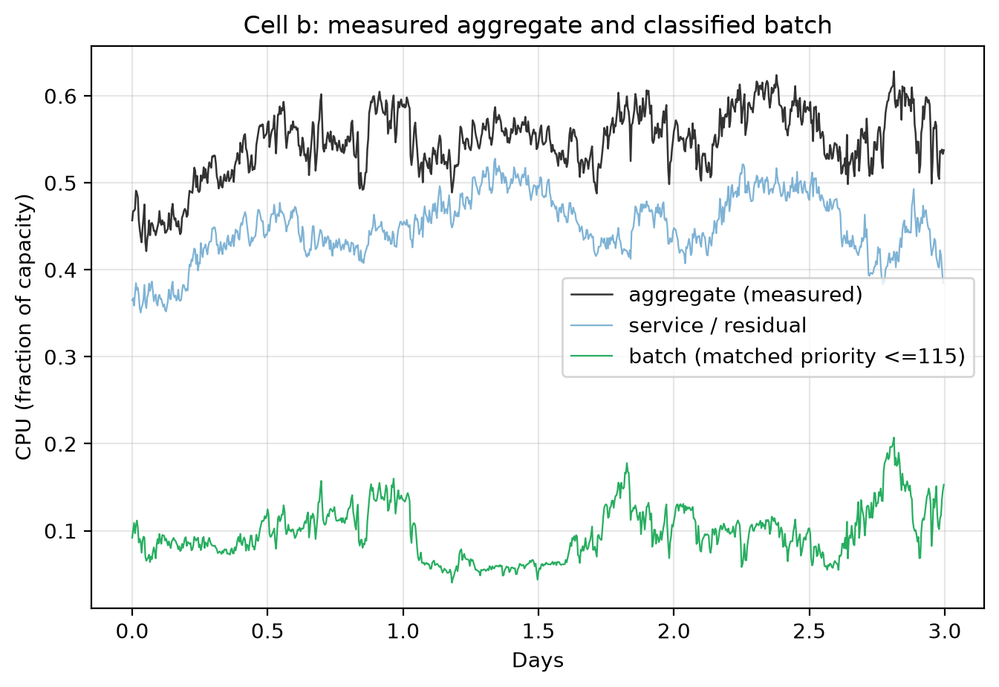
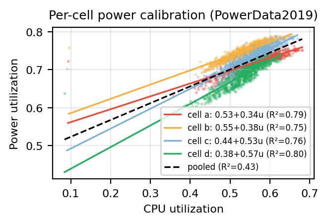
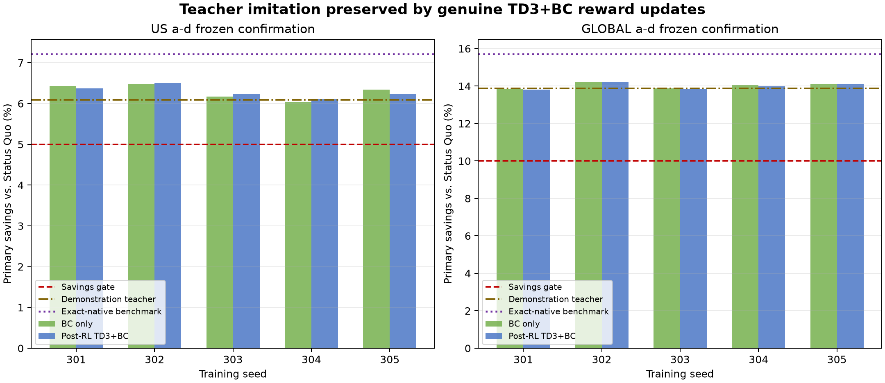
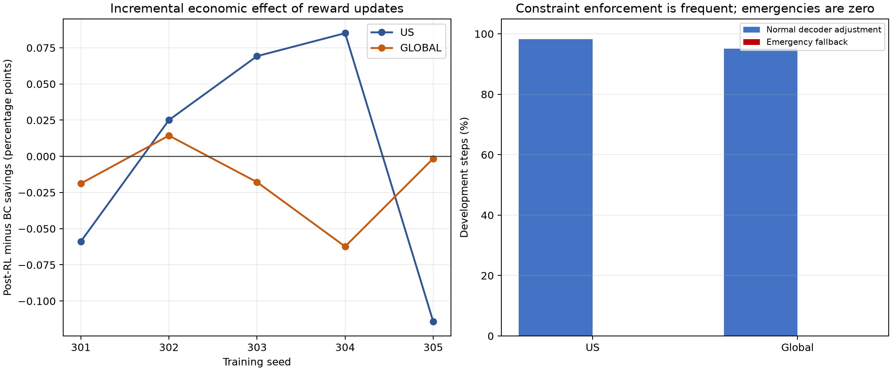

# Abstract

Geo-distributed data centers can shift computational demand across both place and time, but an economically attractive schedule is not acceptable if it drops service, misses batch deadlines, or exceeds capacity. This thesis studies safe joint routing and deferral in a controlled four-site environment. Workload volumes come from measured aggregate CPU usage and measured no-SLO batch usage in Google ClusterData 2019; non-deferrable service is the aggregate-minus-batch residual. Energy inputs cover 8,928 five-minute intervals from May 2025 CAISO data: native net demand and solar are paired with stepwise-expanded NP15 day-ahead price, then shifted together by local wall time. The construction is one CAISO archetype rather than a replay of independent regional markets.

The final method combines a 13-dimensional continuous actor, causal demonstration guidance, TD3+BC, and a deterministic constraint decoder. The network supplies service-routing, batch-timing, origin, and destination preferences. The decoder enforces service conservation, cumulative EDF deadline feasibility, pool and fleet bounds, exact transport, and destination capacity; a separately measured emergency fallback handles unexpected decoder failure. Offline behavior cloning and subsequent reward-driven TD3+BC are evaluated separately, with analytic controller calls disabled during RL interaction and inference.

Across five a-d development/frozen-confirmation seeds, post-RL primary savings exceed the predeclared thresholds on every seed: the mean is 6.290% for US and 14.000% for Global, with exact completion and 0% emergency fallback. Descriptive e-h transfer also exceeds the thresholds, but is not confirmatory. Attribution is central: BC-only means are 6.289% and 14.017%, while paired post-RL-minus-BC means are only +0.0013 and -0.0172 percentage points. Thus genuine TD3+BC updates preserved safe teacher-imitation performance rather than producing most of the absolute savings. Normal decoder adjustment occurs on more than 95% of a-d steps, so execution is a co-product of learned preferences and deterministic feasibility. A secondary demand-charge sensitivity reveals a peak-cost tradeoff. Claims remain bounded by equal 100 MW proxies, unrestricted transfer, synthetic deadlines, cross-year anchoring, and one deterministic energy month. The objective is electricity price plus positive-net-demand grid stress, not carbon intensity.

# 1. Introduction

Large computing fleets turn software decisions into physical demand. A scheduler that places a unit of work at one data center rather than another selects not only a machine pool but also a power model, an electricity price, and a point on a regional grid-demand profile. A scheduler that executes deferrable work now rather than later also selects a time at which those conditions apply. These spatial and temporal choices are coupled: delaying work changes the set of feasible destinations at a later step, while routing immediate service work changes how much capacity remains for batch work at each destination.

This thesis studies that coupling in a controlled four-site environment. At every five-minute step, the controller must route non-deferrable service demand, decide how much accumulated batch demand to execute, choose the origins from which that batch work is removed, and choose the destinations at which it runs. Each modeled site has normalized compute capacity one and rated power 100 MW. The sites are equal-sized proxies; their different workload shapes and fitted power coefficients are retained, but their raw machine counts do not determine runtime capacity. This deliberate abstraction isolates scheduling, market-phase, and power-model effects from the much larger engineering problem of reproducing the true size and network constraints of a commercial fleet.

The empirical workload source is Google ClusterData 2019, commonly described as a Borg trace. The electricity source is a complete May 2025 California Independent System Operator (CAISO) calendar. Those sources are not contemporaneous. Workload timestep zero from the May 2019 Borg trace is explicitly anchored to the May 2025 energy calendar. The resulting experiment is therefore a cross-year counterfactual, not a historical replay of a real fleet buying power in 2019 or 2025.

The energy construction is similarly controlled. Native five-minute CAISO net demand and solar are paired with hourly NP15 day-ahead electricity price, expanded stepwise to five-minute intervals. The entire tuple is shifted together by local civil time to form four US slots and four Global slots. This provides different local phases while preserving causal alignment among price, net demand, and solar. It does **not** create eight independent electricity markets. Every slot remains a transformation of one CAISO archetype, at one price level, over one month.

Two design requirements dominate the thesis. First, accounting must be dimensionally and temporally correct. Normalized compute becomes power through a fitted cell-specific model, power becomes interval energy, and interval energy becomes dollars through price. Batch work must be conserved from arrival through origin drain, cross-site transport, destination execution, or explicitly recorded failure. Second, learning must not be allowed to purchase an apparently attractive objective by dropping service, missing deadlines, or overflowing capacity. The final architecture therefore separates preference generation from feasibility: a trained network emits routing and timing preferences, a constraint-only decoder turns them into a feasible action, and a separately measured emergency shield is reserved for unexpected decoder failures.

This separation also disciplines attribution. The policy is not credited for arithmetic performed by the decoder, and the decoder is not called a learned controller. An analytic current-state marginal-cost teacher may provide offline demonstrations, but it is absent at inference. Behavior cloning (BC) and reward-driven TD3+BC updates are reported as distinct mechanisms. If imitation explains most of an observed advantage, the thesis must say so rather than attributing all savings to reinforcement learning (RL). Likewise, ordinary decoder adjustment is not an emergency intervention; both rates and both magnitudes must be disclosed independently.

The study asks a bounded technical question: under the stated proxy assumptions, can a causal controller exploit spatial market phase, measured workload flexibility, and heterogeneous power response while satisfying exact service, deadline, transport, and capacity requirements? It does not claim to solve production geo-distributed scheduling. Latency, data residency, network bandwidth, migration energy, transfer price, and independent regional market dynamics are not modeled. The feasible routing domain is consequently an optimistic upper bound.

# 2. Problem Motivation

## 2.1 Why space and time must be optimized together

Service/residual and batch demand place different obligations on a scheduler. The service/residual curve is aggregate usage minus classified no-SLO batch usage; it contains matched SLO-bearing priorities and any usage without matched priority metadata. The model treats that entire residual as immediately due. It may be routed among the four proxy sites, but it cannot be deferred without creating service backlog. Classified batch demand enters an earliest-deadline-first (EDF) pool and may be carried for a synthetic experimental horizon. A purely spatial controller can move demand toward a favorable site but cannot wait for a better interval. A purely temporal controller can wait but cannot exploit simultaneous differences among destinations. A joint controller can use both levers, subject to their shared capacity.

The coupling is easiest to see through residual capacity. Let a site have normalized capacity one. If routed service consumes 0.8 of that capacity, no more than 0.2 remains for batch execution in that interval. Moving some service elsewhere may create room for urgent batch work, but only if the receiving site can accept the service. Conversely, draining more batch now reduces future deadline pressure, yet may increase current energy cost or grid stress. The controller must trade present marginal cost against future feasibility without seeing future exogenous signals in the teacher or relying on model-predictive control.

## 2.2 Electricity price and grid stress are different signals

Electricity price is an operator-facing monetary input. In the primary objective, a site drawing grid power pays the site's time-aligned CAISO-archetype price in USD/kWh. Price may be low or negative. Grid stress is a separate modeled shadow cost: the squared data-center draw is multiplied by the positive part of signed regional net demand and by a fixed coefficient. It penalizes concentration when the transformed grid profile is under positive residual demand, while contributing zero when signed net demand is negative.

These signals can agree or disagree. A low price can occur at a favorable net-demand trough, but the formulation does not assume perfect correlation. Keeping the terms separate permits explicit sensitivity and avoids relabeling a price signal as a physical grid signal. It also prevents an important scope error: no carbon-intensity series appears in the state or objective. The thesis optimizes electricity price plus positive-net-demand grid stress, not carbon emissions.

## 2.3 Why exact feasibility matters

A soft penalty alone can make failure economically tempting. If dropping one normalized unit avoids enough electricity or peak-related cost, a finite backlog or deadline penalty may be smaller than the avoided expense. Even when a penalty is large on average, an RL policy can find rare states in which violating the operational requirement improves its return. A final controller therefore needs more than evidence that average completion is high. It needs an action construction that conserves service, drains only existing batch work, executes exactly what was drained, respects destination capacity, and preserves enough future capacity for every deadline prefix.

This requirement changes the learning problem. The network need not learn the geometry of every equality and inequality from sparse penalties. It learns preferences inside a lower-dimensional semantic interface. The decoder handles conservation and lower or upper bounds analytically. This division improves interpretability: a service logit says where service is preferred; a batch-total scalar says how aggressively optional batch should run; origin logits say which pools should be drained; destination logits say where the resulting work should execute.

## 2.4 Why controlled proxies are useful—and limited

A real geo-distributed fleet has unequal data centers, multiple grids, network constraints, application affinities, reliability zones, and contractual electricity tariffs. Reconstructing all of those factors would require proprietary operational data and would make causal interpretation difficult. The equal 100 MW, unit-capacity proxy design instead asks what the scheduling mechanisms do when site size is held fixed. Cell-specific power curves still make a unit of compute draw different marginal power by site, and shifted energy tuples still create different local phases.

The cost of that control is limited external validity. Machine totals from the Borg cells sum to 96,580, but they remain metadata. They cannot be used to argue that a modeled destination has proportionally more runtime capacity. Unrestricted routing also ignores transfer cost and feasibility. The verified results are therefore described as outcomes in a controlled archetype, not as forecasts of a production bill or grid impact.

## 2.5 Why causal learning and causal teaching are separated

A calendar known to the experimenter can tempt an implementation to look ahead. A clairvoyant optimizer is useful as a bound, but it is not a deployable policy. The frozen v5 demonstration teacher is intentionally current-state only: it computes linear marginal cost from price, positive net-demand stress, demand-charge context, power slope, and site rating; greedily assigns service to low-cost available capacity; and greedily places optional batch on currently cheap or negative-net-demand destinations. It has no access to future price or future net demand. A separate `exact_native` controller uses convex economic dispatch and water-filling as a stronger analytic benchmark, but it does not generate the frozen demonstrations.

That boundary supports a clean scientific comparison. BC asks whether the network can reproduce the causal demonstration controller. Post-BC TD3+BC asks whether interaction with the reward can improve or alter that network. Network-only evaluation, with analytic controller calls disabled, tests what was actually learned. Without these separations, a system could be described as RL even if an analytic routine continued to make the important decisions at inference.

# 3. Related Work and Design Lineage

## 3.1 Cluster management and the Borg trace

Borg established the large-scale cluster-management context for this thesis. Verma et al. describe Borg's architecture and its role in scheduling diverse long-running and batch workloads at Google [1]. Tirmazi et al. document the next generation of Borg and the public ClusterData 2019 trace used here [2]. These works motivate the distinction between priority classes, normalized resource use, and large shared clusters. They do not, however, supply the synthetic scheduling deadlines used in this experiment.

The distinction is important. The present study derives aggregate and batch **volumes** from measured `instance_usage` joined to `collection_events`. Usage with a matched priority at or below 115 is treated as batch/no-SLO. The service curve is then defined conservatively as aggregate usage minus classified batch usage; it therefore contains matched priorities at or above 116 and any usage whose left join did not find priority metadata. The repository does not contain a canonical unmatched-priority-rate audit, so it does not claim that every service-curve sample has a directly observed priority at or above 116. The experimental deadline assigned to batch work comes from a separate modeling rule based on mean duration and is not a Borg SLO.

## 3.2 Power proportionality and provisioning

Fan et al. provide a foundational empirical account of power provisioning for warehouse-scale computers and the limited proportionality between utilization and power [3]. Their observation that idle systems consume a substantial fraction of peak power motivates the affine form used here: normalized power equals an idle intercept plus a utilization-dependent slope. The coefficients in this thesis are not copied from Fan et al.; they are fitted from Google PowerData2019 for each active cell.

Sakalkar et al. study data-center power oversubscription and power-plane design [4]. That line of work highlights the operational value of understanding peak draw and capacity limits. The thesis uses a simpler abstraction: each proxy has a fixed 100 MW rating and no explicit electrical topology. Optional grid-power and ramp caps exist in the safety machinery, but they are not part of the primary configuration. Capacity safety in the primary study is normalized compute capacity plus its associated affine grid draw, not a claim to reproduce a medium-voltage power plane.

## 3.3 Geographic electricity-cost optimization

Qureshi et al. show that geographic diversity in electricity price can be used to reduce the cost of Internet-scale systems [5]. Rao et al. formulate electricity-cost minimization across distributed data centers in multiple electricity markets [6]. Liu et al. connect geographic load balancing to energy and environmental objectives [7]. Together, these studies establish that location can be an energy-control variable rather than a fixed deployment detail.

The present thesis follows that intellectual lineage but narrows the empirical claim. Its US and Global slots are not distinct historical markets. A single CAISO price/net-demand/solar tuple is shifted by IANA local wall time. Price level is not independently recalibrated for Amsterdam, Singapore, or the US regions. Consequently, this experiment isolates phase and workload/power heterogeneity under one controlled archetype; it cannot validate the multi-market price-spread assumptions of a real global operator.

## 3.4 Temporal flexibility and renewable-aware scheduling

GreenSlot demonstrates renewable-aware scheduling of data-center work [8]. Grange et al. provide a distribution-oriented basis for representing data-center job arrivals and resource characteristics [9]. These studies motivate temporal flexibility and careful workload modeling. In this thesis, however, solar is not on-site supply. The data centers are pure grid-connected loads. The CAISO solar series is retained as an observation or forecast feature associated with the grid profile; it never subtracts directly from data-center power.

The primary environmental signal is signed net demand, and only its positive part scales the quadratic grid-stress term. Negative net demand is preserved rather than clipped away, while the stress term becomes zero there. Any incentive during negative-net-demand intervals comes through the preserved price and the absence of positive stress, not through a carbon objective or a fictional behind-the-meter solar plant.

## 3.5 Demand charges and tariff interpretation

The NREL report by McLaren, Gagnon, and Mullendore surveys commercial demand charges and their importance for behind-the-meter economics [10]. It provides context for treating a peak-based charge differently from an energy charge. The thesis implements an optional, illustrative demand charge at 15 USD/kW per modeled monthly billing cycle. It measures peaks at the simulator's five-minute cadence, whereas real tariffs often use 15-minute demand intervals and jurisdiction-specific rules.

Demand charge is secondary and excluded from the primary final reward. When enabled for a separate analysis, it is charged by increments of the running peak so that the per-step terms telescope exactly to the period maximum. An undiscounted return, $\gamma=1$, is mandatory for that identity. This implementation is an illustrative sensitivity, not a reconstruction of CAISO, Dutch, Singaporean, or utility-specific tariffs.

## 3.6 Carbon-aware computing as adjacent context

Radovanovic et al. study carbon-aware computing for data centers [11]. That work is relevant context because it also connects workload timing and placement to external grid signals. It is not the objective adopted here. This thesis has no marginal-emissions or carbon-intensity input, does not optimize carbon, and must not translate lower price or lower positive net demand into an emissions claim. Carbon-aware optimization remains a separate research question requiring different data and validation.

## 3.7 Reinforcement-learning foundations

Proximal Policy Optimization (PPO) provides the on-policy foundation for the earlier design lineage [12]. Its clipped objective limits how far a policy moves from the data-collecting policy during each update. Twin Delayed Deep Deterministic Policy Gradient (TD3) supplies the off-policy continuous-control foundation for v5 [13]. TD3 uses twin critics, target-policy smoothing, delayed actor updates, and replay to reduce overestimation and improve data reuse.

TD3+BC combines a critic-seeking actor objective with behavior cloning [14]. It was proposed as a minimalist offline RL method. This thesis uses its actor regularization ideas in a carefully labeled pipeline: offline teacher demonstrations and BC are one mechanism; subsequent reward-driven interaction and critic learning are another. The mere presence of a Q-function does not erase the contribution of imitation. Attribution must compare the BC checkpoint with the post-BC checkpoint and report which weights and outcomes changed.

Stable-Baselines3 (SB3) supplies tested algorithm implementations and common training infrastructure [15]. The repository pins and records the relevant SB3 version for v5 frozen v3 campaigns. Custom code extends TD3 with the TD3+BC actor loss and supplies a domain-specific safe environment; SB3 does not provide the deadline decoder or the analytic teacher.

SustainDC is a public benchmark for sustainable data-center control using RL [16]. It illustrates the value of integrated, reproducible control environments. SustainCluster, from HPE/ExaDigiT, is referenced only as public GitHub software, not as a peer-reviewed result, source dataset, or runtime dependency [17]. Neither project changes the thesis's narrow objective definition.

## 3.8 Design lineage from v1 through v5

Version labels in the repository represent design learning, not a sequence of final claims. **v1** established the initial joint routing-and-timing environment and exposed the need for a stronger data and accounting contract. **v2** froze the controlled May 2025 CAISO archetype, equal-capacity proxy assumptions, measured tier inputs, objective units, and evaluation scaffolding. **v3** repaired important state and reward semantics by exposing episode position and deadline structure and by making completion accounting explicit. Its remaining boundary ambiguity helped motivate an actionable-pool definition.

**v4** introduced the causal one-step safety projection. It excludes entries with `deadline_step <= t` from actionable state, uses cumulative EDF prefix constraints, admits exact drain endpoints, constructs exact origin-to-destination transport, and fails closed on states outside the frozen assumptions. It is not model-predictive control and does not look ahead at future energy signals.

**v5** changes the policy interface rather than discarding v4 safety. A 13-dimensional action expresses service, optional batch amount, batch origin, and batch destination preferences. A native constraint decoder enforces expected feasibility every step. The v4 projector is retained as a separately instrumented emergency fallback for unexpected decoder problems, with a v5 frozen v3 protocol goal below 1% emergency use. Normal decoder adjustment may be frequent and is not counted as emergency use. Chapter 13 reports the v1-v4 design history, while Chapter 15 reports the verified v5 outcomes and separates routine decoder adjustment from emergency fallback.

# 4. Data Sources and Transformations

## 4.1 A two-source, cross-year experiment

The experiment joins two public empirical sources that answer different questions. Google ClusterData 2019 supplies normalized compute demand and workload priority. CAISO May 2025 supplies the energy calendar. There is no claim that the Google cells were located in the modeled market slots, that their 2019 work encountered 2025 prices, or that the sources describe the same physical system. The join is an explicit counterfactual used to study control mechanisms.

The time index is

$$
t \in \mathcal{T}=\{0,1,\ldots,8927\}, \qquad \Delta=5\text{ minutes}=\frac{1}{12}\text{ hour}.
$$

Here $t$ is a dimensionless interval index and $\Delta$ is the interval duration in hours. The energy calendar begins at 2025-05-01 07:00:00Z inclusive and ends at 2025-06-01 07:00:00Z exclusive. It therefore contains 31 days, 744 hours, or 8,928 five-minute intervals. The original Borg trace covers May 2019; extraction discards its absolute timestamp and retains the ordinal timestep. Workload timestep zero is anchored to May 1, 2025 00:00 Pacific, which is 07:00Z on that date.

## 4.2 Native CAISO inputs

CAISO Today's Outlook historical files provide native five-minute net demand and solar. Net demand is the grid's residual demand after variable generation in the CAISO reporting convention. Solar is retained as an explanatory or forecast feature. It is not modeled as power generated behind the meter at a data center.

The electricity-price source is CAISO OASIS day-ahead market (DAM) total locational marginal price for NP15. Its native resolution is hourly and its native unit is USD/MWh. Each hourly observation is expanded as a step function over the twelve five-minute control intervals in that hour. The unit conversion is

$$
p_t^{\mathrm{USD/kWh}}=\frac{p_t^{\mathrm{USD/MWh}}}{1000}.
$$

The divisor has units kWh/MWh. Negative price observations are preserved. The processed tuple contains `timestamp_utc`, `timestamp_local`, `reference_timestamp_utc`, `price_usd_kwh`, `net_demand_mw`, `net_demand_signed`, and `solar_fraction`, in addition to the integer timestep. Raw source files include adjacent-day buffers so local-time shifts do not circularly wrap the end of May back to its beginning. The build fails rather than silently substituting a synthetic price curve when source coverage is incomplete.


This figure documents the source month and the different native resolutions before hourly price is expanded to the five-minute control cadence. Its limitation is that it shows one May 2025 CAISO NP15 price/net-demand calendar only; it is neither a multi-year sample nor evidence for independent regional markets, and it does not establish behavior outside this controlled archetype.

## 4.3 Signed net-demand normalization

Let $N_t$ denote raw CAISO net demand in MW and let $N_{\max}=33{,}361\ \mathrm{MW}$ be the maximum absolute value used by the active reference-window normalization. The signed feature is

$$
n_t=\operatorname{clip}\!\left(\frac{N_t}{N_{\max}},-1,1\right).
$$

The quantity $n_t$ is dimensionless. Negative values remain negative in storage and in the policy observation. The primary grid-stress calculation uses

$$
n_t^+=\max(n_t,0),
$$

which is also dimensionless. This transformation means negative net demand produces no quadratic stress charge, but it does not create a negative stress credit. Any separate benefit at such an interval must arise from price or from a disclosed control rule. The primary model has no ramp derivative in its reward; raw MW net demand can be retained for separate physical ramp diagnostics.

## 4.4 Local-wall-time shifts

The reference CAISO tuple is transformed into two four-slot scenarios. The US scenario uses the IANA zones `America/Los_Angeles`, `America/Denver`, `America/Chicago`, and `America/New_York`, labeled Pacific, Mountain, Central, and Eastern. The Global scenario uses `America/Los_Angeles`, `America/Chicago`, `Europe/Amsterdam`, and `Asia/Singapore`, labeled Pacific, Central, Amsterdam, and Singapore.

For each target timestamp, the build computes target local civil time and selects the reference California tuple at the matching Los Angeles wall time. Price, net demand, and solar move together. IANA time-zone rules, including daylight-saving behavior, are applied to the conversion. Shifting the full tuple is crucial: shifting price but leaving net demand fixed would manufacture a phase relation that did not occur in the source calendar.

This procedure yields a controlled set of phase-shifted slots. It does not create a real Mountain, Central, Eastern, Amsterdam, or Singapore electricity market. Price levels remain those of the CAISO archetype. Small boundary differences can occur because shifts use adjacent real hours rather than circular wrapping, but those are window-boundary effects, not regional premiums.


The US profiles visualize phase differences created by the Pacific, Mountain, Central, and Eastern wall-time mappings. Their explicit limitation is that all four curves are time shifts of one co-timestamped CAISO tuple at the same source price level, not observations from four independent US electricity markets; the average-day view also suppresses within-month variability.


The Global profiles visualize the Pacific, Central, Amsterdam, and Singapore phase mappings while keeping price, net demand, and solar aligned. Their explicit limitation is that they are time shifts of the same CAISO tuple rather than independent California, Central US, Dutch, and Singaporean market data; they therefore cannot support regional price-level or real multi-market claims.


## 4.5 Alignment and truncation

Every aggregate Borg curve and every measured tier curve for cells a through h contains 8,929 rows, indexed 0 through 8,928. The processed energy files contain 8,928 rows. Runtime loading takes the minimum length across workload, solar, price, signed net demand, and raw net demand and truncates all series to that common length. Consequently, active episodes use workload indices 0 through 8,927; the extra 8,929th Borg sample is not executed.

This minimum-length rule is deterministic and visible in `env\data_loader.py`. It avoids off-by-one reads, but it is not a license to accept arbitrary missing data. Source completeness and timestamp uniqueness are separately checked by the energy-model build and preflight. The active contract expects the exact 8,928-step calendar.

## 4.6 Data provenance boundaries

Three provenance boundaries prevent accidental source substitution. First, `data\energy_model_v2\2025\manifest.json` records the active energy model, source metadata, processed paths, and hashes. Second, measured tier CSVs are the runtime source of service and batch **volume** whenever present. Third, `data\workload_generator_params.json` is secondary extraction/fitting provenance for an older cross-cell synthetic generator; active scenarios do not read it. The active per-site `data\jobs\batch_distributions_{a..h}.json` files provide duration statistics used to construct experimental deadlines.

The repository's `archive\` tree is not a runtime dependency. Historical outputs remain useful for design history, but no active scenario, environment, teacher, decoder, or verified v5 campaign loads data or code from it.

# 5. Borg Workload and Tier Aggregation

## 5.1 Aggregate utilization curves

For each Borg cell $c\in\{a,b,c,d,e,f,g,h\}$, the aggregate input `cell_c.csv` contains `cpu_demand_norm`, a five-minute normalized CPU-utilization curve. A value of one means the source cell's full normalized CPU capacity for that interval; it does not mean one core or one machine. Because each curve is already divided by its own cell capacity, the experiment can treat it as a shape on a unit-capacity proxy without multiplying by the machine count again.

The eight source-cell machine counts are 10,001; 10,047; 13,245; 12,576; 14,122; 12,201; 12,796; and 11,592 for cells a through h, respectively. They total 96,580. These counts support provenance and calibration checks only. If they were used to rescale the runtime curves after normalization, the same fleet-size information would be applied twice.

## 5.2 Measured aggregate, classified batch, and service residual

Tier curves are built from BigQuery `instance_usage` left-joined with `collection_events` to obtain priority. At each cell and timestep, matched usage with priority at or below 115 is classified as no-SLO batch:

$$
\text{batch/no-SLO}:\quad \text{matched priority}\le 115.
$$

Let $w_{c,t}$ be aggregate normalized CPU utilization and $b_{c,t}$ be classified batch utilization. The environment defines the non-deferrable service/residual curve as $s_{c,t}=w_{c,t}-b_{c,t}$. It includes matched priority at or above 116 plus any usage without matched priority metadata. All three curves are measured usage or a residual of measured usage, expressed as dimensionless capacity fractions for one five-minute interval. The conservation identity is

$$
s_{c,t}+b_{c,t}=w_{c,t}
$$

for every cell and timestep, to floating-point precision. Cells a-d are regenerated by `extract_tier_curves.ipynb`; cells e-h are regenerated by `extract_cells_eh.ipynb`. The e-h aggregate and classified-batch volumes are measured from BigQuery in the same way as a-d. They are **not** fitted, synthesized, inferred from a small percentage, or copied from `workload_generator_params.json`.



The figure illustrates the conservation identity on cell b. Its limitation is that cell b is only one example, the service curve is the aggregate-minus-batch residual rather than an exclusive matched-priority audit, and the plotted curves do not preserve job-level placement or dependency structure. The scheduling deadlines used later remain synthetic experimental controls rather than Borg-provided SLOs.

The usage-weighted batch shares over the measured curves are:

| Cell | Machines | Usage-weighted batch share | Active horizon at FF=1 |
|---|---:|---:|---:|
| a | 10,001 | 16.618258% | 18 steps (90 min) |
| b | 10,047 | 15.728094% | 8 steps (40 min) |
| c | 13,245 | 22.327778% | 14 steps (70 min) |
| d | 12,576 | 26.373770% | 26 steps (130 min) |
| e | 14,122 | 23.488854% | 37 steps (185 min) |
| f | 12,201 | 8.365917% | 34 steps (170 min) |
| g | 12,796 | 37.736163% | 35 steps (175 min) |
| h | 11,592 | 29.124742% | 54 steps (270 min) |

The percentages are based on CPU usage, not job counts or requested CPU. They replace stale small synthetic fractions that may appear in secondary provenance. The runtime loader recomputes effective batch share from the measured batch curve divided by the measured aggregate workload, but service and batch demand themselves come directly from their curves.

## 5.3 Batch work as conserved interval demand

A batch sample $b_{c,t}$ enters an origin-specific pool. Operationally it is a normalized compute-interval quantity: executing one unit means sustaining normalized utilization one for one five-minute interval. Pool quantities can be added across time because they represent pending compute work in these interval units. Draining a pool does not itself consume power; power is determined at the destination where the drained work executes.

Each pool entry records two fields: `cpu_demand` and absolute `deadline_step`. Entries are removed EDF, including partial removal of an entry when only part of its quantity is executed. This makes the pool accounting exact rather than rounding a job or timestep to an indivisible unit. The transport matrix later ensures that the sum drained from origins equals the sum placed at destinations.

## 5.4 Synthetic deadline semantics

The public tier trace provides measured volume and priority, not the scheduling deadline required by this experiment. A deadline horizon is therefore constructed as

$$
H_c=\max\!\left(1,\left\lceil
\frac{\bar d_c(1+F)}{300\ \mathrm{s}}
\right\rceil\right),
\qquad
D_{c,t}=t+H_c.
$$

Here $\bar d_c$ is the per-cell mean job duration in seconds loaded from the matching `data\jobs\batch_distributions_{a..h}.json` file selected for cell $c$; $F$ is the dimensionless flexibility factor; 300 s is the control interval; $H_c$ is an integer number of steps; and $D_{c,t}$ is an absolute step index. The primary setting is $F=1$. It produces horizons 18, 8, 14, and 26 steps for a-d, and 37, 34, 35, and 54 steps for e-h.

These horizons are synthetic experimental controls derived from per-cell mean duration. They are not Borg SLOs, not observed completion deadlines, and not learned from electricity data. `data\workload_generator_params.json` is not their active source. The scenario's per-site `batch_distributions` path supplies the active duration.

An entry with `deadline_step = d` remains actionable through step $d-1$ and expires before service at step $d$. Thus an actionable pool at current step $t$ contains only entries satisfying $D>t$. Due-now or already-expired mass is audit-only; it cannot be advertised to a policy as work that the current action can save.

## 5.5 Development and descriptive cell groups

Cells a-d form the development and frozen-confirmation workload group for the primary methodology. Cells e-h are used only for descriptive transfer. They are not an untouched confirmatory holdout: earlier design stages exposed them, and the same deterministic energy month is reused. Their value is diagnostic—particularly because their workload mixes, durations, and power slopes differ—not inferential evidence from an independent test population.

# 6. Power Model

## 6.1 Affine utilization-to-power relation

Each cell has a linear model fitted from Google PowerData2019:

$$
\pi_i(u)=a_i+m_i u,
$$

where $u$ is normalized CPU utilization in $[0,1]$, $a_i$ is normalized idle power, $m_i$ is normalized incremental power per unit utilization, and $\pi_i$ is normalized electrical power. All three quantities are dimensionless. With rated site power $R_i=100\ \mathrm{MW}$, grid draw is

$$
P_{i,t}=R_i\,\pi_i(u_{i,t})
=R_i(a_i+m_i u_{i,t}) \quad [\mathrm{MW}].
$$

There is no on-site generation term, power-usage-effectiveness multiplier, battery, or network-transfer energy in this equation. The model maps compute directly to proxy site grid draw.

The active coefficients are:

| Cell | Idle $a_i$ | Slope $m_i$ | Power model |
|---|---:|---:|---|
| a | 0.5280 | 0.3397 | $P=100(0.5280+0.3397u)$ MW |
| b | 0.5482 | 0.3758 | $P=100(0.5482+0.3758u)$ MW |
| c | 0.4396 | 0.5257 | $P=100(0.4396+0.5257u)$ MW |
| d | 0.3820 | 0.5704 | $P=100(0.3820+0.5704u)$ MW |
| e | 0.3880 | 0.6011 | $P=100(0.3880+0.6011u)$ MW |
| f | 0.4272 | 0.4407 | $P=100(0.4272+0.4407u)$ MW |
| g | 0.4562 | 0.4923 | $P=100(0.4562+0.4923u)$ MW |
| h | 0.3838 | 0.3928 | $P=100(0.3838+0.3928u)$ MW |



The figure shows why the runtime uses cell-specific affine coefficients rather than only the pooled relationship for development cells a-d. Its limitation is that it visualizes a-d and the pooled fit, not the e-h calibrations, and an affine CPU-to-power model does not represent cooling, power-usage effectiveness, server-state transitions, batteries, or facility electrical topology.

The coefficients reveal why normalized compute is not interchangeable across sites. One unit of utilization changes power by $100m_i$ MW, which varies materially by cell. Idle power also matters for absolute cost, although it is action-independent when a site's rating and on/off state are fixed.

## 6.2 Equal proxy sites and machine metadata

Every active scenario declares `rated_power_mw: 100.0`, `capacity: 1.0`, and `memory_capacity: 1.0`. The model therefore compares four equal proxy sites. Cell machine totals do not alter $R_i$ or the capacity constraint. This choice prevents a larger source cell from automatically becoming a larger modeled destination and focuses analysis on workload shape, energy phase, and power coefficients.

The abstraction should not be mistaken for fleet calibration. A production estimate would require actual facility ratings, power-usage effectiveness, server mix, cooling, network energy, and geographic mapping. Here, 100 MW is a controlled scale that converts normalized model output into transparent physical and monetary units.

## 6.3 The complete unit chain

For a destination utilization $u_{i,t}$:

$$
\underbrace{u_{i,t}}_{\text{normalized compute}}
\longrightarrow
\underbrace{a_i+m_i u_{i,t}}_{\text{normalized power}}
\longrightarrow
\underbrace{100(a_i+m_i u_{i,t})}_{\mathrm{MW}}
\longrightarrow
\underbrace{100(a_i+m_i u_{i,t})\Delta}_{\mathrm{MWh}}
\longrightarrow
\underbrace{1000\cdot100(a_i+m_i u_{i,t})\Delta}_{\mathrm{kWh}}
\longrightarrow
\underbrace{p_{i,t}\,1000\cdot100(a_i+m_i u_{i,t})\Delta}_{\mathrm{USD}}.
$$

The factor 100 converts normalized power to MW because the proxy rating is 100 MW. Multiplying by $\Delta=1/12$ hour converts MW to MWh. Multiplying by 1000 converts MWh to kWh. Multiplying by price in USD/kWh produces USD. This chain is used directly in the primary energy cost and is the dimensional backbone of the objective.

# 7. Formal Mathematical Problem

## 7.1 Sets, horizon, and units

The modeled site set is $\mathcal I=\{1,2,3,4\}$. A site may be viewed as an origin $o\in\mathcal I$ when work arrives there and as a destination $i\in\mathcal I$ when work executes there. The finite horizon is $\mathcal T=\{0,\ldots,T-1\}$ with $T=8{,}928$ and interval duration $\Delta=1/12$ hour.

A **normalized compute unit** is a fraction of one proxy site's CPU capacity during one interval. Service execution and destination load have units of normalized utilization for the current interval. Pending batch quantities have units of normalized compute-interval work; numerically, one pending unit requires one full unit of normalized utilization for one interval. This convention makes the capacity upper bound one at each site and permits exact addition of deferred work across steps.

The following exogenous variables are known at the current step:

- $s_{o,t}$: service demand arriving at origin $o$ at step $t$ [normalized compute units];
- $b_{o,t}$: batch demand arriving at origin $o$ at step $t$ [normalized compute-interval units];
- $p_{i,t}$: electricity price assigned to destination $i$ at step $t$ [USD/kWh];
- $n_{i,t}$: signed normalized net demand [dimensionless];
- $N_{i,t}$: raw net demand retained for reporting [MW];
- $a_i$: normalized idle-power coefficient [dimensionless];
- $m_i$: normalized power slope [dimensionless per normalized utilization];
- $R_i=100$: rated destination power [MW]; and
- $C_i=1$: destination compute capacity [normalized compute units per interval].

The current policy does not receive future $p$, $n$, $s$, or $b$ through the analytic teacher. Training can traverse the fixed calendar, but each deployed action is constructed from current and accumulated causal state.

## 7.2 Decision variables

At each step $t$, the feasible scheduler produces:

- $x_{i,t}\ge0$: service executed at destination $i$ [normalized compute units];
- $g_{o,t}\ge0$: batch drained from origin pool $o$ [normalized compute-interval units];
- $y_{i,t}\ge0$: drained batch executed at destination $i$ [normalized compute units];
- $z_{o,i,t}\ge0$: batch transported logically from origin $o$ to destination $i$ [normalized compute units]; and
- $u_{i,t}=x_{i,t}+y_{i,t}$: total destination utilization [normalized compute units].

The transport variable is an accounting flow, not a model of network packets. No bandwidth, latency, transfer energy, or transfer price is attached to $z$. It exists to prove that origin drain and destination execution describe the same work.

The learned v5 network does not output these quantities directly. For four sites it emits an unconstrained preference vector

$$
a_t^{\mathrm{net}}=
\left[
\ell^{S}_{1:4,t},\ \eta_t,
\ell^{O}_{1:4,t},\ \ell^{D}_{1:4,t}
\right]\in\mathbb R^{13},
$$

where $\ell^S$ are four service-routing logits, $\eta$ is one batch-total scalar, $\ell^O$ are four origin-pool logits, and $\ell^D$ are four batch-destination logits. All network outputs are dimensionless. The decoder maps them to $x$, $g$, $y$, and $z$.

## 7.3 Service conservation and destination capacity

All current service must execute in the same interval:

$$
\sum_{i\in\mathcal I}x_{i,t}
=
\sum_{o\in\mathcal I}s_{o,t}
\equiv S_t,
$$

where $S_t$ is total fleet service demand [normalized compute units]. For every destination,

$$
0\le u_{i,t}=x_{i,t}+y_{i,t}\le C_i=1.
$$

The service preference is first decoded with a softmax,

$$
\tilde x_{i,t}=S_t
\frac{\exp(\ell^S_{i,t})}
{\sum_{j\in\mathcal I}\exp(\ell^S_{j,t})},
$$

then projected onto the capped simplex with total $S_t$ and upper bounds given by effective site capacities. The resulting $x$ conserves service exactly. In the final hard-safe path, service backlog is therefore zero; a pre-existing local backlog is an invalid incoming state and causes fail-closed behavior.

## 7.4 Batch pools and deadline state

Let $\mathcal E_{o,t}$ be the multiset of actionable batch entries at origin $o$ after the current arrival is incorporated for planning. Each entry $e\in\mathcal E_{o,t}$ has quantity $q_e>0$ [normalized compute-interval units] and absolute deadline $d_e$ [step index], with $d_e>t$. Total actionable pool is

$$
Q_{o,t}=\sum_{e\in\mathcal E_{o,t}}q_e.
$$

Origin drain is bounded by existing work:

$$
0\le g_{o,t}\le Q_{o,t}.
$$

After drain, entries are removed EDF. If $\operatorname{EDF}(\mathcal E_{o,t},g_{o,t})$ denotes exact partial EDF removal, the next pool is the remaining multiset after advancing the step. No quantity may disappear through rounding. The scalar batch balance across the fleet is

$$
\sum_o Q_{o,t}
-
\sum_o g_{o,t},
$$

subject also to the deadline-prefix constraints in Chapter 8.

## 7.5 Exact origin-destination conservation

Every unit drained must execute, and every executed batch unit must come from a pool:

$$
\sum_{i\in\mathcal I}z_{o,i,t}=g_{o,t}
\quad\forall o,
$$

$$
\sum_{o\in\mathcal I}z_{o,i,t}=y_{i,t}
\quad\forall i,
$$

$$
\sum_o g_{o,t}=\sum_i y_{i,t}.
$$

All quantities are normalized compute units for the current interval. A deterministic transport construction fills a nonnegative matrix with the requested row and column sums and audits numerical conservation. Because transport has no physical network constraints, any origin may supply any destination in the model.

## 7.6 Power, energy, and electricity cost

Given total utilization $u_{i,t}$, destination grid draw is

$$
P_{i,t}=R_i(a_i+m_i u_{i,t})\quad[\mathrm{MW}].
$$

Interval energy is

$$
E_{i,t}=P_{i,t}\Delta\quad[\mathrm{MWh}]
=1000P_{i,t}\Delta\quad[\mathrm{kWh}].
$$

The primary electricity cost is exactly

$$
C^{\mathrm{energy}}_{i,t}
=p_{i,t}P_{i,t}\,1000\,\Delta
\quad[\mathrm{USD}],
$$

with $p_{i,t}$ in USD/kWh, $P_{i,t}$ in MW, $1000$ in kW/MW (equivalently kWh/MWh after multiplying by hours), and $\Delta=1/12$ hour. The formula charges idle and utilization-dependent draw. Negative price can produce negative interval energy cost; it is not clipped.

## 7.7 Positive-net-demand grid stress

The primary grid-stress shadow cost at one step is

$$
C^{\mathrm{stress}}_t
=\alpha\sum_{i\in\mathcal I}P_{i,t}^{2}\max(n_{i,t},0),
$$

where $P_{i,t}$ is in MW, $n_{i,t}$ is dimensionless, and $\alpha=0.015$ has effective units USD/MW$^2$ per simulator interval so the expression contributes USD-equivalent objective units. The coefficient is a modeling weight, not a tariff. Squaring draw discourages concentrating load at a high-positive-net-demand site. Because $\max(n,0)=0$ for $n<0$, the term never treats negative net demand as negative carbon or awards an emissions credit.

## 7.8 Primary finite-horizon objective

Let $B_t$ be unserved service backlog [normalized compute units], $X_t$ be batch work expiring at step $t$ [normalized compute-interval units], and $V_t$ be capacity excess [normalized compute units]. Let $\lambda_S$, $\lambda_D$, and $\lambda_C$ be their respective penalty weights [USD per corresponding normalized unit]. The general evaluation objective is

$$
J_{\mathrm{primary}}
=
\sum_{t=0}^{T-1}
\left[
\sum_i C^{\mathrm{energy}}_{i,t}
+C^{\mathrm{stress}}_t
+\lambda_S B_t
+\lambda_D X_t
+\lambda_C V_t
\right]
+\lambda_D Q_T,
$$

where $Q_T$ is terminal pending batch [normalized compute-interval units]. In a hard-safe final run, $B_t=X_t=V_t=Q_T=0$ by construction and audit, so the penalty terms are zero. They remain in accounting as guards and diagnostics rather than an alternative to feasibility.

The per-step RL reward is a scaled negative training cost,

$$
r_t=-\kappa\,\widehat C_t,
$$

where $\kappa>0$ is a dimensionless numerical reward scale and $\widehat C_t$ may include disclosed potential-based or dense completion shaping whose finite-horizon accounting is checked. Raw USD components remain in the environment `info` record. Scaling reward must not change evaluation dollars.

## 7.9 Optional secondary demand charge

Let $\rho=15$ USD/kW per modeled billing cycle be the illustrative secondary rate, and let

$$
M_{i,t}=\max_{\tau\le t}P_{i,\tau}\quad[\mathrm{MW}]
$$

be the running peak within the current cycle. Instead of charging the full maximum at every step, the implementation charges only each increase:

$$
C^{\mathrm{demand}}_{i,t}
=\rho\,1000\,\max(P_{i,t}-M_{i,t-1},0)
\quad[\mathrm{USD}].
$$

Summing over a cycle telescopes:

$$
\sum_t C^{\mathrm{demand}}_{i,t}
=\rho\,1000\,\max_tP_{i,t}.
$$

The rate is in USD/kW, the factor 1000 converts MW to kW, and the maximum is measured on the simulator's five-minute cadence. Real demand tariffs commonly use 15-minute or other averaging windows and additional billing rules. This term is therefore illustrative, secondary, and excluded from the primary final reward. If enabled, the running peak and cycle position must be observable and $\gamma=1$ is required; discounting would destroy the telescoping equivalence.

## 7.10 Causal control problem

A causal policy $\pi_\theta$ maps current observation $o_t$ to preferences $a_t^{\mathrm{net}}$. A deterministic decoder $\mathcal D$ maps preferences and current safety state $h_t$ to feasible decisions:

$$
a_t^{\mathrm{net}}=\pi_\theta(o_t),
\qquad
(x_t,g_t,y_t,z_t)=\mathcal D(a_t^{\mathrm{net}},h_t).
$$

The learning goal is to find parameters $\theta$ that minimize expected $J_{\mathrm{primary}}$ over training stochasticity while the decoder satisfies all hard constraints. Expectations over seeds describe random initialization, exploration, replay sampling, and domain randomization. They do not describe independent draws of the May energy calendar, which is deterministic and shared.

# 8. Safety and Feasibility Constraints

## 8.1 Safety v4 as the structural precursor

The safety v4 design is a causal, one-step projection, not model-predictive control. It does not optimize a future price trajectory. It inspects current service, current batch arrival, current pools, current effective capacities, and frozen worst-case future envelopes. It then changes the proposed action only as necessary to lie in a set that is sufficient for future deadline completion under those envelope assumptions.

Four constants define the primary envelope for the four-site fleet:

$$
\bar S=2.25,\qquad
\bar B=1.00,\qquad
\bar C=4.00,\qquad
\bar R=\bar C-\bar S-\bar B=0.75.
$$

Here $\bar S$ is maximum assumed fleet service per step [normalized compute units], $\bar B$ is maximum assumed new fleet batch arrival per step [normalized compute-interval units], $\bar C$ is guaranteed total fleet compute capacity per step [normalized compute units], and $\bar R$ is guaranteed capacity reserved for already-carried batch [normalized compute units per future step]. The service and arrival values were rounded upward from development cells a-d and frozen. They were not fit to e-h or to future realized evaluation values.

## 8.2 Actionable work and step ordering

The boundary rule is exact: an entry with deadline $d$ can execute through $d-1$ and expires before action at $d$. Therefore

$$
\mathcal E_{o,t}^{\mathrm{actionable}}
=\{e:d_e>t\}.
$$

State features for pool size, urgency, and deadline buckets use only this actionable set. If an entry with $d_e\le t$ reaches the safety path, the state is already unsalvageable. The system records or raises a pre-action deadline-miss certificate rather than pretending that the current action can repair history.

Current batch arrival is included before calculating what must be served. This avoids a one-step observability gap in which a large new arrival consumes future slack but is invisible to the action. Exact implementation order may use a virtual post-arrival pool before committing state, but the mathematical context seen by the decoder includes the current arrival.

## 8.3 Cumulative EDF prefix constraints

Checking only the earliest single deadline or only total pool volume is insufficient. For every distinct deadline $d>t$, define

$$
Q_t^{\le d}
=\sum_{o}\sum_{e\in\mathcal E_{o,t}:d_e\le d}q_e
$$

as all actionable work due no later than $d$ [normalized compute-interval units]. Let $G_t^{\le d}$ be the portion of current origin drain taken EDF from that prefix [same units]. There are

$$
L(d,t)=\max(d-t-1,0)
$$

future service opportunities after the current action and before expiry. A sufficient carried-work condition is

$$
Q_t^{\le d}-G_t^{\le d}
\le \bar R\,L(d,t)
\qquad\text{for every deadline prefix }d.
$$

Equivalently, the current action must drain at least

$$
M_t^{\le d}
=\max\left(0,
Q_t^{\le d}-\bar R\,L(d,t)
\right)
$$

from each nested prefix. The projector builds a mandatory origin-drain vector that satisfies all such lower bounds while remaining as close as possible to the policy's origin preference. Because deadline prefixes are nested, satisfying the complete sequence provides a stronger guarantee than an average utilization or terminal-only check.

The guarantee is conditional. It relies on future total service not exceeding 2.25, new batch arrival not exceeding 1.0, and usable fleet capacity remaining at least 4.0. If an observed state violates an envelope, safety fails closed with a structured certificate. The system does not silently weaken the guarantee.

## 8.4 Constraint-only v5 decoder

V5 makes the normal action path safe by construction. The decoder performs the following causal sequence:

1. Convert four service logits to preferences and project them onto the capped simplex with exact total service and per-site effective-capacity bounds.
2. Compute residual destination capacity after service.
3. Compute the mandatory EDF origin drain implied by every deadline prefix.
4. Map the batch-total scalar to optional work between zero and the feasible optional upper bound, then add the mandatory amount.
5. Convert four origin logits to optional drain preferences and project them under per-origin pool bounds.
6. Convert four destination logits to execution preferences and project them under residual destination capacities.
7. Construct a nonnegative transport matrix whose row sums equal origin drains and whose column sums equal destination execution.
8. Recompute minimum deadline slack and reject any numerical violation.

The decoder is **constraint-only** in its normal role. It does not substitute the analytic teacher, inspect future price, or optimize a hidden economic objective. Economic preferences come from the network. This is essential to attribution: if the decoder itself chose the cheapest current site, the claim that a network learned routing would be ambiguous.

## 8.5 Exact endpoint and conservation semantics

A standard sigmoid with finite logits approaches but never reaches zero or one. That behavior is undesirable when a deadline requires draining an entire pool or when the best feasible action is to drain none. The safe action construction can land exactly on its box and simplex boundaries. In v5, the bounded batch-total scalar is given explicit endpoint semantics: the lower action bound maps to zero optional drain and the upper bound maps to the full feasible optional amount. Mandatory EDF work is then included regardless of optional preference.

Origin drain rates are computed after projection as $g_{o,t}/Q_{o,t}$ and may therefore be exactly 0% or 100%. Destination placement conserves total drain, and exact transport audits both row and column sums. This eliminates a class of hidden losses in which a `serve_ratio` approximation removes more work from a pool than reaches a destination.

## 8.6 Clean-state guarantee and fail-closed behavior

The immediate-service guarantee assumes a clean incoming state: local service backlog is zero. A pre-existing backlog cannot simply be pooled with current service because its locality and timing semantics differ. The environment checks this condition and raises a `SafetyInfeasibleError` certificate when it is violated.

Other fail-closed conditions include service above the frozen envelope, current batch arrival above its envelope, service exceeding effective fleet capacity, a deadline already missed before action, mandatory batch exceeding current residual capacity, or a post-decode violation of an enabled grid/ramp cap. Certificates contain reason, step, observed requirement, available capacity, and relevant deficit or binding deadline where possible. Fail closed means the run is not silently scored as safe; it does not mean arbitrary work is discarded.

Optional per-site maximum-grid-MW and maximum-upward-ramp constraints are implemented in effective-capacity calculations. They are disabled in the primary configuration. Their existence must not be reported as though primary runs enforced a power or ramp cap.

## 8.7 Normal decoder adjustment versus emergency shielding

Constraint decoding commonly changes raw preferences. A service softmax may request more than a site's capacity; an origin preference may request more than that pool contains; a deadline prefix may force additional drain. The distance between desired and executed quantities is recorded as **decoder adjustment**. This is ordinary operation, even if it occurs frequently.

A separate emergency path retains the v4 projector/shield for unexpected numerical or decoder failures. Its use is recorded as **emergency intervention**, with a distinct reason and adjustment magnitude. The final architecture target is emergency fallback below 1% of steps. That target cannot be satisfied by relabeling routine decoder adjustment. Reports must disclose at least the decoder-adjustment rate and magnitude, emergency rate and magnitude, infeasibility-certificate count, minimum deadline slack, exact endpoint counts, and transport-conservation error.

The teacher is not an emergency path. It is disabled at inference by an explicit call guard. Likewise, a fallback may not convert an envelope violation or already-missed deadline into a nominally safe action; known infeasibility still fails closed.

## 8.8 Penalties as accounting guards

Service-backlog, batch-expiry/terminal-pool, and capacity penalties remain useful during earlier soft-safe designs and for detecting violations. Their weights are bounded against modeled economic savings so a policy cannot rationally prefer dropping work to buying power. In the hard-safe final architecture, however, success requires the corresponding physical quantities to be zero, not merely a favorable penalized return.

This distinction prevents a circular claim. Zero penalty is meaningful only when raw service conservation, batch completion, expiry, terminal pool, backlog, capacity, and transport fields independently confirm feasibility. A low objective with a nonzero violation is not a safe outcome.

# 9. System Implementation and File Mapping

## 9.1 Runtime layers

The implementation follows the mathematical separation above. Scenario YAML selects committed inputs. `env\data_loader.py` builds four `DataCenterSite` objects and truncates aligned arrays. `MultiDCEnv` supplies cost and episode accounting. `SafeMultiDCEnv` adds the v4 one-step projector. `ResidualSafeOffPolicyEnv` replaces the normal v4 policy interface with the v5 13-dimensional residual decoder while retaining the v4 shield as emergency fallback. The campaign driver builds SB3 models, collects teacher demonstrations, performs BC or TD3+BC updates, disables teacher calls during evaluation, and writes auditable records.

The active path never depends on `archive\`. The table below uses repository-relative Windows paths and describes active inputs or code rather than historical snapshots.

| Active path | Stable role in the thesis |
|---|---|
| `README.md` | Repository-level orientation and design lineage; not a substitute for frozen protocol files. |
| `data\README.md` | Active data contract for Borg curves, measured tiers, power fits, energy inputs, proxy capacity, and truncation. |
| `data\energy_model_v2\README.md` | Source-window, schema, time-zone, signed-net-demand, and processed-calendar contract. |
| `data\energy_model_v2\2025\manifest.json` | Active May 2025 source metadata, processing description, slot summaries, and hashes. |
| `data\energy_model_v2\2025\raw\caiso_outlook\*.csv` | Native CAISO Today's Outlook net-demand and fuel-source files, including the boundary buffer. |
| `data\energy_model_v2\2025\raw\caiso_dam_np15.csv` | Hourly NP15 DAM total LMP input in USD/MWh. |
| `data\energy_model_v2\2025\raw\caiso_dam_np15.metadata.json` | OASIS query, market/node, timing, units, and retrieval provenance for price. |
| `data\energy_model_v2\2025\processed\*.csv` | Eight 8,928-row US/Global slot files containing co-shifted price, net demand, and solar. |
| `scripts\build_energy_model_v2.py` | Rebuilds processed energy slots from committed raw inputs; applies IANA wall-time mapping and units. |
| `scripts\preflight_energy_model_v2.py` | Checks calendar alignment, measured-tier conservation, signed demand, and scenario neutrality invariants. |
| `data\cells\cell_{a..h}.csv` | Measured 8,929-row normalized aggregate CPU curves. |
| `data\cells\cell_{a..h}_tiers.csv` | Measured 8,929-row service/batch curves with exact aggregate conservation. |
| `data\machines\machines_{a..h}.csv` | Machine metadata used for provenance summaries, not runtime capacity scaling. |
| `data\jobs\batch_distributions_{a..h}.json` | Per-cell duration and secondary distribution metadata; active source of mean duration for deadline horizons. |
| `data\workload_generator_params.json` | Secondary provenance for an older synthetic generator; not loaded by active scenarios. |
| `data\power_model_params.json` | Complete pooled and per-cell PowerData2019 affine coefficients; active scenarios select per-cell fits. |
| `extract_clusterdata2019_full.ipynb` | BigQuery extraction lineage for aggregate curves, machine metadata, job information, and power calibration inputs. |
| `extract_tier_curves.ipynb` | Regenerates measured a-d tier curves from `instance_usage` and `collection_events`. |
| `extract_cells_eh.ipynb` | Regenerates measured e-h aggregate/tier curves and supporting metadata. |
| `env\scenarios\us_model_v2_2025.yaml` | Maps cells a-d to Pacific/Mountain/Central/Eastern slots and active per-site inputs. |
| `env\scenarios\global_model_v2_2025.yaml` | Maps cells a-d to Pacific/Central/Amsterdam/Singapore slots. |
| `env\scenarios\us_model_eh_v2_2025.yaml` | Descriptive e-h transfer mapping for US slots. |
| `env\scenarios\global_model_eh_v2_2025.yaml` | Descriptive e-h transfer mapping for Global slots. |
| `env\protocols\v2_2025.yaml` | Frozen energy/proxy/objective/routing contract and earlier evaluation lineage. |
| `env\protocols\v4_safety.yaml` | Frozen actionable-state rules, 2.25/1.0/4.0 envelopes, 0.75 reserve, and safety audit requirements. |
| `env\protocols\v5_offpolicy_td3bc.yaml` | V5 frozen v3 BC and post-BC TD3+BC campaign definitions and teacher-at-inference prohibition. |
| `env\data_loader.py` | Loads YAML-selected arrays, measured tiers, per-cell power, duration metadata, and minimum-length truncation. |
| `env\dc_site.py` | Encapsulates one site's immutable series and mutable service, load, and batch-pool state. |
| `env\workload_generator.py` | Implements batch entries, actionable state, EDF drain, expiry, deadline histograms, and distribution-file loading. |
| `env\power_model.py` | Implements normalized affine power and pooled/per-cell JSON loading. |
| `env\multi_dc_env.py` | Implements Gymnasium state, normalized compute-to-MW cost, grid stress, optional telescoping demand charge, and reward accounting. |
| `env\reward.py` | Defines immutable reward configuration and economic penalty-floor validation. |
| `env\safety_layer.py` | Implements capped-simplex/box projections, cumulative EDF requirements, exact transport, certificates, and v4 projection. |
| `env\safe_multi_dc_env.py` | Applies the v4 causal projector and audits hard-safe execution. |
| `env\residual_safe_offpolicy_env.py` | Implements v5 observations, 13-dimensional decoder, current-state teachers, separate decoder/emergency telemetry, and fallback shield. |
| `scripts\run_offpolicy_campaign_v5.py` | Implements teacher collection, replay prefill, BC, TD3/TD3+BC training, network-only evaluation, provenance, and campaign records. |
| `scripts\smoke_test_offpolicy_v5.py` | Tests decoder/action semantics, teacher safety, replay pairing, and inference teacher-call guard. |
| `scripts\smoke_test_safety_v4.py` | Tests v4 feasibility requirements and exact accounting primitives. |
| `scripts\smoke_test_demand_charge.py` | Tests the running-peak telescoping identity and related completion accounting. |
| `scripts\build_offpolicy_evidence_v5.py` | Packages v5 frozen v3 evidence and attribution fields after runs are verified; it is not a source of the stable equations. |
| `evaluate.py` | Runs deterministic episodes and computes cost, completion, safety, and physical summaries from step records. |

## 9.2 Reproduction entry points

From the repository root in Windows PowerShell, stable structural checks are invoked with Windows path separators:

```powershell
python scripts\preflight_energy_model_v2.py
python scripts\smoke_test_demand_charge.py
python scripts\smoke_test_safety_v4.py
python scripts\smoke_test_offpolicy_v5.py
```

Rebuilding the processed energy inputs is explicit and should be performed only against the documented committed raw window:

```powershell
python scripts\build_energy_model_v2.py --year 2025
```

A v5 frozen v3 campaign additionally records the Git commit, protocol path and hash, SB3 version, scenario scope, seed, model path, teacher-use flags, and parameter-change evidence. Reproduction is not just rerunning a command; it requires the same data hashes, protocol, software environment, and claim scope.

# 10. Reinforcement-Learning Foundations and v5 Learning Design

## 10.1 Finite-horizon MDP view

The simulator can be represented as a finite-horizon Markov decision process $(\mathcal O,\mathcal A,\mathcal P,r,T)$. Here $\mathcal O$ is the observation space, $\mathcal A\subset\mathbb R^{13}$ is the bounded network action space, $\mathcal P$ is the transition rule induced by the deterministic calendar, pool update, domain randomization, and decoder, $r$ is scaled negative training cost, and $T=8{,}928$ is episode length. Observation components include current workload and energy features, actionable pool/deadline state, effective capacity, marginal-cost context, and episode position needed to make finite-horizon obligations observable.

The calendar is deterministic at evaluation. Random seeds affect neural initialization, exploration noise, replay sampling, and training-time domain randomization. Thus repeated seeds estimate optimization variability conditional on this one calendar; they are not independent energy months.

## 10.2 PPO foundation

Earlier versions use PPO's clipped surrogate. For policy parameters $\theta$, old parameters $\theta_{\mathrm{old}}$, sampled action $a_t$, observation $o_t$, and estimated advantage $\widehat A_t$ [scaled return units], define the dimensionless likelihood ratio

$$
\varrho_t(\theta)=
\frac{\pi_\theta(a_t\mid o_t)}
{\pi_{\theta_{\mathrm{old}}}(a_t\mid o_t)}.
$$

With dimensionless clip radius $\epsilon>0$, PPO maximizes

$$
L^{\mathrm{clip}}(\theta)=
\mathbb E_t\left[
\min\left(
\varrho_t(\theta)\widehat A_t,
\operatorname{clip}(\varrho_t(\theta),1-\epsilon,1+\epsilon)\widehat A_t
\right)
\right].
$$

Clipping discourages destructive on-policy updates. It does not enforce service, capacity, or deadlines; those properties come from the environment and decoder. PPO remains important as design lineage, but v5 turns to off-policy learning to reuse expensive full-month transitions and teacher demonstrations.

## 10.3 TD3 foundation

TD3 learns a deterministic actor $\mu_\theta(o)$ and two critics $Q_{\phi_1}(o,a)$ and $Q_{\phi_2}(o,a)$, whose values are in expected scaled-return units. For replay transition $(o_t,a_t,r_t,o_{t+1},d_t)$, where $d_t\in\{0,1\}$ marks termination, a target is

$$
y_t=r_t+(1-d_t)\gamma
\min_{j\in\{1,2\}}
Q_{\phi'_j}\!\left(o_{t+1},
\operatorname{clip}(\mu_{\theta'}(o_{t+1})+\varepsilon)
\right).
$$

Here primes denote slowly updated target networks, $\gamma=1$ is the dimensionless discount used by the frozen completion-aware protocol, and $\varepsilon$ is clipped target-policy noise in normalized actor-action units. Taking the smaller critic target limits positive approximation bias. Critics minimize squared error to $y_t$; the actor updates less frequently than the critics, and target networks move by Polyak averaging.

The replay buffer stores the bounded action actually executed at the network interface, paired with the observation, next observation, reward, termination flag, and audit information. This pairing matters: storing an unclipped or different teacher action would train the actor against a transition caused by another action.

## 10.4 TD3+BC and behavioral regularization

For a replay minibatch, let $a$ be stored normalized action, $\mu_\theta(o)$ be predicted action, and $Q_{\phi_1}$ be the first critic. The v5 actor loss has the TD3+BC form

$$
L_{\mathrm{actor}}(\theta)
=-\lambda_Q\,
\mathbb E[Q_{\phi_1}(o,\mu_\theta(o))]
+\alpha_{BC}\,
\mathbb E\left[\|\mu_\theta(o)-a\|_2^2\right],
$$

where $\alpha_{BC}$ is a dimensionless BC weight and

$$
\lambda_Q=
\frac{\alpha_Q}
{\mathbb E[|Q_{\phi_1}(o,\mu_\theta(o))|]+\delta}.
$$

The constant $\alpha_Q$ is dimensionless and $\delta>0$ prevents division by zero in scaled-return units. Q normalization keeps the relative strength of the critic and imitation terms interpretable as reward scale changes. Delayed actor updates, twin-critic targets, target smoothing, and online exploration remain genuine TD3 mechanisms.

## 10.5 Demonstration teacher and exact-native benchmark

The frozen demonstration teacher is `native_marginal_cost`. It uses only current state. It forms each site's linear marginal cost from price, power slope, rating, interval duration, positive-net-demand stress context, and optional demand-charge context. It greedily fills the lowest-cost service capacity, chooses optional batch from currently cheap or negative-net-demand capacity, drains origins proportionally within their bounds, and greedily places batch at low-cost destinations.

The separate `exact_native` controller also uses only current state, but it solves the convex economic dispatch more exactly through marginal-cost equalization and water-filling while respecting current capacity and deadline state. It is reported as an analytic benchmark, not as the source of frozen labels. Neither controller has a future-price, future-net-demand, or model-predictive horizon. Demonstrations are generated by `native_marginal_cost`, bounded to the action space, executed through the same decoder, and stored with the resulting transition. At inference an explicit guard disables all teacher-policy calls.

## 10.6 BC-only and post-BC TD3+BC are different estimands

The first learning stage asks whether a network can imitate teacher actions. It performs supervised actor updates on teacher state-action pairs and synchronizes the target actor. This checkpoint should be labeled **BC-only** even though it inhabits a TD3-compatible model container.

The second stage warm-starts from the BC checkpoint, prefills replay with demonstrations, interacts with the environment using exploration, learns critics from reward-bearing transitions, and updates the actor with both Q and BC terms. This is genuine post-BC reward-driven TD3+BC. Evidence should include actor and critic hashes or parameter distances before and after RL, update counts, and teacher-call flags. Performance of the two checkpoints must be compared directly. If their behavior is nearly identical, imitation—not RL—deserves primary credit.

## 10.7 Preference learning, not feasibility learning

The actor is trained to prefer economically useful feasible outcomes, but the decoder remains responsible for equalities, capacities, EDF lower bounds, and transport. A policy can learn that a destination is attractive or that optional batch should be delayed; it cannot choose to violate service conservation. This architecture reduces unsafe exploration and creates a precise semantic contract for the 13 outputs.

It also limits the claim. Savings produced solely because the decoder forces overdue work are safety-mechanism effects. Savings established by the supervised demonstration/BC stage are teacher-guided imitation effects. Only the incremental behavior attributable to reward-driven updates can be called an RL contribution.

# 11. Methodology and Attribution Principles

## 11.1 Claim scopes

The primary methodology uses cells a-d for development and frozen confirmation. Freezing means the protocol, data paths, objective, seeds, and reporting rules are fixed before the designated run; it does not turn prior development data into an untouched statistical holdout. Cells e-h are evaluated only as descriptive transfer because they were exposed during earlier design stages. They must never be called newly held out, untouched, or confirmatory.

The energy calendar has no untouched confirmatory month. Training and deterministic evaluation use the controlled May 2025 CAISO archetype. Generalization to another month, year, system operator, price level, or real multi-market fleet is untested. Seed variation is conditional on that fixed calendar.

## 11.2 Predeclared outcome hierarchy

Safety is evaluated before economics. Each seed must independently show exact service conservation, batch completion one within numerical tolerance, zero expiry, zero terminal pool, zero terminal service backlog, no infeasibility certificate, capacity compliance, and transport error within tolerance. Aggregate mean cost cannot compensate for a failing seed.

Economic accounting then separates primary energy cost, positive-net-demand grid stress, and zero-valued hard-safety penalties. The illustrative demand-charge reference is secondary and is not silently added to the primary reward. Raw dollars and physical quantities remain available even when the training reward is scaled or shaped.

## 11.3 Mechanism attribution

At least five mechanisms must be kept distinct:

1. **Input opportunity:** phase-shifted price/net demand and cell power heterogeneity create the optimization landscape.
2. **Analytic controllers:** the greedy `native_marginal_cost` controller provides frozen demonstration labels, while `exact_native` water-filling is a separate causal benchmark.
3. **Behavior cloning:** supervised updates reproduce teacher actions in a network.
4. **Reward-driven RL:** post-BC TD3+BC updates change actor and critic parameters using environment return.
5. **Constraint decoder and emergency shield:** deterministic safety machinery turns preferences into feasible execution.

These contributions are not assumed additive. An ablation can diagnose dependence on a mechanism, but interacting percentage changes should not be summed into a causal decomposition. Lower-slope routing, for example, follows directly from the power model and may be demonstrated by a teacher; RL should not receive credit merely for rediscovering arithmetic encoded in its features.

## 11.4 Required disclosure

The final evidence package states the protocol and commit hashes, software version, action semantics, campaign and seed definitions, RL update counts, teacher-call guards, and model-record identities. It reports BC-only and post-BC checkpoints separately, with the canonical paths summarized in Chapter 15 and Appendix A.

Safety telemetry must distinguish normal decoder adjustment from emergency intervention. Required fields include both rates, both adjustment magnitudes, fallback reasons, mandatory-EDF activation, minimum deadline slack, exact 0%/100% drains, infeasibility certificates, and transport-conservation error. Reporting only the under-1% emergency target while omitting frequent normal adjustments would be misleading.

## 11.5 Interpretation limits

The thesis supports statements about one controlled CAISO archetype applied to equal proxy sites with unrestricted routing. It does not support claims about carbon reduction, independent global electricity markets, actual fleet capacity proportional to 96,580 machines, real Borg deadlines, transfer feasibility, or a production tariff. The e-h tier curves remain measured, while their deadline horizons remain synthetic controls. These distinctions belong in the main text, not only in footnotes.

Chapter 15 quantifies cost, safety, attribution, and secondary demand-charge sensitivity from artifacts verified against these contracts. It distinguishes achieved outcomes from protocol thresholds and reports the evidence fields needed to audit each claim.

# 12. Worked End-to-End Example

This example follows one illustrative five-minute step of the final v5 semantics. It is designed to make the complete chain visible to a non-expert: measured work enters the state, a network emits preferences, the constraint decoder makes those preferences feasible, the environment converts compute into power and cost, and the resulting transition trains the critics and actor. None of the state values below is taken from a final seed or reported v5 result.

## 12.1 Current state

Consider development cells a-d mapped to four proxy sites, each with normalized compute capacity $C_i=1$ and rated power $R_i=100$ MW. At step $t$, current service arrivals at origins a-d are

$$
s_t=(0.40,\ 0.35,\ 0.30,\ 0.25),
\qquad S_t=\sum_i s_{i,t}=1.30.
$$

Service is pooled for unrestricted routing and must all execute now. The batch pools shown below are the actionable pools **after** current arrivals have been included. Every listed deadline is strictly greater than $t$.

| Origin | Carried batch before arrival | Current batch arrival | Post-arrival pool $Q_{o,t}$ | Actionable deadline composition |
|---|---:|---:|---:|---|
| a | 0.10 | 0.20 | 0.30 | 0.10 due at $t+1$; 0.20 due at $t+18$ |
| b | 0.15 | 0.10 | 0.25 | 0.15 due at $t+4$; 0.10 due at $t+8$ |
| c | 0.00 | 0.20 | 0.20 | 0.20 due at $t+14$ |
| d | 0.15 | 0.00 | 0.15 | 0.15 due at $t+8$ |
| **Fleet** | **0.40** | **0.50** | **0.90** | — |

Batch quantities are normalized compute-interval units. The new a, b, and c arrivals use the active FF=1 horizons for those origins; carried entries may have fewer steps remaining. The relevant current energy features are illustrative prices

$$
p_t=(0.060,\ 0.045,\ 0.030,\ 0.050)\ \mathrm{USD/kWh}
$$

and signed net-demand features

$$
n_t=(0.80,\ 0.40,\ -0.20,\ 0.60).
$$

A full observation also contains episode position, actionable deadline features, current capacity context, marginal-cost features, and the other configured per-site fields. The example writes only the values needed to reproduce this action and cost.

## 12.2 The 13-dimensional network action and service projection

After SB3 rescales its internal normalized actor output to the environment action box, suppose the network emits

$$
a_t^{\mathrm{net}}=
[\underbrace{3,0,0,0}_{\text{service logits}},
\underbrace{0}_{\text{batch-total scalar}},
\underbrace{0,0,0,0}_{\text{origin logits}},
\underbrace{0,0,0,0}_{\text{destination logits}}].
$$

This 13-vector lies inside the v5 action bounds $[-6,6]^{13}$. The four service logits produce a softmax preference. Multiplying that preference by total service $S_t=1.30$ gives

$$
\widetilde x_t
=
1.30\,\operatorname{softmax}(3,0,0,0)
=
(1.131063059,\ 0.056312314,\ 0.056312314,\ 0.056312314).
$$

The first desired value exceeds site a's capacity. The capped-simplex projection preserves the exact service total while imposing $0\le x_{i,t}\le1$:

$$
x_t=(1.00,\ 0.10,\ 0.10,\ 0.10),
\qquad \sum_i x_{i,t}=1.30.
$$

This is a **normal decoder adjustment**: site a is capped at one and its excess preference is redistributed equally across the other three sites by the Euclidean projection. Residual destination capacity after service is

$$
C-x_t=(0,\ 0.90,\ 0.90,\ 0.90),
$$

so the fleet has 2.70 normalized units of batch capacity in the current interval.

## 12.3 Mandatory EDF work, optional batch, and exact transport

The frozen safety envelope guarantees $\bar R=0.75$ units of carried-batch capacity in each future step. The a-origin entry of 0.10 is due at $t+1$. There are

$$
L(t+1,t)=(t+1)-t-1=0
$$

future execution opportunities after the present action and before that entry expires. Its deadline-prefix lower bound is therefore

$$
M_t^{\le t+1}
=\max(0,0.10-0.75\times0)=0.10.
$$

All later prefixes have nonnegative slack, so the mandatory EDF vector is

$$
m_t=(0.10,\ 0,\ 0,\ 0),
\qquad \sum_o m_{o,t}=0.10.
$$

The maximum feasible batch total is $\min(0.90,2.70)=0.90$. After reserving mandatory work, the optional upper bound is $0.90-0.10=0.80$. The batch-total scalar is zero, and the decoder's logistic interior mapping therefore requests half of that optional range:

$$
g_t^{\mathrm{optional,total}}
=0.80\,\sigma(0)=0.80\times0.5=0.40.
$$

Uniform origin logits request $0.40/4=0.10$ optional units from each pool. Those requests fit within the optional origin bounds $(0.20,0.25,0.20,0.15)$. Adding mandatory EDF work gives the exact origin drain

$$
g_t=(0.20,\ 0.10,\ 0.10,\ 0.10),
\qquad \sum_o g_{o,t}=0.50.
$$

EDF removal at a drains the urgent 0.10 first and then 0.10 of its later entry. Uniform destination logits request

$$
\widetilde y_t=(0.125,\ 0.125,\ 0.125,\ 0.125).
$$

Site a has no residual capacity, so the destination capped-simplex projection produces

$$
y_t=\left(0,\ \frac16,\ \frac16,\ \frac16\right)
\approx(0,\ 0.166666667,\ 0.166666667,\ 0.166666667),
$$

with $\sum_i y_{i,t}=0.50=\sum_o g_{o,t}$. One deterministic exact transport matrix consistent with these row and column sums is

$$
z_t=
\begin{bmatrix}
0 & 1/6 & 1/30 & 0\\
0 & 0 & 1/10 & 0\\
0 & 0 & 1/30 & 1/15\\
0 & 0 & 0 & 1/10
\end{bmatrix}.
$$

Its row sums are $(0.20,0.10,0.10,0.10)$ and its column sums are $(0,1/6,1/6,1/6)$. Thus no batch work is created or lost between origin drain and destination execution.

## 12.4 Compute, power, energy, stress, and reward

Destination utilization is service plus executed batch:

$$
u_t=x_t+y_t
=(1.00,\ 0.266666667,\ 0.266666667,\ 0.266666667).
$$

Using the active a-d coefficients and $R_i=100$ MW gives

$$
\begin{aligned}
P_{a,t}&=100(0.5280+0.3397\times1.00)=86.770000\ \mathrm{MW},\\
P_{b,t}&=100(0.5482+0.3758\times0.266666667)=64.841333\ \mathrm{MW},\\
P_{c,t}&=100(0.4396+0.5257\times0.266666667)=57.978667\ \mathrm{MW},\\
P_{d,t}&=100(0.3820+0.5704\times0.266666667)=53.410667\ \mathrm{MW}.
\end{aligned}
$$

The complete per-site accounting is:

| Site | $u_{i,t}$ | $P_{i,t}$ MW | $p_{i,t}$ USD/kWh | Energy USD $=pP(1000/12)$ | $n_{i,t}$ | Stress USD $=0.015P^2\max(n,0)$ |
|---|---:|---:|---:|---:|---:|---:|
| a | 1.000000 | 86.770000 | 0.060 | 433.850000 | 0.80 | 90.348395 |
| b | 0.266667 | 64.841333 | 0.045 | 243.155000 | 0.40 | 25.226391 |
| c | 0.266667 | 57.978667 | 0.030 | 144.946667 | -0.20 | 0.000000 |
| d | 0.266667 | 53.410667 | 0.050 | 222.544444 | 0.60 | 25.674294 |
| **Total** | — | — | — | **1,044.496111** | — | **141.249080** |

For example, site a consumes $86.77\times1000/12=7{,}230.833333$ kWh in five minutes, and $7{,}230.833333\times0.060=\$433.85$. Site c still pays for energy, but its negative signed net demand makes its positive-net-demand stress term zero rather than negative.

All service is executed, no deadline expires, no destination exceeds capacity, and origin and destination batch totals agree. The current batch arrival is 0.50 and current batch execution is also 0.50, so dense arrival-minus-completion accounting is zero for this step. Using the v5 frozen v3 US reward configuration, urgency-potential weight is zero, idle-cost subtraction is off, and the primary demand charge is off. Hence all shaping and violation terms in this illustrative step are zero, and the primary step cost is

$$
C_t^{\mathrm{primary}}
=1{,}044.496111+141.249080
=\$1{,}185.745191.
$$

With the US numerical reward scale $\kappa=5\times10^{-4}$,

$$
r_t=-\kappa C_t^{\mathrm{primary}}
=-0.0005\times1{,}185.745191
=-0.592872595\approx-0.592873.
$$

This reward is a scaled training number; the environment retains the unscaled USD decomposition in its step information.

## 12.5 Normal adjustment is not emergency fallback

The service adjustment has squared distance $0.022903367$. The infeasible uniform destination request changes by $(-0.125,1/24,1/24,1/24)$, whose squared distance is $0.020833333$. The origin request needs no adjustment. The combined normal decoder distance is therefore

$$
\sqrt{0.022903367+0.020833333}=0.209133212.
$$

For this step, telemetry should say that the native decoder was used, normal decoder adjustment occurred with distance 0.209133212, emergency intervention was false, and emergency adjustment was zero. The v4 emergency shield would be called only if the native decode encountered an unexpected numerical or implementation failure. A known envelope violation or already-missed deadline would fail closed instead. The ordinary capacity and deadline projections above must not be counted toward the under-1% emergency target.

## 12.6 Pseudocode from observation to learning update

The following pseudocode preserves the division between policy output, deterministic feasibility, environment accounting, and learning:

```text
observation = build_observation(
    service, actionable_pools, deadlines, prices, signed_net_demand,
    power_context, effective_capacity, episode_position
)

# SB3 actor output is internally normalized to [-1, 1]^13.
a_normalized = actor(observation)
a_environment = rescale_to_box(a_normalized, low=-6, high=6)
# Illustrative environment-scale value:
# [3,0,0,0, 0, 0,0,0,0, 0,0,0,0]

service_pref, batch_scalar, origin_pref, destination_pref = split_13d(a_environment)
service = capped_simplex(softmax(service_pref) * total_service, capacity)
mandatory_origin = cumulative_edf_prefix_lower_bounds(actionable_pools, reserve=0.75)
optional_total = bounded_scalar(batch_scalar, feasible_optional_upper)
origin_drain = mandatory_origin + capped_origin_preference(origin_pref, optional_total)
destination_batch = capped_destination_preference(destination_pref, origin_drain.sum())
transport = exact_transport(row_sums=origin_drain, column_sums=destination_batch)

next_observation, reward, done, info = environment_step(
    service, origin_drain, destination_batch, transport
)

# Replay stores the corresponding policy-normalized 13-vector, not x/g/y/z
# as though those constrained quantities had been emitted by the actor.
replay.add(observation, a_normalized, reward, next_observation, done, info)

batch = replay.sample()
target_action = clipped(actor_target(batch.next_observation) + target_noise)
target_q = batch.reward + (1 - batch.done) * gamma * min(
    critic1_target(batch.next_observation, target_action),
    critic2_target(batch.next_observation, target_action)
)
update_both_critics_by_squared_error(target_q)

if delayed_actor_update:
    predicted_action = actor(batch.observation)
    actor_loss = -q_normalization * critic1(batch.observation, predicted_action)
                 + bc_weight * squared_distance(predicted_action, batch.action)
    update_actor(actor_loss)
    polyak_update_target_networks()
```

The actor learns the mapping from observations to 13 routing/timing preferences. The twin critics learn expected scaled return, BC teaches the actor to imitate offline causal-teacher actions, and post-BC TD3+BC can change the actor through reward-driven Q estimates. By contrast, softmax, EDF lower bounds, capped-simplex projections, exact transport, affine power, USD cost, and reward scaling are calculated. The analytic teacher is training-only and absent during network inference. This distinction prevents feasibility arithmetic or teacher behavior from being misreported as an RL discovery.

The numerical state and network action in this chapter are illustrative teaching values. They demonstrate internal semantics and arithmetic only; they are not sampled from, averaged over, or evidence about any final v5 seed.

# 13. Concise Experimental History: v1 to v4

## 13.1 v1: initial construction and invalidation

V1 combined an initial workload-control environment with a mixed or partly synthetic market construction and earlier demand-charge and terminal-accounting semantics. It exposed consequential provenance and accounting problems: source identity, time alignment, terminal work, and peak-based billing could not be treated as secondary implementation details. That evidence motivated a stricter data contract and explicit accounting identities. V1 was invalidated and archived. It is historical design lineage only, not a source of current runtime inputs or final evidence. No model-count claim is made for v1.

## 13.2 v2: frozen PPO headline

V2 established the controlled May 2025 CAISO archetype and ran 80 PPO models: four controller configurations, two workload folds, and ten training seeds, with 501,760 training steps per model. Under the historical v2 fold terminology, Global spatial PPO was the only robust learned success, at approximately 0.90% and 1.19% savings on its two held-out historical folds. US spatial savings were not established. Joint batch control was unsafe or unreliable: only 9 of 40 joint-batch seeds met the frozen safety criterion. The frozen broad headline therefore failed.

Those historical fold labels do not create a fresh holdout for the present thesis. Cells later reused during v3 and v4 are now treated according to the stricter development/descriptive scope documented elsewhere. V2 remains the frozen headline result for that protocol; later exploratory work diagnoses and repairs mechanisms rather than rewriting it.

## 13.3 v3: exploratory observability and reward recovery

V3 trained 126 exploratory models through successive halving and budget diagnostics. It repaired important state and reward issues and then selected a-d configurations with mean savings of +0.051% for US and +2.032% for Global. Safety remained inadequate: each selected configuration was safe in only 1 of 10 seeds. A remaining deadline-boundary observation defect was disclosed: state could include carried entries with `deadline_step <= t` even though the transition expired them before the current action could serve them.

V3 was therefore diagnostic, not a replacement for v2. Its results suggested that observability, reward design, and compute budget affected behavior, but they did not establish a trustworthy unconstrained joint controller and did not overturn the failed frozen v2 headline.

## 13.4 v4: hard safety with substantial projector co-control

V4 added the causal one-step hard-safety projector and trained 36 new hard-safe PPO models, in addition to replaying archived policies through the projector. On a-d, the reported economics were -0.246% for US and +3.262% for Global. All newly trained hard-safe runs were safe under the v4 criteria. The Global result, however, required normal v4 projector intervention on 18.786% of steps, so it was correctly attributed to **PPO plus projector**, not to an unconstrained PPO actor.

The e-h transfer remained descriptive: US was -0.149% and Global was +3.611%. These values did not form a fresh confirmation gate. V4 established that the cumulative EDF, exact endpoint, exact transport, and fail-closed machinery could deliver safety. It did not establish the target economics with a policy whose native actions were already aligned to those constraints.

## 13.5 Why v5 changed the architecture

The exact architectural motivation for v5 was the gap exposed by v4: hard safety was achievable, but frequent normal projection—most visibly the 18.786% Global rate—made the economic action a co-product of the actor and projector and weakened policy attribution. V5 therefore replaced an unconstrained drain-style interface plus frequent post-policy correction with a structured 13-dimensional actor whose heads express service routing, optional batch amount, batch origin, and batch destination. A constraint-only native decoder handles expected feasibility, while the v4 shield is retained and measured separately only as emergency fallback.

Teacher-guided TD3+BC addresses the accompanying learning problem. A causal current-state marginal-cost teacher supplies offline feasible demonstrations; BC and post-BC reward-driven TD3+BC are measured separately; replay and twin critics improve transition reuse; and teacher calls are prohibited at inference. This design makes feasible action semantics native to the actor/decoder interface and clarifies what comes from imitation, reward learning, and deterministic constraints. This history states the motivation and protocol; Chapter 15 provides the separately attributed v5 evidence.

# 14. Limitations and Threats to Validity

## 14.1 Energy-data scope

The energy evidence is one complete May 2025 CAISO calendar and one NP15 day-ahead price/net-demand archetype. The US and Global scenarios shift the same co-timestamped tuple by IANA local wall time; they are not independent regional electricity markets. Consequently, the experiment cannot establish generalization across seasons, years, system operators, real regional price levels, or independent market shocks. Adjacent-hour buffers prevent circular wrapping, but they do not turn one source month into a multi-market panel.

The workload and energy sources are also cross-year. Ordinal timestep zero from the May 2019 Borg workload is anchored to May 1, 2025 on the energy calendar. This is a controlled counterfactual rather than a contemporaneous replay. Any apparent alignment between workload shape and the 2025 energy tuple is an experimental construction, not evidence that the original Borg fleet experienced those grid conditions.

## 14.2 Proxy facilities and movement assumptions

Every site is an equal 100 MW, unit-compute-capacity proxy. That choice isolates power coefficients, workload shape, and market phase, but removes real fleet-size heterogeneity; the 96,580 source machines remain metadata. The affine PowerData2019 model also omits facility cooling, PUE dynamics, power-state transitions, batteries, and electrical topology. Absolute modeled MW and USD should therefore be interpreted within the proxy, not as a forecast for a named production facility.

Service and batch routing are unrestricted among all four destinations. The model has no latency, data-residency rule, transfer bandwidth, transfer energy, transfer price, or application-placement constraint. Exact transport proves conservation only inside this optimistic abstraction. It does not show that the corresponding movement could be performed over a real network or permitted by an application's reliability and jurisdictional requirements.

## 14.3 Workload and deadline construct validity

Aggregate and classified-batch CPU volumes are measured, including all e-h curves; service/residual is aggregate minus classified batch. The deadlines are not measured Borg SLOs. They are synthetic experimental controls derived from per-cell mean duration and the selected flexibility factor. Conclusions about temporal scheduling therefore apply to these deadline semantics, not to undocumented production due dates or arbitrary batch applications. Aggregate curves also suppress job dependencies, placement constraints, and per-task heterogeneity.

## 14.4 Evaluation and statistical scope

Evaluation reuses a deterministic May 2025 energy calendar. Seeds represent training stochasticity—initial weights, exploration, replay sampling, and domain randomization—not independent months, markets, or workload populations. Optimization-seed intervals describe optimizer variability conditional on the fixed experiment; they are not independent-data confidence intervals and must not be interpreted as sampling uncertainty over future electricity calendars.

Cells a-d are the development and frozen-confirmation scope. Cells e-h are descriptive transfer only because earlier design stages exposed them. There is no fresh confirmatory workload group and no untouched confirmatory energy month. Freezing a protocol prevents further tuning against its designated evidence, but it cannot retroactively make previously seen data independent.

## 14.5 Teacher, decoder, and attribution threats

The analytic marginal-cost teacher is causal and absent at inference, but training may depend strongly on its demonstrations. A network that reproduces teacher behavior through BC has not independently discovered that behavior through reward. BC-only and post-BC TD3+BC checkpoints, parameter changes, update counts, and inference teacher-call guards are therefore necessary attribution evidence.

The decoder is also a co-author of every executed physical action. It enforces service conservation, mandatory EDF work, pool bounds, capacity, and exact transport. Frequent normal decoder adjustment can materially change network preferences even when emergency use is zero. Economics must therefore be attributed to the learned preference policy **plus** the constraint decoder unless evidence isolates an incremental learned contribution. Normal adjustment and emergency fallback must remain separate telemetry; the under-1% emergency target says nothing by itself about normal decoder activity.

## 14.6 Tariff and objective scope

The optional demand charge is an illustrative 15 USD/kW per modeled monthly cycle, telescoped through a running maximum sampled at the simulator's five-minute cadence. Real tariffs often use 15-minute demand measurements and include ratchets, coincident peaks, seasonal schedules, and utility-specific rules. The implemented sensitivity is not a reconstruction of any California, Dutch, Singaporean, or other production tariff, and the primary final reward excludes it.

Finally, the primary objective is electricity price plus positive-net-demand grid stress. No carbon-intensity or marginal-emissions series is used, so the study does not optimize carbon and cannot infer emissions reductions from lower price or lower modeled stress. Taken together with the absence of fresh confirmatory data, these limits require final claims to remain conditional on the controlled proxy, the fixed calendar, the stated workload groups, and the verified v5 frozen v3 protocol.
# 15. Final v5 Results and Learnings

## 15.1 Evidence identity and claim scope

The verified package is tied to corrected source commit `81d50713b85e5f96809b37c16855289d13b1ad4d`, frozen protocol `v5-offpolicy-td3bc-frozen-v3`, and protocol SHA-256 `af656597d178f64ccf1f37ce635e3d1c9dc9167f13efe104deee86b44c4e1349`. Training and evaluation used Stable-Baselines3 2.9.0. These identities matter because earlier v5 artifacts did not constitute the corrected frozen evidence; the results in this chapter refer only to the canonical v3 package.

The primary claim scope is cells a-d, labeled **development/frozen confirmation**. Freezing prevented further protocol changes against the designated campaign, but a-d is not an untouched workload holdout. Cells e-h are reported separately as **descriptive transfer only** because earlier development exposed them. All evaluations share the same deterministic May 2025 CAISO archetype, so neither scope supplies an independent confirmatory energy month.

## 15.2 BC-only and post-RL economics on a-d

The BC-only checkpoint already cleared both primary savings thresholds. Across five training seeds, its US mean savings were 6.288963602%, with a minimum of 6.027250261%; its Global mean was 14.017275642%, with a minimum of 13.840816528%. Every BC-only seed passed the completion and safety gates, and emergency fallback was 0%. These are network checkpoints trained to imitate the causal analytic teacher, then evaluated with the teacher absent.

Post-BC reward training produced the following a-d primary-cost savings relative to Status Quo:

| Scenario | Seed 301 | Seed 302 | Seed 303 | Seed 304 | Seed 305 | Mean | Minimum |
|---|---:|---:|---:|---:|---:|---:|---:|
| US | 6.374% | 6.497% | 6.236% | 6.112% | 6.231% | 6.290% | 6.112% |
| Global | 13.822% | 14.221% | 13.863% | 13.983% | 14.112% | 14.000% | 13.822% |

The table rounds seed values for legibility; the exact values are preserved in `canonical_results.json` and the per-region manifests. The optimization-seed intervals are [6.106132799%, 6.474318690%] for US and [13.792240549%, 14.207862300%] for Global. They summarize variation from initialization, exploration, and replay sampling on one fixed evaluation calendar. They are **not independent-data confidence intervals** over months, markets, or future workloads.



Figure 6 is limited to the five a-d optimization seeds evaluated on the same deterministic CAISO month. Its bars show neither independent market replication nor production-bill uncertainty. The greedy demonstration-teacher line and the higher exact-native benchmark line are distinct analytic, non-learned references.

The direct threshold answers are therefore unambiguous. More than 5% US savings and more than 10% Global savings were achieved on **every** a-d post-RL seed, not merely in the mean. Every seed was safe and complete: service and batch completion held, deadline expiry was zero, terminal batch pool and terminal service backlog were zero, and infeasibility certificates were zero. Emergency fallback was 0%, satisfying the under-1% gate. The teacher was absent during reward-driven interaction and at inference. Actor and critic hashes both changed from their BC warm starts, and every seed recorded 2,048 TD3 updates, establishing that genuine post-BC reward training occurred.

## 15.3 Descriptive transfer to e-h

The same a-d-trained post-RL policies were evaluated on the separately measured e-h tier curves. Those tier volumes were extracted from BigQuery, not fitted or synthesized. US descriptive-transfer savings had a mean of 5.684973644% and a minimum of 5.319742616%. Global descriptive-transfer savings had a mean of 12.889596837% and a minimum of 12.037510575%. Every e-h evaluation remained safe, and emergency fallback remained 0%.

These descriptive values also exceed 5% US and 10% Global on every seed, as shown by their minima. They are encouraging transfer evidence, not confirmation: e-h was exposed during earlier design work, shares the same controlled energy month, and does not become untouched merely because the v5 campaign was frozen.

## 15.4 Normal decoder adjustment and exact safety

Zero emergency use does not imply that the raw network action was already feasible. Across seeds, the mean normal decoder-adjustment rate was 98.216845878% for a-d US and 95.123207885% for a-d Global. Mean a-d adjustment L2 was 0.351040 for US and 0.330687 for Global. On e-h, the mean normal adjustment rate was 99.583333333% for US and 98.445340502% for Global. These are routine deterministic projections through the structured service, EDF, pool, transport, and capacity constraints; they are not emergency-shield activations.



Figure 7 summarizes the same five a-d seeds and the executed actor-plus-decoder system. Its frequent-adjustment bars do not measure performance on unseen energy data and do not establish actor-only feasibility; they show that deterministic constraint handling co-authors execution on most steps even though the separate emergency fallback is unused.

The resulting safety claim is exact within the simulator's declared numerical tolerances, but the economic action must be attributed to the **network plus constraint decoder**. The decoder cannot be treated as a rare repair mechanism. It translates preferences into feasible quantities on most steps, while the emergency shield is a distinct fail-safe whose measured rate is 0%.

## 15.5 Demonstration teacher, exact-native benchmark, and learning attribution

Two causal analytic controllers must be kept separate. `native_marginal_cost` is the greedy linear current-state controller that generated the frozen offline demonstrations. `exact_native` is a stronger convex current-state economic-dispatch benchmark. Neither uses future price or future net demand, and neither is an RL result.

| Scope | US demonstration teacher | Global demonstration teacher | US exact-native benchmark | Global exact-native benchmark |
|---|---:|---:|---:|---:|
| a-d development/frozen confirmation | 6.088524719% | 13.886388339% | 7.215990882% | 15.715358095% |
| e-h descriptive transfer | 6.343857014% | 13.914521061% | 7.227750030% | 16.361134455% |

On a-d, the post-RL network reached 87.17% of the exact-native US benchmark and 89.09% of the exact-native Global benchmark. These percentages measure proximity to the separate analytic upper reference; they do not compare the network to its actual frozen label policy and do not convert either controller into an RL result.

The decisive attribution comparison is paired post-RL minus BC-only on the same a-d seeds. The mean difference was **+0.001262143 percentage points for US** and **-0.017224218 percentage points for Global**. Thus the actor and critics genuinely underwent reward-driven TD3+BC updates and preserved all frozen gates, but the incremental economic improvement over BC was negligible in US and slightly negative in Global. Almost all absolute primary savings were already established by the supervised demonstration/BC stage rather than the short reward-training phase. The strongest supported learning claim is therefore preservation and small policy modification under genuine RL updates—not that RL independently created the full 6.29% and 14.00% advantages.

## 15.6 Primary cost composition

The a-d post-RL means decompose into energy and positive-net-demand grid-stress dollars as follows:

| Scenario | Baseline primary | Policy primary | Baseline energy | Policy energy | Baseline grid stress | Policy grid stress |
|---|---:|---:|---:|---:|---:|---:|
| US | $6,567,708.51 | $6,154,584.82 | $5,555,106.12 | $5,196,889.47 | $1,012,602.39 | $957,695.35 |
| Global | $6,598,480.97 | $5,674,690.24 | $5,576,711.79 | $4,900,244.42 | $1,021,769.18 | $774,445.82 |

Both components fell in both scenarios under the primary accounting. The grid-stress component is the modeled cost based on positive signed net demand; it is not a carbon price, emissions estimate, or carbon-intensity objective.

## 15.7 Secondary demand-charge sensitivity

Demand charge was excluded from the primary reward. A separate sensitivity applies an illustrative rate of $15/kW per modeled billing cycle to the running site peaks measured at the simulator's five-minute cadence.

| Scope | Demand-charge change | Change in dollars | Combined primary + demand-charge sensitivity |
|---|---:|---:|---:|
| a-d US | +18.536% | +$870,104 | -4.058% |
| a-d Global | +18.536% | +$870,104 | +0.475% |
| e-h US descriptive | +16.152% | +$747,240 | -3.630% |
| e-h Global descriptive | +16.152% | +$747,240 | +0.566% |

The primary controller reduced interval energy and grid-stress cost while concentrating enough load to raise the summed site peaks. Under this secondary calculation, the added peak charge more than offsets US primary savings, while Global remains slightly positive. This is a sensitivity, not a tariff forecast: real tariffs often use 15-minute demand windows and may include ratchets, coincident-peak rules, seasonal schedules, and utility-specific billing definitions. Tariff-aware training could produce a different routing policy.

## 15.8 Canonical evidence and explicit verdict

The canonical aggregate is `output/offpolicy_v5_continuous/canonical_v5_v3/canonical_results.json`; its readable synthesis is `output/offpolicy_v5_continuous/canonical_v5_v3/results_report.md`; and package provenance, command identity, and artifact hashes are recorded in `output/offpolicy_v5_continuous/canonical_v5_v3/evidence_manifest.json`. The seed-level final campaign manifests are `output/offpolicy_v5_continuous/final_td3bc_manifest_us_v3.json` and `output/offpolicy_v5_continuous/final_td3bc_manifest_global_v3.json`.

Against the frozen questions, the evidence says: **yes**, every a-d seed exceeded 5% US savings; **yes**, every a-d seed exceeded 10% Global savings; **yes**, exact simulator safety and completion were achieved; and **yes**, the emergency-under-1% requirement was achieved at 0%. The e-h descriptive evaluations also exceeded both thresholds and remained safe, but do not provide confirmation. The evidence does not establish generalization to another energy month, because no independent energy-month confirmation exists. Finally, the attribution answer is not “RL produced all savings”: the supervised demonstration/BC stage explains almost all absolute benefit, genuine TD3+BC reward updates preserved the gates with little incremental economic change, and the feasibility decoder co-authored execution on most steps.

# 16. Conclusion

This thesis demonstrates a safe, causal architecture for joint spatial and temporal scheduling in a controlled geo-distributed data-center proxy. At inference, the analytic teacher is absent: a trained network alone generates the 13 routing and timing preferences, after which a deterministic constraint decoder enforces service conservation, EDF deadline feasibility, pool bounds, exact transport, and capacity. The separate emergency fallback was unused across the verified BC-only, post-RL a-d, and descriptive e-h evaluations.

The frozen a-d evidence cleared the declared economic targets on every post-RL seed. Mean primary savings were 6.290225745% for US and 14.000051425% for Global, with minima above 5% and 10%, respectively. Completion was exact within declared tolerances, with zero expiry, zero terminal work or backlog, zero infeasibility certificates, and 0% emergency fallback. Descriptive e-h transfer also remained above both thresholds and safe, but is not an untouched confirmation result.

The main learning is methodological as much as economic. BC-only performance was already 6.288963602% and 14.017275642%. The paired effect of subsequent reward training was only +0.001262143 percentage points in US and -0.017224218 points in Global. Changed actor and critic hashes and 2,048 updates per seed verify genuine TD3+BC training, yet the evidence supports RL **preservation**, not a major incremental improvement. Most savings were already present after the greedy demonstration/BC stage. Moreover, normal decoder adjustment above 95% on a-d means the executed policy is properly understood as learned preferences plus deterministic feasibility, even though emergency use is zero.

The secondary demand-charge analysis exposes an objective tradeoff. Energy and positive-net-demand grid-stress cost fell, but illustrative peak charges rose; combined US economics became negative at the chosen $15/kW-cycle sensitivity. A production study would need tariff-aware multi-objective training rather than treating peak billing as an afterthought.

The findings remain conditional on one shifted CAISO month, cross-year workload anchoring, equal 100 MW proxies, synthetic deadlines, and unrestricted routing. Next work should test new months and system operators, use real regional prices, add transfer cost and bandwidth, latency, residency, and application constraints, train directly against realistic tariffs, reduce routine decoder adjustment, and evaluate fresh untouched workload groups. Carbon optimization would require a separate carbon-intensity dataset and objective; it is not a result of this thesis.

# Appendix A. Reproduction and Evidence Reference

## A.1 Windows reproduction commands

The published package uses a documented multi-revision provenance chain. The persisted model records were trained from source commit `81d50713b85e5f96809b37c16855289d13b1ad4d`. The final report, model artifacts, and paper were committed afterward without changing the frozen training-source paths. The final commit therefore contains the complete package, while the record-level `source_commit` continues to identify the exact code used by training.

After checking out the final package commit named in the repository history, run the following Windows PowerShell commands to validate demand-charge accounting, PPO v3 semantics, v4 safety, the v5 off-policy/evidence contract, canonical results, and the final DOCX:

```powershell
python scripts\smoke_test_demand_charge.py
python scripts\smoke_test_ppo_v3.py
python scripts\smoke_test_safety_v4.py
python scripts\smoke_test_offpolicy_v5.py
python scripts\build_v5_results.py
python scripts\build_final_thesis.py
```

To regenerate model records with the same declared training-source identity, create a separate worktree at the frozen source commit and run the two campaigns there:

```powershell
git worktree add ..\dc-energy-v5-training 81d50713b85e5f96809b37c16855289d13b1ad4d
Push-Location ..\dc-energy-v5-training
python scripts\run_offpolicy_campaign_v5.py --campaign td3bc_bconly_frozen_v3 --regions us global --seeds 301 302 303 304 305 --workers 4
python scripts\run_offpolicy_campaign_v5.py --campaign td3bc_postrl_frozen_v3 --regions us global --seeds 301 302 303 304 305 --workers 4
python scripts\build_offpolicy_evidence_v5.py --bc-campaign td3bc_bconly_frozen_v3 --postrl-campaign td3bc_postrl_frozen_v3 --seeds 301 302 303 304 305 --workers 4 --suffix v3
Pop-Location
```

The separate worktree avoids overwriting the final package's committed artifacts. Returning to the checked-out final package commit rebuilds reports and the paper from the persisted verified package. Running the campaigns directly from a later commit intentionally records a different `source_commit` and therefore constitutes a new evidence package rather than the exact published provenance. The thesis command expects `thesis_paper.md` at the repository root and writes `thesis_paper.docx`.

## A.2 Frozen identities

| Item | Verified identity |
|---|---|
| Published model-training source commit | `81d50713b85e5f96809b37c16855289d13b1ad4d` |
| Protocol ID | `v5-offpolicy-td3bc-frozen-v3` |
| Protocol file | `env\protocols\v5_offpolicy_td3bc.yaml` |
| Protocol SHA-256 | `af656597d178f64ccf1f37ce635e3d1c9dc9167f13efe104deee86b44c4e1349` |
| Stable-Baselines3 | `2.9.0` |
| US final manifest | `output\offpolicy_v5_continuous\final_td3bc_manifest_us_v3.json` |
| Global final manifest | `output\offpolicy_v5_continuous\final_td3bc_manifest_global_v3.json` |

The protocol digest is the normalized-text SHA-256 validated by the campaign tooling. The evidence manifest records the artifact hashes and the tracked-source cleanliness check used when the canonical package was built.

## A.3 Evidence and model directory map

| Path | Role |
|---|---|
| `output\offpolicy_v5_continuous\canonical_v5_v3\canonical_results.json` | Canonical machine-readable statistics, safety gates, attribution, teacher benchmarks, components, and demand-charge sensitivity |
| `output\offpolicy_v5_continuous\canonical_v5_v3\results_report.md` | Human-readable canonical findings and reproduction commands |
| `output\offpolicy_v5_continuous\canonical_v5_v3\evidence_manifest.json` | Source/protocol identity, command provenance, final-manifest paths and hashes, and workspace-state evidence |
| `output\offpolicy_v5_continuous\canonical_v5_v3\reproduce_config.json` | Exact BC, post-RL, evidence-build, and smoke-test commands |
| `output\offpolicy_v5_continuous\final_td3bc_manifest_us_v3.json` | US seed records and frozen campaign identity |
| `output\offpolicy_v5_continuous\final_td3bc_manifest_global_v3.json` | Global seed records and frozen campaign identity |
| `output\offpolicy_v5_continuous\campaigns\td3bc_bconly_frozen_v3_results.json` | Aggregated BC-only campaign output |
| `output\offpolicy_v5_continuous\campaigns\td3bc_postrl_frozen_v3_results.json` | Aggregated post-RL campaign output |
| `models\offpolicy_v5_continuous\frozen_confirmation\td3_bc\<region>\td3bc-bconly-native-marginal-cost-ad-frozen-confirmation-v3\s<seed>\` | BC-only `model.zip` and `record.json` for `us` or `global`, seeds 301-305 |
| `models\offpolicy_v5_continuous\frozen_confirmation\td3_bc\<region>\td3bc-postrl8k-bca4-lr1e5-noise001-ad-frozen-confirmation-v3\s<seed>\` | Post-RL `model.zip` and `record.json` for `us` or `global`, seeds 301-305 |
| `output\offpolicy_v5_continuous\canonical_v5_v3\v5_savings_by_seed.png` | Canonical BC/post-RL/teacher/gate figure |
| `output\offpolicy_v5_continuous\canonical_v5_v3\v5_attribution_and_safety_rgb.png` | Canonical paired-attribution and decoder/emergency figure |

All active scenario, environment, teacher, decoder, model, and evidence paths are outside `archive\`. The archive preserves invalidated or historical lineage only; neither reproduction nor thesis generation has a runtime dependency on it.

# References

[1] Verma et al., “Large-scale cluster management at Google with Borg,” *EuroSys*, 2015. DOI: [10.1145/2741948.2741964](https://doi.org/10.1145/2741948.2741964).

[2] Tirmazi et al., “Borg: the Next Generation,” *EuroSys*, 2020. DOI: [10.1145/3342195.3387517](https://doi.org/10.1145/3342195.3387517).

[3] Fan et al., “Power Provisioning for a Warehouse-sized Computer,” *ISCA*, 2007. DOI: [10.1145/1250662.1250665](https://doi.org/10.1145/1250662.1250665).

[4] Sakalkar et al., *ASPLOS*, 2020. DOI: [10.1145/3373376.3378533](https://doi.org/10.1145/3373376.3378533).

[5] Qureshi et al., “Cutting the Electric Bill for Internet-Scale Systems,” *SIGCOMM*, 2009. DOI: [10.1145/1592568.1592584](https://doi.org/10.1145/1592568.1592584).

[6] Rao et al., “Minimizing Electricity Cost: Optimization of Distributed Internet Data Centers in a Multi-Electricity-Market Environment,” *INFOCOM*, 2010. DOI: [10.1109/INFCOM.2010.5461933](https://doi.org/10.1109/INFCOM.2010.5461933).

[7] Liu et al., “Greening Geographical Load Balancing,” *SIGMETRICS*, 2011. DOI: [10.1145/1993744.1993767](https://doi.org/10.1145/1993744.1993767).

[8] Goiri et al., “GreenSlot: Scheduling Energy Consumption in Green Datacenters,” 2011. DOI: [10.1145/2063384.2063411](https://doi.org/10.1145/2063384.2063411).

[9] Grange et al., *Future Generation Computer Systems*, 2018. DOI: [10.1016/j.future.2018.03.049](https://doi.org/10.1016/j.future.2018.03.049).

[10] McLaren, Gagnon, and Mullendore, NREL report BR-6A20-68963, OSTI 1374803, 2017.

[11] Radovanovic et al., *IEEE Transactions on Power Systems*, 38(2), 1270–1280. DOI: [10.1109/TPWRS.2022.3173250](https://doi.org/10.1109/TPWRS.2022.3173250). Carbon-aware context only; carbon optimization is outside this thesis.

[12] Schulman et al., “Proximal Policy Optimization Algorithms,” arXiv:1707.06347, 2017.

[13] Fujimoto, van Hoof, and Meger, “Addressing Function Approximation Error in Actor-Critic Methods,” *ICML*, 2018; arXiv:1802.09477.

[14] Fujimoto and Gu, “A Minimalist Approach to Offline Reinforcement Learning,” *NeurIPS*, 2021; arXiv:2106.06860.

[15] Raffin et al., “Stable-Baselines3: Reliable Reinforcement Learning Implementations,” *JMLR*, 22(268), 2021.

[16] “SustainDC,” arXiv:2408.07841. Public benchmark context.

[17] HPE/ExaDigiT, “SustainCluster,” public GitHub software. Software reference only; not treated here as peer-reviewed evidence or an active data source.

## Verification Summary

An independent source-and-history fact check reviewed **411 verifiable claim occurrences** in this document against the active code, canonical model records and manifests, data files, git history, and public bibliographic indexes.

- **401 claims were confirmed as originally written.**
- **7 claim occurrences were corrected in place**, covering three issues: the frozen greedy demonstration teacher is now distinguished from the separate exact-native water-filling benchmark; service is now described as the measured aggregate-minus-classified-batch residual rather than an exclusively observed priority-at-least-116 tier; and reproduction is now documented as a multi-revision worktree workflow rather than a one-commit process.
- **3 original exclusive service-tier provenance occurrences were unverifiable** because the committed extraction uses a left join and contains no canonical unmatched-priority-rate audit. The exclusive tier claim is replaced throughout with conservative service/residual semantics; the missing audit is disclosed in Sections 2.1, 3.1, and 5.2.

The audit confirmed all final v5 seed metrics, safety and update evidence, demand-charge sensitivity, data and power coefficients, action and decoder semantics, v1-v4 history, archive independence, and all 17 bibliographic identifiers. A separate implementation review also repaired and revalidated DOCX drawing/style identifiers, table-header XML, mathematical tokenization, and reproducible package timestamps.
