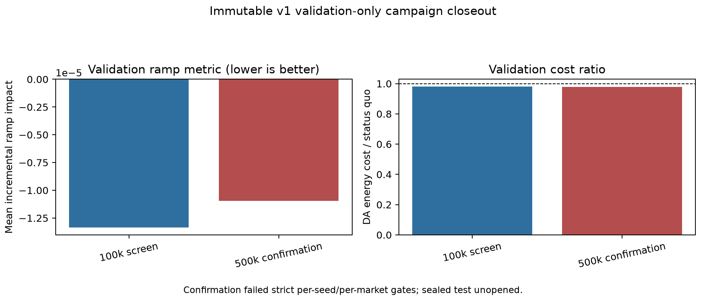

> **DRAFT STATUS - NOT A FINAL RESULT.** The v1 validation-only ramp campaign is
> closed and immutable. The preregistered v2 candidate campaign is ongoing. All
> v2 outcome text is generated from canonical machine evidence through explicit
> placeholders. The March-April 2026 sealed test has not been opened in preparing
> this draft. `scripts/build_final_thesis.py` intentionally refuses to build a
> DOCX while any placeholder remains unresolved.

# Abstract

Geo-distributed computing can alter grid-facing demand by moving work across
markets and by changing when deferrable work executes. The earlier v5 study in
this repository established exact simulator safety and substantial objective
savings in a controlled four-site CAISO archetype, but it did not establish a
large reinforcement-learning contribution. Across five a-d
development/frozen-confirmation seeds, post-RL primary savings averaged
6.290226% in the US construction and 14.000051% in the Global construction,
with exact completion and zero emergency fallback. Behavior cloning alone
already averaged 6.288964% and 14.017276%. Paired post-RL minus BC was only
+0.001262 percentage points in US and -0.017224 points in Global, while the
deterministic decoder adjusted more than 95% of actions. The defensible prior
result is therefore supervised imitation plus deterministic feasibility,
preserved but not materially improved by a short TD3+BC phase.

That attribution result motivates a different question. Instead of optimizing
price and positive-net-demand exposure in one shifted-market archetype, this
study asks whether a randomly initialized policy can anticipate and counteract
future physical grid ramps across six independently observed US markets. The
new energy model uses a common hourly UTC panel from September 2025 through
April 2026 for CAISO NP15, ERCOT North, NYISO Zone J, MISO Minnesota Hub, SPP
North Hub, and ISO New England NEMA. September-January is training, February is
validation, and March-April is sealed test. PJM DOM / Northern Virginia was not
evaluated because its required credential was unavailable. Market series are
never spatially interpolated.

The v6 objective measures the data-center contribution to normalized
market-scale 1 h and 3 h ramps, adds a residual-tail term above train-only
native-ramp thresholds, and constrains day-ahead energy cost. A semantic
`2N+1` action and deterministic capped-simplex/EDF decoder preserve service,
deadlines, capacity, and transport exactly. Three real warm-history hours and a
three-hour no-arrival terminal tail close every scored ramp window and prevent
end-of-episode dumping. PPO and SAC start from random weights and use no
teacher, demonstrations, behavior cloning, expert replay, analytic economic
base, model-predictive controller, or optimizer action.

The immutable v1 screen and confirmation are a validation-only negative
protocol: PPO was safe and below its energy budget, but three of five
confirmation seeds failed strict behavior or per-market ramp gates, so no
protocol qualified and sealed test remained unopened. A separately frozen v2
retry is described only as a preregistered ongoing candidate. Its results are
not asserted in this draft.

# 1. Research Reframing

## 1.1 What the prior study established

The root thesis `thesis_paper.md` and canonical v5 evidence remain the record of
the previous study. That study used measured Google ClusterData 2019 workload
volumes, one May 2025 CAISO energy archetype shifted across four proxy sites, a
causal current-state demonstration teacher, TD3+BC, and a deterministic
constraint decoder. Its final evidence is preserved rather than rewritten.

| Prior-study estimand | US | Global |
|---|---:|---:|
| BC-only mean savings | 6.288964% | 14.017276% |
| Post-RL mean savings | 6.290226% | 14.000051% |
| Paired post-RL minus BC | +0.001262 pp | -0.017224 pp |
| Post-RL minimum across five seeds | 6.112360% | 13.822014% |
| Normal decoder adjustment | 98.216846% | 95.123208% |
| Emergency fallback | 0% | 0% |

Actor and critic hashes changed and every seed recorded 2,048 TD3 updates, so
the post-BC phase was genuine reward training. The empirical effect of that
phase was nevertheless negligible relative to the supervised initialization.
The exact claim is not that pure RL discovered 6.29% and 14.00% savings. It is
that a teacher-imitation policy plus deterministic feasibility achieved those
absolute results, and a short TD3+BC phase largely preserved them.

This distinction also limits the meaning of "safe RL." Safety arose from exact
decoder arithmetic, not from a statistical tendency of the actor to avoid
violations. Frequent routine adjustment means the executed controller was a
co-product of learned preferences and deterministic constraints. Zero emergency
fallback is important but does not make the raw actor independently feasible.

## 1.2 Why reformulation was necessary

Three observations made another tuning sweep scientifically weak.

First, the earlier objective was dominated by immediate spatial economics.
Deterministic QP diagnostics under the corrected v2 energy archetype found
spatial headroom of 7.24% in US a-d and 15.75% in Global a-d, but only 0.77%
and 0.60% additional temporal headroom under the primary synthetic deadline.
Across all workload groups, the primary temporal increment was 0.60%-2.27%.
Even tripling the experimental flexibility horizon raised it only to
0.82%-3.17%. A joint actor could therefore solve the large immediate routing
signal while showing little measurable value from anticipation.

Second, long-horizon credit assignment was entangled with hostile action
geometry. The controller had to represent routing, queue drainage, destination
placement, and exact equalities through a high-dimensional bounded action whose
physical execution was repeatedly changed by a projector or decoder. Sparse
deadline and terminal consequences appeared many transitions after the
preferences that caused them. Better safety penalties could not create temporal
headroom that the modeled problem did not possess.

Third, v5 answered the safety and economic thresholds with supervision. Once
BC already crossed the thresholds, the experiment no longer cleanly identified
whether RL itself could learn the key behavior. The new study therefore removes
the teacher rather than trying to subtract it after the fact, and it changes the
physical target from price-level response to forecast-aware ramp response.

A deterministic implementation audit also resolved an earlier teacher
discrepancy. The strongest parent benchmark used exact KKT/water-filling convex
allocation, whereas an intermediate `TeacherPolicy` used a
temperature-softmax approximation. Sharpening that approximation moved it
toward the exact allocation but increased constraint-boundary intervention.
The final v5 package consequently labels the greedy demonstration teacher and
the stronger exact-native benchmark separately. V6 avoids this ambiguity
entirely: neither controller may generate training or inference actions.

## 1.3 New research question

The v6 question is:

> Can random-initialized PPO or SAC learn, from causal observations only, to
> anticipate and reduce a geo-distributed fleet's incremental contribution to
> future 1 h and 3 h market-scale net-load ramps, while preserving exact
> workload safety and a preregistered day-ahead energy-cost budget?

This is narrower than "can data centers stabilize the grid." The modeled fleet
is price-taking, market-level, and small relative to each balancing area under
the primary case. The output is a controlled stress-test estimate, not a
dispatch instruction to an ISO and not evidence of local feeder relief.

# 2. Related Work and Positioning

## 2.1 Geographic workload scheduling

Qureshi et al. established that geographic electricity-price diversity can be
used to reduce the operating cost of internet-scale systems [5]. Rao et al.
formulated distributed data-center scheduling across multiple electricity
markets [6], and Liu et al. linked geographic load balancing with external
energy and environmental signals [7]. These works motivate space as a control
variable. The present study differs by using six independently observed
market-price and physical-load products on a common UTC calendar and by making
incremental physical ramp impact, not energy-price savings, the primary
optimization target.

The distinction between wholesale and retail scope is essential. The economic
input is wholesale day-ahead LMP at a hub, zone, or interface. It is not a
retail electricity bill, tariff, power-purchase agreement, hedged settlement,
or utility demand charge. Lower modeled DA cost cannot be translated directly
into bill savings for a real data center.

## 2.2 Temporal flexibility and grid interaction

GreenSlot and related renewable-aware schedulers show why deferrable computing
can align work with changing grid conditions [8]. Carbon-aware computing
similarly uses external time-varying signals, but carbon intensity and marginal
emissions are different quantities from net-load ramps [11]. V6 contains no
carbon series and makes no emissions claim.

The new formulation targets a specific grid-facing externality: the squared
change in market net load after modeled data-center power is added, relative to
the native squared change. This incremental construction asks whether the fleet
amplifies or counteracts an already occurring ramp. It does not claim control
of the full market trajectory, frequency response, reserve procurement, or
distribution-network constraints.

## 2.3 Reinforcement learning and constrained action semantics

PPO supplies the on-policy candidate [12], and SAC supplies an entropy-regularized
off-policy candidate [13]. Stable-Baselines3 provides the algorithm
implementations [15]. Unlike v5, the v6 campaign prohibits behavior cloning,
demonstrations, expert replay, analytic base actions, and MPC. Analytic and QP
controllers may appear only as evaluation bounds.

The deterministic decoder is not an expert policy. It has no price, ramp, or
forecast objective. It translates semantic preferences into quantities that
satisfy exact service conservation, EDF queue obligations, residual capacity,
and origin-destination transport. This separates "which feasible action is
preferred" from "how the equalities are solved" without allowing an economic
teacher to decide the action.

## 2.4 Learnability ablations

Two isolated pure-RL ablations show that PPO and SAC can learn the immediate
spatial dispatch subproblem from random initialization.

The pure-PPO ablation removed temporal state and backlog and used an
evaluation-only convex oracle. On held-out chronological test days, five
semantic-interface seeds captured 99.08% +/- 0.13% of US spatial oracle
headroom and 94.06% +/- 0.92% of Global headroom. The legacy projected-logit
interface also learned, capturing 97.37% and 94.95%, but semantic PPO used
41.2% fewer steps in US and 28.6% fewer in Global.

The pure-SAC ablation used a feasible logistic-normal stick-breaking action,
train-only normalization, validation-controlled stopping, and a final
chronological test partition. Three seeds captured 87.5937% mean oracle
headroom and achieved 5.17065% mean savings versus the balanced baseline after
100,000 interactions, with maximum conservation error `3.576e-07`, zero
capacity violation, and analytic/QP discrepancy `7.105e-13` USD.

These ablations identify algorithm capability, not v6 ramp performance. They
show that random-initialized PPO and SAC can learn a strong immediate economic
signal when action semantics and credit horizon are simple. Combined with the
QP headroom diagnostics, they support the root-cause conclusion: the original
joint formulation's difficulty was not a blanket inability of either algorithm
to learn dispatch. It combined a large spatial shortcut, tiny temporal
headroom, delayed consequences, and difficult constrained-action geometry.

The ablation evidence is preserved at commits `e1e4e8c` (PPO) and `35397a8`
(SAC). It is independent of the v1 ramp campaign and does not authorize any
claim about the sealed v6 test.

# 3. Energy Model v3

## 3.1 Six independent evaluated markets

Energy model v3 maps six measured Borg workload/power profiles to six
independently observed market locations:

| Market identifier | Price location | Physical geography | Borg workload |
|---|---|---|---|
| `CAISO_NP15` | CAISO NP15 | CAISO system | a |
| `ERCOT_LZ_NORTH` | ERCOT Load Zone North | ERCOT system | b |
| `NYISO_NYC_J` | NYC Zone J, PTID 61761 | Zone J load; NYCA renewable context | c |
| `MISO_MINN_HUB` | MISO Minnesota Hub | MISO system | d |
| `SPP_NORTH_HUB` | SPP North Hub | SPP balancing authority | e |
| `ISONE_NEMA` | ISO-NE NEMA, location 4008 | ISO-NE balancing authority | f |


Each market remains separate. No market series is interpolated from another
market, and no missing market can be filled by a shifted CAISO archetype.
Hourly aggregation requires complete native intervals. Missing, duplicate,
unit-ambiguous, mixed-revision, or geography-mismatched inputs fail closed.

## 3.2 Calendar and split

The common panel contains 5,808 hourly UTC timestamps from
`2025-09-01T00:00:00Z` through `2026-05-01T00:00:00Z` exclusive.

| Split | Complete months | Permitted use |
|---|---|---|
| Train | Sep 2025-Jan 2026 | gradients, normalization, forecast fitting, thresholds |
| Validation | Feb 2026 | selection, stopping, preregistered dual updates |
| Sealed test | Mar-Apr 2026 | one post-selection evaluation only |

Validation and test cannot influence market scales, level normalization,
native-ramp thresholds, forecast fitting, reward calibration, hyperparameters,
or architecture. The March-April 2026 sealed test is not opened for drafting,
figure generation, or v2 candidate selection.

## 3.3 Source, licensing, and geography caveats

Price products are market-specific day-ahead LMPs: CAISO OASIS NP15, ERCOT
report 13060 at LZ North, NYISO DAM zonal LBMP, MISO DA ex-post LMP at
MINN.HUB, SPP DA LMP at SPPNORTH_HUB, and ISO-NE final DA LMP at NEMA.
Redistribution rights differ. MISO and ISO-NE artifacts are retained as hashes,
metadata, and derived metrics where their terms restrict raw redistribution;
SPP's unclear bulk redistribution license is treated as derived-metrics-only.
The repository records endpoint, product, location, units, interval semantics,
timezone/DST rules, revision policy, retrieval identity, and raw hashes.

Physical products are not uniformly local to the price node. CAISO and ERCOT
use system physical load; MISO and SPP use balancing-authority physical
conditions; ISO-NE uses balancing-authority conditions; NYISO uses Zone J load
with NYCA renewable context. A market-level result is therefore not evidence
about the feeder, utility territory, or campus immediately surrounding a named
facility. Price geography and physical geography are stated separately in
every claim.

Where a complete operator historical physical product is unavailable, v3 uses
only the same-balancing-authority UTC series from the no-key EIA Hourly
Electric Grid Monitor bulk archive. This is explicit fallback evidence, not an
ISO settlement product. Negative renewable-generation adjustments in EIA bulk
series are clipped to zero before net-load derivation, with affected counts and
raw minima retained. The operation is a documented non-negativity
normalization, not interpolation.

PJM requires `PJM_API_KEY`. Because the credential was absent, **PJM DOM /
Northern Virginia was not evaluated**. No result in this thesis applies to a
Virginia data center, PJM DOM, or the PJM system.

## 3.4 Workload and power mapping

Cells a-f use measured Google ClusterData 2019 aggregate and classified
no-SLO/batch CPU profiles. The 8,928 complete five-minute intervals form a
744-hour profile. The terminal boundary sample is excluded, the profile is
averaged to hourly values, converted through the committed cell-specific
affine power model, and tiled across the eight-month market calendar.

This is not contemporaneous workload telemetry. A measured 2019 workload
month is repeated against 2025-2026 market conditions. Repetition supplies a
controlled workload shape but not independent monthly workload samples.
Deadlines remain synthetic experimental controls derived from fitted duration,
not measured production SLOs.

## 3.5 Causal forecast reconstruction

All six markets use reconstructed causal forecasts rather than realized future
values. Each forecast records its target, value, issue time, vintage, horizon,
capability, and quality flags. Issue time cannot follow the controller
timestamp. Training uses daily expanding-window ridge vintages whose training
targets strictly precede each vintage. The model fitted on the first five
months is frozen at the February boundary for validation and sealed test.

Forecast reconstruction uses observed lags and trailing means plus target-hour
and day-of-week features. It is not an ISO-published forecast product.
Forecast-error strata must therefore be reported, and performance must not be
described as if the controller received a perfect system forecast.

## 3.6 Scale cases

The primary case assigns 100 MW rated power to each of six sites, 600 MW total.
The main physical sensitivity scales the fleet to 1 GW total, equally allocated
at 166.6667 MW per site. A separate explicitly non-primary **price-taking 1 GW
per-site stress** reaches 6 GW total. The phrase "1 GW stress" must always state
whether it means 1 GW fleet total or 1 GW at each site.

For non-stress cases, modeled penetration must remain below 5% of each
market's train-only gross-demand Q95 scale. The 6 GW stress explicitly
overrides that gate and cannot support an ordinary price-taking claim. The
model does not simulate endogenous LMP, unit commitment, transmission
congestion feedback, or market clearing; even the smaller cases are
counterfactual price-taking injections.

# 4. Ramp-Aware v6 Problem

## 4.1 State

At each hourly decision, the policy observes current and three trailing
normalized gross-demand and net-load levels, closed native 1 h and 3 h ramps,
causal h1/h2/h3 forecast endpoints and maximum forecast upward ramps, previous
modeled site power, current service and batch arrivals, EDF queue/deadline
state, site capacities and affine power parameters, day-ahead LMP, forecast
vintage age/quality, and UTC calendar features.

Realized future load, realized future net load, real-time price, forecasts
issued after the controller timestamp, and test-fitted statistics are forbidden
policy inputs.

## 4.2 Semantic action and exact decoder

For `N` sites, the actor emits `2N+1` bounded preferences:

1. `N` service-allocation preferences;
2. one optional total batch-execution preference; and
3. `N` batch-destination preferences.

The constraint-only decoder maps those preferences to an executed action. A
capped-simplex allocation conserves all current service within capacity.
Deterministic global EDF selects batch origins and enforces cumulative deadline
prefixes. A residual-capacity capped simplex places the drained batch work.
Exact transport matches origin drains to destination execution. The decoder
contains no LMP, ramp, forecast, or economic objective.

The protocol reserves a guaranteed batch-capacity fraction and validates
service and batch arrival envelopes causally. Runtime envelope violations fail
closed; the implementation cannot inspect future workload to repair an
infeasible episode.

## 4.3 Incremental 1 h and 3 h ramp impact

For market `m`, hour `t`, horizon `h` in `{1,3}`, native net load `N`, modeled
data-center power `P`, and train-only gross-demand Q95 scale `S`:

```text
b[m,t,h] = (N[m,t] - N[m,t-h]) / (S[m] * h)
a[m,t,h] = ((N[m,t] + P[m,t]) - (N[m,t-h] + P[m,t-h])) / (S[m] * h)
I[m,t,h] = a[m,t,h]^2 - b[m,t,h]^2
```

`I < 0` means the modeled fleet counteracts the native squared ramp; `I > 0`
means it amplifies it. Squaring is symmetric: upward and downward ramps are
both scored. The 1 h and 3 h weights are 0.40 and 0.60. Power is aggregated
once per market before scoring, preventing double counting when multiple sites
share a market in a sensitivity.

The normalization makes impacts comparable across market scales but does not
make the markets statistically exchangeable. A unit of normalized impact is
not MW, MWh, USD, reliability risk, or reserve requirement. Evaluation also
reports native and adjusted p95/max ramp in MW and fraction-`S` per hour.

## 4.4 Residual-tail emphasis

A secondary term scores incremental squared absolute ramp remaining above each
market/horizon's train-only native Q90 threshold. Its v1 weight is 0.15. This
focuses learning on the tail without discarding the full-distribution primary
impact. Thresholds are frozen before validation.

The v2 preregistration retains the raw v1 impact as the sole result surface and
adds a smooth worst-market positive-harm training penalty plus finite-horizon
causal potential shaping. The potential depends only on causal forecasts, the
current EDF queue, and previous market power. With `gamma=1` and zero terminal
potential, its episode sum telescopes to an action-independent constant.
Reward normalization is disabled so that identity is not destroyed.

## 4.5 Day-ahead energy-cost budget

Hourly modeled DA cost is:

```text
cost[m,t] = LMP_DA[m,t] * P[m,t] * 1 hour
```

It is reported separately from ramp stress. The v1 campaign allows at most 5%
cost above status quo; the v2 retry preregisters a stricter 2% primary budget,
with 0%, 2%, and 5% epsilon sensitivities. A projected dual update may use
training and validation, never sealed test.

DA LMP is a wholesale settlement signal. The modeled ratio excludes retail
delivery charges, demand tariffs, hedges, PPAs, taxes, ancillary-service
revenue, and endogenous price response. It is not a retail electricity bill.

## 4.6 Warm history, terminal tail, and anti-gaming

Every episode begins with three real hours of warm history so the first scored
3 h window has authentic antecedents. Circular wrap is forbidden. After the
last active-arrival decision, three no-arrival tail hours remain. Tail power,
ramp windows, energy cost, safety, and queue state are all scored. Work must be
complete and queues empty at the actual terminal.

These rules block three shortcuts: hiding an unfavorable ramp before episode
start, dumping batch into an unscored final transition, and wrapping the last
calendar hour to an unrelated first hour. Reward arrives when each causal ramp
window closes.

## 4.7 Pure-RL attribution

The v6 candidates start from random actor and critic weights. Allowed
pre-learning interaction is safe random feasible warmup. The following are
prohibited:

- demonstration datasets and behavior cloning;
- expert replay or warm-start checkpoints;
- analytic economic base actions;
- MPC or optimizer actions;
- oracle reward shaping;
- future-realized features; and
- curriculum trajectories generated by an expert.

Training manifests record initial/final parameter hashes, interaction and
update counts, replay provenance, split identity, normalization identity,
forecast vintages, semantic adjustment, emergency feasibility, and explicit
false assertions for every prohibited source.

# 5. Experimental Protocol

## 5.1 Immutable v1 screen and confirmation

The first preregistered campaign is frozen by commits:

| Stage | Commit | Role |
|---|---|---|
| Screen | `7b21499` | PPO/SAC, seeds 2601-2603, 100k validation |
| Confirmation | `3391440` | PPO, seeds 2601-2605, 500k validation |
| Closeout | `b1bb302` | canonical validation-only report and stop decision |

The aggregate validation evidence is:

| Stage | Algorithm | Seeds | Mean ramp impact | Mean cost ratio | Exact safety | All strict gates |
|---|---|---:|---:|---:|---|---|
| Screen | PPO | 3 | -1.33492978072e-05 | 0.9801356986 | true | true |
| Confirmation | PPO | 5 | -1.09572077294e-05 | 0.9783949019 | true | false |



The 500k validation curve changed by -17.9192% relative to the screen,
failing the preregistered requirement for at least 1.0% material improvement.
Three confirmation seeds failed strict gates:

| Seed | Mean ramp impact | DA cost ratio | Failure |
|---:|---:|---:|---|
| 2602 | -1.58831491944e-05 | 0.9858038052 | MISO did not improve |
| 2604 | -4.00807153722e-06 | 0.9742610172 | behavior did not lower ramp-period power |
| 2605 | -4.42000152464e-06 | 0.9588596206 | SPP did not improve |

Seeds 2601 and 2603 passed all gates. All five were exactly safe and within
the energy budget. Aggregate mean improvement is not enough: the protocol
required every seed and every market to pass. No algorithm was selected, the
2M extension was rejected, robustness studies were not run, and sealed test
remained unopened. This is a validation-only negative result, not a test
failure and not evidence that ramp-aware control is impossible.

Cost, exact safety, and behavior were persisted at six-market aggregate level
in v1; the frozen evaluator did not persist their per-market decompositions.
No missing decomposition is reconstructed after the fact.

## 5.2 Preregistered v2 retry

Commit `4d47a9a` freezes a separate v2 candidate rather than reinterpreting v1.
It preserves the same panel, split, semantic action, exact decoder, raw result
metrics, and strict no-tolerance gates. It changes only preregistered training
mechanisms motivated by the v1 validation diagnosis:

- PPO learning rate `1e-4`, five epochs, and `target_kl=0.02`;
- fresh random-init seeds 2701-2705;
- nominal 100k stopping at the complete-vector-trajectory boundary of 110,592;
- a smooth positive-harm penalty emphasizing the worst market;
- causal finite-horizon potential shaping with an action-independent
  undiscounted episode sum; and
- disabled reward normalization.

V2 is not a post-hoc rescue of a v1 seed. It is a new frozen protocol evaluated
under the same validation-only selection boundary. Pending output must not be
described in prose, copied from a training console, or rounded by hand.

## 5.3 Candidate result insertion

<!-- data-result-contract-begin -->

**Canonical campaign status:** {{CANONICAL_V2:CAMPAIGN_STATUS}}

{{CANONICAL_V2:VALIDATION_RESULTS_TABLE}}

**Validation-only selection decision:** {{CANONICAL_V2:SELECTION_DECISION}}

**Sealed-test status:** {{CANONICAL_V2:SEALED_TEST_STATUS}}

**Sealed-test result table:** {{CANONICAL_V2:TEST_RESULTS_TABLE}}

**Statistical summary:** {{CANONICAL_V2:STATISTICAL_SUMMARY}}

**Final v2 verdict code:** {{CANONICAL_V2:FINAL_VERDICT}}

<!-- data-result-contract-end -->

These tokens are replaced only by `scripts/materialize_ramp_thesis.py` from a
JSON document satisfying `docs/ramp_v6_thesis_results.schema.json`. The
materializer requires canonical/generated flags, resolvable git commits
including the `4d47a9a` protocol identity, validation-only selection, a typed
per-candidate validation table, sealed-test non-selection assertions, and
structured statistics. A selected candidate must occur in the validation table
and must have passed every strict gate. The materializer generates the
prose/table itself; free-form result claims are not accepted.

# 6. Statistics and Decision Rules

## 6.1 Units of analysis

Optimizer seeds quantify training variability conditional on a fixed dataset
and protocol. They are not independent markets, months, or future deployments.
Day bootstrap treats calendar days as the resampling unit for within-split
temporal variability. Month bootstrap is meaningful only where at least two
complete months exist; February validation alone cannot support a multi-month
validation interval. Any interval from one validation month must be labeled a
day-block interval, not a month-generalization confidence interval.

The six markets are reported individually and as a macro average. They are not
treated as independent draws from a superpopulation of ISOs. Market-specific
success is a strict gate rather than an iid standard-error calculation.

## 6.2 Primary estimands

The primary estimands are:

1. macro mean incremental normalized ramp impact over 1 h and 3 h;
2. per-market mean incremental ramp impact;
3. exact service/batch completion and certificate violations;
4. DA cost ratio relative to status quo;
5. ramp-period behavior audits; and
6. adjusted p95 and maximum 1 h/3 h ramps in MW and fraction-`S` per hour.

The protocol succeeds only if all declared gates pass for all confirmation
seeds. Reporting a favorable average while hiding a harmed market is
prohibited. Epsilon-cost sensitivities map the ramp-cost Pareto surface but do
not replace the primary cost budget.

## 6.3 Forecast-error and scale strata

Results are stratified by causal forecast error, market, season/month, and
fleet scale. The primary 600 MW case, 1 GW fleet-total sensitivity, and 6 GW
non-primary stress remain separate. The 6 GW stress cannot be pooled into the
primary mean or described as price-taking evidence if its penetration override
is active.

## 6.4 Test protocol

If no v2 protocol clears every validation gate, the correct endpoint is another
validation blocker and the sealed test stays closed. If a protocol clears all
gates, its identity, checkpoint hashes, normalizers, forecast model, decoder,
and evaluation code are frozen before a single test evaluation. Test results
cannot trigger retraining, reselection, tolerance changes, or a second test
opening. A negative test is published as negative.

# 7. Expected Evidence and Figure/Table Plan

## 7.1 Figures supported before v2 completion

| Figure | Evidence | Status |
|---|---|---|
| Six-market study design and split | v3 source contract and workload mapping | generated |
| Immutable v1 closeout | `final_results.json`, commits 7b21499/3391440/b1bb302 | generated |
| v5 BC/post-RL attribution | existing canonical v5 figure | prior study |
| v5 decoder versus emergency use | existing canonical v5 figure | prior study |

No figure in this draft reads or summarizes sealed-test outcomes. Market
diagnostic images may be cited only as data-quality evidence and must not be
mistaken for policy results.

## 7.2 Figures generated only after canonical v2 evidence

1. validation learning curves by seed, with no test overlay;
2. per-market validation ramp impact with every failed gate visible;
3. ramp-cost Pareto fronts at 0%, 2%, and 5% epsilon;
4. forecast-error-stratified validation effects;
5. behavior audit showing pre-service and ramp-period power;
6. if and only if selection occurs, one sealed-test panel clearly separated
   from validation; and
7. scale sensitivity separating 600 MW, 1 GW fleet total, and 6 GW stress.

All generated result figures must embed canonical source hashes and protocol
commit in adjacent machine metadata.

## 7.3 Final tables

The final paper requires tables for source/licensing geography, workload mapping,
split usage, protocol hyperparameters, seed-level validation gates, per-market
effects, exact safety, DA cost, ramp extrema, forecast strata, and artifact
hashes. A single aggregate "improvement" table is insufficient because the v1
failure occurred precisely at the seed and market levels.

# 8. Limitations and Threats to Validity

## 8.1 Market and geography scope

The six price locations and physical geographies are not uniform. Hub or zonal
LMP can differ from the actual settlement node of a facility; balancing-area
load can differ from local utility and feeder conditions. A market-level ramp
effect is not a local reliability result. Northern Virginia and PJM are
excluded entirely.

The model is price-taking and does not clear the market after data-center load
changes. At larger scales, especially 1 GW per site, unchanged LMP and unit
commitment become implausible. Those cases are stress tests, not market
forecasts.

## 8.2 Economic scope

DA LMP times modeled MWh is not a retail bill. The model excludes delivery,
capacity, ancillary services, hedges, taxes, PPAs, retail demand charges, and
endogenous congestion. Negative LMP does not guarantee a negative retail rate.
The cost budget is a controlled opportunity-cost constraint, not a financial
business case.

## 8.3 Data and forecast scope

Operator products differ in cadence, revision status, location, and license.
Same-BA EIA physical fallback is not identical to an operator settlement
product. Renewable non-negativity clipping changes a small class of raw EIA
values and must remain disclosed. Forecasts are reconstructed from causal
history; they are not operator forecasts and may omit weather, outages, fuel,
and transmission state.

No market interpolation protects provenance but can create selection toward
periods with complete public data. Eight months do not establish multi-year
climate, fuel, policy, or infrastructure robustness.

## 8.4 Workload and infrastructure scope

Google 2019 workload is tiled across a later energy calendar. Synthetic EDF
deadlines are not production SLOs. Six equal proxy sites omit latency,
bandwidth, migration energy, data residency, application affinity, reliability
domains, cooling, PUE variation, batteries, and generator constraints.
Unrestricted routing is optimistic.

Exact safety is exact only inside this simulator. It does not prove feasibility
for a production scheduler with unmodeled constraints.

## 8.5 Statistical scope

Five optimizer seeds do not provide independent-data replication. Six markets
are fixed cases, not random samples. February supplies one validation month.
March-April test supplies only two months if opened. Bootstrap intervals
describe variability within these fixed periods and cannot support universal
claims about US grids or future years.

## 8.6 Algorithm and decoder attribution

The pure-RL prohibition removes supervision but does not make the actor the
sole controller. The deterministic decoder still constructs the exact feasible
action. Results must be attributed to random-initialized policy preferences
plus constraint-only execution. Semantic adjustment and emergency fallback are
reported separately.

A validation failure does not prove PPO or SAC cannot learn ramp response under
another valid formulation. A success does not prove the learned policy found
the globally optimal counter-ramp. Analytic/QP comparators remain
evaluation-only bounds.

# 9. Reproduction and Provenance

## 9.1 Immutable identities

| Artifact | Identity |
|---|---|
| v5 canonical prior-study report | `output/offpolicy_v5_continuous/canonical_v5_v3/results_report.md` |
| v1 screen | commit `7b21499` |
| v1 confirmation | commit `3391440` |
| v1 closeout/base | commit `b1bb302` |
| v2 preregistration | commit `4d47a9a` |
| v3 live panel manifest SHA-256 | `489cb39c61c19952fe90b213c1ea20e4f5eb904563425ec8b751a15ceed446df` |
| v3 raw acquisition manifest SHA-256 | `64fd78254dabefa8d525f3e43144b2a50bc12c3050bad21efcc8836e3d11b7e7` |
| v3 ramp factory manifest SHA-256 | `b2c88f8831eec0e2d1321e779eb9e823d96cd165fd3fd6d2ca3ba34ed1497e8c` |
| pure PPO learnability ablation | commit `e1e4e8c` |
| pure SAC learnability ablation | commit `35397a8` |

## 9.2 Draft validation

```powershell
python scripts\build_ramp_thesis_figures.py
python scripts\validate_ramp_thesis.py --allow-placeholders
python -m unittest tests.test_ramp_thesis -v
```

The following command must fail while v2 results are pending:

```powershell
python scripts\build_final_thesis.py --source thesis_ramp_v6.md --output build\thesis_ramp_v6.docx
```

## 9.3 Canonical result insertion

After the v2 evidence builder publishes a canonical JSON conforming to
`docs/ramp_v6_thesis_results.schema.json`:

```powershell
python scripts\materialize_ramp_thesis.py `
  --results output\ramp_rl_v6\v2\canonical_thesis_results.json `
  --output build\thesis_ramp_v6_materialized.md

python scripts\validate_ramp_thesis.py `
  --source build\thesis_ramp_v6_materialized.md

python scripts\build_final_thesis.py `
  --source build\thesis_ramp_v6_materialized.md `
  --output build\thesis_ramp_v6.docx
```

Materialization is an auditable build step, not manual editing. The generated
JSON must identify the protocol and source commit, preserve failed gates, state
whether sealed test opened, and assert that test was not used for selection or
tuning. The build output is intentionally outside the root final DOCX until the
canonical contract is satisfied.

## 9.4 No-test drafting boundary

Drafting uses source contracts, train/validation protocol definitions, v1
validation evidence, and prior-study v5 evidence. It does not run a test-split
environment, evaluate a v2 checkpoint on March-April, inspect per-episode test
metrics, or derive claims from test artifacts. Merely having sealed files in a
committed repository does not authorize their use.

# 10. Conclusion

The prior v5 study remains a valid but narrower result: supervised imitation
and a deterministic decoder produced substantial safe savings in a controlled
CAISO archetype, while the incremental TD3+BC effect was approximately zero.
That finding motivates, rather than weakens, the v6 study. The new formulation
removes supervision, introduces six independent markets, replaces price-level
optimization with causal future-ramp response, and makes workload safety and
cost explicit constraints.

Deterministic diagnostics and pure-RL ablations support the reformulation.
Immediate spatial dispatch is learnable by random-initialized PPO and SAC, but
the original joint problem offered little incremental temporal headroom and
combined delayed credit with difficult constrained actions. V6 creates a
directly temporal target while retaining semantic feasibility.

The immutable v1 ramp campaign is a negative validation result: aggregate ramp
and cost moved favorably, but strict seed, behavior, and per-market gates did
not all pass. Sealed test remained closed. The v2 retry is preregistered and
ongoing. Its outcome belongs only in the generated contract block above; until
canonical evidence materializes those tokens, this document is a methods and
prior-evidence draft, not a final empirical thesis.

# References

[1] Verma et al., "Large-scale cluster management at Google with Borg,"
*EuroSys*, 2015. DOI: 10.1145/2741948.2741964.

[2] Tirmazi et al., "Borg: the Next Generation," *EuroSys*, 2020.
DOI: 10.1145/3342195.3387517.

[3] Fan et al., "Power Provisioning for a Warehouse-sized Computer," *ISCA*,
2007. DOI: 10.1145/1250662.1250665.

[4] Sakalkar et al., *ASPLOS*, 2020. DOI: 10.1145/3373376.3378533.

[5] Qureshi et al., "Cutting the Electric Bill for Internet-Scale Systems,"
*SIGCOMM*, 2009. DOI: 10.1145/1592568.1592584.

[6] Rao et al., "Minimizing Electricity Cost: Optimization of Distributed
Internet Data Centers in a Multi-Electricity-Market Environment," *INFOCOM*,
2010. DOI: 10.1109/INFCOM.2010.5461933.

[7] Liu et al., "Greening Geographical Load Balancing," *SIGMETRICS*, 2011.
DOI: 10.1145/1993744.1993767.

[8] Goiri et al., "GreenSlot: Scheduling Energy Consumption in Green
Datacenters," 2011. DOI: 10.1145/2063384.2063411.

[9] Grange et al., *Future Generation Computer Systems*, 2018.
DOI: 10.1016/j.future.2018.03.049.

[10] McLaren, Gagnon, and Mullendore, NREL report BR-6A20-68963, 2017.

[11] Radovanovic et al., *IEEE Transactions on Power Systems*, 38(2),
1270-1280. DOI: 10.1109/TPWRS.2022.3173250.

[12] Schulman et al., "Proximal Policy Optimization Algorithms,"
arXiv:1707.06347, 2017.

[13] Fujimoto, van Hoof, and Meger, "Addressing Function Approximation Error
in Actor-Critic Methods," *ICML*, 2018; arXiv:1802.09477.

[14] Fujimoto and Gu, "A Minimalist Approach to Offline Reinforcement
Learning," *NeurIPS*, 2021; arXiv:2106.06860.

[15] Raffin et al., "Stable-Baselines3: Reliable Reinforcement Learning
Implementations," *JMLR*, 22(268), 2021.
